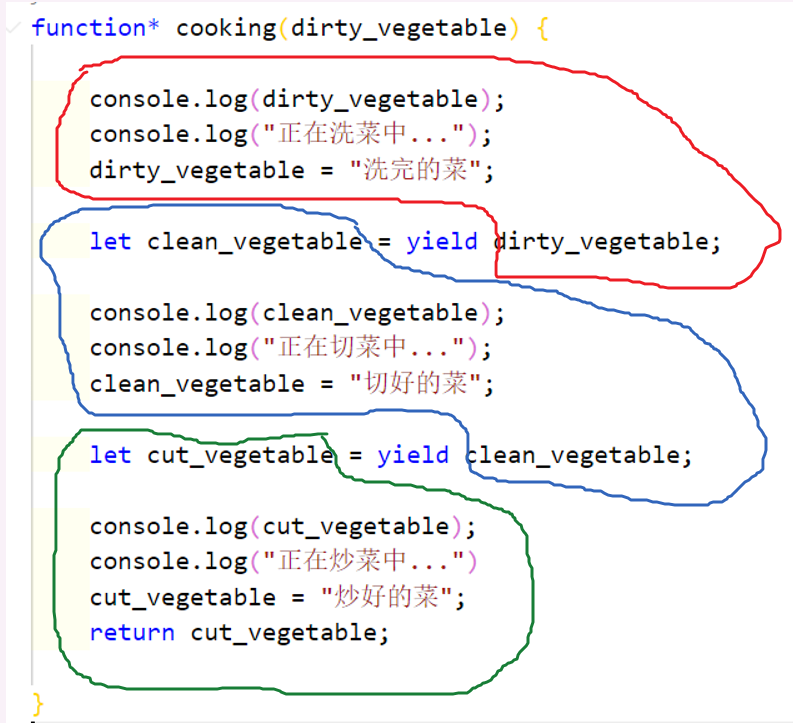

*优秀博文参考*
[这一次，彻底弄懂 JavaScript 执行机制](https://juejin.im/post/59e85eebf265da430d571f89)

**同步区 > （异步）微任务区 > 宏任务**

## 并发与并行
并发强调的是时间段内执行多个任务，而并行强调的是在一个时间点上执行多个任务。
## 回调函数
就是在函数中再传一个函数的形式，也是本人用的最多的一种代码形式。
emmmmmmm..大概就张下面这样
``` js
app.get('/search', (req, res0) => {
    mongoose.connect('mongodb://127.0.0.1:27017/itcast', { useNewUrlParser: true });
    var db = mongoose.connection;
    //req.query.title
    getArticle.Article.find({ title: { $regex: req.query.title } }, (err2, res2) => {
        if (err2) {
            console.log("查询失败");
            //查询失败只可能一种情况，分类里连15个都没有
        } else {
            console.log(res2.length);
            res0.send(JSON.stringify(res2));
        }
    });
});
```
这段代码是我第一个项目中写的代码，当时用的后端是express，而我当时啥也不懂，只会不停的写回调来处理数据请求，这还算好，有的api我能写进去整整五层。。现在看看以前的代码真的是头皮发麻，简直就和看自己初中时候的QQ空间是一个感觉XD

用回调的写法最大的问题便是产生类似上面的*Callback hell*(回调地狱),这样的代码非常非常的难以阅读和维护。

为了解决这个问题，社区和搞标准的那帮人又整出了下面的东西。
## Promise
`Promise`的出现的最大的意义就是为了解决像回调地狱这种问题，当然除此之外它还有其他的好处。
### 基本感知
``` js
const axios = require('axios');

function Page1() {
    return new Promise((resolve, reject) => {
        //异步操作的代码
        axios.get("https://www.jixieclub.com:3002/list?Pnum=2")
            .then(res => {
                //异步操作成功
                resolve(res);
            })
            .catch(error => {
                reject(error);
            });
    });

}
Page1().then(val => {
    let arr = val.data;
    let length = arr.length;
    return length;
}).then(
    val => {
        console.log("获取到了数组的长度")
        console.log(val)//15
    }
)
```
> 上述api为真实后端接口，可作为测试接口进行调用

这里请求数据调用了`axios`这个框架，但用什么不是我们关注的重点，重点是请求数据肯定是一个异步的操作。

`Promise`构造函数接受一个函数作为参数,其中这个函数内部是用户要进行的异步操作，外部的两个参数是`Promise`对象内置的，这两个函数其实还是两个函数对象，`resolve()`函数会将传进去的参数给“扔给”接下来`then`函数的第一个函数中，`reject()`会将传进去的参数“扔给”`then`函数的第二个函数中。

而`then`函数的返回值会传到下一个`then`函数中去。

``` js
const axios = require('axios');

function getPage(num) {
    return new Promise((resolve, reject) => {
        axios.get("https://www.jixieclub.com:3002/list?Pnum=" + num)
            .then(res => {
                //异步操作成功
                resolve(res);
            })
            .catch(error => {
                reject(error);
            });
    });
}
getPage(1).then(val => {
    let arr = val.data;
    let length = arr.length;
    return length;
}).then(
    val => {
        console.log("获取到了数组的长度")
        console.log(val) //15
        return getPage(2);
    }
).then(
    val => {
        console.log(val);
        //打印出了第二页的结果
    }
)
```
### `Promise.all()`
这个方法接受几个promise实例，主要用来指定当全部的promise实例都成功时该执行什么操作。

而`Promise.all()`也会返回一个实例，请看下面这段代码。
``` js
const p1 = new Promise((resolve, reject) => {
    resolve("p1成功了");
})
const p2 = new Promise((resolve, reject) => {
    resolve("p2成功了!!!!")
})
const p3 = new Promise((resolve, reject) => {
    resolve("p3成功了!!!!")
})
const pAll = Promise.all([p1, p2, p3]);
pAll.then(val => {
        console.log(val);
        //[ 'p1成功了', 'p2成功了!!!!', 'p3成功了!!!!' ]
    },
    reason => {
        console.log(reason);
    })
```
上述代码中创建了三个`promise`实例，每个实例都只有`resolve()`方法(也就是说默认操作全部成功)，此时`pAll`实例中的`then()`方法中会将所有从`resolve()`中的`values`用一个数组传过来。

``` js
const p1 = new Promise((resolve, reject) => {
    resolve("p1成功了");
})
const p2 = new Promise((resolve, reject) => {
    reject("p2失败了!!!!")
})
const p3 = new Promise((resolve, reject) => {
    resolve("p3成功了!!!!")
})
const pAll = Promise.all([p1, p2, p3]);
pAll.then(val => {
        console.log(val);
    },
    reason => {
        console.log(reason);
        //p2失败了！！！！
    })
```
如果存在一个失败了就会将失败的`reason`传出来。

### 手动实现Promise
## Generator
`Generator`函数是一种特殊的函数，这种函数最大的特点就是**能停**。请看这段代码
``` js
function* test() {
    console.log("a");
    console.log("aaa");
    yield;
    console.log("b");
    console.log("bbb");
    yield;
    console.log("c");
    console.log("ccc");
}

let genObj = test();
genObj.next();
//a
//aaa
genObj.next();
//b
//bbb
genObj.next();
//c
//ccc
```
如上述代码中我定义的`test()`函数就是一个`Generator`函数。定义这种函数需要你在前面加一个跟指针似的小星号，函数会返回一个**指针对象**。

其中代码中的两个`yield`可以理解成“两个矮墙”，当你调用`next()`方法时就会把这个函数给踹一脚，不然它不走啊~~

那你可能奇怪了，这和generator这个名字有什么关系呢？原因是实现这种走走停停的效果本质上是用一个“大函数”generate了一堆“小函数”，比如上面的代码其实就是生成了三个`test()`函数，每次调用`next()`方法都会手动调用下一个。

`Generator`函数的最大作用便是实现异步解决方案，但在说这部分内容之前我们还需要继续研究一下`yield`这个东西，它的作用可并止上面那样简单。
#### yield
这块内容石川大大的一个视频讲的特别好，可以先参考一下。[yield到底是个啥](https://www.bilibili.com/video/av20327829?p=14)
假如说我们需要模拟一个做菜的过程，那么整个做菜的过程可以分为三步：

1.洗菜
2.切菜
3.炒菜

用`generator`函数模拟的话大概就是这样一个过程
``` js
function* cooking(dirty_vegetable) {

    console.log(dirty_vegetable);
    console.log("正在洗菜中...");
    dirty_vegetable = "洗完的菜";

    let clean_vegetable = yield dirty_vegetable;

    console.log(clean_vegetable);
    console.log("正在切菜中...");
    clean_vegetable = "切好的菜";

    let cut_vegetable = yield clean_vegetable;

    console.log(cut_vegetable);
    console.log("正在炒菜中...")
    cut_vegetable = "炒好的菜";
    return cut_vegetable;

}

//先把刚买回来的脏的菜扔进去
let genObj = cooking("刚买回来的菜");
let period1 = genObj.next(); //阶段1没有必要传参
let period2 = genObj.next("干净的菜");
let period3 = genObj.next("切好的菜");
console.log(period1); // { value: '洗完的菜', done: false }
console.log(period2); // { value: '切好的菜', done: false }
console.log(period3); // { value: '炒好的菜', done: true }
```

光看代码估计你有些顶不住，我给你简单画一下吧~~


其中红色区域对应的是`period1`，注意`period1`上面没有“凸起”,也就意味着第一阶段没有传参，其实在函数入口已经把参数传进来了。

蓝色部分是`period2`,绿色阶段是`period3`，他们的上半部分都是“凸起”的，也就是说可以接受外部参数。

三个阶段返回值也可以顺利打印出来~~


## async和await
## 常用的定时器函数


## 事件循环
### 浏览器中的事件循环
### node中的事件循环
## 微任务的执行
## 函数的执行
## 语句的执行

