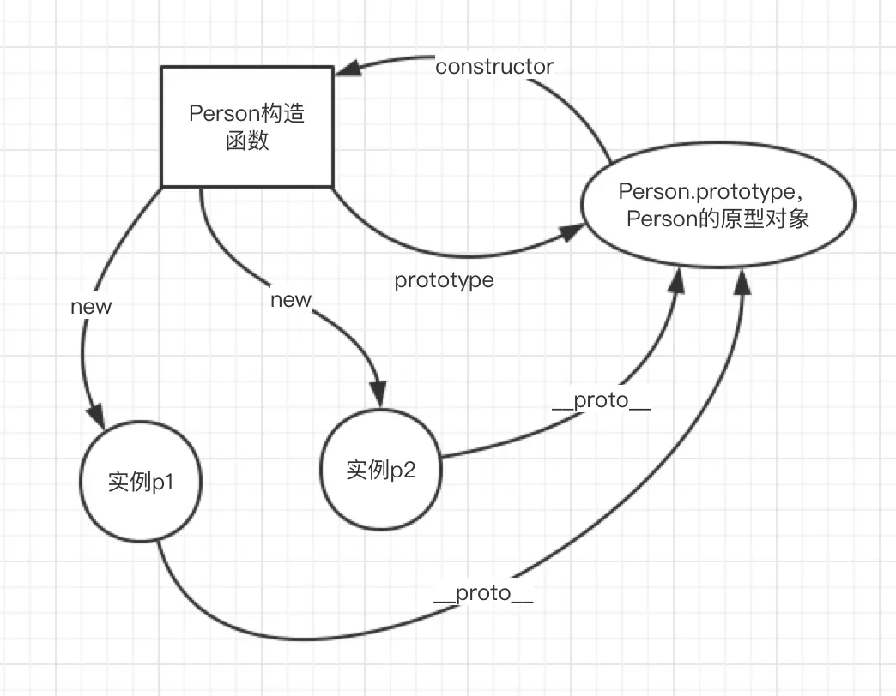

## 引子
在javascript中，没有所谓的“类”的概念，js中只有实例，所有的对象都是实例。

要想实现面向对象的一些特性(如继承)，只能将一个对象的原型指向另一个对象。

``` js
let model = {
    name: 'undefined',
    height: '183',
    run() {
        console.log(this.name + "is running!")
    }
};

let jason = {
    name: "jason"
};
//
jason.__proto__ = model;
jason.run();
console.log(jason.height)
```
在这个例子中，jason这个对象是没有`height`属性和`run()`方法的，但如果把jsaon对象的原型指向`model`,jason就也能去访问model中的属性和方法。

但最好不要这样做，因为老IE对对象的这个隐藏属性支持好像不是太好。正常的操作应该是这样：
``` js
let model = {
    name: 'undefined',
    height: '183',
    run() {
        console.log(this.name + " is running!")
    }
};

var stu = Object.create(model);
stu.name = 'jason';
stu.run();//jason is running!
```
其中，`Object`也是Js的一个内置对象，`Object.created()`是这个内置对象中的一个方法，它可以根据传入的对象创建出一个独立的"副本"。

上面的两种方法都实现了原型继承。
## 创建对象的各种方式
### 字面量直接创建
这种方法最简单，但劣势也非常明显，那就是无法复用。如果有大量同类型的对象，则代码就会非常冗余。
### new一个Object()
``` js
function add_stu(name, age) {
    let obj = new Object();
    obj.name = name;
    obj.age = age;
    return obj;
}

let jason = add_stu("jason", 18);
console.log(jason);//{ name: 'jason', age: 18 }
let cat = add_stu("果果", 2);
console.log(jason.constructor);//Function: Object]
console.log(cat.constructor);//Function: Object]
```
这种方法虽然解决了代码复用的问题，但由于都是从`Object()`new过来的，因此无法判断类型。
### new一个构造函数
每当我们去new一个函数时，new完后会返回一个新的对象，这个新的对象我们可以把它类比为“类的实例”，当然new的那个函数我们可以将它类比为一个“类”。
在函数被new的过程中，主要会做三件事情。

1.创建一个新的对象。
2.将函数中的this绑定到这个新的对象上
3.返回这个新的对象
``` js
function Student(name, age) {
    this.name = name;
    this.age = age;
    this.sayhi = function() {
        console.log("hi!!!")
    }
}
let jason = new Student("jason", 18);
jason.sayhi(); //hi!!!
console.log(jason);
//Student { name: 'jason', age: 18, sayhi: [Function] }
```
用这种方法我们可以发现打印出来的结果多了一些不一样的东西，如果我们在定义一个关于“猫”的类,并比较`jason`和`guoguo`的构造器：
``` js
function Cat(name, age) {
    this.name = name;
    this.age = age;
    this.meow = function() {
        console.log("Meow~~")
    }
}
let guoguo = new Cat("果果", 1);
guoguo.meow(); //Meow~~
console.log(guoguo); 
//Cat { name: '果果', age: 1, meow: [Function] }
console.log(jason.constructor == guoguo.constructor); //false
```
我们发现可以根据构造器的指向来判断类型了！

但这样在构造函数中直接定义构造方法是有问题的，我们接下来会讨论。
## 原型
每当我们创建一个函数的时候，JS解析器会向函数中添加一个叫`prototype`的属性，这个属性所对应的对象就是所谓的**原型**对象（简称原型）。如果我们new一个实例，这个实例也会拥有原型对象的所有属性。
``` js
function Cat(name, age) {
    this.name = name;
    this.age = age;
    this.meow = function() {
        console.log("Meow~~")
    }
}
let guoguo = new Cat("果果", 1);
let qiuqiu = new Cat("球球",2);
guoguo.meow();//Meow~~
qiuqiu.meow();//Meow~~
console.log(guoguo.__proto__);//Cat {}
console.log(qiuqiu.__proto__);//Cat {}
```
在上述的测试代码中，我们通过实例的`__proto__`属性查看了原型(PS:实际代码中可千万不要这样用)。

那原型的作用到底是什么呢？

**原型是JS实现面向对象的核心特性。**

在上面的代码中，我们实例化了两只喵，其中每实例化一直喵都会直接初始化一个`meow()`方法，那如果我们实例化了一千只喵，甚至一万只喵，那么在实例化的过程中都会初始化这个方法，这无疑会是巨大的性能浪费。

正确的方法应该是将`meow()`方法添加到`Cat`的原型对象上，这样`meow()`方法就作为了所有猫猫的公共属性，谁都可以访问。
``` js
function Cat(name, age) {
    this.name = name;
    this.age = age;
}
Cat.prototype.meow = function(){
    console.log("喵喵喵？")
}
let guoguo = new Cat("果果", 1);
let qiuqiu = new Cat("球球",2);
guoguo.meow();//喵喵喵？
qiuqiu.meow();//喵喵喵？
```
而所谓的原形链就是：当访问一个对象的属性时，如果没有，就会去这个**对象的原型对象**上去找，如果还没有，就会去这个**原型对象的原型对象**上去找，知道找到为止。

### 和原型有关的两个方法
#### `hasOwnProperty()`
判断一个属性是否是自己独有的而不是原型上的。
``` js
function Cat(name, age) {
    this.name = name;
    this.age = age;
}
Cat.prototype.meow = function(){
    console.log("喵喵喵？")
}
let guoguo = new Cat("果果", 1);
let qiuqiu = new Cat("球球",2);
console.log(guoguo.hasOwnProperty('meow'));//false
```
#### `isPrototypeOf()`
判断一个对象是否是另一个对象的原型
``` js
function Cat(name, age) {
    this.name = name;
    this.age = age;
}
Cat.prototype.meow = function(){
    console.log("喵喵喵？")
}
let guoguo = new Cat("果果", 1);
let qiuqiu = new Cat("球球",2);
console.log(Cat.prototype.isPrototypeOf(guoguo));//true
```
### 构造函数、原型对象、实例间的关系

- 构造函数的`prototype`属性指向原型对象，原型对象的`constructor`指向构造函数。
- 构造函数new出来的所有实例中的隐藏属性`__proto__`也会指向原型对象。
## 继承
### 原型链继承
将“子类”的`prototype`指向“父类”的实例，从而获得父类的属性和方法。
``` js
function Person(name, age) {
    this.name = name;
    this.age = age;
}
Person.prototype.say = function() {
    console.log('hi');
}

function Student(num) {
    this.num = num;
}

let p = new Person("jason", 18);
Student.prototype = p;
//Student的原型指向了Person的实例，因此Student new出来的实例就会拥有原Person的属性和方法。
let jason = new Student("170501");
console.log(jason.age);//18
jason.say();//hi
```
但有一点需要注意，如果我们打印实例`p`的构造器指向，我们会发现`p`的构造器仍然指向的是原来的`Person`类，这是非常不好的。
``` js
console.log(p.constructor);
//[Function: Person]
```
为什么不好呢？别忘了`p`里面装的可是`Student.prototype`,既然是`Student`的原型了那我们就应该老老实实让`p`的构造器指向`Student`,这才是一个正经原型对象该有的亚子。说的严谨一些还是为了方便我们对类型进行判断。
``` js
p.constructor = Student;
// 或者
Student.prototype.constructor = Student;

console.log(p.constructor);//[Function: Student]
```
### 构造函数继承
