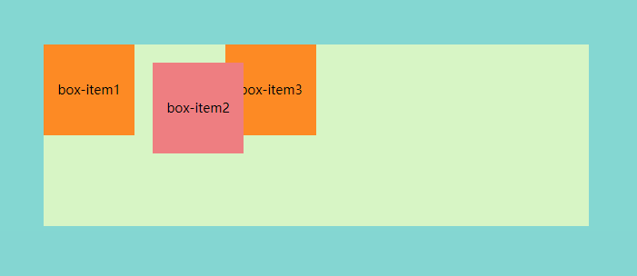
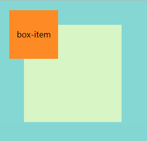
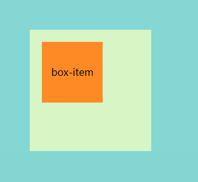
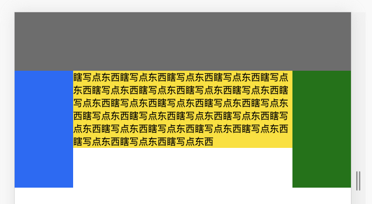
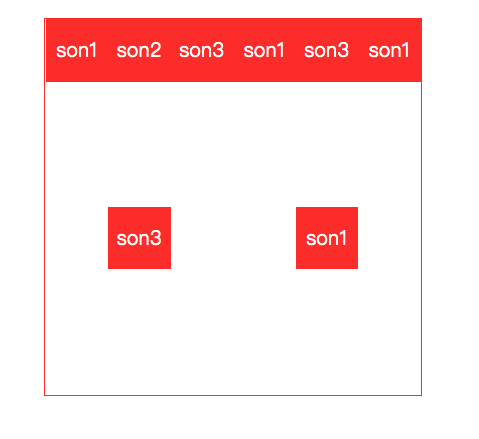
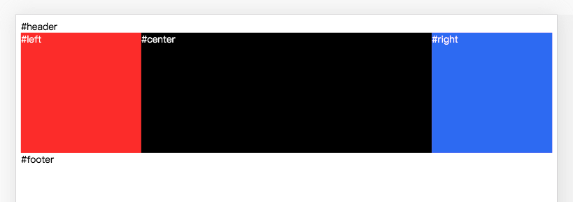
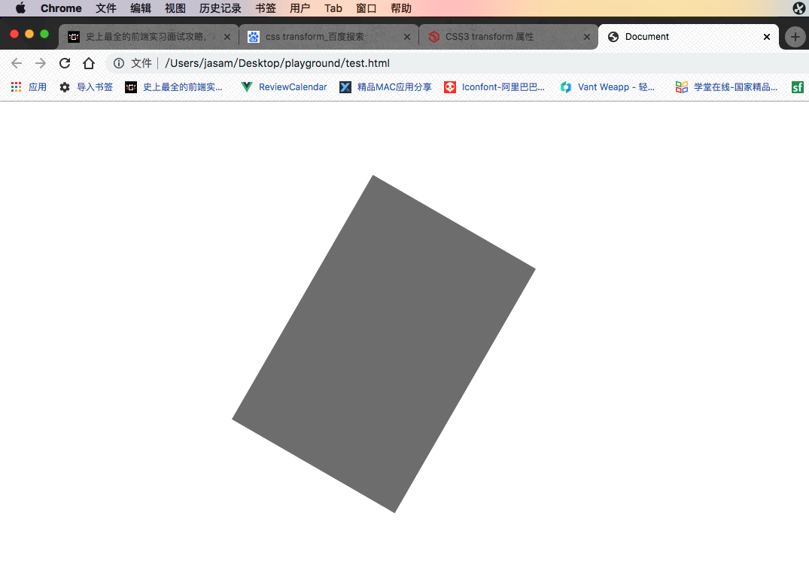

## css选择器优先级
内联 > ID选择器 > 类选择器 > 标签选择器
### 样式表优先级
内联 > 内部css > 外部css
具体比较可以应用加权(感觉用的不多啊)
## position属性

### fix
多用于广告啥的，会随着页面滚动。这种布局会脱离文档流。
### relative



当前元素相对与自身原来位置的偏移，处于文档流之内。

*给中间的盒子添加了下列样式*

```css
.relative{
    position:relative;
    top:20px;
    left:20px;
    background-color: lightcoral;
}
```
### absolute
绝对定位，会脱离文档流

- 如果父级元素没有position的值，则按照html(也就是整个浏览器)偏移，脱离了整个html文档流。

  ```css
  /*此时父元素（绿色区域）没设置position的属性*/
  .box-item{
          position:absolute;
          top:20px;
          left:20px;
          background-color: darkorange;
          width: 100px;
          height:100px;
          text-align: center;
          line-height: 100px;
  }
  ```

  

  

- 如果父元素有position的值，则按照父级元素的位置偏移,只会脱离当前父元素内的文档流。

```css
/*此时父元素（绿色区域）设置了position属性*/
.box-item{
        position:absolute;
        top:20px;
        left:20px;
        background-color: darkorange;
        width: 100px;
        height:100px;
        text-align: center;
        line-height: 100px;
}
```



## display属性

display属性设置一个元素如何显示

### block
块级元素，这种属性显示出来的元素会占一整行。
常见块元素:`<p><div><h1><li>`

### inline
内联元素，只会占领自身的宽度和高度所在的空间。宽度和高度取决于内容本身，高度没法改，要改宽度只能设置padding值。
常见内联元素:`<a><em>`

### inline-block
行内块元素，顾名思义，不会单独占一行的块元素。宽，高，margin，padding都可以设置。

## float
加了float的元素会“飘“起来，脱离当前的文档流。
注意：文字对于float起来的元素依然是敏感的，因此可以利用这个属性做一些图文环绕的效果。


### 清除浮动
添加浮动后，后续元素的排列方式会受到影响，此时清除浮动就可以消除这种影响(也就是让受影响的元素回到原来的位置)

最简单的方法是添加**clear属性**。clear会强制指定左侧或者右侧的元素不为浮动元素。
## 常用布局
### 双飞翼布局
实现原理是将主体部分放前面，left，right放后面，然后让这三个元素都浮起来，最后利用margin为负值的特性将left，right调整到合适的位置。

```html
				<div class="head"></div>
        <div class="content">
            <div class="center">
                <p class="para">瞎写点东西瞎写点东西瞎写点东西瞎写点东西瞎写点东西瞎写点东西瞎写点东西瞎写点东西瞎写点东西瞎写点东西瞎写点东西瞎写点东西瞎写点东西瞎写点东西瞎写点东西瞎写点东西瞎写点东西瞎写点东西瞎写点东西瞎写点东西瞎写点东西瞎写点东西瞎写点东西瞎写点东西瞎写点东西瞎写点东西</p>
            </div>
            <div class="left"></div>
            <div class="right"></div>
        </div>
```

```css
			 *{
            padding: 0;
            margin: 0;
        }
        .head{
            height: 100px;
            background-color: grey;
        }
        .center{
            width: 100%;
            height: 100%;
            background-color: yellow;
            float: left;
        }
        .left{
            width: 100px;
            height: 200px;
            background-color: blue;
            float:left;    
            margin-left: -100%;
        }
        .right{
            width: 100px;
            height: 200px;
            background-color: green;
            float: left;
            margin-left: -100px;
        }
        .para{
            margin: 0 100px 0 100px;
            /* 上右下左顺时针 */
        }
```


### Flex布局
可以很好的解决居中问题，外层父级元素设置flex，内层居中元素直接设置margin:auto

```html
<body>
    <div id="mydiv">
        <div >son1</div>
        <div >son2</div>
        <div >son3</div>
        <div >son1</div>
        <div >son3</div>
        <div >son1</div>
        <div >son3</div>
        <div >son1</div>
    </div>
</body>
```

```css
	  #mydiv{
        width: 300px;
        height: 300px;
        border: 1px solid red;
        margin: 20px auto;
        display: flex;
        flex-direction: row;
        flex-wrap: wrap;
        justify-content: space-around;
    }
    #son{
        width: 100px;
        height: 100px;
        background-color: gray;
        margin: auto;
    }
    #mydiv div{
        width: 50px;
        height: 50px;
        color: white;
        line-height: 50px;
        text-align: center;
        background-color: red;
    }
```



#### jusify-content
定义子元素在**主轴**方向上的分布方式
[具体值的效果](https://www.w3cschool.cn/cssref/css3-pr-justify-content.html)

#### align-items 

规定flex子项们在**侧轴**上的对齐方式。

#### 利用弹性盒子实现双飞翼布局

父容器设置flex，左右两边用flex-basis设定一个基本的宽高，中间的盒子用flex-grow瓜分父元素剩余空间

```html
<!DOCTYPE html>
<html lang="en">

<head>
    <meta charset="UTF-8">
    <meta name="viewport" content="width=device-width, initial-scale=1.0">
    <meta http-equiv="X-UA-Compatible" content="ie=edge">
    <title>Document</title>
    <style>
        body {
        min-width: 550px;
    }
    #container{
        display: flex;
        justify-content: center;
        align-items: flex-start;
    }
    .column{
        height: 200px;
        color:white;
    }
    #center{
        flex-grow: 1;
        background-color: black;
    }
    #left{
        flex-basis: 200px;
        background-color: red;
    }
    #right{
        flex-basis: 200px;
        background-color: blue;
    }
    </style>
</head>

<body>
    <div id="header">#header</div>
    <div id="container">
        <div id="left" class="column">#left</div>
        <div id="center" class="column">#center</div>
        <div id="right" class="column">#right</div>
    </div>
    <div id="footer">#footer</div>

</body>

</html>
```




## 响应式布局解决方案

**方案一：**

```css
html {
    font-size: 16px;
}

@media screen and (min-width: 375px) {
    html {
        /* iPhone6的375px尺寸作为16px基准，414px正好18px大小, 600 20px */
        font-size: calc(100% + 2 * (100vw - 375px) / 39);
        font-size: calc(16px + 2 * (100vw - 375px) / 39);
    }
}
@media screen and (min-width: 414px) {
    html {
        /* 414px-1000px每100像素宽字体增加1px(18px-22px) */
        font-size: calc(112.5% + 4 * (100vw - 414px) / 586);
        font-size: calc(18px + 4 * (100vw - 414px) / 586);
    }
}
@media screen and (min-width: 600px) {
    html {
        /* 600px-1000px每100像素宽字体增加1px(20px-24px) */
        font-size: calc(125% + 4 * (100vw - 600px) / 400);
        font-size: calc(20px + 4 * (100vw - 600px) / 400);
    }
}
@media screen and (min-width: 1000px) {
    html {
        /* 1000px往后是每100像素0.5px增加 */
        font-size: calc(137.5% + 6 * (100vw - 1000px) / 1000);
        font-size: calc(22px + 6 * (100vw - 1000px) / 1000);
    }
}
```

**然后所有单位直接上rem，美滋滋**

**方案二：**直接上vw，现在兼容性应该都解决了。

**方案三:**  媒体查询

## css常用@规则
### @import
用来引入一个css文件
```css
@import "mystyle.css";
@import url("mystyle.css");
```
### @media
用的超级多的媒体查询
```css
@media screen and (max-width: 600px) {
  #head { … }
  #content { … }
  #footer { … }
}
```
### @key-frames
用来定义动画的关键帧
```css
@keyframes diagonal-slide {
  from {
    left: 0;
    top: 0;
  }

  to {
    left: 100px;
    top: 100px;
  }
}
```
### @fontface
用来引入字体
```css
@font-face {
  font-family: Gentium;
  src: url(http://example.com/fonts/Gentium.woff);
}
p { font-family: Gentium, serif; }
```
## css3常用特性
### transform
可以实现对元素的旋转，缩放，倾斜，和移动等变换。
**eg**:将一个div盒子横向移动300px，纵向移动100px，旋转30度

```html
<!DOCTYPE html>
<html lang="en">
<head>
    <meta charset="UTF-8">
    <meta name="viewport" content="width=device-width, initial-scale=1.0">
    <meta http-equiv="X-UA-Compatible" content="ie=edge">
    <title>Document</title>
    <style>
    #mydiv{
        background-color: grey;
        width: 200px;
        height: 300px;
        transform: translateX(300px) translateY(100px) rotate(30deg);
    }
    </style>
</head>
<body>
    <div id="mydiv"></div>
</body>
</html>
```



### transition
将元素的某个属性从一个值过渡到另一个值。
```html
<!DOCTYPE html>
<html lang="en">
<head>
    <meta charset="UTF-8">
    <meta name="viewport" content="width=device-width, initial-scale=1.0">
    <meta http-equiv="X-UA-Compatible" content="ie=edge">
    <title>Document</title>
    <style>
    #mydiv{
        background-color: grey;
        width: 200px;
        height: 300px;
        transform: translateX(300px) translateY(100px) rotate(30deg);
        transition: all 2s linear;
        /* 第一个参数代表所有属性，第二个参数代表两秒，第三个参数代表线性过渡 */
    }
    #mydiv:hover{
        background-color: red;
        transform: translateX(-300px);
    }
    </style>
</head>
<body>
    <div id="mydiv"></div>
</body>
</html>
```
最后的效果可以看到灰色盒子逐渐变红并移动到左边。

### animate
在调用动画之前要先定义动画帧。
```html
<!DOCTYPE html>
<html lang="en">
<head>
    <meta charset="UTF-8">
    <meta name="viewport" content="width=device-width, initial-scale=1.0">
    <meta http-equiv="X-UA-Compatible" content="ie=edge">
    <title>Document</title>
    <style>
    #mydiv{
        background-color: grey;
        width: 40px;
        height: 40px;
        margin: 90px auto;
    }
    #mydiv:hover{
        animation: jump 1s linear ;
        动画帧的名字，持续几秒，动画的速度曲线
    }
    @keyframes jump {
        0% {transform: translateY(0px);}
        30% {transform: translateY(-20px);}
        60% {transform: translateY(-60px);}
        100% {transform: translateY(0px);}
    }
    /* 这个动画帧要是能用函数描述就nb了 */
    </style>
</head>
<body>
    <div id="mydiv"></div>
</body>
</html>
```
最终的效果是当鼠标放上去的时候，盒子会弹一下。


