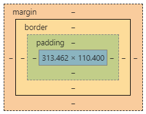

## meta 标签

位于 head 元素内部，用于存储一些页面的相关信息，可以告诉浏览器如何显示内容，存一些 keywords 方便 SEO 等等

### charset 属性

指定字符集

### name=“viewport”

指定视窗口大小，在 content 属性中我们经常将宽度设置为`device-width`从而用来实现响应式布局。
如果不指定 viewport 的化那么默认的宽度为 980px,在手机上看的话就很难受了

## 常见 body 标签及常用属性

### div

遇事不决 div，但 div 本身并不具有语义话，因此如果考虑 seo 的话最好用一些语义化的标签。
比如`section`,'article','aside','header','footer'等等。

### a 标签的 target

```html
<section>
  <h1>链接</h1>
  <a href="http://www.qq.com">腾讯网</a>
  <a href="http://www.taobao.com" target="_blank">淘宝网</a>
</section>
```

当`target`的值设置为`_blank`时，会在新的标签打开网页。

### span/em/strong

这三个是常见的`行内元素`,其中 em 默认为斜体，strong 默认为粗体。

### table/thead/tbody/tr/td

这一组为表格相关的元素。

```html
<h1>表格</h1>
<table border="1">
  <thead>
    <tr>
      <th>表头1</th>
      <th>表头2</th>
      <th>表头3</th>
    </tr>
  </thead>
  <tbody>
    <tr>
      <td>数据1</td>
      <td>数据2</td>
      <td>数据3</td>
    </tr>
    <tr>
      <td colspan="2">占据两列的单元格</td>
      <td>数据3</td>
    </tr>
    <tr>
      <td rowspan="2">占据两行的单元格</td>
      <td>数据2</td>
      <td>数据3</td>
    </tr>
    <tr>
      <td>数据2</td>
      <td>数据3</td>
    </tr>
  </tbody>
</table>
```

tr 为单元行，td 为单元格
`colspan`指定单元格占几列，`rowspan`指定单元格占几行

### ul/ol/li/dl/dt/dd

这一组为列表类的元素

### form/input/select/textarea/button

这一组为表单类的元素

```html
<h1>表单</h1>
<form method="GET" action="http://www.qq.com">
  <p>
    <select name="select1">
      <option value="1">一</option>
      <option value="2" selected>二</option>
    </select>
  </p>
  <p>
    <input type="text" name="text1" />
  </p>
  <p>
    <input type="password" name="password" />
  </p>
  <p>
    <input type="radio" name="radio1" id="radio1-1" />
    <label>选项一</label>
    <input type="radio" name="radio1" id="radio1-2" />
    <label for="radio1-2">选项二</label>
  </p>
  <p>
    <button type="button">普通按钮</button>
    <button type="submit">提交按钮一</button>
    <input type="submit" value="提交按钮二" />
    <button type="reset">重置按钮</button>
  </p>
</form>
```

- option 中的 selected 属性可以指定默认被选中的下拉框。

#### input 中的 type 属性

- type="text": 明文输入。
- type="password": 密文输入。
- type="radio": 单选框。
  ::: tip
  当 name 属性此时设置相同时，说明他们为一组单选框，只能选一个。
  同时 id 的属性值不能相同。
  :::
- label 标签中的 for 属性可以绑定 input（通过 input 的 id）

#### 表单中的 button 按钮

- type="submit": 会将当前 form 中的数据提交。
- type="reset": 会将当前 form 中的数据重置。

### 响应式布局

通过设置 meta 标签中的 viewport 和 css 的媒体查询可以实现响应式的布局

```css
@media screen and (max-width: 600px) {
  #head { … }
  #content { … }
  #footer { … }
}
//如果一个设备的最大宽度不到600px就套用上述样式
```

## 盒子模型

每个 html 元素都能抽象成一个类似盒子样的模型，包括内容区，内边距，边框，外边距



关于宽高，不同的标准定义还不一样。

IE 盒子模型的宽高包含了内容区，内边距，边框（offset-width）；而标准盒模型的宽高只包含内容区

### box-sizing

默认值是`content-box`，及标准盒子模型的宽高定义。
若想将宽高定义为 IE 盒子模型，则可以设置`border-box`。

### 替换元素

一些外部的加载内容，比如`img`,`video`,`iframe`等等。

他们的宽高首先受到当前内容决定，因此虽然是 inline 元素，但是比较特殊，可以设置宽度和高度。

同时他们内容的样式不会受外部 css 影响，比如内部的`iframe`的样式，外部是肯定无法改变的，但是我们可以更改他们的位置和宽高。

#### img

我们可以设置`object-fit:cover`让他们等比例占满整个盒子。

然后通过`object-position:center`来设置图片在盒子中的位置。

## 语义化标签

HTML5 新增了一些新的语义化标签，类似这样

```html
<body>
  <header>头部</header>
  <nav>
    导航
  </nav>
  <main>
    <article>
      在那个已被忘却的日子里，它的世界颠覆了。泥土飞走，出现了一条又深又宽的峡谷，然后泥土又轰隆隆地飞回来，峡谷消失了，在原来峡谷的尽头出现了一座黑色的孤峰。其实，在这片广阔的疆域上，这种事常常发生，泥土飞走又飞回，峡谷出现又消失，然后是孤峰降临，好像是给每次灾变打上一个醒目的标记。褐蚁和几百个同族带着幸存的蚁后向太阳落下的方向走了一段路，建立了新的帝国。
    </article>
    <aside>
      右边
    </aside>
  </main>
  <footer>页脚</footer>
</body>
```

## Canvas

**入门体验**

```javascript
//获取canvas实例
var mycanvas = document.querySelector('canvas');
//获取绘制工具箱(获取上下文)
var ctx = mycanvas.getContext('2d');
//移动画笔
ctx.moveTo(100, 100);
//画直线轨迹
ctx.lineTo(200, 100);
//描边
ctx.stroke();
```

### api

扔个 api 在这把，感觉暂时还用不上

```javascript
rect( x, y, width, height )   绘制矩形

fillRect( x, y, width, height )  绘制被填充的矩形

strokeRect( x, y, width, height )  绘制矩形（无填充）

clearRect( x, y, width, height ) 清除指定的矩形内的像素


fill()  填充当前绘图（路径）

stroke() 绘制已定义的路径

beginPath()  起始（重置）当前路径

moveTo( x, y )  将笔触移动到指定的坐标(x,y)

lineTo( x, y )  绘制一条从当前位置到指定的坐标(x,y)的直线

clip()  从原始画布剪切任意形状和尺寸的区域

quadraticCurveTo()  创建二次贝塞尔曲线

bezierCurveTo()   创建三次贝塞尔曲线

arc( x, y, radius, startAngle, endAngle, anticlockwise)  绘制圆或圆弧

arcTo( x1, y1, x2, y2, radius)  根据给定点画圆弧，再以直线连接两个点

isPointInPath( x, y )  检测指定的点是否在当前路径中，在则返回true。


fillStyle  设置或返回用于填充绘画的颜色、渐变或模式

strokeStyle  设置或返回用于笔触的颜色、渐变或模式

shadowColor  设置或返回用于阴影的颜色

shadowBlur   设置或返回用于阴影的模糊级别

shadowOffsetX  设置或返回阴影与形状的水平距离

shadowOffsetY  设置或返回阴影与形状的垂直距离


lineCap  设置或返回线条的结束点样式（butt、round、square）

lineJoin  设置或返回当两条线交汇时，边角的类型（bevel、round、miter）

lineWidth  设置或返回当前的线条宽度

miterLimit  设置或返回最大斜接长度


createLinearGradient( x0, y0, x1, y1 )  创建线性渐变

createPattern( image/canvas/video, repeat )  在指定的方向内重复绘制指定的元素

createRadialGradient( x0, y0, r0, x1, y1, r1 ) 创建径向渐变

addColorStop( stop, color )  规定渐变对象中的颜色和停止位置


font  设置或返回文本内容的当前字体属性（和css的font一样）

textAlign  设置或返回文本内容的当前对齐方式

textBaseline  设置或返回在绘制文本时使用的当前文本基线

fillText( text, x, y )  在画布上绘制“被填充”的文本

strokeText( text, x, y )  在画布上绘制文本（无填充）

measureText( text )  返回包含指定文本宽度的对象（属性width获取宽度）


drawImage( image/canvas, x, y )、drawImage( image/canvas, x, y, width, height )、drawImage( image/canvas, sx, sy, sWidth, sHeight, dx, dy, dWidth, dHeight )  在画布上绘制图像、画布或视频


createImageData( width, height )、createImageData(imageData)  绘制ImageData对象

getImageData( x, y, width, height )  返回ImageData对象，该对象为画布上指定的矩形复制像素数据。

putImageData( ImageData, x, y )、putImageData( imageData, sx, sy, sWidth, sHeight, dx, dy, dWidth, dHeight )  把图像数据放回画布上。

width  返回ImageData对象的宽度

height  返回ImageData对象的高度

data  返回一个对象，包含指定的ImageData对象的图像数据


globalAlpha  设置或返回绘图的当前alpha或透明度

globalCompositeOperation  设置或返回新图像如何绘制到已有的图像上。


scale( x, y )  缩放当前绘图

translate( x, y )  重新设置画布上的(0,0)位置

rotate( angle )  选择当前绘图，单位为“弧度”，角度转弧度公式（ degrees*Math.PI/180）

transform( m11, m12, m21, m22, dx, dy )  替换绘图的当前转换矩阵

setTransform()  将当前转换重置为单元矩阵，然后运行transform()


save()  保存当前环境的状态

restore()  恢复之前保存过的路径状态和属性


getContext('2d')  获取2d对象

toDataURL()  将canvas转换成图片，返回地址

```

## 面试题补充

### doctype 的作用？

告诉浏览器的解析器，用什么文档的类型规范来解析这个文档。doctype 不存在的话默认会以兼容模式加载页面。

### 前端如何优化 seo？

- 语义化标签
- 设置`keywords`和`description`
- 重要的内容一定要放前面，搜索引擎是从上往下进行抓取，并且有长度限制
- 少用`iframe`，搜索引擎不会抓取`iframe`的内容。
