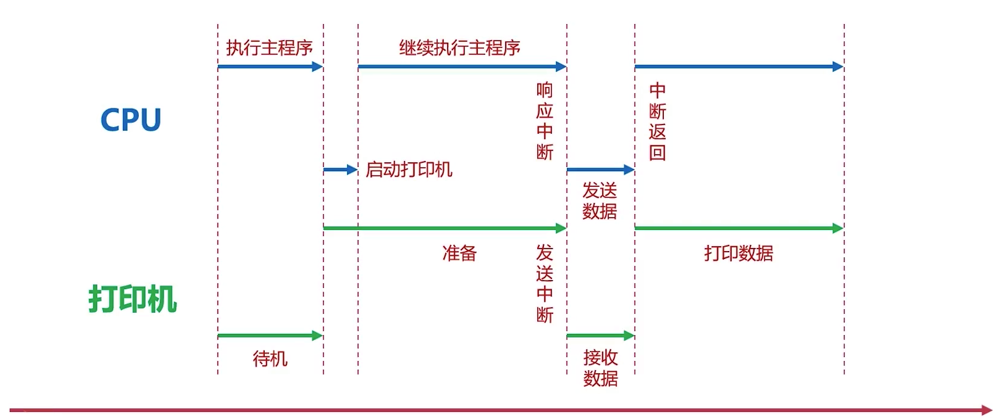
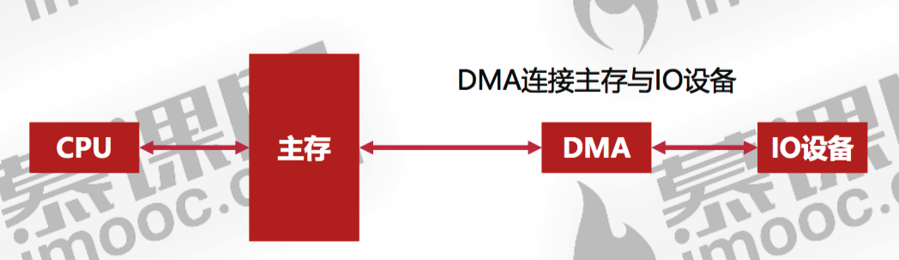

## 常见的IO设备
### 常见的输入设备
总体上可以分为两类，一类是字符输入设备，一类是图像输入设备。

字符输入设备指的就是键盘，而图像输入设备有鼠标，数位板，扫描仪等等。

### 常见的输出设备
有显示器，打印机，投影仪等等。
## IO接口的通用设计
在设计IO接口时，设计者需要考虑很多问题。比如主机如何向设备收发数据？主机如何确定设备有没有被占用？设备是否已经连接等等问题。
### 数据线
可以实现IO设备与主机间的数据传递，有单向传输数据线和双向传输数据线。
### 状态线
状态线可以让IO设备向主机报告自己是否正常连接，同时主机也能通过状态线知道IO设备是否被占用。
### 命令线
用于CPU向设备发送重要命令（读，写，启动，弹出）的信号线。

比如CPU读写磁盘中的某块区域数据，弹出U盘等等都会用到。
### 设备选择线
用来选择IO设备的信号线。如果有三个U盘插在电脑上，当打开某个U盘之前，肯定会存在一个对要打开U盘进行选择的过程。
## CPU与IO设备的通信
主要有两种方法。一种方法是通过程序中断行为，另一种方法是DMA（直接存储器访问）。
### 程序中断

如图所示（红箭头是时间线），当CPU需要使用打印机时，会先通过**命令线**向打印机发送一个“启动打印机”的命令，此时打印机就开始进入启动准备的阶段，而CPU不会等着打印机启动，会继续先干手里的活儿。当打印机启动完之后，打印机会向CPU发送**中断信号**，此时CPU会响应中断（或者拖一段时间再响应，图中描述的是立即响应的状态）并**立即停止**自己手上的工作，然后CPU便和打印机建立了“信息通道”，打印机源源不断的接收来自CPU给自己发送的信息。当信息发送完成后，CPU会执行**中断返回**，继续自己之前的工作，而这时候的打印机已经获取到了需要打印的信息，会开始进行数据打印的工作。

其实程序中断是低速设备同CPU的一种**异步通信**方式，但频繁中断CPU也并不是一个好的策略，会降低CPU的使用效率。

>**异步**是编程中的一个极其重要的概念，通过上图可以看到在同一条时间线上存在多条任务同时运行。而JavaScript中的异步其实也可以这样理解。假如说有一段代码（或一个函数）在**异步执行**，这时这段异步执行的代码就会和主程序的代码在时间线上处于平行状态。

>是时候给异步下一个清晰的定义了。

>假如说一个**系统**中存在多个事件**同时发生**的行为，那么对于**整个系统**来说，这种行为的特征就是**异步**的。

### DMA（直接存储器访问）

DMA是一种内存访问技术。它可以允许一些计算机内部或外部的硬件直接读写系统内存而不需要通过CPU，这样打印机在打印的时候就不用发送中断信号了，可以大大提高CPU的效率。

DMA常用硬盘，网卡，显卡和声卡等等。