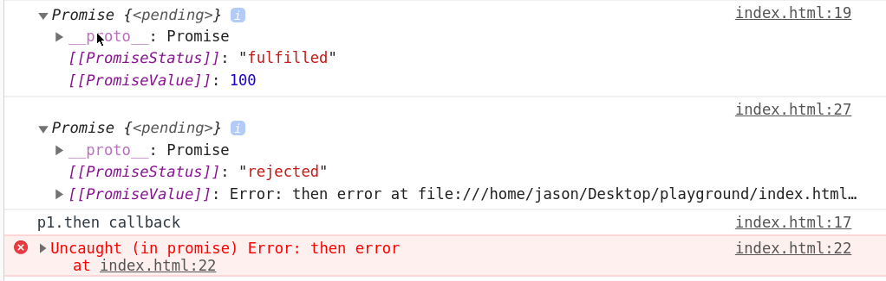
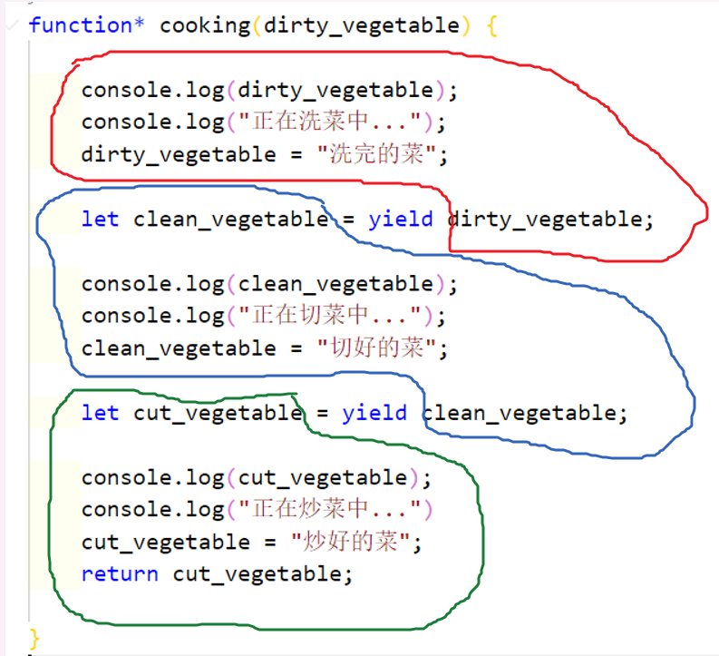

_优秀博文参考_
[这一次，彻底弄懂 JavaScript 执行机制](https://juejin.im/post/59e85eebf265da430d571f89)

**同步区 > 微任务区(promise) > 宏任务**

## 并发与并行

并发强调的是时间段内执行多个任务，而并行强调的是在一个时间点上执行多个任务。

## 回调函数

就是在函数中再传一个函数的形式，也是本人用的最多的一种代码形式。
emmmmmmm..大概就张下面这样

```js
app.get('/search', (req, res0) => {
  mongoose.connect('mongodb://127.0.0.1:27017/itcast', {
    useNewUrlParser: true,
  });
  var db = mongoose.connection;
  //req.query.title
  getArticle.Article.find(
    { title: { $regex: req.query.title } },
    (err2, res2) => {
      if (err2) {
        console.log('查询失败');
        //查询失败只可能一种情况，分类里连15个都没有
      } else {
        console.log(res2.length);
        res0.send(JSON.stringify(res2));
      }
    }
  );
});
```

这段代码是我第一个项目中写的代码，当时用的后端是 express，而我当时啥也不懂，只会不停的写回调来处理数据请求，这还算好，有的 api 我能写进去整整五层。。现在看看以前的代码真的是头皮发麻，简直就和看自己初中时候的 QQ 空间是一个感觉 XD

用回调的写法最大的问题便是产生类似上面的*Callback hell*(回调地狱),这样的代码非常非常的难以阅读和维护。

为了解决这个问题，社区和搞标准的那帮人又整出了下面的东西。

## Promise

`Promise`的出现的最大的意义就是为了解决像回调地狱这种问题，当然除此之外它还有其他的好处。

`Promise`实例存在三种状态，这三种状态会影响 then 和 catch 的执行。

- 当处于`pending`状态的时候，不会触发 then 和 catch。
- 当`resolved`的时候，此时可以执行 then 方法中的回调，但不能执行 catch 方法中的回调。
- 当`rejected`的时候，此时可以执行 catch 方法中的回调，但不能执行 then 方法中的回调，**一旦执行就会报错**。

```js
Promise.resolve()
  .then(() => {
    console.log(1);
  })
  .catch(() => {
    console.log(2);
  })
  .then(() => {
    console.log(3);
  });
// 1
// 3
```

### 基本感知

```js
const axios = require('axios');

function Page1() {
  return new Promise((resolve, reject) => {
    //异步操作的代码
    axios
      .get('https://www.jixieclub.com:3002/list?Pnum=2')
      .then((res) => {
        //异步操作成功
        resolve(res);
      })
      .catch((error) => {
        reject(error);
      });
  });
}
Page1()
  .then((val) => {
    let arr = val.data;
    let length = arr.length;
    return length;
  })
  .then((val) => {
    console.log('获取到了数组的长度');
    console.log(val); //15
  });
```

> 上述 api 为真实后端接口，可作为测试接口进行调用

这里请求数据调用了`axios`这个框架，但用什么不是我们关注的重点，重点是请求数据肯定是一个异步的操作。

`Promise`构造函数接受一个函数作为参数,其中这个函数内部是用户要进行的异步操作，外部的两个参数是`Promise`对象内置的，这两个函数其实还是两个函数对象，`resolve()`函数会将传进去的参数给“扔给”接下来`then`函数的第一个函数中，`reject()`会将传进去的参数“扔给”`then`函数的第二个函数中。

而`then`函数的返回值会传到下一个`then`函数中去。

```js
const axios = require('axios');

function getPage(num) {
  return new Promise((resolve, reject) => {
    axios
      .get('https://www.jixieclub.com:3002/list?Pnum=' + num)
      .then((res) => {
        //异步操作成功
        resolve(res);
      })
      .catch((error) => {
        reject(error);
      });
  });
}
getPage(1)
  .then((val) => {
    let arr = val.data;
    let length = arr.length;
    return length;
  })
  .then((val) => {
    console.log('获取到了数组的长度');
    console.log(val); //15
    return getPage(2);
  })
  .then((val) => {
    console.log(val);
    //打印出了第二页的结果
  });
```

### `then`和`catch`对`PromiseStatus`的影响

- 在链式调用中，依然会返回 promise.但此时返回的 promise 实例状态取决于链式回调中是否有报错，与 then/catch 无关。

```js
Promise.resolve()
  .then(() => {
    console.log(1);
    throw new Error('error!!!');
  })
  .catch(() => {
    console.log(2);
  })
  .then(() => {
    console.log(3);
  });

//1
//2
//3
```



### `Promise.all()`

这个方法接受几个 promise 实例，主要用来指定当全部的 promise 实例都成功时该执行什么操作。

而`Promise.all()`也会返回一个实例，请看下面这段代码。

```js
const p1 = new Promise((resolve, reject) => {
  resolve('p1成功了');
});
const p2 = new Promise((resolve, reject) => {
  resolve('p2成功了!!!!');
});
const p3 = new Promise((resolve, reject) => {
  resolve('p3成功了!!!!');
});
const pAll = Promise.all([p1, p2, p3]);
pAll.then(
  (val) => {
    console.log(val);
    //[ 'p1成功了', 'p2成功了!!!!', 'p3成功了!!!!' ]
  },
  (reason) => {
    console.log(reason);
  }
);
```

上述代码中创建了三个`promise`实例，每个实例都只有`resolve()`方法(也就是说默认操作全部成功)，此时`pAll`实例中的`then()`方法中会将所有从`resolve()`中的`values`用一个数组传过来。

```js
const p1 = new Promise((resolve, reject) => {
  resolve('p1成功了');
});
const p2 = new Promise((resolve, reject) => {
  reject('p2失败了!!!!');
});
const p3 = new Promise((resolve, reject) => {
  resolve('p3成功了!!!!');
});
const pAll = Promise.all([p1, p2, p3]);
pAll.then(
  (val) => {
    console.log(val);
  },
  (reason) => {
    console.log(reason);
    //p2失败了！！！！
  }
);
```

如果存在一个失败了就会将失败的`reason`传出来。

### `Promise.allSettled()`

不管 promise 是否成功,只要处理完最终都可以取到 promise 的结果

```js
const p1 = new Promise((resolve, reject) => {
  resolve(1);
});

const p2 = new Promise((resolve, reject) => {
  resolve(1);
});

const p3 = new Promise((resolve, reject) => {
  reject('error');
});

Promise.allSettled([p1, p2, p3]).then((value) => {
  console.log(value);
});
```

### Promise 核心源码手动实现

## async 和 await

`async`和`await`是目前为止最新的 js 异步解决方案。

**`await`相当于 promise 的`then`，`try...catch`相当于 promise 的`catch`。**

在使用的时候用户需要先自己去定义一个`async`函数，然后将需要异步执行的函数放入`async`函数的内部，同时在前面加上`await`关键字。

`async` 函数会返回一个 promise 对象。

有一点需要注意，`await`后面跟的函数**必须**要返回一个`promise`实例，`await`函数的返回值就是这个`promise`实例中的 value。

而`await`后面的代码，就相当于是一个“大回调”。

```js
const axios = require('axios');

function getPage(num) {
  return new Promise((resolve, reject) => {
    axios
      .get('https://www.jixieclub.com:3002/list?Pnum=' + num)
      .then((res) => {
        //异步操作成功
        resolve(res);
      })
      .catch((error) => {
        reject(error);
      });
  });
}
// 异步转同步！！！
async function await_getPage(num) {
  let res = await getPage(num);
  console.log(res);
  ////拉取的数据很长就不粘过来了
}
await_getPage(2);
```

上述代码中如果你将`await_getPage()`中的`res`直接**return**出来是得不到数据的，因为 async 函数中最终返回的还是一个 promise,也就是说你要把这个值拿到`async`函数外面进行操作的话还需要调用`then()`方法。

如果`await`函数返回的 promise 失败了，此时需要通过`try...catch`进行异常处理。

```js
const axios = require('axios');

function getPage(num) {
  return new Promise((resolve, reject) => {
    //简单模拟一个失败的情况
    reject('啊！请求失败了嘤嘤嘤');
  });
}
// 异步转同步！！！
async function await_getPage(num) {
  try {
    const value = await getPage(num);
    console.log(value);
  } catch (error) {
    console.log(error);
    //啊！请求失败了嘤嘤嘤
  }
}
await_getPage(2);
```

## 异步遍历问题

如果要异步的处理一个数组中的内容，只能用`for...of`循环，用`for...in`,`foreach`,还有`map`都是无效的。

```js
const muti = (num) => {
  return new Promise((resolve) => {
    setTimeout(() => {
      resolve(num * num);
    }, 1000);
  });
};

const nums = [1, 2, 3];
// nums.map(async (item, index) => {
//     const res = await muti(item)
//     console.log(res); //此时的1 4 9会同时打印出来
// })

!(async function() {
  for (let val of nums) {
    const res = await muti(val);
    console.log(res); //此时的1 4 9会间隔1秒打印
  }
})();
```

## Generator

`Generator`函数是一种特殊的函数，这种函数最大的特点就是**能停**。请看这段代码

```js
function* test() {
  console.log('a');
  console.log('aaa');
  yield;
  console.log('b');
  console.log('bbb');
  yield;
  console.log('c');
  console.log('ccc');
}

let genObj = test();
genObj.next();
//a
//aaa
genObj.next();
//b
//bbb
genObj.next();
//c
//ccc
```

如上述代码中我定义的`test()`函数就是一个`Generator`函数。定义这种函数需要你在前面加一个跟指针似的小星号，函数会返回一个**指针对象**。

其中代码中的两个`yield`可以理解成“两个矮墙”，当你调用`next()`方法时就会把这个函数给踹一脚，不然它不走啊~~

那你可能奇怪了，这和 generator 这个名字有什么关系呢？原因是实现这种走走停停的效果本质上是用一个“大函数”generate 了一堆“小函数”，比如上面的代码其实就是生成了三个`test()`函数，每次调用`next()`方法都会手动调用下一个。

`Generator`函数的最大作用便是实现异步解决方案，但在说这部分内容之前我们还需要继续研究一下`yield`这个东西，它的作用可并止上面那样简单。

#### yield

这块内容石川大大的一个视频讲的特别好，可以先参考一下。[yield 到底是个啥](https://www.bilibili.com/video/av20327829?p=14)
假如说我们需要模拟一个做菜的过程，那么整个做菜的过程可以分为三步：

1.洗菜 2.切菜 3.炒菜

用`generator`函数模拟的话大概就是这样一个过程

```js
function* cooking(dirty_vegetable) {
  console.log(dirty_vegetable);
  console.log('正在洗菜中...');
  dirty_vegetable = '洗完的菜';

  let clean_vegetable = yield dirty_vegetable;

  console.log(clean_vegetable);
  console.log('正在切菜中...');
  clean_vegetable = '切好的菜';

  let cut_vegetable = yield clean_vegetable;

  console.log(cut_vegetable);
  console.log('正在炒菜中...');
  cut_vegetable = '炒好的菜';
  return cut_vegetable;
}

//先把刚买回来的脏的菜扔进去
let genObj = cooking('刚买回来的菜');
let period1 = genObj.next(); //阶段1没有必要传参
let period2 = genObj.next('干净的菜');
let period3 = genObj.next('切好的菜');
console.log(period1); // { value: '洗完的菜', done: false }
console.log(period2); // { value: '切好的菜', done: false }
console.log(period3); // { value: '炒好的菜', done: true }
```

光看代码估计你有些顶不住，我给你简单画一下吧~~


其中红色区域对应的是`period1`，注意`period1`上面没有“凸起”,也就意味着第一阶段没有传参，其实在函数入口已经把参数传进来了。

蓝色部分是`period2`,绿色阶段是`period3`，他们的上半部分都是“凸起”的，也就是说可以接受外部参数。

三个阶段返回值也可以顺利打印出来~~

## JavaScript 执行机制

js 的任务类型总的来说可以分为两类：**同步任务**和**异步任务**。

其中异步任务又可以继续细分为**微任务**和**宏任务**。

关于它们的执行机制，可以直接记结论,原理稍后会讲。

**同步区 => 微任务区（promise） => 宏任务区**

```js
setTimeout(() => {
  console.log('宏任务区');
}, 0);

Promise.resolve('微任务区').then((val) => {
  console.log(val);
});

console.log('同步区');
/*********** console ****************/
// 同步区
// 微任务区
// 宏任务区
```

典型的**宏任务**有:`定时器回调`,`ajax回调`，和`dom事件回调`。
典型的**微任务**有:`promise`的`then/catch`回调,`MutationObserver`（浏览器上的 api，可以用来监听 dom 变化）

:::warning
`Promise`的初始化回调并不是微任务，而 async 函数中，**await 之前的代码等同于`Promise`的初始化回调**。
:::

::: warning
如果一个微任务在一个宏任务中，它并不会被先执行，而是按着队列顺序执行。
:::

```js
setTimeout(() => {
  console.log('宏任务区');
  //微任务如果在宏任务里的话并不会被先执行
  Promise.resolve('宏任务区里的微任务').then((val) => {
    console.log(val);
  });
}, 0);

Promise.resolve('微任务区').then((val) => {
  console.log(val);
});

console.log('同步区');
/********* console *********/
// 同步区
// 微任务区
// 宏任务区
// 宏任务区里的微任务
```

### 一道关于执行机制的场景题

```js
let i;
for (i = 1; i <= 3; i++) {
  setTimeout(() => {
    console.log(i);
  }, 0);
}
//4
//4
//4
```

### Dom 渲染与 Event Loop

当浏览器在解析一段代码的时候，会一行一行的把代码放到浏览器的调用栈中。

如果遇到了定时器，浏览器就会根据先把定时器中的回调暂存到`宏任务队列`，而不去执行，继续执行同步代码。
如果遇到 Promise,浏览器就会把 Promise 推到`微任务队列`中，而不去执行，继续执行同步代码。

当同步代码执行完(调用栈清空)，会先去执行微任务。

如果代码中有 dom 操作，**会先尝试 DOM 渲染**，最 后才去触发`event loop`（任务队列）。

`Dom渲染`是一个非常重要的时间结点，在此之前触发的任务都是`微任务`,而之后的任务都是`宏任务`，如定时器，网络请求，dom 事件的回调。

## node 中 js 的执行机制

### Event Loop

nodejs 中有很多不同种类的宏任务队列，但我们只需要关心三个，他们的优先级如下，

- timer: 存放定时器相关的回调。
- poll: 存放 IO 相关的回调。
- check: 存放`setImmediate`相关的回调。

微任务队列有两种，他们的优先级如下。

- process.nextTick
- promise

::: warning
在浏览器环境下，每一个宏任务在执行完毕后，都会去 check 一下微任务队列。
但是在 nodejs(node10) 环境下，却不是这样的。只会在当前宏任务队列清空时，才去 check 微任务队列。
node12以后表现和浏览器一致。
:::

### nodejs 不适用的场景

**CPU 密集型**:图片处理，裁剪

**大内存**:处理 Excel，因为 v8 内存只有 1.4G

## v8 如何执行一段 js 代码


### 1. 转 AST 和执行上下文

通过分词和解析将代码转成 AST 和执行上下文(执行上下文会扔到 call stack 中)

::: tip
ESLint 检查代码规范的原理也是用到了 AST.
:::

### 2. 通过解释器生成字节码并执行

在执行的过程中,如果发现热点代码,会通过编译器提前编译为机器码,这样下次再运行时便能减少一部分时间.

### 3. 执行机器码

## 一道跳舞公司的面试题

```js
async function async1() {
  console.log('async1 start');
  await async2();
  // promise
  console.log('async1 end');
}

async function async2() {
  console.log('async2');
}

console.log('script start');

setTimeout(function() {
  console.log('setTimeout');
}, 0);

async1();

new Promise(function(resolve, reject) {
  console.log('promise1');
  reject();
}).then(function() {
  // promise
  console.log('promise2');
});

console.log('script end');

// script start
// async1 start
// async2
// promise1
// script end
// async1 end
// 报错
// setTimeout
```
