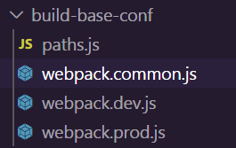

现在前端的需求开始变得越来越复杂，许多代码如果你全写到一个 js 文件里的话一是不好维护，二是没法多人协作，因此模块化是一个非常重要的话题。

## ES6 模块化

### babel 安装

1. cnpm install --save-dev @babel/core @babel/cli @babel/preset-env @babel/node
2. cnpm i --save @babel/polyfill
3. 创建项目配置文件`babel.config.js`

```js
const presets = [
  [
    '@babel/env',
    {
      targets: {
        edge: '17',
        firefox: '60',
        chrome: '67',
        safari: '11.1',
      },
    },
  ],
];
module.exports = { presets };
```

4. 通过`npx babel-node`来运行 js 文件

### 默认导出

导出的话要用`export default`将变量暴露出去

```js
// calculate.js
function add(a, b) {
  return a + b;
}

function sub(a, b) {
  return a - b;
}

function multify(a, b) {
  return a * b;
}

function div(a, b) {
  return a / b;
}
//这些变量不导出的话外界是访问不到的
export default {
  add,
  sub,
  multify,
  div,
};
```

导入的话用`import...from`导入外部模块。

```js
import calculate from './calculate.js';
let res = calculate.add(10, 20);
let res2 = calculate.multify(20, 20);
console.log(res); //30
console.log(res2); //400
```

### 按需导出

如果要按需导出的话只需要在变量前加上`export`关键字。

```js
// calculate.js
export const PI = 3.141592;
export const SQRT2 = 1.414;
export const SQRT3 = 1.732;
```

导入的话用花括号，但注意变量名要和导出的变量名保持一致。

默认导入和按需导入可以同时存在，并不冲突。

```js
import calculate, { PI, SQRT2 } from './calculate.js';
let res = calculate.add(10, 20);
let res2 = calculate.multify(20, 20);
console.log(res); //30
console.log(res2); //400
console.log(PI); //3.141592
```

### 直接导出并执行代码

`naive.js`

```js
console.log('too young too simple!');
```

`main.js`

```js
import './naive';
//too young too simple!
```

## webpack 基本配置

### 拆分配置

在配置开发环境和生产环境的时候，我们可以将公共的配置提取出来，这样可以减少一些配置项的重复。



> `webpack.common.js`是公共的配置项

在开发配置或生产配置中合并配置项的时候，我们需要用到一个要`webpack-merge`的工具，然后就可以进行配置合并了。

以下是 dev 环境下的关键代码。

> webpack.dev.js

```js
const webpackCommonConf = require('./webpack.common.js')
const { smart } = require('webpack-merge')

module.exports = smart(webpackCommonConf, {"这里面是开发环境中特有的配置项"})
```

### 公共配置

#### 处理 ES6

```js
{
    test: /\.js$/,
    loader: ['babel-loader'],
    include: srcPath,
    exclude: /node_modules/
}
```

> .babelrc

```js
{
    "presets": ["@babel/preset-env"],
    "plugins": []
}
```

#### vue 模板预编译

```js
{
    test: /\.vue$/,
    loader: ['vue-loader'],
    include: srcPath
}
```

#### 处理样式

```js
{
    test: /\.css$/,
    // loader 的执行顺序是：从后往前
    loader: ['style-loader', 'css-loader', 'postcss-loader'] // 加了 postcss
},
{
    test: /\.less$/,
    // 增加 'less-loader' ，注意顺序
    loader: ['style-loader', 'css-loader', 'less-loader']
}
```

其中`postcss-loader`可以对 css 进行兼容性处理。

需要在项目目录下对`postcss.config.js`进行配置

```js
module.exports = {
  plugins: [require('autoprefixer')],
};
```

::: tip
如果有多个 loader，那么执行的顺序是从后往前。
:::

#### 配置 Html 入口文件

配置之前需要安装`html-webpack-plugin`插件。

```js
plugins: [
  new HtmlWebpackPlugin({
    template: path.join(srcPath, 'index.html'),
    filename: 'index.html',
  }),
];
```

### 开发环境下的配置

#### 处理图片

开发环境下直接用`file-loader`引入图片 url。

> 在 rules 中加入下列规则

```js
// 直接引入图片 url
{
    test: /\.(png|jpg|jpeg|gif)$/,
    use: 'file-loader'
}
```

#### 配置 devServer

```js
devServer: {
    port: 8080,
    progress: true, // 显示打包的进度条
    contentBase: distPath, // 根目录
    open: true, // 自动打开浏览器
    compress: true, // 启动 gzip 压缩
    // 设置代理
    proxy: {
        // 将本地 /api/xxx 代理到 localhost:3000/api/xxx
        '/api': 'http://localhost:3000',
        // 将本地 /api2/xxx 代理到 localhost:3000/xxx
        '/api2': {
            target: 'http://localhost:3000',
            pathRewrite: {
                '/api2': ''
            }
        }
    }
}
```

其中通过设置代理可以解决跨域问题。

### 生产环境下的配置

#### output 配置

```js
output: {
    filename: 'bundle.[contentHash:8].js',  // 打包代码时，加上 hash 戳
    path: distPath,
    // publicPath: 'http://cdn.abc.com'  // 修改所有静态文件 url 的前缀（如 cdn 域名），这里暂时用不到
}
```

哈希戳会检测文件变动情况，如果文件不变的话哈希戳也不会变，这样可以减少一些不必要的打包。

#### 处理图片

生产环境下对图片的处理会稍微复杂一些。

```js
// 图片 - 考虑 base64 编码的情况
{
    test: /\.(png|jpg|jpeg|gif)$/,
    use: {
        loader: 'url-loader',
        options: {
            // 小于 5kb 的图片用 base64 格式产出
            // 否则，依然延用 file-loader 的形式，产出 url 格式
            limit: 5 * 102
            // 打包到 img 目录下
            outputPath: '/img1/
            // 设置图片的 cdn 地址（也可以统一在外面的 output 中设置，那将作用于所有静态资源）
            // publicPath: 'http://cdn.abc.com'
        }
    }
}
```

## webpack 高级配置

### 多页面配置多入口

首先要在公共配置中配置多入口

> webpack.common.js

```js
entry: {
    index: path.join(srcPath, 'index.js'),
    other: path.join(srcPath, 'other.js')
},
```

如果是在生产环境下，我们还需要配置多出口。

> webpack.prod.js

```js
output: {
    filename: '[name].[contentHash:8].js', // name 即多入口时 entry 的 key
    path: distPath,
},
```

这里的`name`就是`entry`中的 key。

最后要配置生成多个 Html 模板文件。

> webpack.common.js

```js
plugins: [
  new HtmlWebpackPlugin({
    template: path.join(srcPath, 'index.html'),
    filename: 'index.html',
    // chunks 表示该页面要引用哪些 chunk （即上面的 index 和 other），默认全部引用
    chunks: ['index'], // 只引用 index.js
  }),
  // 多入口 - 生成 other.html
  new HtmlWebpackPlugin({
    template: path.join(srcPath, 'other.html'),
    filename: 'other.html',
    chunks: ['other'], // 只引用 other.js
  }),
];
```

这里的`chunks`会指定引入的`js`文件,不配置的话会将所有的入口 js 全部引入。

::: tip
生产环境下如果不想去手动的清除 dist 可以去安装一个`clean-webpack-plugin`的插件

```js
plugins: [
  new CleanWebpackPlugin(), // 会默认清空 output.path 文件夹
  //...
];
```

:::

### 抽离压缩 CSS 文件

在生产环境下，我们需要对 CSS 文件进行抽离和压缩。

先将抽离和压缩的插件先引进来。

```js
const MiniCssExtractPlugin = require('mini-css-extract-plugin');
const TerserJSPlugin = require('terser-webpack-plugin');
const OptimizeCSSAssetsPlugin = require('optimize-css-assets-webpack-plugin');
```

**抽离 CSS**

```js
module: {
    rules: [
        // 抽离 css
        {
            test: /\.css$/,
            loader: [
                MiniCssExtractPlugin.loader,  // 注意，这里不再用 style-loader
                'css-loader',
                'postcss-loader'
            ]
        },
        // 抽离 less --> css
        {
            test: /\.less$/,
            loader: [
                MiniCssExtractPlugin.loader,  // 注意，这里不再用 style-loader
                'css-loader',
                'less-loader',
                'postcss-loader'
            ]
        }
    ]
},
plugins: [
    // 抽离 css 文件
    new MiniCssExtractPlugin({
        filename: 'css/main.[contentHash:8].css'
    })
],
```

**压缩 CSS**

压缩 CSS 的时候需要在`optimization`中进行配置。

```js
optimization: {
    // 压缩 css
    minimizer: [new TerserJSPlugin({}), new OptimizeCSSAssetsPlugin({})],
}
```

### 抽离分割代码块

有的时候我们可以将一些公共的脚本文件拆出来，做成“共享脚本”，这样可以避免一些重复的引入。
同时一些第三方的模块我们也可以把他们给拆出来，毕竟这些第三方模块打包出来肯定是静态的，没有必要每次重新被打包。

> 我们需要在 webpack.prod.js 配置下 optimization

```js
optimization: {
        // 分割代码块
        splitChunks: {
            chunks: 'all',
            /**
             * initial 入口 chunk，对于异步导入的文件不处理
                async 异步 chunk，只对异步导入的文件处理
                all 全部 chunk
             */

            // 缓存分组
            cacheGroups: {
                // 第三方模块
                vendor: {
                    name: 'vendor', // chunk 名称
                    priority: 1, // 权限更高，优先抽离，重要！！！
                    test: /node_modules/,
                    minSize: 0,  // 大小限制
                    minChunks: 1  // 最少复用过几次
                },

                // 公共的模块
                common: {
                    name: 'common', // chunk 名称
                    priority: 0, // 优先级
                    minSize: 0,  // 公共模块的大小限制
                    minChunks: 2  // 公共模块最少复用过几次
                }
            }
        }
    }
```

在公共配置里的 HTML 模板中，我们还需要手动引入 chunk。

> webpack.common.js

```js
plugins: [
  new HtmlWebpackPlugin({
    template: path.join(srcPath, 'index.html'),
    filename: 'index.html',
    // chunks 表示该页面要引用哪些 chunk （即上面的 index 和 other），默认全部引用
    chunks: ['index', 'vendor', 'common'], // 要考虑代码分割
  }),
  // 多入口 - 生成 other.html
  new HtmlWebpackPlugin({
    template: path.join(srcPath, 'other.html'),
    filename: 'other.html',
    chunks: ['other', 'common'], // 考虑代码分割
  }),
];
```

::: tip
Q: module chunk bundle 的区别？

- module 指的是各个源文件，在 webpack 中一些皆模块
- chunk 是多个 module 的集合，此时这个集合还在内存中
- bundle 是 chunk 最终的输出文件
  :::

### 异步加载 js

webpack 默认支持 import 函数,可以实现像 vue 那样的动态懒加载

```js
setTimeout(() => {
  import('./test').then((res) => {
    console.log(res.default);
  });
}, 1500);
```

<hide txt="PS:这种写法在node下是不支持的。。。"/>
 
## 打包效率优化(提高开发体验)
### 优化babel-loader
在babel-loader中开启缓存可以减少一些不必要的js转义
``` js
{
    test: /\.js$/,
    //开启babel-loader缓存
    loader: ['babel-loader?cacheDirectory'],
    include: srcPath,
    exclude: /node_modules/
}
```
### 配置noParse
有一些包是没有必要经过webpack打包解析的，像`lodash`,`jQuery`等等，此时我们可以在module中配置noParse字段避免这些库文件被打包
``` js
module:{ noParse:[/jquery|lodash/] }
```
### 忽略第三方包的指定目录
`IgnorePlugin`可以忽略第三方包的指定目录，比如一些语言包，我们可以将其全部忽略，在使用的时候动态引入自己需要的即可。
``` js
//webpack.config.js
module.exports = {
    //...
    plugins: [
        //忽略 moment 下的 ./locale 目录
        new webpack.IgnorePlugin(/^\.\/locale$/, /moment$/)
    ]
}

````
### 多进程文件处理
#### happypack
> eg:用happypack来处理es6
``` js
const HappyPack = require('happypack')

    module: {
        rules: [
            // js
            {
                test: /\.js$/,
                // 把对 .js 文件的处理转交给 id 为 babel 的 HappyPack 实例
                use: ['happypack/loader?id=babel'],
                include: srcPath,
                // exclude: /node_modules/
            },
            //...
        ]
    },

    plugins: [
    // happyPack 开启多进程打包
    new HappyPack({
        // 用唯一的标识符 id 来代表当前的 HappyPack 是用来处理一类特定的文件
        id: 'babel',
        // 如何处理 .js 文件，用法和 Loader 配置中一样
        loaders: ['babel-loader?cacheDirectory']
    })
],
````

#### ParallelUglifyPlugin

ParallelUglifyPlugin 可以实现多进程压缩代码

> 在 plugin 中配置

```js
// 使用 ParallelUglifyPlugin 并行压缩输出的 JS 代码
new ParallelUglifyPlugin({
  // 传递给 UglifyJS 的参数
  // （还是使用 UglifyJS 压缩，只不过帮助开启了多进程）
  uglifyJS: {
    output: {
      beautify: false, // 最紧凑的输出
      comments: false, // 删除所有的注释
    },
    compress: {
      // 删除所有的 `console` 语句，可以兼容ie浏览器
      drop_console: true,
      // 内嵌定义了但是只用到一次的变量
      collapse_vars: true,
      // 提取出出现多次但是没有定义成变量去引用的静态值
      reduce_vars: true,
    },
  },
});
```

### 热更新

热更新不会像刷新网页那样直接丢失网页原来的状态，当我们开发一些路由较复杂的应用时可以用得上。

> 热更新肯定是在 dev 环境下

```js
const HotModuleReplacementPlugin = require('webpack/lib/HotModuleReplacementPlugin');
//入口文件
entry: {
    // index: path.join(srcPath, 'index.js'),
    index: [
        'webpack-dev-server/client?http://localhost:8080/',
        'webpack/hot/dev-server',
        path.join(srcPath, 'index.js')
    ],
    //...
},
plugins: [
    //...
    new HotModuleReplacementPlugin()
],
devServer: {
    //...
    hot: true,
    //...
}
```

如果要实现 js 热更新的话需要手动在代码里设置一个监听范围

```js
// 增加，开启热更新之后的代码逻辑
if (module.hot) {
  module.hot.accept(['./math.js'], () => {
    const sumRes = sum(10, 30);
    console.log('sumRes in hot', sumRes);
  });
}
```

此时，只有`math.js`文件更改才会触发热更新，修改其他的 js 文件不会触发热更新

### 使用 Dllplugin 来预打包静态依赖

首先要先用`webpack/lib/DllPlugin`来生成预打包文件

> webpack.dll.js

```js
const path = require('path');
const DllPlugin = require('webpack/lib/DllPlugin');
const { srcPath, distPath } = require('./paths');

module.exports = {
  mode: 'development',
  // JS 执行入口文件
  entry: {
    // 把 React 相关模块的放到一个单独的动态链接库
    react: ['react', 'react-dom'],
  },
  output: {
    // 输出的动态链接库的文件名称，[name] 代表当前动态链接库的名称，
    // 也就是 entry 中配置的 react 和 polyfill
    filename: '[name].dll.js',
    // 输出的文件都放到 dist 目录下
    path: distPath,
    // 存放动态链接库的全局变量名称，例如对应 react 来说就是 _dll_react
    // 之所以在前面加上 _dll_ 是为了防止全局变量冲突
    library: '_dll_[name]',
  },
  plugins: [
    // 接入 DllPlugin
    new DllPlugin({
      // 动态链接库的全局变量名称，需要和 output.library 中保持一致
      // 该字段的值也就是输出的 manifest.json 文件 中 name 字段的值
      // 例如 react.manifest.json 中就有 "name": "_dll_react"
      name: '_dll_[name]',
      // 描述动态链接库的 manifest.json 文件输出时的文件名称
      path: path.join(distPath, '[name].manifest.json'),
    }),
  ],
};
```

然后在开发环境中用`webpack/lib/DllReferencePlugin`引入预打包的库文件。

```js
// 第一，引入 DllReferencePlugin
const DllReferencePlugin = require('webpack/lib/DllReferencePlugin');

plugins: [
    //...
    //引入配置文件
    new DllReferencePlugin({
        // 描述 react 动态链接库的文件内容
        manifest: require(path.join(distPath, 'react.manifest.json')),
    }),
],
```

## webpack 在生产模式下自身的优化

### TreeShaking

当用生产模式打包时，会默认启用`Tree-Shaking`。

`Tree-Shaking`是一种打包机制，它可以移除那些没有引用的 js 代码。
::: tip
Q: ES6 module 和 Commonjs 的区别
A: Commonjs 是可以动态引入的，也就是允许在代码执行阶段引入。
而 ES6 module 不支持动态引入，但正是因为这一点使得 ES6 在编译阶段可以静态分析，从而实现 Tree-Shaking。
:::

### scope hosting 作用域提升

变量提升可以减少一些变量声明，简化一些函数结构。

## babel

### 环境搭建

> package.json

```json
{
  "name": "09-babel-demo",
  "version": "1.0.0",
  "description": "",
  "main": "index.js",
  "scripts": {
    "test": "echo \"Error: no test specified\" && exit 1"
  },
  "keywords": [],
  "author": "",
  "license": "ISC",
  "devDependencies": {
    "@babel/cli": "^7.7.5",
    "@babel/core": "^7.7.5",
    "@babel/plugin-transform-runtime": "^7.7.5",
    "@babel/preset-env": "^7.7.5"
  },
  "dependencies": {
    "@babel/polyfill": "^7.7.0",
    "@babel/runtime": "^7.7.5"
  }
}
```

> .babelrc

```json
{
  "presets": [
    [
      "@babel/preset-env",
      {
        "useBuiltIns": "usage",
        "corejs": 3
      }
    ]
  ],
  "plugins": []
}
```

然后就可以使用`npx babel xxx.js`来编译 ES6 了。

### babel-polyfill

首先要明白一件事情:Babel 只解析高级的"语法"，但不会解析一些新增的 api，此时就需要我们用一些 polyfill 库来解析这些新的 api

Babel7.4 之前用的一个 polyfill 库，里面包含了`core.js`和`regenerator`。
7.4 之后被弃用，官方推荐直接使用`core.js`和`regenerator`。

你可以通过直接 import 的方式将 babel-polyfill 全部引入进来(不推荐)

也可以配置按需引入。
PS：这种方法在 7.4 之后的版本也是可用的

> .babelrc

```json
{
  "presets": [
    [
      "@babel/preset-env",
      {
        "useBuiltIns": "usage",
        "corejs": 3
      }
    ]
  ],
  "plugins": []
}
```

然后在入口文件就不用全部 import 了。
::: tip
很多的其他 UI 组件库也可以设置按需引入。
:::

### babel-runtime

`babel-runtime`可以将打上 pollfill 的 api 在转义时改个名儿，这样在运行时可以避免变量污染,在开发一些第三方库的时候可以用得到

#### 具体配置

首先要将`@babel/plugin-transform-runtime`和`@babel/runtime`这两个库装上

配置`.babelrc`

```json
{
  "presets": [
    [
      "@babel/preset-env",
      {
        "useBuiltIns": "usage",
        "corejs": 3
      }
    ]
  ],
  "plugins": [
    [
      "@babel/plugin-transform-runtime",
      {
        "absoluteRuntime": false,
        "corejs": 3,
        "helpers": true,
        "regenerator": true,
        "useESModules": false
      }
    ]
  ]
}
```

## webpack 面试题补充

### 前端为什么需要工程化

**从代码层面：**

- 首先通过工程化处理可以使得代码的体积压缩，从而提高加载速度
- 可以编译一些高级的语法(ES6/TS，Scss)
- 可以提高代码的兼容性(polyfill)
  **从开发流程上:**
- 统一的标准
- 高效的开发环境

### loader 和 plugin

loader 是模块转换器，比如讲 less => css
常见的 loader 有`babel-loader`,`css-loader`,`less-loader`,`url-loader`,以及处理其他文件的`file-loader`
plugin 是一些拓展插件，比 loader 的功能更为强大。
常见的 plugin 有`HtmlWebpackPlugin`,`DllPlugin`,`HotModuleReplacementPlugin`等等

### babel 和 webpack 的区别

emmm 怎么会有这种脑瘫面试题，一个语法转换器，一个打包工具，能一样么。。

### 如何产出一个 lib

用`DllPlugin`预编译

### babel-polyfill 和 babel-runtime 的区别

babel-polyfill 会污染全局，但是配合使用 babel-runtime 就不会污染全局
当开发一些第三方的 lib 时一定要用 babel-runtime

### webpack 如何实现懒加载

和 vue 路由懒加载一样，都是`import()`

### 为何 Proxy 不能被 polyfill？

因为 Proxy 的操作没法用 ES6 以下的语法模拟。
你写个 Promise 完全可以用可以写一个大的 Function，then 方法可以整个回调
你写 Class 可以用 Function，但你写 Proxy 用啥？`Object.definePropery`吗？别忘了 Proxy 的功能远比这个 api 强大的多

### ES6+(bebel)转换原理

解析 => 转换 => 生成

分析 token,将其转换成 AST
通过读取用户配置(.babelrc)将其转换成目标 AST
将目标 AST 再生成为 es5 以下的语法

### webpack 的性能优化

#### 提高构建速度

1. 缓存(babel-loader)
2. 忽略一些不必要的模块及模块内的某些路径(IgnorePlugin)
3. 动态链接库(以前构建出来一个 dll,比如 react)
4. 多进程打包和压缩代码(happyPack 和 ParalleUglyPlugin)

#### 代码优化

PS: webpack 自身的优化就不说了

1. 使用 cdn
2. 图片 base64
3. bundle 加 hash
4. 懒加载
5. 对于一些多页面应用，可以将公共代码抽离出来(在`optimization.splitChunks`中进行配置)
