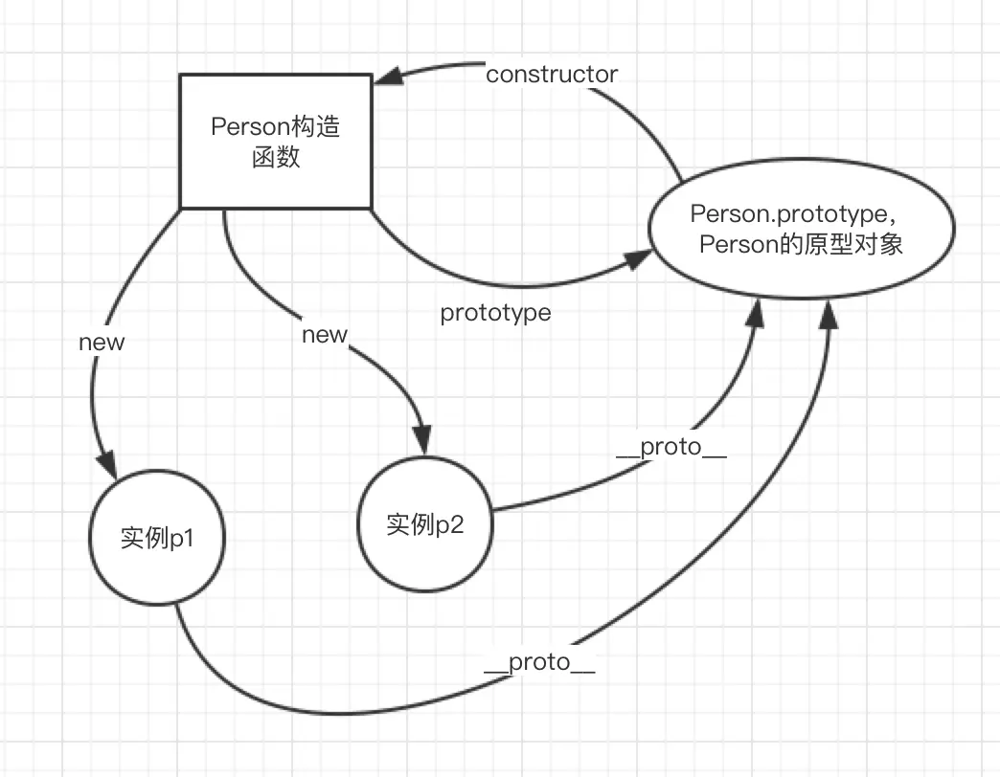

## 引子
在javascript中，没有所谓的“类”的概念，js中只有实例，所有的对象都是实例。

要想实现面向对象的一些特性(如继承)，只能将一个对象的原型指向另一个对象。

``` js
let model = {
    name: 'undefined',
    height: '183',
    run() {
        console.log(this.name + "is running!")
    }
};

let jason = {
    name: "jason"
};
//
jason.__proto__ = model;
jason.run();
console.log(jason.height)
```
在这个例子中，jason这个对象是没有`height`属性和`run()`方法的，但如果把jsaon对象的原型指向`model`,jason就也能去访问model中的属性和方法。

但最好不要这样做，因为老IE对对象的这个隐藏属性支持好像不是太好。正常的操作应该是这样：
``` js
let model = {
    name: 'undefined',
    height: '183',
    run() {
        console.log(this.name + " is running!")
    }
};

var stu = Object.create(model);
stu.name = 'jason';
stu.run();//jason is running!
```
其中，`Object`也是Js的一个内置对象，`Object.created()`是这个内置对象中的一个方法，它可以根据传入的对象创建出一个独立的"副本",其中参数是要指定的原型对象。

上面的两种方法都实现了原型继承。
## 创建对象的各种方式
### 字面量直接创建
这种方法最简单，但劣势也非常明显，那就是无法复用。如果有大量同类型的对象，则代码就会非常冗余。
### new一个Object()
等同于字面量直接创建。
### `Object.create()`
`Object.create(null)`没有原型<hide txt="感觉是找不到原型，毕竟引用传了个null过去"></hide>，通过`Object.create()`可以指定原型。

::: warning
关于`new`与`Object.create()`的区别
`new`是针对于`类`或者`构造函数`的，而`Object.create()`主要是针对于原型对象的。
如果你`new`了一个原型对象或者你用`Object.create()`传进去一个类，都是没有意义的，毕竟他们作用的东西不一样，虽然都是实现继承的手段。
:::
### new一个构造函数
每当我们去new一个函数时，new完后会返回一个新的对象，这个新的对象我们可以把它类比为“类的实例”，当然new的那个函数我们可以将它类比为一个“类”。
在函数被new的过程中，主要会做三件事情。

1.创建一个新的对象。
2.将函数中的this绑定到这个新的对象上
3.返回这个新的对象

说白了就是：**构造函数中的this，会指向new出来的实例对象。**
``` js
function Student(name, age) {
    this.name = name;
    this.age = age;
    this.sayhi = function() {
        console.log("hi!!!")
    }
}
let jason = new Student("jason", 18);
jason.sayhi(); //hi!!!
console.log(jason);
//Student { name: 'jason', age: 18, sayhi: [Function] }
```
用这种方法我们可以发现打印出来的结果多了一些不一样的东西，如果我们在定义一个关于“猫”的类,并比较`jason`和`guoguo`的构造器：
``` js
function Cat(name, age) {
    this.name = name;
    this.age = age;
    this.meow = function() {
        console.log("Meow~~")
    }
}
let guoguo = new Cat("果果", 1);
guoguo.meow(); //Meow~~
console.log(guoguo); 
//Cat { name: '果果', age: 1, meow: [Function] }
console.log(jason.constructor == guoguo.constructor); //false
```
我们发现可以根据构造器的指向来判断类型了！

但这样在构造函数中直接定义构造方法是有问题的，我们接下来会讨论。

## 原型
每当我们创建一个函数的时候，JS解析器会向函数中添加一个叫`prototype`的属性，这个属性所对应的对象就是所谓的**原型**对象（简称原型）。如果我们new一个实例，这个实例也会拥有原型对象的所有属性。
``` js
function Cat(name, age) {
    this.name = name;
    this.age = age; 
    this.meow = function() {
        console.log("Meow~~")
    }
}
let guoguo = new Cat("果果", 1);
let qiuqiu = new Cat("球球",2);
guoguo.meow();//Meow~~
qiuqiu.meow();//Meow~~
console.log(guoguo.__proto__);//Cat {}
console.log(qiuqiu.__proto__);//Cat {}
```
在上述的测试代码中，我们通过实例的`__proto__`属性(**隐式原型**)查看了**显式原型**(PS:实际代码中可千万不要这样用)。

也就是说，**实例的隐式原型指向构造函数的显式原型**。

``` js
console.log(guoguo.__proto__ === Cat.prototype);//true
```

那原型的作用到底是什么呢？

**原型是JS实现面向对象的核心特性。**

在上面的代码中，我们实例化了两只喵，其中每实例化一直喵都会直接初始化一个`meow()`方法，那如果我们实例化了一千只喵，甚至一万只喵，那么在实例化的过程中都会初始化这个方法，这无疑会是巨大的性能浪费。

正确的方法应该是将`meow()`方法添加到`Cat`的原型对象上，这样`meow()`方法就作为了所有猫猫的公共属性，谁都可以访问。
``` js
function Cat(name, age) {
    this.name = name;
    this.age = age;
}
Cat.prototype.meow = function(){
    console.log("喵喵喵？")
}
let guoguo = new Cat("果果", 1);
let qiuqiu = new Cat("球球",2);
guoguo.meow();//喵喵喵？
qiuqiu.meow();//喵喵喵？
```
而所谓的原形链就是：当访问一个对象的属性时，如果没有，就会去这个**对象的原型对象**上去找，如果还没有，就会去这个**原型对象的原型对象**上去找，知道找到为止。

### 和原型有关的两个方法
#### `hasOwnProperty()`
判断一个属性是否是自己独有的而不是原型上的。
``` js
function Cat(name, age) {
    this.name = name;
    this.age = age;
}
Cat.prototype.meow = function(){
    console.log("喵喵喵？")
}
let guoguo = new Cat("果果", 1);
let qiuqiu = new Cat("球球",2);
console.log(guoguo.hasOwnProperty('meow'));//false
```
#### `isPrototypeOf()`
判断一个对象是否是另一个对象的原型
``` js
function Cat(name, age) {
    this.name = name;
    this.age = age;
}
Cat.prototype.meow = function(){
    console.log("喵喵喵？")
}
let guoguo = new Cat("果果", 1);
let qiuqiu = new Cat("球球",2);
console.log(Cat.prototype.isPrototypeOf(guoguo));//true
```
### 构造函数、原型对象、实例间的关系

- 构造函数的`prototype`属性指向原型对象，原型对象的`constructor`指向构造函数。
- 构造函数new出来的所有实例中的隐藏属性`__proto__`也会指向原型对象。
## 继承
### 原型链继承
将“子类”的`prototype`指向“父类”的实例，从而获得父类的属性和方法。
``` js
function Person(name, age) {
    this.name = name;
    this.age = age;
}
Person.prototype.say = function() {
    console.log('hi');
}

function Student(num) {
    this.num = num;
}

let p = new Person("jason", 18);
Student.prototype = p;
//Student的原型指向了Person的实例，因此Student new出来的实例就会拥有原Person的属性和方法。
let jason = new Student("170501");
console.log(jason.age);//18
jason.say();//hi
```
但有一点需要注意，如果我们打印实例`p`的构造器指向，我们会发现`p`的构造器仍然指向的是原来的`Person`类，这是非常不好的。
``` js
console.log(p.constructor);
//[Function: Person]
```
为什么不好呢？别忘了`p`里面装的可是`Student.prototype`,既然是`Student`的原型了那我们就应该老老实实让`p`的构造器指向`Student`,这才是一个正经原型对象该有的亚子。说的严谨一些还是为了方便我们对类型进行判断。
``` js
p.constructor = Student;
// 或者
Student.prototype.constructor = Student;

console.log(p.constructor);//[Function: Student]
```
### 构造函数继承
::: tip
建议您在看这部分内容时，请先了解好`call()`函数的作用。
:::
``` js
function Animal(name,age){
    this.name = name;
    this.age = age;
}
function Cat(name,age,isCute){
    //将Cat中要new出来的实例对象传入Animal中
    Animal.call(this,name,age);
    this.isCute = isCute;
}

let guoguo = new Cat("果果",1,true);
console.log(guoguo.name);//果果
```
我们需要对`Animal.call(this,name,age);`这行代码进行详细的讨论。<hide txt="PS:那帮人咋这么牛逼呢，这样就能实现继承了卧槽！！！"></hide>

首先我们知道，当构造函数被**new**的时候，会解析构造函数中的this，并将其指向到new出来的实例身上。

也就是说，这行代码在真正执行的时候是长这个样子:
`Animal.call(guoguo,name,age);`
其中，可爱的果果（实例）被作为参数传递到了Animal这个函数中，构造函数`Animal()`再一执行，果果就有了`Animal`的属性啦！
### 组合继承

``` js
function Animal(name,age){
    this.name = name;
    this.age = age;
}
Animal.prototype.run = function(){
    console.log("running!")
}
function Cat(name,age,isCute){
    //将Cat中要new出来的实例对象传入Animal中
    Animal.call(this,name,age);
    this.isCute = isCute;
}
Cat.prototype = new Animal();
//猫的原型指向动物的实例，方便拿出实例上的方法
Cat.prototype.constructor = Cat;
let guoguo = new Cat("果果",1,true);
console.log(guoguo.name);//果果
guoguo.run();//running!
```
组合继承就是这两种继承方法的结合，但缺点也很明显————父类构造方法被调用了两次，而且每次调用，除了属性和方法，构造函数里的其他东西我们也跑了一遍(假如有的话，这个例子有些极端，父类构造方法过于简单了)，我们应该去思考一种方案，只要父类的属性和方法。
### 寄生组合继承

``` js
function Animal(name, age) {
    this.name = name;
    this.age = age;
}
Animal.prototype.run = function() {
    console.log("running!")
}

function Cat(name, age, isCute) {
    //将Cat中要new出来的实例对象传入Animal中
    Animal.call(this, name, age);
    this.isCute = isCute;
    Cat.prototype.run = function() {
        console.log("不仅仅会跑，我还回爬树！")
    }
}

function Brideg() {};
//让Bridge的原型对象先指向Animal的原型对象
Brideg.prototype = Animal.prototype;
let brideg = new Brideg();
Cat.prototype = brideg;

//找到一个正经原型该有的亚子
brideg.constructor = Cat;

let guoguo = new Cat("果果", 1, true);
console.log(guoguo.name);
guoguo.run(); //不仅仅会跑，我还回爬树！
```
寄生组合继承的核心思想是:创建一个“缓冲函数对象”,首先让这个“缓冲函数对象”的原型先指向父类的原型，然后再让子类的原型指向“缓存对象”的**实例**。当然最后不要忘了更改构造器的指向。
当然也可以用`Object.create(Animal.prototype)`函数创建一份父类的原型拷贝，然后将子类的原型指到这份原型拷贝上，道理是一样的，最终实现的目标也是一致的————都是为了能“干净的”继承父类的原型。
## 多态
在Java语言中，多态有两种表现形式，一种是方法的重载(`Overload`), 另一种是方法的重写(`Override`)。上面继承中的例子中`Cat`类的`run()`方法已经体现了对方法的重写，接下来重点讨论重载。
### JS中方法的重载
- 普通方法模拟重载
``` js
function sum(a, b, c) {
    if (a && b && c) {
        console.log(a + b + c);
    } else if (a && b) {
        console.log(a + b);
    } else {
        console.log(a);
    }
}
sum(); //undefined
sum(11, 12); //23
sum(11, 12, 13) //36
```
能看出来这种方法非常不灵活，万一传进来的参数是4个或者是5个就又要重新加条件判断。
- 使用`arguments`参数对象实例
关于`arguments`对象实例，详见[JS内置对象常用api整理](./js对象常用api整理.md)
``` js
function sum() {
    if (arguments.length == 0) return "你不传数过来劳资咋给你算？"
    let res = 0;
    for (let i = 0; i < arguments.length; i++) {
        res += arguments[i];
    }
    return res;
}

let res = sum(1, 2, 3);
let res2 = sum(7, 7, 7, 7, 7, 7, 7, 7);
let res3 = sum();
console.log(res); // 6
console.log(res2); // 56
console.log(res3); // 你不传数过来劳资咋给你算？
```
## ES6中的面向对象
### 创建一个类
``` js
class Cat {
    constructor(name, age) {
        this.name = name;
        this.age = age;
    }
}

let guoguo = new Cat("果果", 1);
let qiuqiu = new Cat("球球", 2);
console.log(guoguo.name);
```
### 类中添加方法
``` js
class Cat {
    constructor(name, age) {
        this.name = name;
        this.age = age;
    }
    meow() {
        console.log("meow~")
    }
}

let guoguo = new Cat("果果", 1);
let qiuqiu = new Cat("球球", 2);
console.log(guoguo.name);
guoguo.meow();//meow~
```
### 继承
和Java、C++一样，都是用`extend`关键字来实现继承
``` js
class Animal {
    constructor(name, age) {
        this.name = name;
        this.age = age;
    };
    run() {
        console.log("running!")
    }
}

class Cat extends Animal {
    constructor(name, age, isCute) {
        super(name, age);//用super来调用父类的构造函数
        this.isCute = isCute;
        this.meow();
    }
    meow() {
        console.log("喵~~")
    };
    //override
    run() {
        console.log("不单单会跑，我还会爬树！")
    }
}

let guoguo = new Cat("果果", 1, true);
guoguo.run();
```
当我们用ES6之前的这种乱七八糟的方法实现继承之后再来看这些，变觉得清爽了许多。但仍有几点需要我们注意。
- 当`super`用来调用父类的构造函数时，一定要放到子类this的前面进行调用，如果不写或者写到后面的话，在new实例的时候就会报错。
- `super`关键字不单单可以调父类的构造函数，也可以调用父类的普通函数。
``` js
class Cat extends Animal {
    constructor(name, age, isCute) {
        super(name, age);
        this.isCute = isCute;
        super.run();
    }
    meow() {
        console.log("喵~~")
    };
    //override
    run() {
        console.log("不单单会跑，我还会爬树！")
    }
}

let guoguo = new Cat("果果", 1, true);//running!
```
- 构造器里的`this`指向的是实例对象
``` js
class Cat extends Animal {
    constructor(name, age, isCute) {
        super(name, age);
        this.isCute = isCute;
        // super.run();
        console.log(this);
    }
    meow() {
        console.log("喵~~")
    };
    //override
    run() {
        console.log("不单单会跑，我还会爬树！")
    }
} 

let guoguo = new Cat("果果", 1, true);
//Cat { name: '果果', age: 1, isCute: true }
```
而方法里的`this`指向的是方法的调用者（一般情况下还是实例对象）
``` js
class Animal {
    constructor(name, age) {
        this.name = name;
        this.age = age;
    };
    run() {
        console.log("running!");
    }
}

class Cat extends Animal {
    constructor(name, age, isCute) {
        super(name, age);
        this.isCute = isCute;
        let obj = {};
        obj.meow = this.meow;
    }
    meow() {
        console.log(this.name + ":喵喵喵~");
    };
}

let guoguo = new Cat("果果", 1, true);
guoguo.meow();//果果:喵喵喵~
```

### 重载
在ES6中,由于拓展运算符`...`的存在，实现重载也非常的简单
``` js
function sum(...nums) {
    if (nums.length == 0) return "你不传数过来劳资咋给你算？" 
    let res = 0;
    for (let i = 0; i < nums.length; i++) {
        res += nums[i];
    }
    return res;
}

let res = sum(1, 2, 3);
let res2 = sum(7, 7, 7, 7, 7, 7, 7, 7);
let res3 = sum();
console.log(res); // 6
console.log(res2); // 56
console.log(res3); // 你不传数过来劳资咋给你算？
```