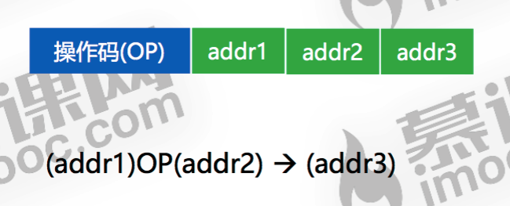
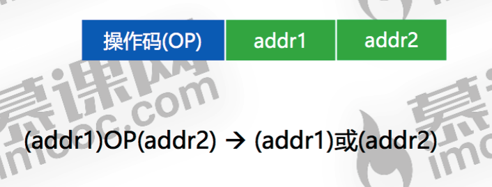
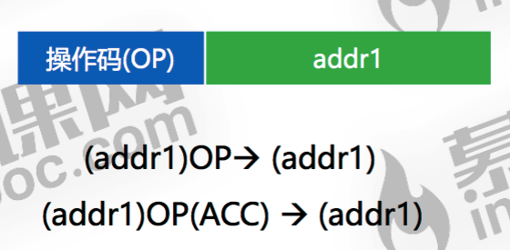
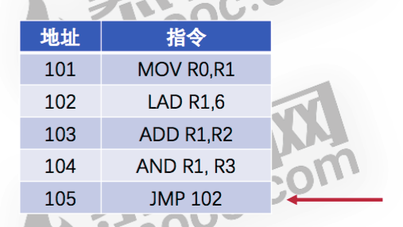
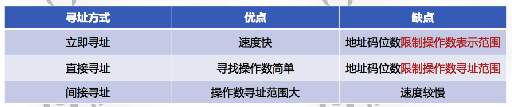
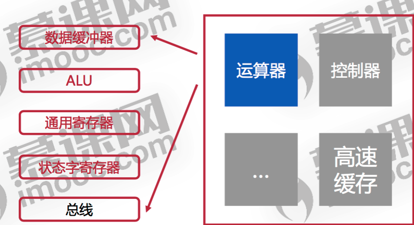
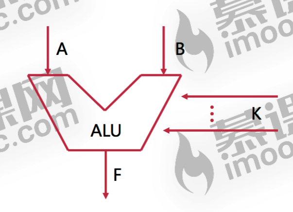
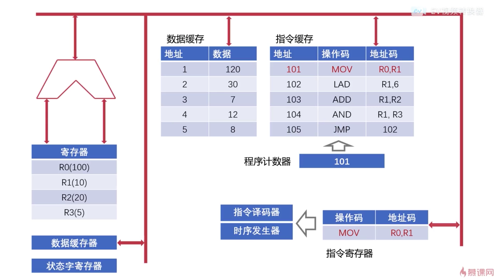
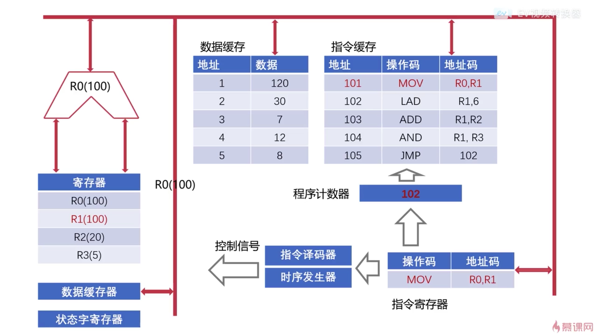
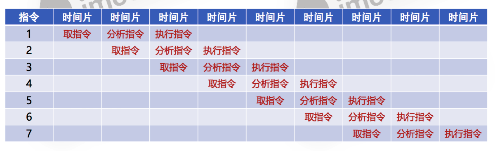

## 指令
### 计算机指令的形式

其中操作码字段指明指令要完成什么操作，操作码的位数可以决定机器可以执行多少种操作。
地址码部分放的是操作数或者是操作数的地址。

地址码可以分为三地址指令，二地址指令，一地址指令和零地址指令。

#### 三地址指令

地址1操作地址2并将结果保存在地址3。
#### 二地址指令

地址1操作地址2并将结果保存在1或者2
#### 一地址指令

自己对自己进行某种操作并将结果保存在自己的“内存”上。
比如自增，自减。
#### 零地址指令
就是没有地址字段的指令，通常是计算机中一些极其重要的特殊操作。
如中断，停机，空操作等等。
### 机器指令的操作类型
#### 数据传输
此类型指令主要负责数据在内存，外存，cache间的消息传递，**以及对数据进行读写**。

#### 算数逻辑操作
此类型指令负责对操作数进行四则运算和逻辑运算（**注意没有移位运算**）

#### 移位操作
此类型主要对操作数进行左移操作(乘2)和右移操作(除2)。

#### 控制指令
大部分都是零地址指令。如中断，停机，等待，空操作等等。

### 机器指令的寻址方式
就是指令要通过什么方式获取到自己所需要的操作数。
#### 指令寻址
根据指令的具体内容来寻址，主要是为了**找到下一条**要执行的指令。
主要有两种表现形式，一种是顺序执行，一种是跳跃执行。

正常情况会从101开始执行，但当执行到JMP指令的时候便会跳转到102。
#### 数据寻址
主要是为了找到本条指令所需要的**操作数**。
##### 立即寻址
指令直接获得操作数，无需访问存储器。
##### 直接寻址
指令中直接给出**操作数在主存中的地址**。
##### 间接寻址
指令中给出的是操作数**地址的地址**。也就意味着要访问多次才能获取到操作数。
##### 三种方式对比

## 控制器

cpu中的控制器主要是用来协调和控制计算机运行的。

### 时序发生器

主要应用于电气工程领域，用来发送时序脉冲。
cpu会根据不同的时序脉冲进行有规律的工作。

### 指令译码器
用来翻译操作码对应的操作数以及控制传输地址码的数据。
### 寄存器
#### 程序计数器
有时也被称之为**指令地址寄存器**，存储下一条指令的地址，可以用来缓存将要运行的指令地址。
#### 指令寄存器
注意区分程序计数器，用于临时存储从主存或高速缓存中的指令。

#### 主存地址寄存器
连接地址总线，用来寄存当前cpu正要访问的内存单元的地址。
#### 主存数据寄存器
连接数据总线，用来寄存当前cpu正要读或写的内存单元的数据。
#### 通用寄存器
容量比专用的寄存器要大一些，用来存一指令，ALU的运算结果啥的。
## 运算器

用来对数据进行运算加工。

### 数据缓冲器
分为输入缓冲和输出缓冲。
输入缓冲用来暂存将要参与运算的数据。
输出缓冲用来暂存运算完的结果。
### ALU

算数逻辑单元，用来进行位运算，逻辑运算以及算数运算。
### 状态字寄存器
用来存放运算状态(进位，溢出，正负等等)和运算控制信息。
## 计算机指令执行的过程
### 指令的执行过程
概括下来一共三个步骤。

**取指令 => 分析指令 => 执行指令**

如图所示，首先将数据和指令缓存到高速缓存中，程序计数器会将要执行的指令的**地址**寄存起来，此时控制器知道了要执行的指令的位置，控制器中的指令寄存器就可以顺着总线取到指令。但这个时候具体该做什么操作控制器其实还并不知道，因为指令的内容还没有翻译，指令寄存器接下来会将指令发送给指令译码器。

当指令寄存器将指令发过去之后，此时**程序计数器会+1**,同时指令译码器会进行翻译，然后由时序发生器发出控制信号给运算器。

运算器在收到信号后会先将要操作的数（R0）取出来放到数据缓冲器中，然后由ALU进行数据处理并记录运算状态(进位，溢出等等)，最后ALU会把结果送出来放到数据缓冲器中。

操作完成后程序计数器已经到了102，就会继续执行与101类似的操作。
### CPU的流水线设计

类似于工厂的流水线，同一个时刻，一个产品(**指令**)处于不同的加工(**执行**)阶段。

上图是串行cpu和流水cpu的执行过程。

从本质上讲，流水线技术是一种**时间并行技术**。及在相同的时间**点**上执行不同的任务。
