## css 选择器优先级

内联 > ID 选择器 > 类选择器 > 标签选择器和伪类选择器
1000 > 0100 > 0010 > 0001
如果有多个选择器，会对其进行加权比较
::: warning
如果元素的属性值后面跟了`!important`,那么这个属性值得优先级最高。
:::

### 样式表优先级

内联 > 内部 css > 外部 css

### 伪类与伪元素

伪类一般匹配元素的特殊状态，比如 hover，而伪元素会匹配元素的特殊位置，像 before，after。
在 CSS3 的新标准中，我们用单引号表示伪类，双引号表示伪元素。

### CSS3 中新增的伪类·

- elem:nth-child(n):选择当前玄素的第 n 个子元素
- elem:last-child: 选中最后一个子元素
  选择元素的方法更灵活了。

## position 属性

### static

默认值。从上倒下，从左到右，它是正常的文档流。

### relative

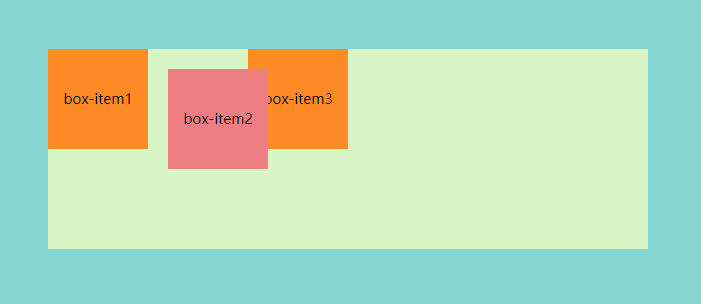

当前元素相对与自身原来位置的偏移，处于文档流之内。

_给中间的盒子添加了下列样式_

```css
.relative {
  position: relative;
  top: 20px;
  left: 20px;
  background-color: lightcoral;
}
```

### absolute

绝对定位，会脱离文档流

- 如果父级元素没有 position 的值，则按照 html(也就是整个浏览器)偏移，脱离了整个 html 文档流。

  ```css
  /*此时父元素（绿色区域）没设置position的属性*/
  .box-item {
    position: absolute;
    top: 20px;
    left: 20px;
    background-color: darkorange;
    width: 100px;
    height: 100px;
    text-align: center;
    line-height: 100px;
  }
  ```

  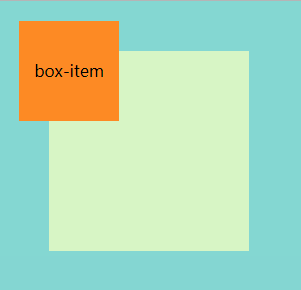

- 如果父元素有 position 的值，则按照父级元素的位置偏移,只会脱离当前父元素内的文档流。

```css
/*此时父元素（绿色区域）设置了position属性*/
.box-item {
  position: absolute;
  top: 20px;
  left: 20px;
  background-color: darkorange;
  width: 100px;
  height: 100px;
  text-align: center;
  line-height: 100px;
}
```

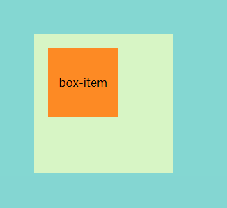

总结: absoulte 相对于里他最近的 relitive 和 absoulte 元素进行定位

### fix

多用于广告啥的，会随着页面滚动。这种布局也会脱离文档流，相对于整个浏览器窗口进行定位。

### sticky

相当于`relative`和`fix`的结合体，它可以让元素在距离浏览器视口一定位置时变成`fix`布局，其他情况下仍然处于正常的文档流中。

通过设置`top`或者`left`告知浏览器距离多少变成`fix`布局。

## display 属性

display 属性设置一个元素如何显示

### block

块级元素，这种属性显示出来的元素会占一整行。
常见块元素:`<p><div><h1><li>`

### inline

内联元素，只会占领自身的宽度和高度所在的空间。

margin 和 padding 在垂直方向上无效。

常见内联元素:`span`,`img`,`input`,`button`

::: tip
img 是一个特例，它虽然是行内元素，但也是置换元素，所以它的性质不同于行内元素。对于 img 来说，设置 margin 和 padding 在垂直方向上是有效的。
:::

### inline-block

行内块元素，顾名思义，不会单独占一行的块元素。宽，高，margin，padding 都可以设置。

## margin 的负值问题

- 如果给`margin-top`和`margin-left`设置负值，元素本身以及后面的元素会被整体拖拽到相反的方向。
- 如果给`margin-bottom`和`margin-right`设置负值，元素本身无变化，但后面的元素会被拖拽到相反的方向，同时元素*相对于外界的宽度和高度*变小。

```html
<!DOCTYPE html>
<html>
  <head>
    <meta charset="UTF-8" />
    <meta name="viewport" content="width=device-width, initial-scale=1.0" />
    <meta http-equiv="X-UA-Compatible" content="ie=edge" />
    <title>margin 负值</title>
    <style type="text/css">
      body {
        margin: 20px;
      }

      .float-left {
        float: left;
      }
      .clearfix:after {
        content: "";
        display: table;
        clear: both;
      }

      .container {
        border: 1px solid #ccc;
        padding: 10px;
      }
      .container .item {
        width: 100px;
        height: 100px;
      }
      .container .border-blue {
        border: 1px solid blue;
        margin-bottom: -20px;
      }
      .container .border-red {
        border: 1px solid red;
      }
    </style>
  </head>
  <body>
    <p>用于测试 margin top bottom 的负数情况</p>
    <div class="container">
      <div class="item border-blue">
        this is item 1
      </div>
      <div class="item border-red">
        this is item 2
      </div>
    </div>

    <p>用于测试 margin left right 的负数情况</p>
    <div class="container clearfix">
      <div class="item border-blue float-left">
        this is item 3
      </div>
      <div class="item border-red float-left">
        this is item 4
      </div>
    </div>
  </body>
</html>
```

## 元素居中

### 水平居中

- inline 元素： `text-align:center`
- block 元素： `margin:auto`
- absolute: `left:50%`+`margin-left:-元素宽度/2`或者`transformX(-50%)`(假设不知道宽度)

### 垂直居中

- inline 元素： 高度等于行高即可。

- 绝对定位的情况下

1. `top:50%` + `margin-top: -元素高度/2`或者`transformY(-50%)`（假设不知道高度）
2. `margin:auto` + `top,left,bottom,right = 0` //终极方案

(PS: 下面的两种方式不需要知道元素高度也能实现)

- flex 布局的情况下
  只需要为需要居中的子元素设置`margin:auto`。

## float

加了 float 的元素会“飘“起来，脱离当前的文档流。
注意：文字对于 float 起来的元素依然是敏感的，因此可以利用这个属性做一些图文环绕的效果。

### 手写清除浮动

添加浮动后，后续元素的排列方式会受到影响，此时清除浮动就可以消除这种影响(也就是让受影响的元素回到原来的位置)

最简单的方法是添加**clear 属性**。clear 会强制指定左侧或者右侧的元素不为浮动元素。

```css
.clearfix:after {
  content: "";
  display: block;
  clear: both;
}
```

## 常用布局

### 双飞翼布局

实现原理是将主体部分放前面，left，right 放后面，然后让这三个元素都浮起来，最后利用 margin 为负值的特性将 left，right 调整到合适的位置。

和圣杯布局很类似，差别只是在右元素的负值应该设置到`margin-left`上而不是`margin-right`上。

```html
<div class="head"></div>
<div class="content">
  <div class="center">
    <p class="para">
      瞎写点东西瞎写点东西瞎写点东西瞎写点东西瞎写点东西瞎写点东西瞎写点东西瞎写点东西瞎写点东西瞎写点东西瞎写点东西瞎写点东西瞎写点东西瞎写点东西瞎写点东西瞎写点东西瞎写点东西瞎写点东西瞎写点东西瞎写点东西瞎写点东西瞎写点东西瞎写点东西瞎写点东西瞎写点东西瞎写点东西
    </p>
  </div>
  <div class="left"></div>
  <div class="right"></div>
</div>
```

```css
* {
  padding: 0;
  margin: 0;
}
.head {
  height: 100px;
  background-color: grey;
}
.center {
  width: 100%;
  height: 100%;
  background-color: yellow;
  float: left;
}
.left {
  width: 100px;
  height: 200px;
  background-color: blue;
  float: left;
  margin-left: -100%;
}
.right {
  width: 100px;
  height: 200px;
  background-color: green;
  float: left;
  margin-left: -100px;
}
.para {
  margin: 0 100px 0 100px;
  /* 上右下左顺时针 */
}
```

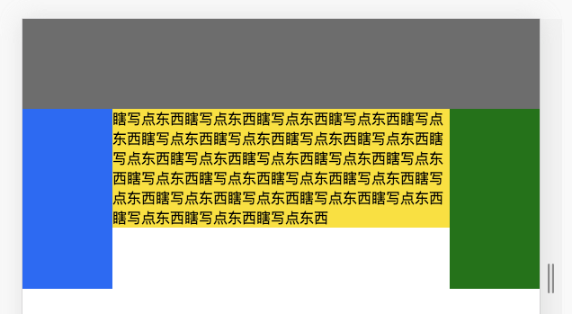

### 圣杯布局

1. 第一步，画出头部和底部，中间的位置将 center 放最前面并设置宽度为 100%，left 和 right 固定宽度。
   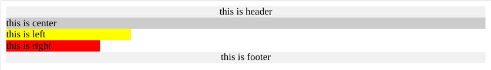
2. 第二步，设置中间三个元素左浮动（需要为父元素清下浮动）
   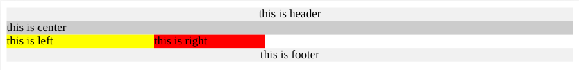
3. 第三步，在三个元素的父元素上设置左边距和右边距，腾出 left 和 right 的位置
   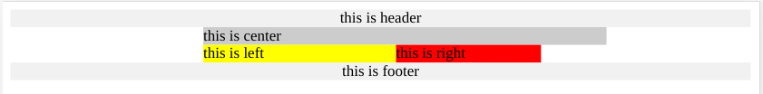
4. 最后一步，设置左元素的 margin-left 为-100%，右部元素的 mrgin-right 为 “-右元素宽度”。
   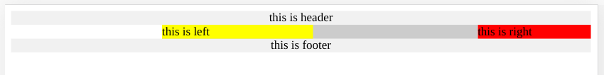
   （PS：当然最后还要再用 position：relative 来调整下位置。）

### Flex 布局

可以很好的解决居中问题，外层父级元素设置 flex，内层居中元素直接设置 margin:auto

```html
<body>
  <div id="mydiv">
    <div>son1</div>
    <div>son2</div>
    <div>son3</div>
    <div>son1</div>
    <div>son3</div>
    <div>son1</div>
    <div>son3</div>
    <div>son1</div>
  </div>
</body>
```

```css
#mydiv {
  width: 300px;
  height: 300px;
  border: 1px solid red;
  margin: 20px auto;
  display: flex;
  flex-direction: row;
  flex-wrap: wrap;
  justify-content: space-around;
}
#son {
  width: 100px;
  height: 100px;
  background-color: gray;
  margin: auto;
}
#mydiv div {
  width: 50px;
  height: 50px;
  color: white;
  line-height: 50px;
  text-align: center;
  background-color: red;
}
```

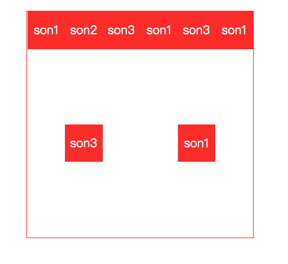

#### jusify-content

定义子元素在**主轴**方向上(就是 flex-direction 的方向)的对齐方式
[具体值的效果](https://www.w3cschool.cn/cssref/css3-pr-justify-content.html)

#### align-items

规定主轴上子项们在**侧轴**上的对齐方式。
[具体值的效果](https://developer.mozilla.org/zh-CN/docs/Web/CSS/align-items)

#### flex-wrap

是否换行

#### align-content

在多行的情况下交叉轴的对齐方式.

> 以下属性作用在子元素上

#### flex-basic

元素在主轴上的基本尺寸,优先级大于元素本身的宽度
(但是没有最大/最小宽高的优先级高!)

#### align-self

自身在**侧轴**上的对齐方式，优先级高于`align-items`。

#### order

规定自身在项目中的顺序，数值越小，位置越靠前。

#### flex-grow

指定单个元素如何分配剩余空间

#### flex-shrink

如果元素在主轴上放不下会默认缩放. 此时指定 flex-shrink 可以指定缩放比例(0 为不缩放)

::: warning
值越大缩小比例越小!
:::

#### flex

flex:flex-grow flex-shrink flex-basic

#### 如何控制单个弹性元素的位置,但不影响其他元素?

A: 在弹性元素上设置 relative 即可

### 利用 flex 画三个点的骰子

```html
<!DOCTYPE html>
<html>
  <head>
    <meta charset="UTF-8" />
    <meta name="viewport" content="width=device-width, initial-scale=1.0" />
    <meta http-equiv="X-UA-Compatible" content="ie=edge" />
    <title>flex 画骰子</title>
    <style type="text/css">
      .box {
        width: 200px;
        height: 200px;
        border: 2px solid #ccc;
        border-radius: 10px;
        padding: 20px;
        display: flex;
        flex-direction: row;
        justify-content: space-between;
      }

      .item {
        display: block;
        width: 40px;
        height: 40px;
        border-radius: 50%;
        background-color: #666;
      }

      .item:nth-child(2) {
        align-self: center;
      }
      .item:nth-child(3) {
        align-self: flex-end;
      }
    </style>
  </head>
  <body>
    <div class="box">
      <span class="item"></span>
      <span class="item"></span>
      <span class="item"></span>
    </div>
  </body>
</html>
```

### 利用 flex 实现双飞翼布局

父容器设置 flex，左右两边用 flex-basis 设定一个基本的宽高，中间的盒子用 flex-grow 瓜分父元素剩余空间

```html
<!DOCTYPE html>
<html lang="en">
  <head>
    <meta charset="UTF-8" />
    <meta name="viewport" content="width=device-width, initial-scale=1.0" />
    <meta http-equiv="X-UA-Compatible" content="ie=edge" />
    <title>Document</title>
    <style>
      body {
        min-width: 550px;
      }
      #container {
        display: flex;
        justify-content: center;
        align-items: flex-start;
      }
      .column {
        height: 200px;
        color: white;
      }
      #center {
        flex-grow: 1;
        background-color: black;
      }
      #left {
        flex-basis: 200px;
        background-color: red;
      }
      #right {
        flex-basis: 200px;
        background-color: blue;
      }
    </style>
  </head>

  <body>
    <div id="header">#header</div>
    <div id="container">
      <div id="left" class="column">#left</div>
      <div id="center" class="column">#center</div>
      <div id="right" class="column">#right</div>
    </div>
    <div id="footer">#footer</div>
  </body>
</html>
```

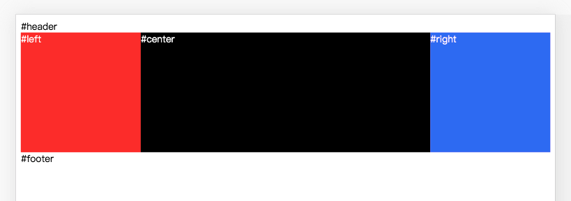

### 品字布局

上面宽度设置为 100%，下面两个各设置为 50%。(一个左浮动，一个右浮动)

```css
#top {
  background-color: red;
  width: 100%;
  height: 100px;
}

#left {
  float: left;
  background-color: yellow;
  width: 50%;
  height: 100px;
}

#right {
  float: right;
  background-color: green;
  width: 50%;
  height: 100px;
}
```

### 多列等高布局

直接 flex 布局，子盒子不要设置高度，具体高度会自动对齐。

## 响应式布局

### rem 单位

```css
html {
  font-size: 16px;
}

@media screen and (min-width: 375px) {
  html {
    /* iPhone6的375px尺寸作为16px基准，414px正好18px大小, 600 20px */
    font-size: calc(100% + 2 * (100vw - 375px) / 39);
    font-size: calc(16px + 2 * (100vw - 375px) / 39);
  }
}
@media screen and (min-width: 414px) {
  html {
    /* 414px-1000px每100像素宽字体增加1px(18px-22px) */
    font-size: calc(112.5% + 4 * (100vw - 414px) / 586);
    font-size: calc(18px + 4 * (100vw - 414px) / 586);
  }
}
@media screen and (min-width: 600px) {
  html {
    /* 600px-1000px每100像素宽字体增加1px(20px-24px) */
    font-size: calc(125% + 4 * (100vw - 600px) / 400);
    font-size: calc(20px + 4 * (100vw - 600px) / 400);
  }
}
@media screen and (min-width: 1000px) {
  html {
    /* 1000px往后是每100像素0.5px增加 */
    font-size: calc(137.5% + 6 * (100vw - 1000px) / 1000);
    font-size: calc(22px + 6 * (100vw - 1000px) / 1000);
  }
}
```

然后所有单位直接用`rem`。

### vw/vh

`1vh` = `视口高度的1%` ，即 **vh = ducument.body.clientHeight/100**

::: tip

```js
window.screen.height; //屏幕高度
window.innerHeight; //视口高度
ducument.body.clientHeight; //body高度（长度不固定）
```

:::

## 常用样式属性(查漏补缺)

### 文本与段落

- letter-spacing:4px // 指定字符间距
- writing-mode:vertical-rl // 垂直方向，从右向左
- line-height: 36px // 指定行间距为 36px
- text-indent: 2em // 指定缩进为空两个格
- write-space: nowrap // 指定文本不换行
- text-align // 指定文本对齐方式

### 背景

- background-size:cover //指定图片优先占满宽高，如果溢出会裁剪掉周围。

### 滚动内容

- overflow:scroll // 指定超出内容显示滚动条

### 阴影

- box-shadow: 2px 2px 12px rgba(0,0,0,0.2) //水平偏移，垂直偏移，模糊半径，扩散半径

### 列表

- list-style 属性可以更改前面的小圆点的样式。

#### 设置文本超出省略

```css
.ellipsis {
  write-space: nowrap;
  overflow: hidden;
  text-overflow: ellipsis;
}
```

## CSS 实现三角形

主要利用了边框与边框间等分的原理。
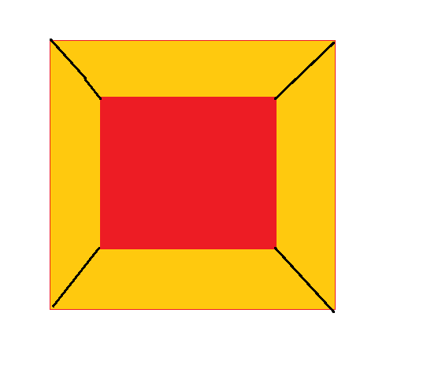
想象一下，外面的黄色部分是边框，里面的红色部分是内容，如果我们把红色部分“挖掉”，边框会变成什么样子呢？

```css
#mydiv {
  border-width: 100px;
  border-style: solid;
  /* 其余的方向设置为透明 */
  border-color: transparent mediumseagreen transparent transparent;
  width: 0px;
  height: 0px;
}
```

### 利用裁剪路径实现任意简单图形

```html
<!DOCTYPE html>
<html lang="en">
  <head>
    <meta charset="UTF-8" />
    <meta name="viewport" content="width=device-width, initial-scale=1.0" />
    <title>Document</title>
    <style>
      .shape {
        width: 100px;
        height: 100px;
        background-color: violet;
        clip-path: polygon(50% 0%, 0% 100%, 100% 100%); //三角形状
        transform: scale(0.2) rotate(90deg);
      }
    </style>
  </head>
  <body>
    <div class="shape"></div>
  </body>
</html>
```

## css 常用@规则

### @import

用来引入一个 css 文件

```css
@import "mystyle.css";
@import url("mystyle.css");
```

### @media

用的超级多的媒体查询

```css
@media screen and (max-width: 600px) {
  #head { … }
  #content { … }
  #footer { … }
}
```

### @key-frames

用来定义动画的关键帧

```css
@keyframes diagonal-slide {
  from {
    left: 0;
    top: 0;
  }

  to {
    left: 100px;
    top: 100px;
  }
}
```

### @fontface

用来引入 web 字体

```css
@font-face {
  font-family: Gentium;
  src: url(http://example.com/fonts/Gentium.woff);
}
p {
  font-family: Gentium, serif;
}
```

## css3 常用特性

### transition

transition:要过渡的属性　过渡时间　时间函数　延迟时间。

如果要过渡多个属性，需要用逗号分割。

eg: `transition:background 1s linear 0s,font-size 1.5s ease-in`

定义元素的变化过程。

```html
<!DOCTYPE html>
<html lang="en">
  <head>
    <meta charset="UTF-8" />
    <meta name="viewport" content="width=device-width, initial-scale=1.0" />
    <meta http-equiv="X-UA-Compatible" content="ie=edge" />
    <title>Document</title>
    <style>
      #mydiv {
        background-color: grey;
        width: 200px;
        height: 300px;
        transform: translateX(300px) translateY(100px) rotate(30deg);
        transition: all 2s linear;
        /* 第一个参数代表所有属性，第二个参数代表两秒，第三个参数代表线性过渡 */
      }
      #mydiv:hover {
        background-color: red;
        transform: translateX(-300px);
      }
    </style>
  </head>
  <body>
    <div id="mydiv"></div>
  </body>
</html>
```

最后的效果可以看到灰色盒子逐渐变红并移动到左边。

### transform(转变)

定义元素变化的结果。
**eg**:将一个 div 盒子横向移动 300px，纵向移动 100px，旋转 30 度

```html
<!DOCTYPE html>
<html lang="en">
  <head>
    <meta charset="UTF-8" />
    <meta name="viewport" content="width=device-width, initial-scale=1.0" />
    <meta http-equiv="X-UA-Compatible" content="ie=edge" />
    <title>Document</title>
    <style>
      #mydiv {
        background-color: grey;
        width: 200px;
        height: 300px;
        transform: translateX(300px) translateY(100px) rotate(30deg);
      }
    </style>
  </head>
  <body>
    <div id="mydiv"></div>
  </body>
</html>
```

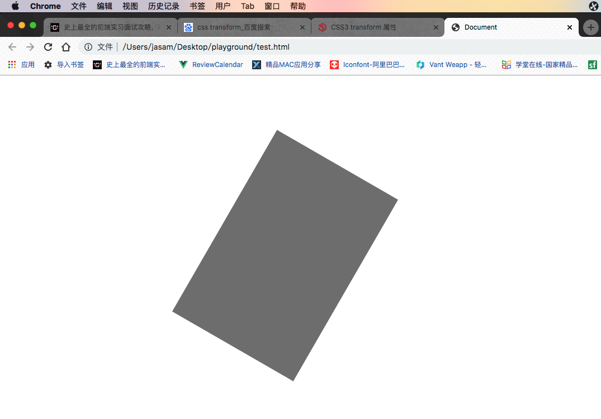

### animate

在调用动画之前要先定义动画帧。

- animation-name: 动画帧的名字
- animation-duration: 动画执行时长
- animation-time-function: 动画时间函数
- animation-delay: 动画执行延迟
- animation-iteration-count:动画执行次数 / infinite

```html
<!DOCTYPE html>
<html lang="en">
  <head>
    <meta charset="UTF-8" />
    <meta name="viewport" content="width=device-width, initial-scale=1.0" />
    <meta http-equiv="X-UA-Compatible" content="ie=edge" />
    <title>Document</title>
    <style>
      #mydiv {
        background-color: grey;
        width: 40px;
        height: 40px;
        margin: 90px auto;
      }
      #mydiv:hover {
        animation: jump 1s linear;
        // 动画帧的名字，持续几秒，动画的速度曲线
      }
      @keyframes jump {
        0% {
          transform: translateY(0px);
        }
        30% {
          transform: translateY(-20px);
        }
        60% {
          transform: translateY(-60px);
        }
        100% {
          transform: translateY(0px);
        }
      }
    </style>
  </head>
  <body>
    <div id="mydiv"></div>
  </body>
</html>
```

最终的效果是当鼠标放上去的时候，盒子会弹一下。

## grid

### display:grid

指定 grid 容器

### grid-template-rows

指定每一行有多高

### grid-template-columns

指定每一列有多宽

```css
.grid {
  width: 300px;
  height: 150px;
  border: solid 5px silver;
  display: grid;
  grid-template-rows: 50% 50%; // repeat(2,50%)
  grid-template-columns: 20% 20% 20% 20% 20%; //repeat(5,20%)
}
```

`repeat`函数为语法糖

repeat(2,100px,200px) === 100px 200px 100px 200px

### fr 单位

可以用来设置占多少剩余空间(类似 flex-grow)

### 间距

`column-gap`可以设置列之间的间距
`row-gap`可以设置行间距
也可以通过`gap`属性统一设置.

```css
.grid {
  display: grid;
  grid-template-columns: 1fr 2fr 1fr;
  gap: 24;
}
```

### 区域占位符

太他妈牛逼了

不多说看代码

```css
article {
  width: 300px;
  height: 500px;
  border: solid 5px silver;
  display: grid;
  grid-template-areas:
    "header header header"
    "sidebar content content"
    "footer footer .";
}

header {
  background: black;
  grid-area: header;
}

aside {
  background: aquamarine;
  grid-area: sidebar;
}

main {
  background: chartreuse;
  grid-area: content;
}

footer {
  background: coral;
  grid-area: footer;
}
```

最终就能摆出区域占位符的布局!

### 对齐方式

和 flex 一样,而且也不用去考虑主轴和交叉轴

`justify-items`:水平方向上的对齐方式
`align-items`:垂直方向上对齐

`justify-content`:容器水平对齐方式
`align-content`:容器垂直对齐方式

## 其他面试问题补充

### li 与 li 之间的空格怎么解决？

A: 直接把 li 写一行。

### 初始化样式的意义是什么？

A: 为了兼容性，但是不利于 SEO。

### visibility 和 display 的区别？

visibility：可见性。
display: 是否展示。

### width:auto 和 width:100%的区别

子元素如果设置 100%,此时如果在加个 margin 就会撑出父元素(底部滚动条)，而 auto 则会自动充满。

### base64 的优缺点

优点: 减少 HTTP 请求。

缺点:

- 增大 HTML 的体积
- 兼容性问题(IE8)
- 缓存性能不如直接用原图片

### BFC 是什么以及触发 BFC 的条件

BFC 是指的是**块级格式化上下文**，一旦某个元素触发了 BFC，那么这个元素就可以视为是一个独立的“块”，可以设置宽和高，且布局不受外界影响

常见触发 BFC 的条件:

- 设置浮动，设置 overflow（除了 visible）
- 元素绝对定位或固定
- display = inline-block 或 flex

  作用:可以不被浮动元素覆盖；可以阻止外边距重叠

### 浏览器解析选择器的顺序是什么？

从右往左，这样会减少大量的重复匹配，可以将范围先控制到最小。

### CSS 和 js 实现动画的方式？

CSS:`transition`,`animate`;
JS:`RAF接口`+`Canvas`

### 实现一个自适应的正方形盒子？

vw/vh 布局直接画。

### 行高的继承问题

- 如果是具体的数值，和具体的比值（1.5/2）之类的，会直接继承下来。
- 如果是百分比，则继承下来的是**计算后的比值**。

### 屏幕里面内容未占满的时候 footer 固定在屏幕可视区域的底部。占满的时候显示在网页的最底端。

父元素上设置高度 100%和弹性布局,内容区用 flex-grow:1 瓜分剩余高度

```html
<!DOCTYPE html>
<html lang="en">
  <head>
    <meta charset="UTF-8" />
    <meta name="viewport" content="width=device-width, initial-scale=1.0" />
    <title>Document</title>
  </head>
  <style>
    html,
    body {
      height: 100%;
      display: flex;
      flex-direction: column;
    }
    .content {
      flex-grow: 1;
    }
  </style>
  <body>
    <div class="content">
      <h1>Sticky Footer with Flexbox</h1>
      <h1>Sticky Footer with Flexbox</h1>
      <h1>Sticky Footer with Flexbox</h1>
      <h1>Sticky Footer with Flexbox</h1>

      <p><button id="add">Add Content</button></p>
    </div>
    <footer class="footer">Footer</footer>
  </body>
</html>
```
