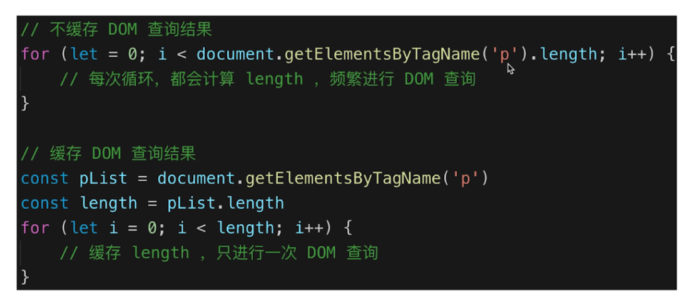
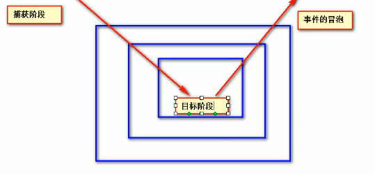

### dom dom1 dom2 dom3

**dom**全称为*Document Object Model*（文档对象模型）。

> The Document Object Model (DOM) is a programming interface for HTML and XML documents. ——MDN

MDN 上说的很明白，dom 是针对于 HTML 和 XML 文档的 api，这些 api 可以使得开发人员对文档进行修改。

dom1 级将 HTML 和 XML 文档看做是一个层次化的节点树，并且可以使用 JS 来对这个节点树进行操作。

dom2 和 dom3 在 dom1 的基础上增加了更多的交互能力。

## js 中常用的 dom 操作

### 创建

- **createElement 创建元素**

```js
var elem = document.createElement('div');
elem.id = 'haorooms';
elem.style = 'color: red';
elem.innerHTML = '我是新创建的haorooms测试节点';
//创建完之后不要忘了给追加上去
document.body.appendChild(elem);
```

### 查找

- **document.getElementById**
  根据 ID 查找元素，大小写敏感，如果有多个结果，只返回第一个。
- **document.getElementsByClassName**
  根据类名查找，会返回一个集合。
- **document.getElementsByTagName**
  根据标签名查找，会返回一个集合。
- **document.getElementsByName**
  根据元素的 name 属性查找，返回一个 NodeList
- **document.querySelector**
  通过制定选择器返回单个元素，挺灵活的一个方法。

::: warning
如果要对 dom 进行遍历操作，一定要先将要遍历的 dom 的**length**取出来。

不然重新计算 dom 的 length 会造成巨大的性能损耗。

:::

### 修改

第一种修改方式是手动修改`property`
比如你用`dom.style.xxx = "xxx"`就是一种修改已有`property`的方式，这样只能更改已经有的标签属性。

第二种方式可以去直接修改元素的`attribute`，这种方式比起修改标签`property`要更加粗暴，甚至你还可以自定义标签属性。
说白了就是可以更改 HTML 的结构。
但这样做挺消耗性能...这两种方法都有可能引起 dom 重新渲染。

```js
let div = document.querySelector('#mydiv');
//把div绿了
div.setAttribute('style', 'background-color: green');
//自定义标签属性
div.setAttribute('div-name', '王宝强');
//getAttribute可以获取属性值
console.log(div.getAttribute('div-name'));
```

### 附加操作

改完后不要忘了把 dom 给 append 上。

- **appendChild**
  用于向节点的子节点列表追加新的子节点。
- **insertAdjacentHTML**
  也是一个用于追加的挺好用的 api，具体使用参考[原生 js 操作 dom 方法之 insertAdjacentHTML](https://www.jianshu.com/p/112bc211c39e)

::: tip
如果要进行的 append 操作很多的话，最好先将要插入的 dom 附加到**DocumentFragment**上

都完成以后，再讲 frag 插入 dom 中，这样会节省很大的性能开销。
:::

```js
const listNode = document.getElementById('list');
//在内存中先创建一个缓存片段
const frag = document.createDocumentFragment();

for (let i = 0; i < 10; i++) {
  const li = document.createElement('li');
  li.innerHTML = 'List item ' + i;
  //每一次操作先附加到文档片段上
  frag.appendChild(li);
}
//都弄完以后，再一次性给插入到dom中
listNode.appendChild(frag);
```

### 删除

- **removeChild**
  removeChild 用于删除指定的子节点并返回子节点

### 移动 dom 节点

先获取要移动的节点，再将其追加到指定父节点的后面。

```js
let div1 = document.querySelector('#div1');
let father = document.querySelector('#father');
father.appendChild(div1);
```

## 事件传播模型

由于一些历史原因，W3C 将事件的传播模型分成了下面三个阶段:


1.捕获阶段：在捕获阶段会从外层想内层进行事件元素捕获，但此时默认不会触发事件。
::: tip
如果想让事件在捕获阶段执行，可以将`addEventListener()`函数中的第三个参数设置为`true`。
:::

2.目标阶段: 当到达目标阶段，会触发目标元素事件，触发事件结束后，会进入冒泡阶段。

3.冒泡阶段: 在冒泡阶段事件会从目标元素开始依次向上进行传递，在传递的过程中默认会触发事件。
::: tip
如果不想让子元素冒泡到父元素上，可以执行在子元素身上执行以下 stopPropagation();
:::

```js
let son = document.querySelector('#son');
son.addEventListener('click', (e) => {
  e.stopPropagation();
  console.log('hhh');
});
```

## 事件绑定

有两种方法。

### `dom对象.事件 = function(event){}`

> 这种事件也叫`dom0`事件。

```js
let mydiv = document.getElementById('mydiv');
mydiv.onclick = function(e) {
  alert('mydiv');
};
```

此时就为`mydiv`这个元素绑定了一个`onclick`(点击)事件。

### `dom对象.addEventListener('事件名称',(e)=>{ },false)`

> 这种事件也叫`dom2`事件。

第一个参数是事件名称，注意没有**on**。
第二个参数是事件触发的函数。
第三个参数决定了是否在捕获阶段触发该事件。

```js
let inner = document.getElementById('inner');
inner.addEventListener(
  'click',
  (e) => {
    alert('inner');
  },
  false
);
```

### 二者的区别

第一种方法有局限性，它只能为一个 dom 对象绑定一个响应事件，如果绑定多个事件，后面的会将前面的覆盖掉。

### 取消事件的默认行为

`event.preventDefault()`

## 事件委托

一种优化 dom 事件响应的方式。
当子元素拥有大量且逻辑相同的监听函数时，最好将监听函数直接设置到父元素上，通过事件冒泡的机制，子元素可以“委托”父元素来完成特定的事件。
这样做的好处一是优化性能，二是更加灵活————如果有新添加的子元素也会有监听函数。
可以通过事件触发函数中的`e.target`来判断是谁触发了事件。

### 编写一个通用的事件绑定函数，考虑事件委托

```js
/**
 *
 * @param {object} elem 要传入的dom元素
 * @param {string} type 操作的类型
 * @param {string} selector 通过一个选择器来确定一个代理的范围
 * @param {Function} fn 要绑定的操作
 */
function bindEvent(elem, type, selector, fn) {
  //如果是三个参数，说明是普通绑定，此时改变一下参数的引用
  if (fn == null) {
    fn = selector;
    selector = null;
  }
  elem.addEventListener(type, (event) => {
    //获得点击源
    const target = event.target;
    if (selector) {
      // 如果不再范围内就不触发
      if (target.matches(selector)) {
        fn.call(target, event);
      }
    } else {
      //无代理直接调用
      fn.call(target, event);
    }
  });
}
//以后统统用这个选元素
let div = document.querySelector('#father');
bindEvent(div, 'click', '.box', (e) => {
  alert(e.target.innerHTML);
});
```

## `load`事件和`DOMContentLoaded`事件

`load`事件要求页面上全部资源加载完之后执行，而`DOMContentLoaded`会在 dom 渲染完之后直接执行(此时有可能图像，视频啥的还没加载完)

## document 实例

`document`其实是`HTMLDocument`的实例
`HTMLDocument`的原型对象是`Document`,换言之`HTMLDocument`继承了`Document`。
