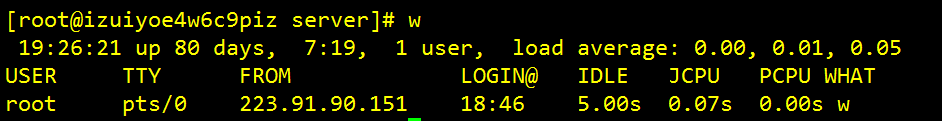
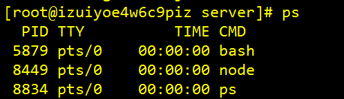
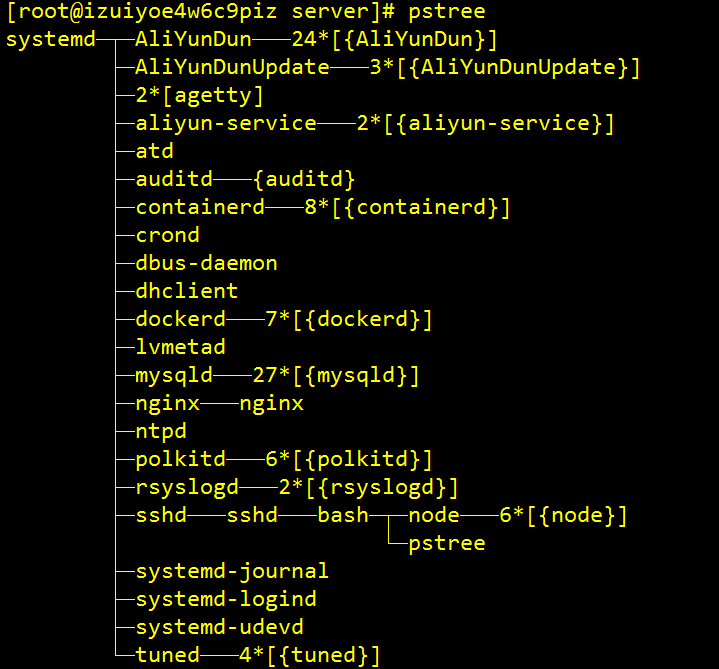
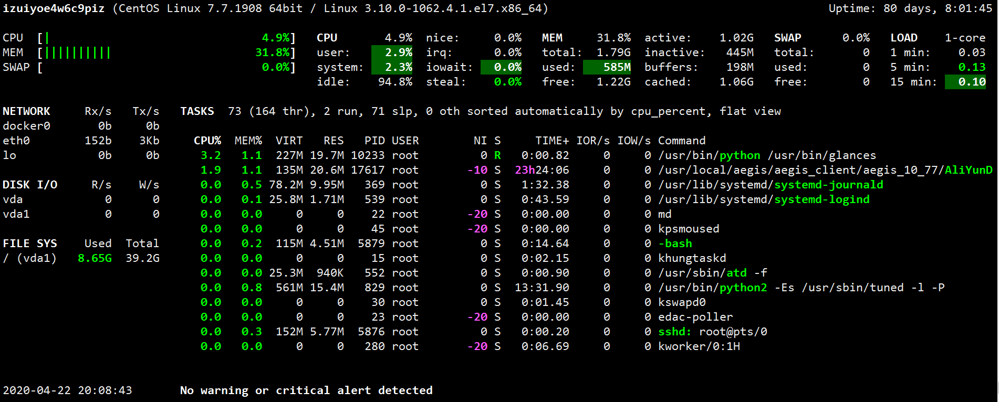
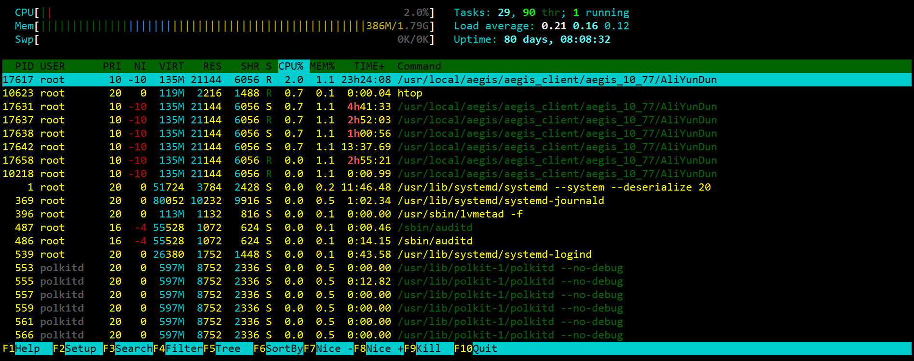
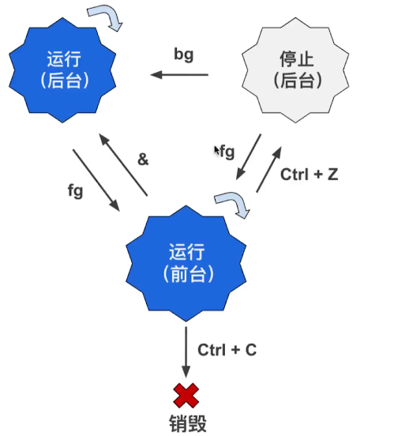
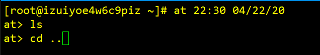

## 文件管理

### 查找命令与相关快捷键

- 按一次`tab`键可以补全命令，按两次`tab`键可以列出可用命令
- 按上键和下键可以翻出来命令的历史记录，`ctrl`+`R`键可以搜索命令。(超级好用！！)
- 一些好用的快捷键
  | 快捷键          | 效果                  |
  | --------------- | --------------------- |
  | ctrl+L          | 清屏                  |
  | shift PgUp/PgDn | 滚屏                  |
  | Home/End 键     | 光标跳到命令开头/结尾 |

### 根目录文件夹简单介绍

- etc: 真正含义是(et cetera),翻译成英语就是`and so on`,里面放了很多配置文件。
- home: 目录中类似`我的文档`
- lib: 目录里面都是库文件，比如.so 结尾的文件
- mnt: 目录里面是临时挂载的一些设备
- opt： 表示可选的软件包
- sbin: 系统二进制文件
- usr: 全称`Unix Software Resource`,类似我们 C 盘中的 Windows 目录和 Program Files 目录的集合
- var: 里面放的大多为 log 文件

#### PWD:显示当前目录的路径

#### which+命令:获取命令真正的执行文件在哪

### 浏览目录

#### ls 命令:列出所有文件和文件夹

::: tip
**可追加参数**

- -a: 列出所有文件和文件夹(包括隐藏)
- -l: 列出所有文件,并显示详细信息，如果在加上-h,会显示出文件大小（更适合阅读），如果追加-t，会按照修改时间对文件进行排序
  :::

#### du: 列出所有文件夹，并显示出磁盘占用

::: tip
**可追加参数**

- -h: 磁盘占用更适用于阅读
- -a: 列出所有文件和文件夹
- -s: 只显示总计大小
  :::

### 浏览和创建文件

#### cat 文件名：显示文件内容(全部显示)

::: tip
**可追加参数**

- -n: 显示行号。
  :::

#### less 文件名：显示文件内容(分页显示)

#### touch 文件: 在当前目录创建文件

#### mkdir 文件夹: 在当前目录创建文件夹

### 文件复制和移动

#### cp+文件名+指定目录:将文件拷贝到指定目录

::: tip
**可追加参数**

- -r:可递归拷贝文件夹内容，可用来拷贝文件夹
  :::

#### 通配符\*

cp _.mp3 ../test: 将文件夹中的所有 mp3 移动到上层目录中的 test 目录中。
cp ha_+指定目录: 将以 ha 开头的文件拷贝到 folder 目录中

#### mv+文件名+指定目录:将文件剪切到指定目录

### 文件的删除和链接

#### rm 文件 1 文件 2 ... : 删除文件

::: warning
**可追加参数**

- -r: 用来删除文件夹
- -f: 强制操作，不询问用户

  :::
  ::: danger
  **一个惊天地泣鬼神草木为之含悲风云闻之变色的命令!!!**

  **rm -rf /\*** :如果你在公司服务器上以 root 权限运行这条命令...你最好先检查下有没有相关备份，如果没有的话。。。就赶紧跑路吧
  :::

#### ln -s 文件名 链接名: 为文件或文件夹创建链接(快捷方式)

### 文件查找

#### locate 关键字: 根据关键字查找文件

::: warning
如果显示没有`locate`命令，则需要先安装`mlocate`这个包。

locate 只能查找 24 小时之前的文件，因为 linux 的文件数据库一天更新一次。
:::

#### updatedb: 会立即强制更新文件数据库。

#### find -name 匹配规则: 在当前目录下查找满足匹配规则的文件和文件夹

eg: `find -name re*`: 查找开头为 re 的文件和文件夹

#### find -size +3M: 查找文件大小大于 3M 的文件

#### find -name "\*.mp3" -atime -30: 查找 30 天内访问过的 mp3 文件

### 文件解压和压缩

#### tar -cvf 文件名.tar 指定文件夹: 将指定文件夹归档

#### tar -zcvf 文件名.tar 指定文件夹: 将指定文件夹归档并压缩

#### tar -tf 指定文件: 查看归档文件

#### tar -xvf 指定文件: 解开归档文件

#### tar -zxvf 指定文件: 解开归档文件并解开归档

#### gzip 指定归档文件: 将归档文件压缩

#### gunzip 指定压缩文件: 将压缩文件解压为归档文件

#### unzip 指定压缩文件(zip): 解压 zip 文件到当前文件夹

## 权限管理

### 用户和权限

#### useradd 用户名: 添加用户

#### passwd 用户名: 为用户设置密码

#### userdel 用户名: 删除目录

#### su 用户名: 切换用户

### 群组

#### groupadd 群组名: 创建群组

#### groups 用户名: 查看用户所在群组

#### usermod -g 群组名 用户名: 将用户划分到指定群组。

#### groupdel 群组名: 删除指定群组

### 文件权限管理

#### chown 用户名 文件名: 更改文件所有者

#### chgrp 群组名 文件名: 更改文件所属群组

::: tip
**可追加参数**

- -r:上述两个命令都可以加上这个参数，从而对文件夹进行用户管理。
  :::

#### 文件访问权限符

| 权限符 | 含义   | 权重 |
| ------ | ------ | ---- |
| d      | 目录   |      |
| l      | 链接   |      |
| r      | 可读   | 4    |
| w      | 可写   | 2    |
| x      | 可执行 | 1    |

#### 解析-rw-rw-r--

第一组代表文件所有者有 rw 权限。
第二组代表组中的其他成员有 rw 权限。
第三组代表组外成员只有 r 权限

#### chmod 权重: 修改文件权限

比如`chmod 600 file1`就将文件权限修改为了`rw-------`.

## 软件管理

### yum(Centos)

### apt(Debian)

### 源码编译安装软件

1. 首先去 github 上把源码 down 下来。
2. 把源码包解压
3. 进入到源码目录，先运行`configure`文件检查编译环境
4. 如果没报错，就执行`make`命令来编译
5. 编译完成后，用`make install`来进行安装

## 进程管理

### 进程和系统监测

#### w: 可以监测当前系统状态,包括开机时间，当前用户，性能负载等等

#### tload: 可以动态的监测系统当前的负载

#### ps: 显示当前系统中的进程(静态)

::: tip
**可追加参数**

- ef: 列出所有进程，包括系统进程。
- aux：通过 cpu 和内存来过滤进程
- --sort：通过制定参数将结果进行排序
  eg: ps -aux --sort -pcpu: 根据 cpu 使用率来降序排列进程
  eg: ps -aux --sort -pmem: 根据内存使用率来降序排列进程
  :::

#### pstree: 以树状结构显示进程

#### top: 显示当前系统中的进程(动态)

#### glances 安装

glances 是一个颜值挺高的系统监测软件，不过我们需要手动安装。

> yum install epel\* -y

> yum install python-pip python-devel -y

> yum install glances -y

我们可以在直接输入`glances`来监测进程。

#### htop 安装

htop 也是一款不错的性能监测软件

> yum install htop -y

效果如下：

### 操作进程和关闭系统

#### kill PID1 PID2 PID3...: 根据 PID 来结束进程

::: tip
**可追加参数**

- -9: 立即强制结束进程
  :::

#### halt: 关闭系统

#### reboot: 重启系统

### 后台进程管理

#### nohup 命令: 这样启动程序会在后台运行，并且不受终端关闭的影响。

#### ctrl+z: 将当前执行的任务暂停（注意此时任务是暂停状态没有运行）

#### bg %num：任务暂停后，会有一个任务号，此命令可将指定任务转入后台运行

#### fg %num: 将指定后台任务转到前台

#### jobs: 显示后台进程状态

#### 上述命令的操作逻辑图：

### 定时任务

#### at: 在指定时刻执行命令

此时输入完要执行的命令行，按下`ctrl`+`D`键结束输入，命令便会在 2020 年 4 月 22 号晚上十点半执行。（注意命令中是美国日期格式）

#### atq: 列出准备执行的任务

#### atrm 任务号: 移除准备执行的任务

#### sleep:休眠指定时间

> touch file.txt ; sleep 15m ;rm file.txt

上述命令意为: 创建 file.txt 文件，并在 15 分钟后删除它。
::: tip
**可选时间单位**

- 无单位: 秒
- m：分钟
- h：小时
- d：天
  :::

## 内存与磁盘管理

## 远程连接

## 文本编辑与版本控制

## 系统安全
 
## shell 脚本编程

## 高级操作

### 文本内容检索

#### grep "关键字" 指定文件: 在指定文件中查找关键字

::: tip
**可追加参数**

- -i: 忽略大小写
- -n: 显示行号
- -r: 针对文件夹进行操作<hide txt="卧槽我是真的写吐了"/>
  :::

#### grep 正则表达式 指定文件：启用正则表达式

### RTFM

全称`Read The F**king Manual`，意思是别尼玛瞎\*\*问，不会翻手册么？(emmmm 大概和羊驼为什么不会过河是一个意思)

#### man 命令: 显示该命令的使用手册

#### whatis 命令: 用一句话告诉你这个命令到底是干啥的

#### apropos 关键字: 根据关键字搜索出相关的命令

比如当你输入 `apropos javascript`之后，终端就会显示:

> [root@izuiyoe4w6c9piz server]# apropos javascript
> node (1) - server-side JavaScript runtime

### 终端输出内容重定向

#### 命令 > 指定文件: 将命令的结果输出到指定文件
