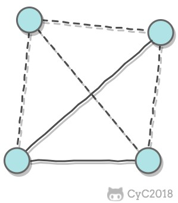
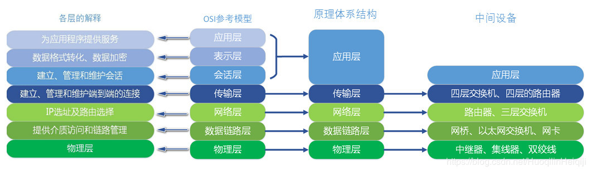

## ISP
互联网服务提供商，它们可从互联网管理机构那买来许多ip地址。其实就是网络运营商，没啥好说的。

## 主机间的通讯方式

C/S(B/S)架构

客户端／服务器

P2P架构 

点对点，不区分客户端和服务器。

## 互联网的组成
### 边缘部分
所有连在互联网上的**主机**(计算机)。
### 核心部分
连接在主机中间的路由设备。
#### 核心部分的通讯方式——分组交换
(PS：交代分组交换产生的历史和原因。)
#### 电路交换
传输数据的一种方式，用专门的线路来传输数据。以前在老式电话中用的较多，但目前一些重要机构(银行，军队)仍会采用这种方式。很大的弊端就是对线路的利用效率不高，只有10%。
#### 报文交换
传输数据的另一种方式，**一大块一大块**存储接收的信息，然后根据其目标选择线路。比电路交换要灵活。缺点是一大块的报文在传输过程中会阻塞线路。

#### 分组交换 
把报文“拆碎"，拆碎的报文叫分组，每个分组中的**包头**都会包含<a id="jump1">原地址和目标地址等信息</a>，因此分组在传输的过程中不会占用线路，效率也更高。(可以这样理解：从一个管道里倒很多"木块"，如果这些木块很大的话倒着就会很慢，甚至会卡在管子里；但如果每个木块很小的话就很容易倒出来了。)
需要注意的是，分组交换也利用了存储转发路由查找的原理(和报文交换的一样，其实是一种改进)。

## 影响网络性能的最关键因素——延迟(时延)
### 排队时延
每个分组在路由器入口和出口排队等待的时间，取决于网络当前的通信量。
### 处理时延
路由器处理[分组中的信息](#jump1)所花的时间。
### 传输时延
路由器或主机传输数据包所花费的时间。

传输时延＝ 数据帧的长度（bit）／传播速度（bit/s）

### 传播时延 
取决于介质，总之就是超级快，忽略不计。

## 网络的五层架构

**自顶向下**

- **应用层**：为特定应用程序提供数据传输服务，例如 HTTP、DNS 等协议。数据单位为报文。
- **传输层** ：为进程提供通用数据传输服务。由于应用层协议很多，定义通用的传输层协议就可以支持不断增多的应用层协议。运输层包括两种协议：主要包含TCP协议和UDP协议。
- **网络层** ：为主机提供数据传输服务。而传输层协议是为主机中的进程提供数据传输服务。网络层把传输层传递下来的报文段或者用户数据报封装成分组（IP协议跑在这层）。
- **数据链路层** ：网络层针对的还是主机之间的数据传输服务，而主机之间可以有很多链路，链路层协议就是为同一链路的主机提供数据传输服务。数据链路层把网络层传下来的分组封装成帧（等于又套了一层壳）。
- **物理层** ：考虑的是怎样在传输媒体上传输数据比特流，而不是指具体的传输媒体。物理层的作用是尽可能屏蔽传输媒体和通信手段的差异，使数据链路层感觉不到这些差异。

有一点需要注意：在网络的核心部分只有最底下三层协议，因为核心部分里面全是路由设备，不用给计算机的进程和app提供服务，老老实实转发就行了。

