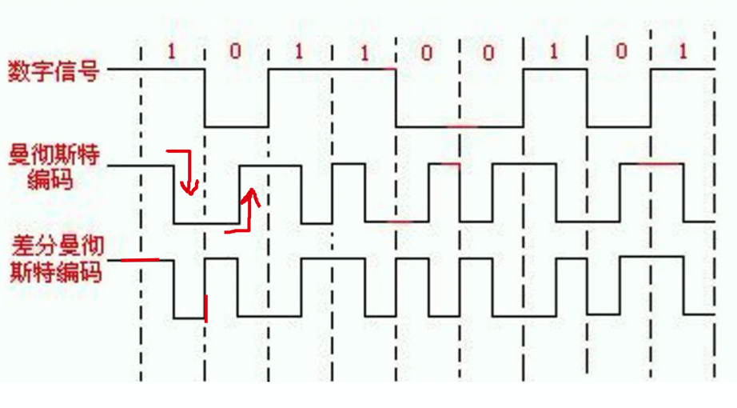
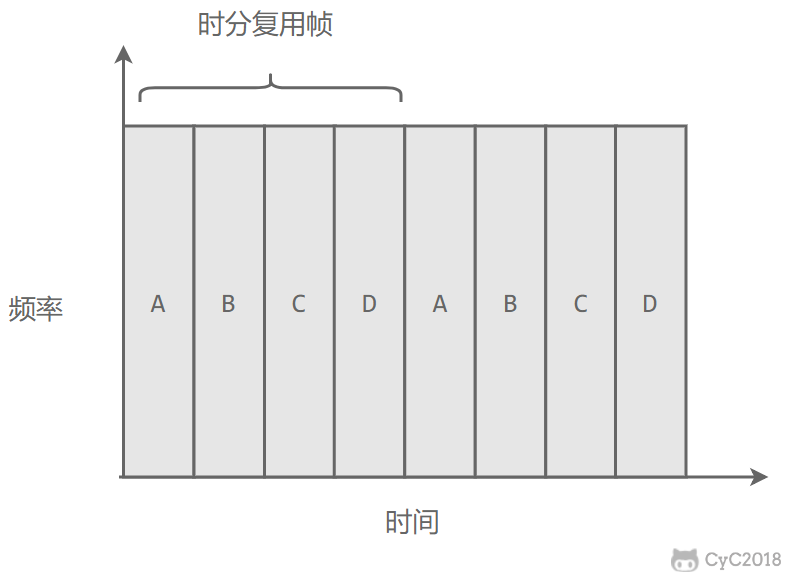
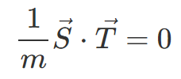
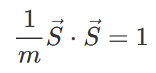
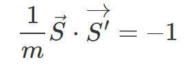

## 调制与解调
模拟信号是连续的信号，数字信号是离散的信号。
调制的意思是将数字信号转换为模拟信号发送出去。(此过程发生在你们家的"猫"中)
## 物理层中的通信方式

- 单工通信：信号只能单向传输。
- 半双工通信：信号可以双向传输，但不能同时传。
- 全双工通信：信号可以双向传输，也可以同时传。

## 两个重要的编码方式

### 曼彻斯特编码

看中间的位置，**下降代表的是1**，上升代表的是0。

### 差分曼彻斯特编码

看左边的位置，**横线代表的是“一”**，竖线代表的是0。

## 信道复用技术

### 频分复用
指的是"主机们"在相同的时间内占用不同的宽带频率。

### 时分复用

指的是"主机们"在不同的时间占用相同的宽带频率。

频分复用和时分复用最大的问题是一直会占着通讯信道，不够灵活。而网络数据具有突发性，有时候有信息，有时候没有信息，所以说这两种通信方式对于信道的利用率其实并不高。

### 统计时分复用
是对时分复用的一种改进。它不固定每个用户在”时间片"(时分复用帧)的位置，如果一个用户此时没有数据那么就会直接跳过然后直接去找下一个。个人理解为"压缩版的时分复用"。负责"压缩"的设备叫**集中器**。

### 波分复用

就是光纤版的**频分复用**。由于光的频率很高，因此习惯上用波长而不是频率。

### 码分复用（CDM）

（注意：在下面所有的计算中，用－1代表0进行计算）

为每个用户分m位的码片，并且**规定**好了任意两个码片正交，也就是说：

假如说，m＝8，设码片s是00011011。**如果这个用户想发送“1”，就发送该码片S（00011011）。如果想发送“0”，就发送该码片的反码S反（11100100）**。

此时码片信息就像小汽车一样一辆一辆发出去了。

接受端此时的角色像是一个脑残的交警，每次看到车都会拦下来（有可能这辆车还是S，同款警车23333；有可能是S的反码；也有可能是其他用户发的码片**T**），然后给它整个**内积运算**，根据内积的结果就能判断发送的数据是0还是1了：

**CASE1:**

此时说明那头发过来的也是个**S**,那头想发的数据是**1**。

**CASE2:**

此时说明那头发过来的是**S反**，那头想发的数据是0。

**CASE3:**

算出来为0，说明是一开始规定的**初始情况**，此时就不用管了，肯定是其他人的干扰数据。

**码分复用的发出去的数据量是原先的m倍。**

