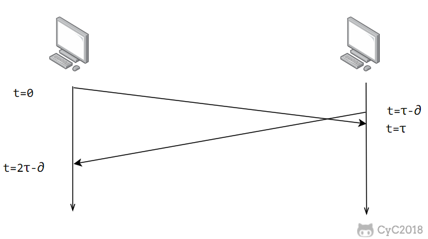
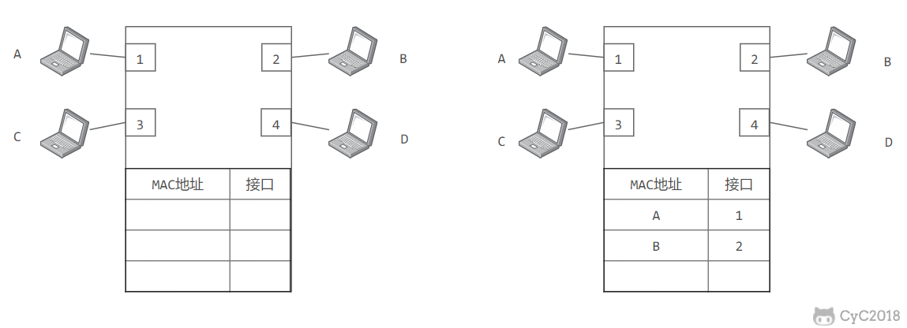

## 数据链路层中的三个基本问题

### 封装成帧
将网络层传下来数据包(分组)加上头部和尾部，用来标记**帧的界限**以及其他的控制信息。

### 透明传输

这里的“**透明**”二字需要好好讨论。

如图所示，每个数据帧都会用**SOH**和**EOT**来标记开始和结尾。但仅仅这样还不行，如果传输的数据中出现了SOH和EOT的话接收端就无法准确判断帧的界限。此时的解决方法是在EOT或SOH的前面加个“转义字符”ESC。那么问题又来了，如果数据部分出现了ESC咋整？解决方法是：再加一个ESC！接收端收到后会对数据进行还原处理。

现在可以解释透明这两个字了。

这里的透明是指：对于用户(PS：这里的用户指的是上一层，也就是网络层)来说，是无法感知到自己发送的数据中被加了个ESC这玩意儿，整个传输过程对于上层就完完全全是个“黑箱”。（如果叫黑箱传输感觉会更好理解）

### 差错检测

目前数据链路层广泛使用[循环冗余检验](https://baike.baidu.com/item/%E5%BE%AA%E7%8E%AF%E5%86%97%E4%BD%99%E6%A3%80%E6%9F%A5/10168241?fromtitle=%E5%BE%AA%E7%8E%AF%E5%86%97%E4%BD%99%E6%A0%A1%E9%AA%8C&fromid=3219009&fr=aladdin)（CRC）来进行比特查错。

------

在数据链路层使用的信道可以分成两类：**点对点信道**和**广播信道**。

## 点对点信道：PPP协议
PPP协议是用户与ISP进行通讯时在数据链路层所使用的协议。

### PPP协议的帧格式

F字段存了个**0x7E**,A和C字段存了**0xFF**和**0x03**（也就是说没有含义。。。）这些单字母字段都是占一个字节

协议字段占两个字节，用来表示数据部分的协议类型。

数据部分**最大**不超过1500字节（也就是说，数据部分是可变的）

FCS是用来循环冗余检验的帧检验序列，占两个字节。

## 广播信道
一对多通信，一个节点发送的数据能够被广播信道上的所有节点接收到。
但如果有多个节点同时在一个信道上发送数据，就有可能发生冲突。
有两种办法可以避免这种冲突，一种是物理层的各种信道复用技术。
另一种是接下来要说的CSMA／CD协议。

### CSMA／CD协议
CSMA/CD的全程叫Carrier-sense multiple access with collision detection(具有冲突检测的载波侦听多路访问)

Carrier-sense（载波监听）：连接到**介质**（对于wifi就是空气，对于以太网就是网线）的设备要在发送数据前对介质进行监听，如果有数据的话自己就不发送。

Multiple Access（多路访问）:多台计算机可以连一根网线，一台计算机发送的信息也能被多台计算机接收。

collision detection(碰撞监测)：网卡在发送数据的时候会通过检测信号电压的高低来判断是否有其他是否发了信号，如果电压特别高就表明发生了碰撞。（但这并不是一种完美的检测机制，因为延迟的存在还是有可能发生碰撞。）

#### 争用期

设发送端到接收端的传播延迟为 τ，一来一回两个" τ"就能判断是否发生了碰撞。

**2 τ被称为争用期**。

#### 指数退避算法

当发生碰撞时，网卡要停止发送，等待**一段时间**。
这段时间通过**指数退避算法**来确定。

算法描述：从离散的整数集合 ${0, 1, 2,4,8.., (2^k-1)}$中随机取一个数（K指的是重传的次数，也就是说，这个集合的范围会随着重传次数的增多而变大），取出来的这个数计做**r**，r乘上争用期就是等待重传时间。

### 局域网
局域网是一种非常典型的广播信道，它的特点是网络为一个固定的范围所拥有(通常是一个单位，或一个学校)

常见的有以太网、令牌环网、FDDI 和 ATM 等局域网。

根据网络的拓扑结构可以对局域网进行分类:

#### 以太网

以太网是目前用的最多，也是最典型的局域网。它使用了星型的局域网拓扑结构。

以太网使用**交换机**进行拓展和存储转发。

##### 交换机

最早的时候用的不是交换机，而是[集线器]([https://baike.baidu.com/item/%E9%9B%86%E7%BA%BF%E5%99%A8/214614?fr=aladdin](https://baike.baidu.com/item/集线器/214614?fr=aladdin))进行网络连接，这种方式由于有弊端（在物理层没有碰撞检测机制）目前已经退出市场。而交换机是一种基于数据链路层的设备，不会发生碰撞，可以根据MAC地址进行存储转发。
###### 交换机的自学习能力

这里的"自学习"主要指的交换机可以自动的获取主机mac和对应接口的映射。

如上图：在主机A向主机B发消息的时候，交换机悄悄的把主机A的mac和主机A所对应的接口写到了下面的那张表中；此时A不知道B的位置，只能发广播，那么B在收到广播后肯定会有一个回应的过程，回应的时候发现表里有A的mac地址和接口映射了，此时就不需要发广播，消息之间就到A那了。在这个“回应的过程中”，交换机又悄悄的把B的mac地址和接口映射记录下来，下次如果A再向B发消息的话直接查表，就不需要发广播了。

##### 以太网的MAC层

mac地址是指的是链路层地址，是用12个的十六进制数表示的，用来标识网卡。

通常笔记本都有两个mac地址，这是因为笔记本有两个网卡(一个有线，一个无线)

##### 以太网的帧格式

- 类型：标记上层使用的协议。
- 数据：长度在46-1500之间，如果太小则需要填充。
- 以太网的FCS字段占四个字节，这点需要注意。

#### 虚拟局域网

顾名思义，是"虚拟"的，当然也就和物理位置无关。

上图中A1，A2，A3，A4就处于一个虚拟局域网中。交换机上有一个特殊的接口叫"干线接口"，专门用来互联虚拟局域网上的交换机。当然虚拟局域网里的数据帧中肯定会有一些特殊字段来标识自己发的是虚拟局域网里的数据帧。

