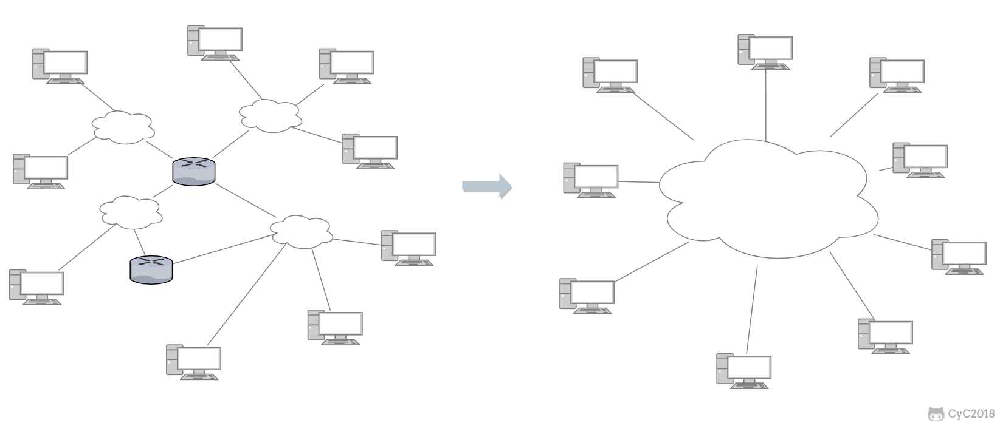
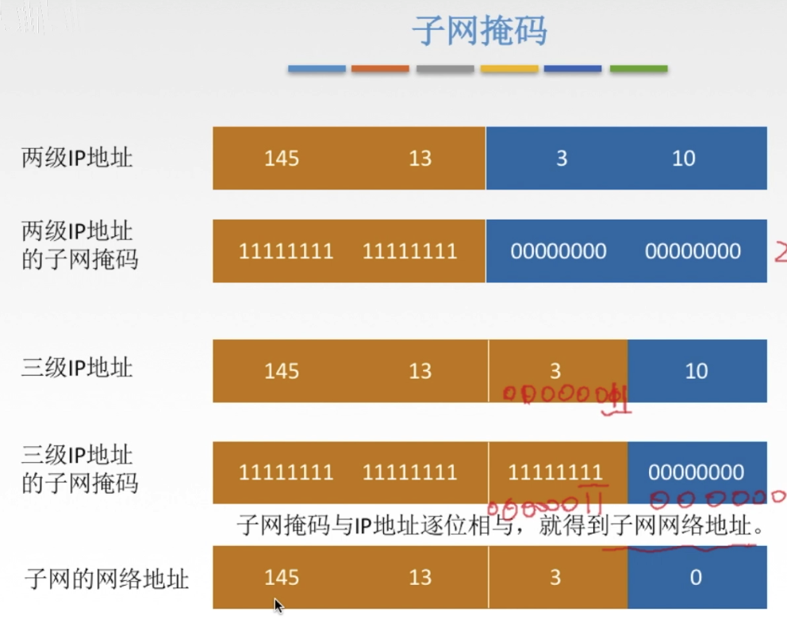

## 互联网的设计思路

**SIMPLE！！！**

网络层向上只提供简单灵活的、**无连接的**、尽最大努力交互的数据报服务。

> **无连接式通讯**（英语：Connectionless communication，又称 CL-mode），又译为**免接式通讯**，一种通讯[传输](https://zh.m.wikipedia.org/wiki/传输)模式，使用于[电信](https://zh.m.wikipedia.org/wiki/電信)及电脑[网路](https://zh.m.wikipedia.org/wiki/網路)中。在两个端点之间传递的讯息，不需要事先安排，建立连线。——维基百科

使用IP协议，可以将整个复杂异构的互联网高度抽象为一个统一的网络。

## 与IP协议配套使用的另外三个协议

- 地址解析协议 ARP（Address Resolution Protocol）
- 网际控制报文协议 ICMP（Internet Control Message Protocol）
- 网际组管理协议 IGMP（Internet Group Management Protocol）
## IP协议

### IP数据报格式

- 版本：占半个字节，记录IP版本号。
- 首部协议：占半个字节，最大值是15，其中“**每一份的1**”代表的是**4字节**，所以最小值是5(看上图，固定部分最少已经占了20个字节)。如果首部长度不是4字节的整数倍，就用尾部的**填充字段**填充到整数倍。
- 区分服务：暂时还用不上。
- 总长度：占两个字节，也就是16位，最多可以表示2的16次方种情况，因此数据报的最大长度为65535字节。（）
- 生存时间：**TTL**（Time To Live）。占一个字节。用来表示ip数据包**“能蹦跶几次”**，每当ip数据包通过一个路由结点时，这个值就会减一。由于这玩意只有8位，也就意味着这个字段最大只能是256。（最多能蹦跶256次）
- 协议：占一个字节。表示当前ip数据报种的数据部分到底是用了哪种协议的数据包，方便接收方主机的ip层处理。
- 首部检验和：占俩字节。用来进行差错检验头部的字段。
- 标识：占两个字节，如果数据报过长，那么数据报就会“分片传输”，每一片的数据报中的这个字段是同一个值。
- 片偏移：占13**位**，表示由于过长而被分片的数据报的“断点信息”。

### IP地址的编码方式

IP 地址的编址方式经历了三个历史阶段：

- 分类
- 子网划分
- 无分类

#### 分类
就是将IP地址划为若干个固定类。
分类后的IP地址具有网络号和主机号。不同分类的网络号的长度是不一样的。

**结构**：{< 网络号 >, < 主机号 >}

从上图可以看出，A，B，C三类网络分别占1，2，3个字节长。并且前面分别填充为0，10，110来作为**类别位**

#### 子网划分

主机号字段中再拿出一部分作为**子网号**，将二级IP再细化为三级IP

**结构**： {< 网络号 >, < 子网号 >, < 主机号 >}

**子网掩码**（**mask**）：一个32位的地址，用来屏蔽（**mask**）ip地址的主机号以便区分该IP地址是否是内网地址。

屏蔽方法是讲IP地址的主机部分**全填0**，剩余部分全填1。

#### 无分类

尽管划分了子网，但是IP资源枯竭的问题仍然没有彻底解决。因此标准协会的那帮人不得不又整套新协议来缓解下这种尴尬境地。

这个无分类编址(CIDR)顾名思义就是没有分类的概念（当然子网也没了）。

**结构**：{< 网络前缀号 >, < 主机号 >}

这个前缀号用IP地址后的一个**“/”**标识。比如128.14.35.7/20 就表示前 20 位为网络前缀。

为了便于路由选择，CIDR又引入了一个叫地址掩码的玩意儿，和子网掩码道理差不多，地址掩码中屏蔽的也是主机号。（虽然CIDR中没有子网的概念，但这个地址掩码仍然可以成为子网掩码，毕竟现在好多人还在用子网掩码）

**超网**（Supernetwork）：指的是**CIDR的地址块**。这种地址块往往包含了超级多的路由地址，构成超级网络的过程叫做**路由聚合**或**构成超网**。

**最长前缀匹配**：在查路由表时可能会查到很多结果，此时应优先选择网络前缀最长的路由。因为网络前缀越长，地址块就越小，路由就越具体。

## ARP地址解析协议

顾名思义，主要作用是用来解析地址。

在实际通信的过程中，IP源地址和目标IP地址始终是不变的，而mac地址始终是发生变化的。这个很好理解，在上图中，数据包从H1到H2的过程中经历了好几次的“拆装拆装”，但IP层是在“里面”，能“拆装”的只有外面的那层“壳”，也就是mac地址。

## ICMP网际控制报文协议
这个协议主要是用来差错检测和连通性测试

假如说你发一个报文出去，但由于可种各样的原因报文没送到，此时网络层就给你回一个报错信息。（也可以理解成一种异常捕获机制吧，方便网络程序员Debug）
### ping

ping是ICMP的应用，主要用来测试主机间的连通性。
**原理**：发送一个echo请求(上表倒数第二个)，收到后回复一个echo响应。

### traceroute
traceroute是ICMP的另一个应用，主要作用是追踪一个数据包到底是咋跑的。(记录路径)

**原理**：
1. 第一次从源主机发一个TTL为**1**的报文，这个报文肯定最多只能蹦一下就GG了，然后那个主机(就是报文死掉的那台主机)就会给源主机回一个**超时响应报文**(看前面的表，ICMP的type是11)。
2. 第二次从源主机发一个TTL为**2**的报文，这个报文最多只能蹦两下，然后更远的那个主机也会重复上一个主机的动作。
3. 以此类推，终于TTL的值足够这个报文从源主机蹦到目标主机了，此时目标主机会给源主机回复一个**终点不可达报文**（因为里面包的是udp）。说是终点不可达，其实已经达到了，至少我们已经知道了每个路由结点的延迟以及没个路由的IP地址。

## 路由选择协议

当一个数据包进入到网络层肯定要进行转发，此时如何转发效率最高便成了一个值得研究的问题。

互联网上的每个内网都可以理解成是一个**自治系统（autonomous system）**，这些自治系统内可以自由的选择路由转发策略，而这种策略对外部网络处于”黑箱“状态。

### 内部网关协议RIP
RIP协议按照固定的时间间隔与邻居路由器交换自己所知道的"临近信息"，一段时间过后每个路由表就能够知道整个网络的拓扑信息。(前提是这个网络不是很大)

