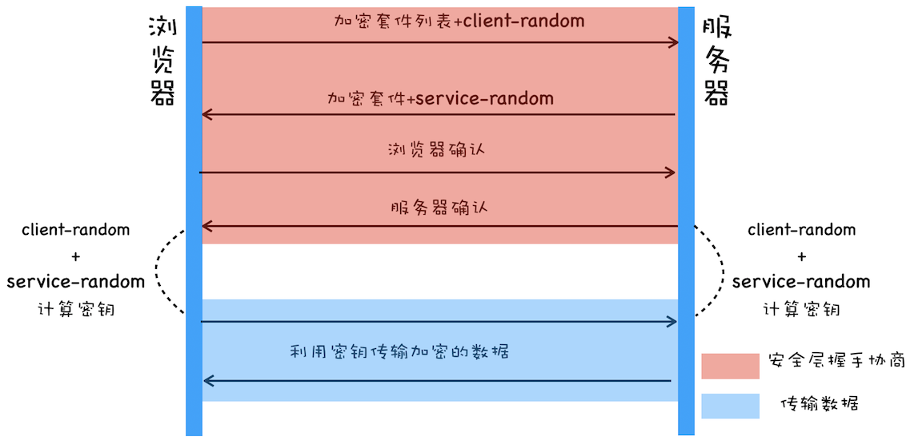

## 域名系统 DNS

## HTTP 协议

### 手写 ajax

```js
//手写ajax
//请求地址 https://www.jixieclub.com:3002/list?Pnum=1
const xhr = new XMLHttpRequest();
//第三个参数为true说明是异步请求
xhr.open('GET', 'https://www.jixieclub.com:3002/list?Pnum=1', true);
//当readState变化时触发
xhr.onreadystatechange = function() {
  if (xhr.readyState === 4) {
    //readyState代表数据流的状态
    //4的意思是数据量全部下载完成
    if (xhr.status === 200) {
      console.log(xhr.responseText);
    } else {
      alert('其他情况');
    }
  }
};
//get请求发送null
xhr.send(null);
```

### 状态码

#### 1xx 服务器受到请求

#### 2xx 请求成功

- 200 请求成功

#### 3xx 重定向(配合相应头里的 location)

- 301 永久重定向，域名快过期的时候可以整一个
- 302 临时重定向 （跳外链，搜索结果，短网址）
- 304 资源未修改

#### 4xx 客户端错误

- 404 找不到资源
- 403 没有权限

#### 5xx 服务端错误

- 500 服务端错误
- 504 网关超时（服务器集群）

### http methods

- get: 获取数据
- post: 新建数据
- patch/put: 更新数据
- delete: 删除数据

#### Restful API

- 传统 api: 把每个 url 当作一个功能
- Restful: 把每个 url 当做一个唯一的资源（不传参数，明确 method）

### header

#### 常见的请求头

- Accept: text/html (浏览器能接受的格式)
- Accept-Encoding (浏览器能接受的压缩方式)
- Accept-Language
- Connection: keep-alive http1.1 特性,建立 tcp 长连接
- cookie
- Host:请求的域名
- User-Agent： 用户代理(浏览器信息)
- Content-type: application/json 发送的数据格式

#### 常见的响应头

- Content-type：返回的数据格式
- Content-length: 返回数据的长度
- Content-Encoding 　返回数据的压缩方式
- Set-Cookie

### 缓存机制

#### 强制缓存

- 可以简单理解为在 max-age 中都会触发强制缓存。

- Cache-Control:max-age/no-cache/no-store
  ::: tip
  no-cache 和 no-store 的区别
- no-cache：不使用强制缓存，直接使用协商缓存
- no-store: 不使用强制缓存，也不用协商缓存
  :::
- expires 已被 cache-control 代替

#### 协商缓存

协商缓存是服务器端校验缓存的策略.

- max-age 过期就会触发协商缓存

- 浏览器在**再次**发送请求时，会带上**资源标识**。服务器可以根据这些资源标识进行判断，相同返回 304（body 为空），否则返回 200（body 里有最新的资源）。

- 有哪些资源标识？

  1. last-Modified: 资源的最后修改时间（精确到秒），请求的时候用的是`if-Modified-Since`,value 还是`last-Modified`中的 value
  2. Etag：资源的唯一标识，请求的时候用的是`if-None-Match`,value 还是`etag`中的 value

- 两者都有的话优先 Etag，更精确。

#### 刷新操作对缓存的影响

- 手动刷新(F5)：强制缓存失效，协商缓存有效。
- 强制刷新(Ctrl+F5): 强制缓存和协商缓存全部失效。

## HTTPS

## HTTP 各个版本

### http1.1 的主要问题

**对宽带的利用率不高**

造成该现象的原因:

1. tcp 拥塞控制慢启动
2. 多条 tcp 链接争抢宽带,影响关键资源下载
3. 队头阻塞,上一个请求没处理好那么下一个请求就只能干等

### http2


将请求打碎了用帧的形式来进行传输,同时每个帧都有对应的 id 和优先级

这样服务器就能实现调度响应.

#### 服务器推送

这里的服务器推送是指当收到 html 请求时,服务器会直接把 html 中引用的 css 和 js 文件一起返回回来

#### 请求头压缩

有很多请求的请求体和相应体都是空的,对头部压缩也能提升一些效率

### http3


http3 的底层用的是 udp,不过既然用 udp 的话,那就要手动在上层实现 tcp 中的特性了

包括流量控制和可靠传输等等,同时还要实现 https 和 http2 里有的东西,包括 tsl 多路复用.

### 阻碍

中间设备僵化

## HTTPS

http 明文传输的内容很容易被其他人窃取和篡改,这种攻击方式也就是所谓的**中间人攻击**

### TSL


介于 http 协议和传输层之间,用于加密和解密 http 请求(安全层)

### 对称加密



首先浏览器和服务器会彼此确认加密方法和对方的随机数

然后浏览器在利用彼此生成的随机数计算出相同的密钥,在拥有这个密钥的基础上进行安全传输.

可问题是第一次传`client-random`和`service-random`是明文的,而加密方法也都是公开的,黑客自己也能把这和密钥给算出来

### 非对称加密


首先浏览器依然会把自己支持的加密算法告诉服务器

接下来服务器会返回给浏览器一个公钥和一个加密算法,随后浏览器发送的所有数据都是经过公钥加密的,浏览器那里就可以用私钥进行解密

由于黑客那里没私钥,因此他即便拦截到浏览器的请求信息也莫得办法,但是!

服务器返回的数据黑客还是能够解密的!

### 对称加密和非对称加密结合的方式

首先利用非对称加密让生成一个浏览器和服务器都知道的`master-key`,

黑客是不知道这个 key 的,因为他手里没私钥匙
然后利用这个`master-key`将传输的内容进行对称加密

### 数字证书

主要是防止 DNS 劫持,黑客有可能篡改了用户浏览器上域名到 ip 上的映射,因此服务器需要给浏览器一个证明"我就是我"的途径,这个途径就是签名证书

这个证书一方面可以用来证明身份,另一方面可以包含服务器的公钥

当浏览器向服务器要公钥的时候,服务器会直接把证书给浏览器,同时进行验证操作

### TLS 完整握手流程

1. 首先客户端会先发起请求，在这次请求中会带上一个随机数，以及自己支持的 tls 版本和加密套件
2. 服务器受到请求后，会返回一个新的随机数，确认支持的 tls 版本和加密套件，同时也会把自己的 ca 证书给浏览器
3. 浏览器此时会从 ca 证书里面把公钥取出来，然后将一个`premaster-key`用 公钥加密发给服务器
4. 服务器此时会用私钥去解密这个`premaster-key`

现在这个时间节点后，客户端和服务器就都有对方的`随机数`和`premaster-key`了，他们会计算出一个相同的`master-key`，来进行对称接下来所有的 http 报文。
