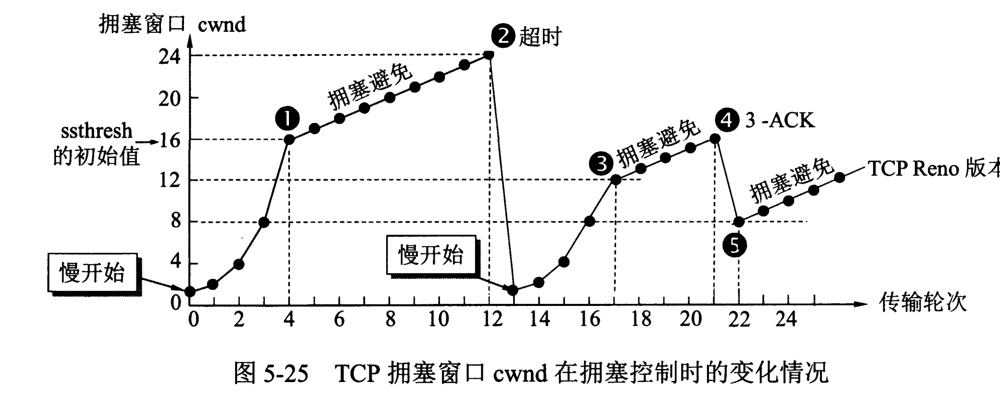

## 服务器与应用层协议之间的关系
服务器端使用TCP或者UDP的端口侦听客户端请求

客户端使用IP地址来定位主机，用目标的端口来定位服务。

服务器网卡上可以设置开放的端口号，实现网络安全。
## UDP

### 头部结构

头部占8个字节，其中的每个字段都包含两个字节，分别包括源**端口，目标端口，长度，校验和**，同时还有12个字节的伪首部。

PS：这张图是自顶向下中的，32比特的意思是结构的“宽度”是4个字节。

### 特性

- 面向无连接：说白了就是想发就发，不管你有没有收到。
- 不可靠性：既然想发就发，肯定就不可靠啦，网络一炸就掉包了
- 高效：没TCP那么墨迹，它只需要保证数据发出去并且能有序到达就OK
- 传输方式灵活：不但支持一对一，也可以支持一对多，多对多，多对一，想咋发就咋发。

### 适用场景

- 直播，视频通话
- 对即时通讯要求高的网络游戏（LOL(MOBA)，彩6这种）

## TCP

### 头部结构

头部最少占20个字节，其中源端口号和目标端口号还是各占两个字节，校验和也是占两个字节，除此之外还包括：

- 序号：占4个字节 对每个字节流进行编号，如果序号为600，则说明这个数据包的第一个字节为600，最后一个字节就是600+数据包的长度

- 确认号：4个字节，用来表示一个数据包的下一个字节的编号是多少，同时也表示本数据包已经送到，（暂时理解为当前数据包的最后一个字节的序号）

- 窗口：两个字节，表示还能接受多少字节的数据，用于流量控制

- 紧急数据指针：两个字节，指出紧急数据的位置，只有在URG为1时才有效

  这还没完，还有6bit的标识符

  1. URG为1时，激活紧急数据指针
  2. ACK为1时，说明确认号字段（小ack）有效
  3. PSH为1时，表示接收端应该立即将数据 push 给应用层，而不是等到缓冲区满后再提交。
  4. RST为1，说明TCP连接有问题，要重新连
  5. SYN一般情况为1，配合ACK使用。当ACK为0时，说明当前包为连接请求。
     当SYN为0，说明连接建立好了。
  6. FIN为1，表示数据已经发完了，并要求释放连接。

### 套接字
socket = (IP地址：端口号)
一个TCP连接由两个端点（两个套接字）来决定。

### 建立连接时的三次握手

1. 第一次握手，客户端向服务器发送**连接请求报文**，该报文段包含了一个自己的初始序号X。

2. 第二次握手，如果同意连接，服务器就会返回一个**连接确认报文**，该报文中也包含了一个初始序号Y。

3. 第三次握手，客户端还要再向服务器发送一个**连接确认报文**，此时的确认号是Y＋1，序号是X＋1，用来保证这次的连接确认报文的确是“关于”前两次握手的，如果没有这第三次握手，那么在网络出现阻塞时就会产生问题——一旦网络请求在网络中滞留的时间过长，客户端就会**重新发一个请求**。那之前发的请求怎么办？还停在网络中呢，之前的“作废请求”到达客户机只是一个时间问题。因此第三次握手是一个非常好的保证方式，保证客户端会忽略前两次握手，不然服务器会直接打开两个连接通道。

   **第三次握手后**，连接通道打开。

### 断开连接时的四次挥手

1. 第一次挥手，客户端发送**连接释放请求**。（FIN为1）
2. 第二次挥手，服务器收到请求，先往上告诉应用层“TCP要关了。。”接着给客户端返回一个ACK，再接着就进入了一个“半关闭”（CLOSE-WAIT）的状态，在这个状态中，B还是可以给A发送数据的。
3. 第三次挥手，此时数据应该是“彻底发完了”，服务器发送**连接释放请求**（FIN为1），并进入到**"最后确认阶段"（LAST－ACK）**
4. 第四次挥手，客户端受到连接释放请求后，会再向服务器发送一个ACK，告诉服务器“自己听到了它的连接释放请求”，当服务器收到这个ACK后，便会最终进入CLOSED状态。而客户端在发完ACK后便会进入到一个**TIME－WAIT**的状态，该状态会持续两个MSL（Maximum Segment Lifetime)。该状态的存在是为了防止另外一种情况：假设第四次挥手时的ACK在网络中滞留了，那么服务器就会在一定时间后**重新发送连接释放请求**，这2MSL的时间主要是为了等这玩意儿。

### 特性
面向连接
点对点
可靠交付
全双工
面向字节流

#### 传输可靠

##### 停止等待协议
（超时重传机制）保证了保证了数据可以准确送达。

##### 滑动窗口

滑动窗口是TCP流量控制的具体实现。

发送端窗口的大小是由接受窗口决定的，接收端会告诉发送端自己的剩余窗口大小，然后发送端会再根据网络情况设置一个合适的大小。当发送端收到应答报文**之后**，会将滑动窗口向右滑动。

如果给窗口字段设置为0，则发送方久无法发送数据了。

如果出现发送失败需要重传的情况，会先处理发送窗口需要处理的其他数据段。

滑动窗口可以让TCP实现流量控制功能，不然就会出现接收方网络差的要死（带宽已经占完），发送方还一直发数据的情况。

 
#### 拥塞控制

当网络出现拥塞的时候，数据包就有可能会丢，此时发送方就会重传，但问题是你越传网络就会越堵啊。。。此时拥塞控制就显得很重要了。

TCP实现拥塞控制的四个算法

- 慢开始: 刚开始的时候慢点传数据，然后在传输的过程中将发送窗口逐渐指数级扩大，避免一开始就发送大量数据直接把网给搞炸，其实很好理解，想想你百度云下东西的时候是逐渐变快的，而不是上来就满宽带（PS：前提是你开了百度云Svip）。
- 拥塞避免：当传输过程中发生拥塞时，发送窗口停止指数扩大，并将阈值设置为当前窗口的一半。发送窗口在每个RTT只会＋1。
- 快重传：如果发送方收到三个相同的，此时便知道自己的接下来的数据没发出去，发送方会立即停止当前数据发送并快速发送没发出去的数据。
- 快恢复：在执行快重传时，发送方知道自己只是丢了个别的报文段，没有必要慢开始，直接**快恢复**：将阈值砍一半，然后直接把窗口拉满（窗口值和阈值此时相等），然后执行拥塞避免算法。（既然丢数据那就说明网络有些顶不住了，转为拥塞避免算法是最为稳妥的选择。）

> 当

### 适用场景

强调数据完整性的应用，像下载器，企业客户端应用，HTTP，FTP等文件传输协议，POP，SMTP等邮件传输协议。