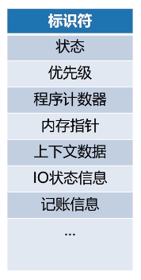
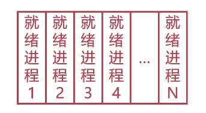
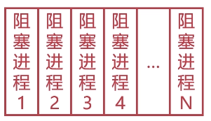
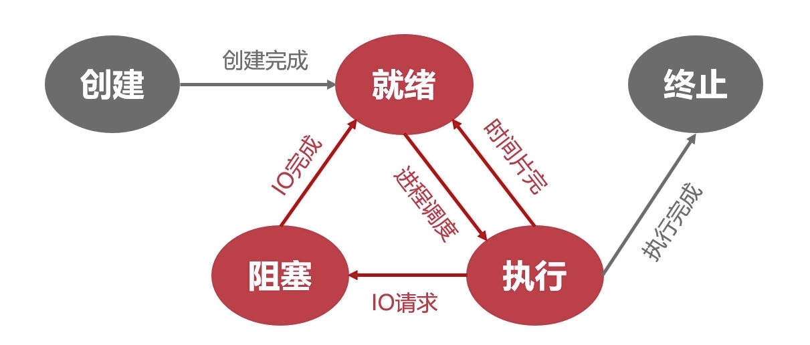
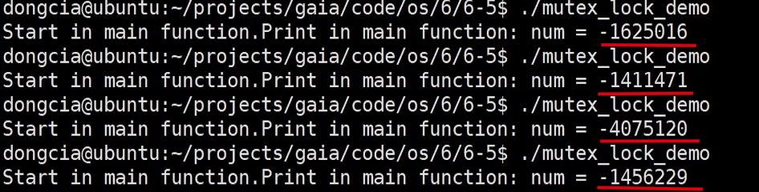
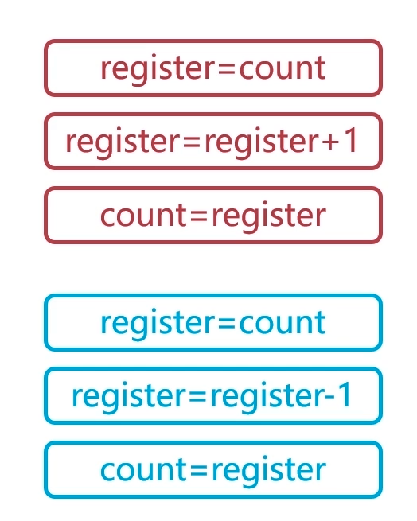
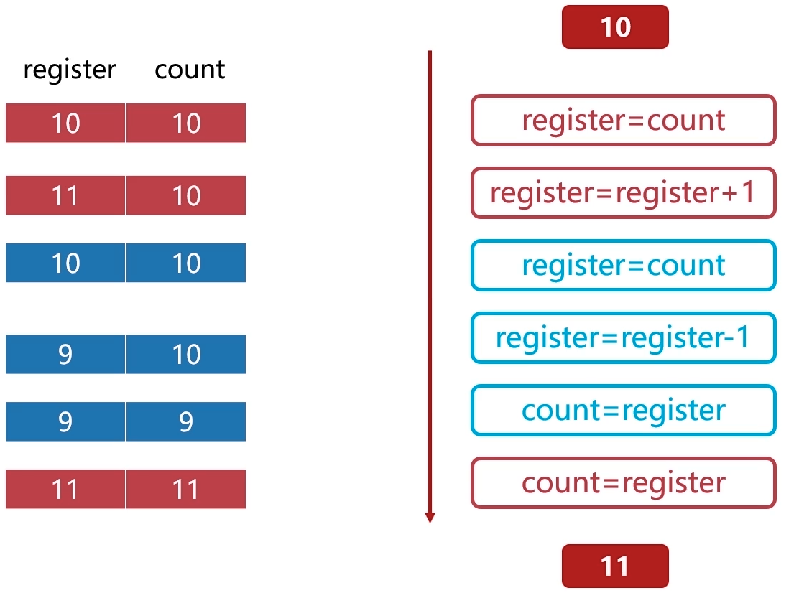
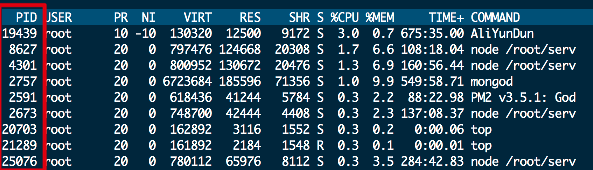
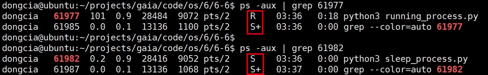
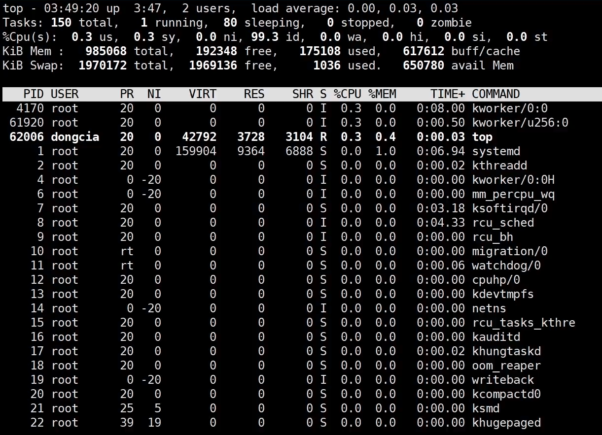

> 现代的OS基本都是多道处理系统，也就意味着一个操作系统会**并发**运行多个程序，为了方便描述和控制这些“Running Application",人们引入了进程的概念。
## 进程实体
### 主存中的进程形态
主存中的进程是一段连续存储的空间，这段空间被称之为**进程控制块**。进程控制块是用于描述和控制进程的数据结构，同时它也是使得进程能够独立运行的基本单位。

- 标志符:用来标记一个进程，用于区别其他进程。
- 状态：用来标记进程的状态，如“阻塞态”，“运行态”等等。
- 程序计数器：和计组中的计数器概念差不多，用来存储进程即将执行下一条指令的地址。
- 内存指针：存储和程序指针以及进程位置相关的信息。
- 上下文：上下文区域存储的是当前进程正在执行时CPU中的**寄存器和高速缓存中数据**。
- IO状态信息：记录当进程执行IO操作时所占用的文件列表。
- 记账信息：记录进程使用CPU的时间，时钟数总和等等。

由于PCB要经常被读取，因此它会被OS置于一块常驻的区域内存中。
### 进程与线程
进程是进行资源分配与调度的**基本单位**，**拥有**一定的资源，通过进程IPC进行通信。
线程是操作系统进行调度的**最小单位**，线程**不拥有**资源，但它可以**共享**进程的资源。线程只能通过读写同一进程的数据进行通信。
## 五状态模型
### 创建状态
当进程**拥有PCB**但是其他所有资源还没就绪的状态。

操作系统会提供fork()函数接口来让应用程序创建进程。
### 就绪状态
当进程所需要的所有资源都准备好，但只差**CPU资源**的时候，我们就可以说进程进入了**就绪状态**。

当多个进程处于就绪状态的时候，它们会形成**就绪队列**。
### 执行状态
当进程获得全部资源（包括CPU资源），此时就会进入**执行状态**。
> 在单处理机中，某个时刻内只能有一个进程处于执行态。
### 阻塞状态
当进程由于缺少资源（最典型的是发起IO请求）而放弃CPU的时候，我们就可以说此时进程处于阻塞状态。

当多个进程处于阻塞状态时，它们就会形成**阻塞队列**。
### 终止状态
当进程结束被**系统回收**(此时会归还PCB)的状态。
### 五状态之间的转换

当进程被创建后，并且获得了**除CPU资源的所有资源**，就会进入就绪状态(或进入就绪队列)。在就绪状态，一旦被**调度**（获得CPU资源），就会进入执行态。反之，如果不被调度（CPU资源用完），就会重新返回就绪态。当进程在执行态发起IO请求时，就会进入阻塞态。IO操作一旦完成，会回到就绪态，等待被调度。当进程在执行态运行完成后，会归还PCB，并进入终止态。
## 进程同步
### 为什么需要引入进程同步
在解释这个问题之前，首先要引入两个著名的问题。
#### 生产者-消费者问题
*有一群生产者在生产产品，生产完成后会将产品放入仓库，同时有一群消费者在消费产品，它们会从仓库中拿走产品并消费。*

这个问题在宏观条件下并不会出现什么差错，但类比放入计算机中的时候，就会出现问题。
```c++
#include <stdio.h>
#include <stdlib.h>
#include <unistd.h>
#include <pthread.h>
#include <vector>

pthread_mutex_t mutex = PTHREAD_MUTEX_INITIALIZER;

int num = 0;
//生产者函数，模拟生产1000000个产品
void *producer(void*){
    int times = 10000000;
    while(times --){
        // pthread_mutex_lock(&mutex);
        num += 1;
        // pthread_mutex_unlock(&mutex);
    }
}
//消费者函数，模拟消费1000000个产品
void *comsumer(void*){
    int times = 10000000;
    while(times --){
        // pthread_mutex_lock(&mutex);
        num -= 1;
        // pthread_mutex_unlock(&mutex);
    }
}


int main(){
    printf("Start in main function.");
    //分别用线程来模拟生产者和消费者
    pthread_t thread1, thread2;
    pthread_create(&thread1, NULL, &producer, NULL);
    pthread_create(&thread2, NULL, &comsumer, NULL);
    pthread_join(thread1, NULL);
    pthread_join(thread2, NULL);
    printf("Print in main function: num = %d\n", num);
    return 0;
}
```
上述代码用C++简单模拟了一下生产者-消费者的模型，我们用生产者生产出了1000000个产品，同时又用消费者消费了1000000个产品，理论上来说，我们最终print出来的num应该是0，但结果却很诡异：


很明显结果是不对的，问题到底出在哪？

问题出在计算机操作“仓库”（缓冲区）的层次上。

当计算机要操作缓冲区时，不管是生产者还是消费者，都要经历三步。
1. 把数据从缓冲区拿出来，放到寄存器里。
2. 在**寄存器**里对数据进行操作。
3. 操作完成后将数据放回缓冲区。


假如说count是缓冲区，register是寄存器，上述就是一个生产进程一个消费进程顺序执行的理想情况，这肯定是不会出错的。

但如果这两个进程的执行顺序是交叉执行（别忘了现代OS都支持进程并发），最终就的不到想要的结果。

上图简单的描述了这种情况。我们很容易发现：生产者进程还没生产完毕，消费者进程的手就伸过来了。那么消费者进程拿到的只能是初始值10，最终一个生产一个消费产生的结果只能是9或11（看这俩进程谁先跑完）。

看到这里我们应该就能想到，如果我们强制性的**控制**下他们的执行顺序，就不会产生这种情况。

接下来看第二个问题。
#### 哲学家进餐问题

假设有五个哲学家，他们每天的生活只有🍚，🤔和😪，他们五个人共用一张桌子，桌子上有五个碗，但是只有五根筷子。当他们饿的时候，会先拿起左边的筷子，再拿起右边的筷子，然后开始吃饭。吃完饭后他们会继续思考。

忽然有一天，发生了一件非常可怕的事情。

他们同时饿了，他们又同时拿了左手边的筷子，由于他们都拿不到右手边的筷子，于是他们就全饿死了。。。

进程在调用资源的时候就很像这几个哲学家，一旦出现这种等待资源的情况，就只能被活活饿死，这种情况叫做**死锁**。
***
之所以会产生上面两种情况的最本质原因是：**进程彼此之间没有相互通信**。

假如生产者能够通知消费者自己没有完成生产或已经完成生产，哲学家在吃饭前能够通知邻座的哲学家，都不会出现这种问题。

因此我们需要通过进程同步来帮助**控制并发进程和协调临界区资源。**
> **临界区资源**：指的是在计算机中虽然被共享但无法被多个线程共同访问的资源。
### 进程同步的原则
#### 空闲让进
当临界资源空闲时，允许进程使用。
#### 忙则等待
当临界资源有人用，需要使用的进程就只能等着。
#### 有限等待
要保证等待的进程等的时间是有限的，而不是一直在那傻等。
#### 让权等待
既然进程已经在等临界资源了，那么此时把CPU给它也没啥用啊，菜都没有还怎么做饭。。。不如先把CPU资源让出来（此时就进入了阻塞态）。
### 进程同步的方法
#### 消息队列
#### 共享存储
#### 信号量
具体内容请参考下一篇博客，[点此跳转]()
### 线程同步
#### 互斥量
#### 读写锁
#### 自旋锁
#### 条件变量
具体内容请参考下一篇博客，[点此跳转]()
## Linux的进程管理
### 相关概念
#### 进程的类型
- 前台进程：能在终端界面和用户交互的进程。
- 后台进程：相对于前台进程，不占用终端界面。执行程序的时候在后面追加一个&就可以以后台进程的方式启动程序。
- 守护进程：是一类特殊的后台进程，会在系统引导时启动，一直运行到系统关闭。
> 在linux中，进程名字中以“d”结尾的一般都是守护进程，如cround,httpd,sshd,mysqld等等。
#### 进程的标记
##### 进程ID


PID这一列就是"ProcessID",是一个非负整数，最大值由OS确定，用来标识每一个进程。

ID为0的进程是**idle**进程，是系统创建的第一个进程。ID为1的进程是init进程，是0号进程的子进程，负责完成系统初始化，同时init也是所有用户进程的祖先进程。
> 在linux中，可以使用pstree命令来查看进程间的继承关系。

##### 进程的状态标记

- **R**: Running,代表进程正在跑。
- **S**: Sleeping,代表进程正在处于睡眠状态。
- **D**: 进程处于IO等待的睡眠状态。
- **T**: 进程处于暂停状态。
- **Z**: 进程处于退出状态，或僵尸进程。 
### 操作linux进程的常用命令
#### ps命令
ps命令可以用于查看当前进程的快照。
- ps -aux:可以打印所有进程的详细信息。
- ps -u [用户名]：查看指定用户的进程。
- ps -aux | grep [“进程名”]or[进程号]：可以查看指定进程的详细信息。
- ps -aux --sort=-pcpu:根据cpu的使用频率进行排序。
- ps -aux --sort=-pmem:根据内存的使用状况进行排序。
- ps -ef --forest:打印所有进程的父子状态。
#### top命令
动态监视进程所有状态。

有几个没说的字段需要补充。
- PR：进程的优先级。
- VIRT：进程的虚拟内存。
- COMMAND:启动该进程需要的命令。
#### kill命令
用于删除执行中的程序或工作。
用的最多的就是kill -9 ["进程名"]or[进程号]