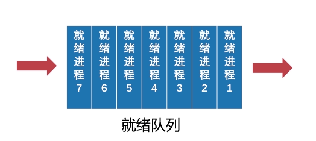
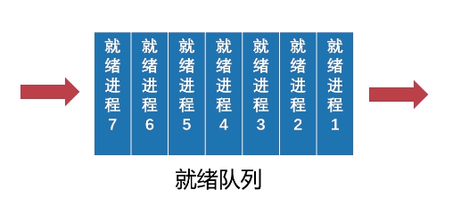
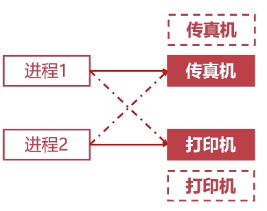
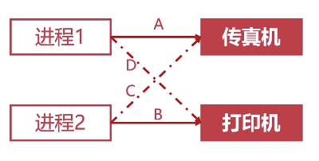
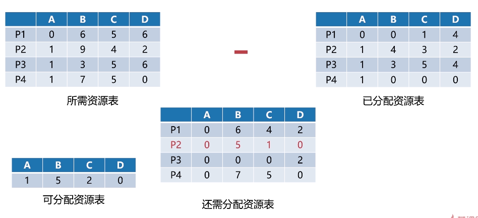

## 进程调度的概述
进程调度指的是计算机通过决策来决定哪个就绪进程该获得CPU资源。

进程调度总的来说要经历两个步骤：
1. 保留旧进程的运行信息，请出旧进程。
2. 选择新的进程，准备运行环境并为其分配CPU。

为了实现这两个步骤，首先要了解三种重要的机制。
***
### 就绪队列的排队机制

上一篇我们已经提到，当多个进程处于就绪态的时候，就会按某种方式形成就绪队列。其实形成队列的最主要目的还是为了方便调度程序最快找到就绪进程。
### 选择运行进程的委派机制
调度进程以一定策略选择就绪进程，并且将CPU资源分配给它。
### 新老进程的上下文切换机制

保存老进程的上下文信息放到主存中，将要执行的新进程的信息放入CPU的高速缓存。
***
### 进程调度的方法
#### 非抢占式的调度
处理器一旦分配给某个进程，就让该进程一直使用下去，调度程序无法抢占正在使用的CPU，直到进程完成或发起IO请求时进程才会让出CPU。

这种方法系统开销小，适用于专用系统，但对每个进程来说不公平。
#### 抢占式的调度
对比非抢占式调度，该方法允许调度程序以一定策略暂停当前正在运行的进程。这种方法对每个进程都很公平，适用于通用系统，但频繁的切换进程增加了系统开销。

## 进程调度算法
### 先来先服务调度算法

谁先来先把cpu资源给谁。在磁盘调度的时候也有类似的算法，实现简单。
### 短进程优先调度算法
调度程序会优先选择就绪队列中估计运行时间最短的进程进行调度，很明显这对于长作业是不公平的。
### 高优先权优先调度算法
每一个进程会附带一个优先权字段，调度程序可以优先选择权重高的进程，这种调度算法可以使得紧急任务得到优先处理。

通常情况下前台进程的优先级要高于后台进程。
### 时间片轮转调度算法
是一种改良后的先来先服务算法。每次会从头部取出待执行的进程，然后为其分配一个时间片，时间片用完后就将进程扔到队尾，不管进程有没有执行完。

是一种相对公平的调度算法，但不能保证及时响应用户。
## 死锁的产生
*先讲个笑话
面试官：请解释一下什么是死锁？
你：把offer给我我就给你解释。*

> **死锁**是指系统内两个或两个以上的进程同时**争抢某一临界资源**或者**调度顺序不当**而进入阻塞的一种现象，若无系统外的干涉，他们将会永远无法推进下去。这些在相互等待的进程被称为**死锁进程**。
### 竞争资源导致死锁

进程1在使用传真机同时它还需要使用打印机。
进程2在使用打印机同时它还需要使用传真机。

这两个进程陷入了死锁，他们都占着相应的资源，同时等待批次的资源被释放。如果此时能够多出一台传真机或者打印机最终都能打破死锁。

### 进程调度顺序不当导致死锁

如果以**A => B => C => D**的顺序来执行，就会造成死锁。
但如果以**A => D => B => C**的顺序来执行，就不会死锁，因为进程1在使用完传真机和打印机后，便会释放资源。

### 死锁产生的必要条件
既然是必要条件，也就意味着：如果产生了死锁，这四种状况都满足了。
#### 互斥条件
进程对资源的使用具有**排他性**，当一个进程使用某资源时，其他需要使用该资源的进程只能等待。
#### 请求保持条件
进程占着一个资源，同时又“伸着手”等着别的资源，但别的资源被占着没释放，这个进程也不嫌累，手就这样一直伸着。这个“手一直伸着”的过程就是请求保持状态。
#### 不可剥夺条件
进程在获得资源后便拥有对这个资源的最高使用权，任何高权限的进程，哪怕是OS本身，也不能剥夺该进程的资源。
#### 环路等待条件
发生死锁时，必然会存在一条环形的逻辑关系。

*可以对照上面的打印机-传真机例子和之前的哲学家进餐问题，看看四个条件是不是都满足了。*
## 死锁的处理
### 预防死锁的方法
> 除了互斥条件不可被破坏外，破坏其他的必要条件都可以避免死锁。
#### 破坏请求保持条件
不要让进程一直“伸着手”的最好方法就是在一开始就把所需要的资源都给它，这样得到“满足”的进程就不会提出资源请求了。
#### 破坏不可剥夺条件
当一个进程不能得到它所需要的所有资源时，必须要想办法让该进程将所占的资源释放掉。
#### 破坏环路等待条件

将资源按照线性排好序，进程申请的时候必须按照**线性递增**的顺序来申请。

这个地方需要解释一下。

假设有个进程1需要申请ABCD这四个资源，进程2需要申请ABCDE这五个资源。

如果进程1按照A => B => C => D，进程2按照A => B => C => D => E的顺序来申请，就不会出现问题。

但如果进程1按照上面的顺序，进程2不老实，它倒着拿资源（E=>D=>C=>B=>A）,这时他们在申请资源的时候就肯定会在某一个地方“僵持”住。

所以说，只要都老老实实的线性申请资源，最终就不会产生环形的资源-进程逻辑链。

### 银行家算法

首先需要解释下这几个表都是啥意思。

**所需资源表**表示的是每一个进程对于各个资源的具体需求。比如P2进程此时需要1个A资源，9个B资源，4个C资源，2个D资源。

**已分配资源表**表示的是每一个进程目前所拥有的具体资源。比如P3进程此时拥有1个A资源，3个B资源，5个C资源，4个D资源。

**还需分配资源表**是这两个表最终相减的结果。

在分配资源之前，首先将所需资源表和已分配资源表相减，得出还需分配资源表，然后拿可分配资源表（仓库中还剩多少）与还需分配资源表一行一行比对，如果能找出能分配出去的行最终就将可分配资源表中的资源分配出去。

在这个例子中，只有P2满足条件，因此最终会把资源分配给P2。