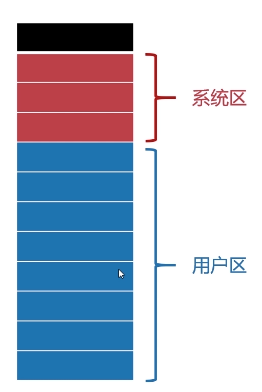
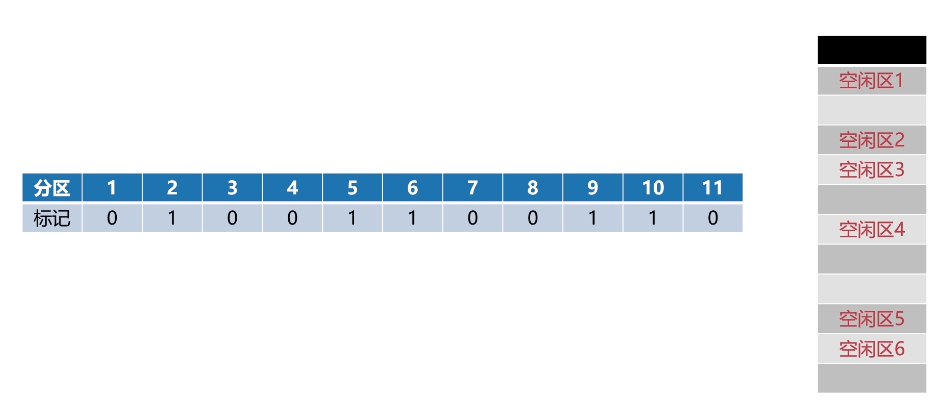
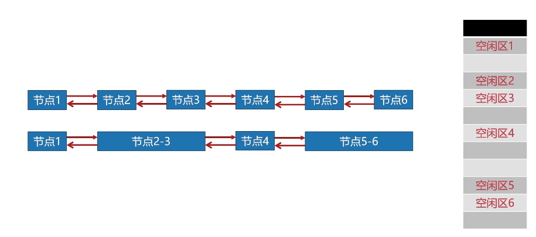
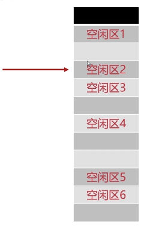
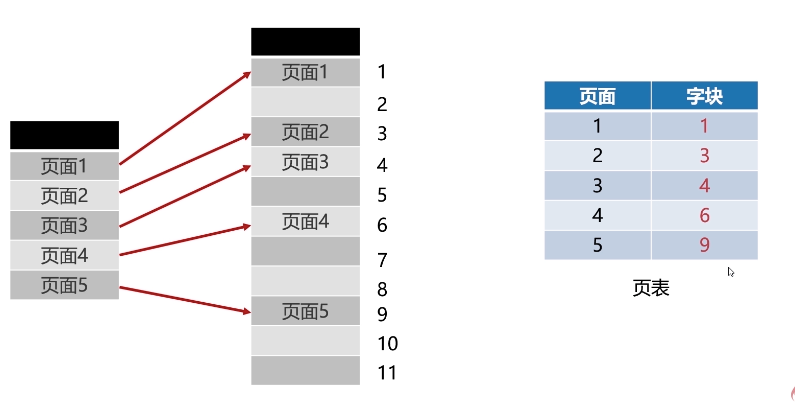
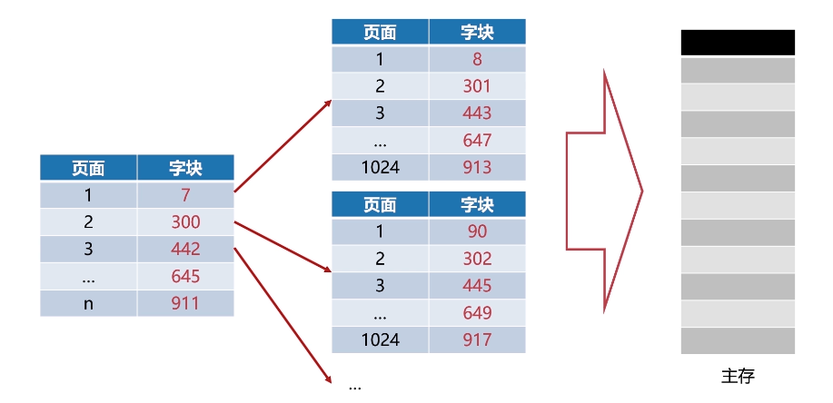
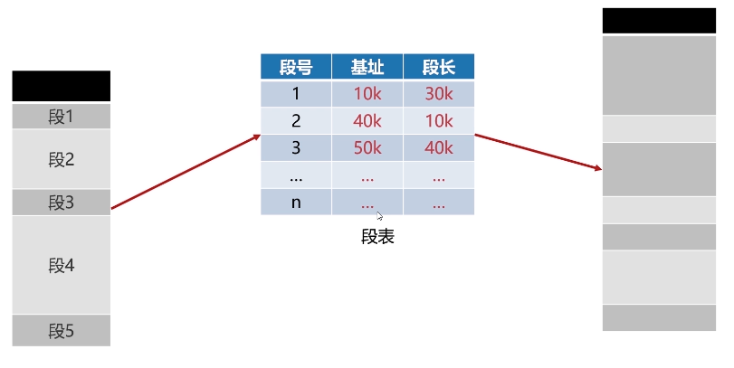
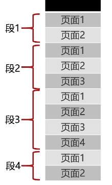
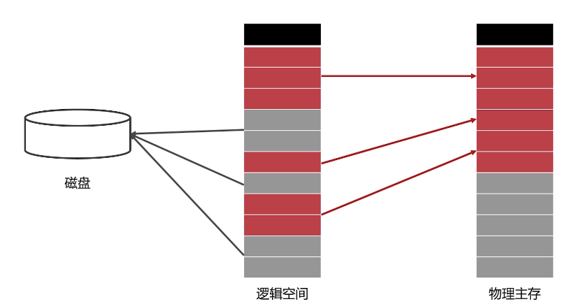

> 在早期的计算机中其实并不需要存储管理，但随着计算机和程序越来越复杂，人们必须要确保计算机有着足够的内存区处理数据，因此进行存储管理就成了一件非常重要的事情。
## 内存的分配与回收
### 内存分配
#### 单一连续分配

这是一种最简单的内存分配方式，但只能在单用户，单进程的OS中使用，如今已经过时。
#### 固定分区分配

固定分区分配是支持多道程序OS中最简单的存储分配方式。内存空间被划分成固定大小的区域，每个程序会独占一个固定的区域，互不干扰。
#### 动态分区分配
##### 所涉及的数据结构
###### 动态分区空闲表

表中的0代表空闲，没有被使用；表中的1代表已经被使用。
###### 动态分区空闲链

将空闲的分区块用双向链表的形式链接起来，其中连续的节点可以合并成一个节点，因此每个节点中都会有存储当前节点容量的字段信息。
##### 动态分区分配算法
###### 首次适应算法(FF)

会使用空闲链这种数据结构，每次分配内存时都会从开始的位置便利空闲链，当找到的空闲链的容量足够运行程序时，就会将这块空闲链分配出去。

但这种分配方式有个明显的缺点就是每次都是从内存头部地址开始，这使得内存头部的地址不断的被划分，而高地址位内存很难得到利用。为了改进这种情况，人们又发明了**循环首次适应算法**，每次划分内存不是从头开始划分，而是从上一次分配结束的位置开始。这样就能保证高地址位的内存也能得到充分利用。

###### 最佳适应算法(BF)

这种算法会将空闲区链表按照容量**从小到大**排序，每次分配内存时都会从头遍历链表然后为其分配一个**最合适**的分区块，这样可以避免内存块出现“大材小用”的情况，同时也能减少内存碎片的产生。
###### 快速适应算法(QF)

这种算法要求OS拥有多个空闲链表，每个链表都保存固定的存储容量（但每种链表的存储空间是不同的，如图）这样做的好处是在分配内存的时候可以**快速**找到适合分配内存的内存区域。
### 内存回收
- case1：回收区在空闲区后面

此时只需要增大空闲区1的容量，增大到刚好能够覆盖掉会收区即可。

- case2：回收区在空闲区的前面

首先需要合并回收区和空闲区1，然后新的空闲区使用**回收区的地址**。

- case3: 回收区位于两个空闲区之间

将空闲区1，回收区，空闲区2都合并，新的空闲区使用**空闲区1的地址**。
- case4: 回收区附近没有空闲区

此时要在回收区创建一个新的空闲节点，标注好内存回收区的大小和首部地址，插入到对应的空闲链表中。
## 段页式存储管理
### 页式存储管理
页式存储管理会将进程的逻辑空间等分成若干大小的页面，相应的物理内存也会被划分成若干个物理块或页框，最终会以页面为单位将进程空间装入被划分的物理内存中分散的物理块。

页面大小在划分的时候应该适中，过大的话会难以分配，过小的话会产生**内存碎片**。
#### 内存碎片

一般来说页面的大小通常是512B~8KB之间。
#### 页表
> 单单有页面和物理块（页框）还不够，我们怎么知道具体的页面分配到哪个页框中呢？

页表是用来记录进程逻辑空间与物理空间之间映射关系的一张表。

#### 页面的虚拟地址
虚拟地址可以分解为页号P和业内偏移W。
- 页号P = 虚拟地址/页面大小
- 业内偏移W = 虚拟地址%页面大小
#### 页式存储管理的问题
在现代的OS中，可以支持很大的逻辑地址空间。假设一个32位的系统（最大能支持4G内存），规定了页面大小为4K，那么单单页表项就会有**2的20次方**个，假如说每个页表项就占1B的字节，那么这张页表就占1M的内存了。

也就是说，你每开一个新的进程，光页表就吃了你1M的内存！！！

那如何解决这种问题呢？此时就引出了多级页表。

#### 多级页表

根页表的字块中存储的不是页面的块号，而是**页表的块号**，在运行的时候只需要将根页表加载到内存中，如果调用某一个具体字块，则可以根据根页表进行“按需加载”，大大节省了内存开销。
### 段式存储管理
> 页式存储管理是以页面为单位进行划分的，但如果有一段连续的逻辑分布在离散的页面中，效率就会大大降低。
段式存储管理会把进程的逻辑空间划分为若干段（非等分），段的长度由连续的逻辑长度所决定。
#### 段表

类似页表，保存每一段的逻辑空间与物理空间的映射。由于段的长度不固定，因此段表中会多出**段长**这个字段。
#### 段式存储与页式存储的对比
相同点：段式存储和页式存储都离散的管理了进程的逻辑空间。
不同点：
- 页是物理单位，段是逻辑单位。
- 分页是为了合理利用空间，分段是为了满足用户需求。
- 页大小是有硬件决定，而段的长度可以动态变化。
- 页表的信息是一维的，段表信息是二维的。
### 段页式存储管理
> 分页可以有效提高内存利用率（虽然会存在页内碎片），分段可以更好的满足用户需求，二者结合，便可以形成段页式存储管理。
> 

先将逻辑空间按照段式管理分成若干段，再把段内空间按页式管理划分成若干页。
#### 段页地址的结构

- 段号指的是进程的逻辑空间具体在哪一段
- 段内页号与页内地址可以直接类分页存储管理的页表项。
## 虚拟内存
> 英雄联盟这款游戏安装后大概有16个G，但一台8G的笔记本却可以流畅运行，这是为什么呢？

### 虚拟内存概述
#### 原因
现代的OS都采用的是多道程序设计，每个程序都需要物理内存供其运行，更不用说像一个大的程序本身需要的内存也非常多，物理内存总会有不够的时候。
#### 原理

将程序使用的内存进行划分，将暂时用不到的内存放到磁盘中去。
### 程序的局部性原理
在计算机存储器中也设计到了这个概念，局部性是指CPU访问存储器时，无论是读操作还是写操作，都倾向于访问存储器中的连续区域。

这个特性是实现虚拟内存技术的关键，程序在运行时，无需全部加载，装载所需要的部分即可。如果访问页不在内存，此时就会发出**缺页中断**，发起**页面置换**。

从用户的层面来看，好像程序拥有非常大的内存来运行，即**虚拟内存**。
### 虚拟内存的置换算法
虚拟内存的置换算法和高速缓存的置换算法一模一样，具体参考请点击[这里](https://seekinglight.gitee.io/%E5%AD%98%E5%82%A8%E5%99%A8.html)
## Linux系统的存储管理
### Buddy内存管理算法
也被称之为“伙伴系统”，这种算法主要是为了解决**内存外碎片**的问题，同时这种算法本身也具有极高的效率。
> #### 页内碎片与页外碎片
> 
> - 页内碎片：之前提到过，是指某个进程已经分配到的某块内存**减去**实际所需的内存后，所剩下的内存。
> - 外部碎片：是指还没有分配出去(此时还不属于任何进程)，但是由于大小而无法分配给申请内存的新进程。

...
待更新
### Linux交换空间

