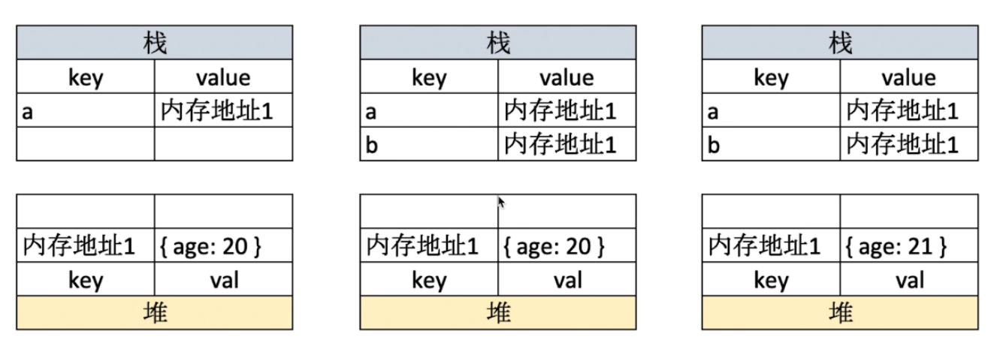
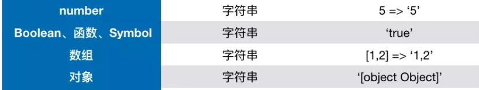
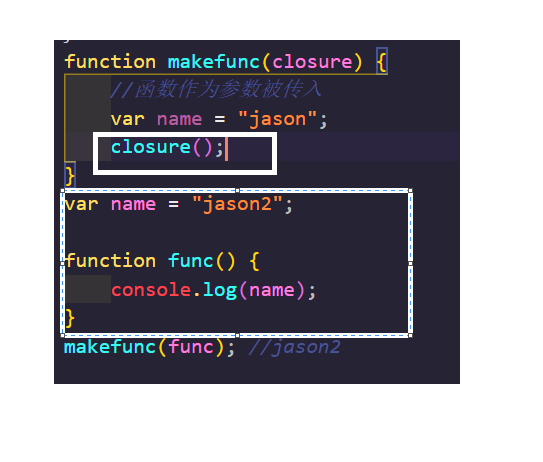
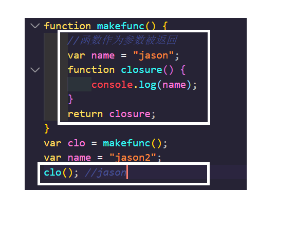
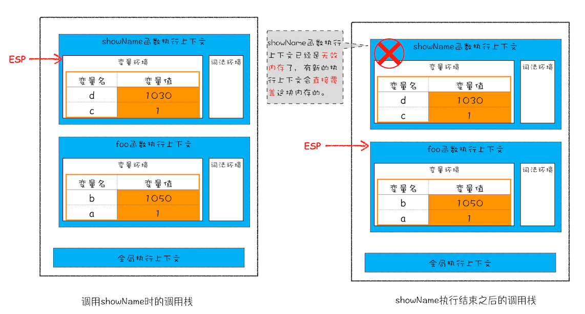

## Js 中类型分类

### 原始类型(值类型)

- 包括 number/string/boolean/null/undefined/symbol;

- 原始类型中存的都是值，是不可能调出任何函数的。
  但 `2333.3333.toFixed(2)` 之所以能调用是因为被 js 强制转型成了**Number 对象**。

- null 如果用 typeof 检查类型发现是 Object，其实这是 js 的一个老 bug。。。

- symbol 是 ES6 中新增的原始类型，它可以用来生成唯一的标志来避免命名冲突。
- `NaN`是 number 中的特殊值，代表的是参与数学计算错误后的返回值。

```js
let obj = {
  [Symbol(01)]: "hello",
  [Symbol(01)]: "world",
};

console.log(Object.getOwnPropertySymbols(obj).map((sym) => obj[sym]));
// [ 'hello', 'world' ]
```

通过调用`Symbol()`方法来创建 symbol 实例，即便传入参数一样也不影响。

最终如果要拿对象中**symbol 作为键的值**的话可以用`Object.getOwnPropertySymbols(obj).map(sym => obj[sym])`。

symbol 最大的作用可以用来定义字符串常量,即便写错了也没关系,因为它生成的标志永远是唯一的,还可以防止命名冲突.

除此之外还可以用来封装类上的私有属性(用 ts 的话感觉用不上)

### 对象类型(引用类型)

- 对象类型定义的变量里面放的不是对象，而是对象的**引用**，因为对象太大了如果放到栈内存里会造成很大的性能损耗！
  
- 如果函数参数是对象的话（假设传过来的这个对象叫 p1），千万不要用`person = {...}`的形式修改传进来的对象(person 是函数的形参)，你会发现根本修改不了。

```js
function test(person) {
  person = {
    name: "yyy",
    age: 30,
  };
}
const p1 = {
  name: "yck",
  age: 25,
};
test(p1);
console.log(p1.age); // 25
```

> 最终可以发现，p1.age 的值仍然是 25。
>
> 因为这等于是重新为 person 分配了一个新的对象，已经和 p1 没有关系了，请看下图
> 

## typeof 和 instanceof

- typeof 可以检查原始类型(除了 null)，但是在检查对象类型的时候，除了函数能显示出一个 function 以外，其他的统统显示的是 object
- instanceof 主要是用来判断是否是某个类(或构造函数)的实例。(继承下来的实例也可以判断)

```js
function Foo() {}
let foo = new Foo();
//foo是否是Foo的实例呢？
console.log(foo instanceof Foo); // true
```

## instanceof 的实现原理

看代码其实很好理解，就是一个递归往上进行判断的过程。

```js
function myinstantof(ins, origin_obj) {
  //首先第一步先拿到判断实例的原型对象
  const proto = ins.__proto__;
  //如果这个实例对象存在...
  if (proto) {
    if (proto === origin_obj.prototype) {
      return true;
    } else {
      //如果判断不等的话让这个判断对象继续递归往原型链上判断
      return myinstantof(proto, origin_obj);
    }
  }
  return false;
}
```

## 通用的类型判断方法

```js
Object.prototype.toString.call(foo);
```

## 类型转换

### 转 boolean

通过`Boolean()`方法可以强制转换任意值为 boolean 类型，除了`undefined`,`null`,`-0`,`+0`,`NaN`,`""`以外，其余的值都是 true。

### 转数字

通过`Number()`方法可以强制转换任意类型为 number 类型。

### 转字符串

通过`String()`方法可以强制转换任意类型为字符串，具体的转换效果可以参考下表

以下变量在经历两次`!!`运算后结果都为 false

`0`,`NaN`,`""`,`null`,`undefined`,`false`.

上面的变量统称为**false 类**变量，而剩余的变量都为**true 类**变量。

这两种变量可以帮助我们进行逻辑判断。

```js
console.log(11 && 0); //0
console.log("" || "abc"); //'abc'
let abc = {};
console.log(!abc.a); //true
```

::: warning
上述的大多数规则都容易理解和记忆。人们通常会犯错误的值得注意的例子有以下几个：

- 对 undefined 进行数字型转换时，输出结果为 NaN，而非 0。
- 对 "0" 和只有空格的字符串（比如：" "）进行布尔型转换时，输出结果为 true。

:::

### `==`和`===`

==只会比较"转换之后的 value"，===更加严格，除了比较 value 还会检查类型。
:::tip
除了在对`null`进行判断用两等，其余的情况一律用三等。
:::

## js 的作用域与作用域链

### 作用域

es6 之前 js 中的作用域只有函数作用域和全局作用域

在 es6 之后引入 let 和 const 之后便和其他语言一样拥有了块级作用域

### 作用域链

作用域链是指 js 查找一个变量的过程.

**函数执行上下文的(词法环境 => 变量环境) => 全局执行上下文的(词法环境 => 变量环境)**

## 闭包

闭包是啥？

这个问题在网上看了很多的博客，都写的很奇怪，反正我是没看懂。

其实 MDN 上的**英文翻译**我觉得就是描述的最贴切的。

> A closure is the combination of a function bundled together with references to its surrounding state.

这个`surrounding state`可以理解为被某个函数引用的自由变量。

所谓的自由变量是指外层作用域中的变量。

::: warning
在 js 中，自由变量的查找逻辑是根据函数定义的位置，而不是调用的位置。
因为 js 中的作用域是使用的静态的词法作用域，而不是动态作用域。
:::

下面两幅图中函数声明时所在的区域就是所谓的`surrounding state`.





从上面两个例子我们可以看到，闭包的最大特点就是：

**闭包函数被调用时，不受当前作用域的影响！**

说句不好听的，闭包破坏了 js 的作用域机制。

闭包最大的作用就是用来封装数据，只对外提供 API。

```js
// 封装一个name对象，包含set和get方法
var Name = (function() {
  var name = "未定义";
  return {
    getName() {
      return name;
    },
    setName(new_name) {
      name = new_name;
    },
  };
})(); //加小括号直接执行这个闭包引用
console.log(Name.name);
Name.setName("Jasonlee");
console.log(Name.getName());
```

## this 的指向判断问题

`this`取什么样的值，实在函数**调用**的时候被确认的，而不是在定义的时候被确认。

通过一个对象来**调用**(注意是调用,不是赋值!)这个对象上的方法时,方法中的 this 会指向该对象.

除非遇到一些特殊情况，像箭头函数（会把上层作用域中的 this 传进来）,bind 等等。

(严格模式下函数被调用时的 this 为 undefined)

## 执行上下文

> 解释下“全局执行上下文“和“函数执行上下文”。

### 全局执行上下文

当 js 引擎第一次遇到你的 script 时，会先创建一个全局执行的"小环境",这个全局执行的“小环境”就是所谓的 Global Execution Context，此时这个执行的全局 context 会被压入执行栈。

### 函数执行上下文

当 js 引擎遇到函数调用时，会为该函数创建一个独立的 context 并压入执行栈中。

### 执行上下文具体创建的过程

会经历创建阶段和执行阶段，在创建阶段会去绑定 this 的指向，分配词法环境与变量环境；在执行阶段会先去完成对变量的分配，最后执行代码。

## 深拷贝与浅拷贝

首先先看这样的一个问题。

我需要将一个对象拷贝到另一个对象上。
<hide txt="以下内容皆为真实案例"></hide>
我刚学 js 的时候，理所当然会想到用等号，最开始还没什么大问题，直到有一天，我遇到了下面这个对象。。。

```js
let obj1 = {
  a: 1,
  b: ["1", "2", "3"],
  c: "hello",
};
let obj2 = {};
```

我的目标很简单，就是将`obj1`拷贝到`obj2`上，让`obj2`作为一个临时的**snapshot**(快照)。

我像往常一样，写下了`obj2 = obj1`。

但接下来当我修改`obj1`的值的时候，`obj2`竟然也发生了变化。

```js
obj2 = obj1;
// obj1.b[2] = "33333";
obj1.a = 111111;
console.log(obj1); //{ a: 111111, b: [ '1', '2', '3' ], c: 'hello' }
console.log(obj2); //{ a: 111111, b: [ '1', '2', '3' ], c: 'hello' }
```

很明显，这和我的需求是违背的。

最终经过查阅资料和验证，我得到了下面的结论。

**在 javascript 中，当用=进行赋值操作时，只有基础的数据类型传递的是值，而对象(包括函数对象)传递的只是引用！**

那有什么方法来解决上面的问题呢？

### `Object.assign()`实现对象内元素浅拷贝

第一种方法，就是使用`Object.assign()`方法进行拷贝操作。

```js
let obj1 = {
  a: 1,
  b: ["1", "2", "3"],
  c: "hello",
};
let obj2 = {};

for (let x in obj1) {
  obj2[x] = obj1[x];
}
Object.assign(obj2, obj1);
obj1.a = 111111111111;
console.log(obj1); //{ a: 111111111111, b: [ '1', '2', '3' ], c: 'hello' }
console.log(obj2); //{ a: 1, b: [ '1', '2', '3' ], c: 'hello' }

obj1.b[2] = "3333333333";
console.log(obj1); //{ a: 111111111111, b: [ '1', '2', '3333333333' ], c: 'hello' }
console.log(obj2); //{ a: 1, b: [ '1', '2', '3333333333' ], c: 'hello' }
```

这种方法本质上只是迭代对象中的每一个键值对，然后给赋值过去，如果对象里都是基本类型那还好，万一有对象还是要 GG。所以实现深拷贝才是根本途径。

第二种方法就是用`JSON.parse(JSON.stringify(obj))`,但这种方法也有局限性，如果要拷贝的目标是一个**函数对象**或者**类的实例**，就会报错。

所以说，实现深拷贝是很有必要的一件事，实现起来也并不是很难。

### 手写深拷贝

实现的逻辑很简单，还是进行遍历赋值，如果遇到了对象类型就递归下去，直到最里层都为基本类型为止。

```js
function deepClone(target_obj, source_obj) {
  for (let key in source_obj) {
    //首先先将要拷贝的内容拿出来并判断类型
    let item = source_obj[key];
    //如果是数组或者是对象，就递归下去进行赋值，直到“头”是基本类型为止
    if (item instanceof Array) {
      target_obj[key] = [];
      deepClone(target_obj[key], item);
    } else if (item instanceof Object) {
      target_obj[key] = {};
      deepClone(target_obj[key], item);
    } else {
      target_obj[key] = item;
    }
  }
}

let obj1 = {
  a: 1,
  b: ["1", "2", "3"],
  c: "hello",
};
let obj2 = {};

deepClone(obj2, obj1);
obj1.b[0] = "111111111";
console.log(obj2);
//{ a: 1, b: [ '1', '2', '3' ], c: 'hello' }
```

### 手写深度比较

即便你能够拷贝出一个完全一样的对象，你也不能用等于号来比较他们。
因为比较的永远是引用。

```js
function isObject(obj) {
  return typeof obj === "object" && obj !== null;
}

function isEqual(obj1, obj2) {
  //首先参与运算的必须都是两个对象,不是的话直接让他俩用等于号比较，就不受累了
  if (!isObject(obj1) || !isObject(obj2)) return obj1 === obj2;
  //先取出这两个对象的keys
  const keys1 = Object.keys(obj1);
  const keys2 = Object.keys(obj2);
  if (keys1.length != keys2.length) return false;
  // core code
  for (let key in obj1) {
    //比较当前key上的val
    const res = isEqual(obj1[key], obj2[key]);
    if (!res) return false;
  }
  //循环跑完发现没问题的话
  return true;
}
```

## js 中的异常捕获

第一种方法是使用`try...catch`语句，但总不能每次都将错误的地方全包起来，比较保险的另一种方式是在开头重写`window.onerror()`方法<hide txt="记住一定要在开头写因为这是函数表达式不存在变量提升！！！"></hide>,然后发给后台统计错误信息啥的。
也就是说，只要在你的 js 出现问题就会自动执行`window.onerror()`方法

附个 MDN 的链接[GlobalEventHandlers.onerror](https://developer.mozilla.org/zh-CN/docs/Web/API/GlobalEventHandlers/onerror)

```js
window.onerror = function(message, url, line, column, error) {
  alert("出错了!");
  //给后端发送错误请求
  //...
};
console.log(a);
let a = 1;
```

## js 的垃圾回收机制

### 栈中的垃圾如何回收



通过下移 ESP 指针.

### 堆中的垃圾如何回收


v8 里的堆空间主要分为新生区和老生区,其中新生区中又分为对象区域和空闲区域.

当对象区域快满时,会触发 gc 进行扫描,扫描的过程中会将仍被引用的变量复制到空闲区,然后做角色反转

如果 gc 触发了两次,垃圾对象依然存在,就会被晋升到老生区.

### 老生区

老生区里的主要还是标记清除算法。

所谓标记清除就是从根对象开始(Window,Global),去扫描能否抵达的变量(是否可达)，如果可达就为其进行标记上色，当遍历完所有的对象树后

老生区里的成员主要是晋升进来的对象和一些非常大的对象,这里里的对象会根据调用栈的中是否有变量引用作为其被**标记**的依据,他会在对垃圾标记后进行批处理,防止内存碎片.

---

_下面这块算 es6 的部分了_

## requestAnimationFrame()

[你需要知道的 requestAnimationFrame](https://juejin.im/post/6844903565048152078)

`requestAnimationFrame()`是一个动画相关的 api，它要求传一个回调进去，告诉浏览器用这个回调来更新动画。

> RAF 会在布局前生效，利用这一点可以避免页面大量回流

> React 中就是参考这个 api 模拟实现的 requestIdleCallback

当然你也可以利用这玩意做节流。

```html
<!DOCTYPE html>
<html lang="en">
  <head>
    <meta charset="UTF-8" />
    <meta name="viewport" content="width=device-width, initial-scale=1.0" />
    <title>Document</title>
  </head>
  <style>
    #div1 {
      width: 100px;
      height: 50px;
      background-color: red;
    }
  </style>

  <body>
    <div id="div1"></div>
    <script src="https://cdn.bootcss.com/jquery/3.4.1/jquery.min.js"></script>
    <script>
      let div1 = $("#div1");
      let oriWidth = 100;
      let maxWidth = 640;

      function animate() {
        oriWidth += 1;
        div1.css("width", oriWidth);
        if (oriWidth < maxWidth) {
          window.requestAnimationFrame(animate);
        }
      }
      animate();
    </script>
  </body>
</html>
```

## let 和 const

在 es6 中新增了`let`与`const`,它们声明的变量，仅仅在块级作用域内才有效，并且不存在变量提升。

> 变量提升:JS 的一种预解析机制，用 var 和 function 定义的变量都存在变量提升。
> 但是函数表达式不存在变量提升。

### let

```js
if (true) {
  let a = 1;
  console.log(a); //1
}
console.log(a); //ReferenceError: a is not defined

for (var i = 0; i < 9; i++) {}
console.log(i); //9
for (let j = 0; j < 9; j++) {}
console.log(j); //ReferenceError: j is not define
```

```js
//创建10个a标签，点击时弹出对应的序号
for (let i = 1; i <br 11; i++) {
  let a = document.createElement("a");
  a.innerHTML = i + "</br>";
  a.addEventListener("click", (e) => {
    e.preventDefault();
    alert(i);
  });
  document.body.append(a);
}
```

### const

和其他语言一样，可以用来声明一些常量

```js
const PI = 3.1415926;
console.log(PI);
PI = 3.999; //Assignment to constant variable.
```

::: warning
对于基本数据类型，*const*定义的常量和其他语言没有区别。
但是对于对象类型就要注意了，const 只能保证这个指向对象的引用是不可变的，并不能保证引用对象的 value 也不可变。
如果要实现引用对象的 value 也不可变，我们需要使用`Object.freeze()`将其冻结。
:::

## 解构赋值

所谓的`解构赋值`,就是从对象中提取值，然后对对象进行赋值操作。

### 数组的解构赋值

```js
let [a, b, c] = [1, 1, 2];
console.log(b); //1
```

当然这玩意的应用比我想象的要灵活的多。

```js
let [a, b, c] = [1, 1];
console.log(c); //undefined
let [x, , z] = [1, 2, 3];
console.log(z); //3
//有默认值的情况
let [p = "ppp", q] = [, 22222];
console.log(p); //ppp
//交换两个变量的值
let [m, n] = [1, 2];
[m, n] = [n, m];
console.log(m + "," + n); //2,1
//与拓展运算符的结合
let arr = [1, 2, 3];
let [i, j, k] = [...arr];
console.log(i); //1
```

最后的例子中有个`...`需要好好解释一下。

### 拓展运算符

`...`叫`拓展运算符`。用来拓展啥呢？用来拓展对象(包括数组对象)

它可以将可遍历的对象中的每一个键值对都拓展成由逗号分隔的序列，可能你觉得这不是一句人话，还是看个小例子吧。

```js
let obj1 = {
  a: 1,
  b: 2,
};

let obj2 = {
  ...obj1,
  c: 3,
  d: 4,
};
console.log(obj2);
//{ a: 1, b: 2, c: 3, d: 4 }
```

看明白了嘛？其实`...obj1`就等价于`a:1,b:2`，现在再去读读那句话，应该明白了吧。

看懂了这个例子，那么数组的例子就应该很简单了。

```js
let arr1 = [1, 2, 3];
let arr2 = [4, 5, 6, ...arr1];
console.log(arr2); //[ 4, 5, 6, 1, 2, 3 ]
```

数组其实算是特殊的对象，这里的`...arr1`其实等价于`1,2,3`。

### 对象的解构赋值

数组因为有下标所以位置可以很自然的“匹配”好。

而对象在解构赋值要保证赋值成功的重要条件便是**能够匹配到 key**。

```js
let { foo: a } = { foo: "aaa", bar: "bbb" };
console.log(a); //aaa
```

在上面这段代码中，`foo`是匹配的位置，`a`是要用来被赋值的变量。
从右边的对象中，找到`foo`对应的 value，并赋值给变量`a`.

在 ES6 里面如果一个对象的 key 和 value 重名的话可以只写一个，因此就有了下面的骚操作。

```js
let { log10, round } = Math;
console.log(log10(100)); //2
console.log(round(3.14)); //3
```

是不是很有意思 XD

从`Math`对象中找到这两个“变量”对应的值，他们的值其实是一个**function**，这样的话每次写就很省事了。

如果想给变量设置默认值得话还是用`=`号。

```js
let { e: e = "eee", f: f } = {
  f: "fuck",
};
console.log(e); //eee
console.log(f); //fuck
```

### 字符串的解构赋值

其实除了数组和对象，所有拥有`length`属性的**Array-like**(类数组)都可以进行解构赋值，包括字符串。

```js
let [a, b, c, d, e] = "hello";
console.log(a); //h
```

## for...of 循环

ES6 借鉴别的语言引入了`for...of`循环，作为遍历`Array-Like对象`的统一方法。
::: warning
没有特殊说明的话，本块内容中的所有`Array-Like对象`都统一称为`对象`。
:::

```js
let numbers = [1, 2, 3];
for (let val of numbers) {
  console.log(val);
}
//1
//2
//3
```

::: warning
用`for...of`遍历的是对象的 value,而`for...in`遍历的是对象的 key
:::

```js
let numbers = [1, 2, 3];
for (let key in numbers) {
  console.log(key + "|" + typeof key);
}
// 0|string
// 1|string
// 2|string
```

可以看到用`for...in`的时候数组下标被拿出来了。

如果要遍历对象(这里指的是常规的对象)的话，还是用`for...in`方便些。

## Set

ES6 中引入了集合这种结构,`Set`也是一个`Array-Like`对象，只不过在 Set 中的元素的 value 要符合“集合”的定义。

### 基本使用

```js
let set = new Set([1, 2, 3, 4, 5]);
console.log(set); //Set { 1, 2, 3, 4, 5 }
set.add(6);
set.add(7);
set.add(8);
console.log(set); //Set { 1, 2, 3, 4, 5, 6, 7, 8 }
//Set转为数组
let arr = [...set];
console.log(arr);

//数组转为Set，会自动去重
let set_1 = new Set([1, 2, 3, 3, 3]);
console.log(set_1); //Set { 1, 2, 3 }

//只要是array-like,都可以转成set
let set_str = new Set("jasonlee");
console.log(set_str); //Set { 'j', 'a', 's', 'o', 'n', 'l', 'e' }
```

### 删除

```js
let set = new Set([1, 2, 3, 4, 5]);
console.log(set); //Set { 1, 2, 3, 4, 5 }
set.delete(2);
console.log(set); //Set { 1, 3, 4, 5 }
```

### 判断是否存在

```js
console.log(set.has(2)); //false
```

### 清空 Set

```js
set.clear();
console.log(set); //Set {}
```

### 遍历操作

方法很多，个人喜欢用`for...of`

```js
let set = new Set([1, 2, 3]);
for (let val of set) {
  console.log(val);
}
//1
//2
//3
```

## Map

在传统意义上的对象只能用字符串当**key**，即便你写的不是字符串 JS 也会给你自动转化为字符串。

而新增的`Map`解构就没有这种约束。

```js
let map = new Map([
  [1, "aaa"],
  //甚至布尔类型的值也没有问题
  [false, "bbb"],
]);
console.log(map.has(1)); //true
console.log(map.has(false)); //true
```

在传参数的时候需要注意，传进去的是一个数组，而每一个键值对也要求是一个数组，而且是两个元素，一个用来指**key**，一个用来指**value**。

```js
let set = new Set([3, 4]);
let map = new Map([[1, "aaa"], Array.from(set)]);
console.log(map); //Map { 1 => 'aaa', 3 => 4 }
```

### 遍历操作

`Map`也算是一个`Array-Like`,因此也可以使用`for...of`进行遍历。
不过在遍历的时候需要指定出要遍历的是`key`还是`value`。

```js
let map = new Map([
  [1, "aaa"],
  [2, "bbb"],
  ["3", "ccc"],
]);
//如果不指定会遍历每一个键值对
for (let val of map) {
  console.log(val);
}
// [ 1, 'aaa' ]
// [ 2, 'bbb' ]
// [ '3', 'ccc' ]

// 遍历map中的key
for (let val of map.keys()) {
  console.log(val);
}
// 1
// 2
// 3  最后的这个三在vscode中颜色不一样，因为它是string

//遍历map中的value
for (let val of map.values()) {
  console.log(val);
}
// aaa
// bbb
// ccc
```

### Map 的属性和操作方法

- `size`属性
  返回 map 成员的数目

```js
let map = new Map([
  [1, "aaa"],
  [2, "bbb"],
  ["3", "ccc"],
]);
console.log(map.size); //3
```

- `set()`与`get()`

```js
let map = new Map([
  [1, "aaa"],
  [2, "bbb"],
  ["3", "ccc"],
]);
map.set(4, "ddd");
map.set("5", "eee");
console.log(map.get(1)); //aaa
console.log(map.get("5")); //eee
console.log(map.get(6)); //undefined
```

- `has(key)`方法
  传进去的参数是个**key**，判断 map 中是否有这个 key。

```js
let map = new Map([
  [1, "aaa"],
  [2, "bbb"],
  ["3", "ccc"],
]);
console.log(map.has("3")); //true
```

- `delete(key)`与`clear()`方法

```js
let map = new Map([
  [1, "aaa"],
  [2, "bbb"],
  ["3", "ccc"],
]);
map.delete("3");
console.log(map); //Map { 1 => 'aaa', 2 => 'bbb' }
map.clear();
console.log(map); //Map {}
```

### Map 转数组

```js
let map = new Map([
  [1, "aaa"],
  [2, "bbb"],
  ["3", "ccc"],
]);
//map转数组
let arr_map = [...map];
console.log(arr_map);
//[ [ 1, 'aaa' ], [ 2, 'bbb' ], [ '3', 'ccc' ] ]
```

## 面试题补充

### 常用的 JavaScript 规范

- for 和 if 后面必须跟大括号
- switch 语句要带上 default 分支
- 不要再内置对象的原型上添加方法
- 尽量使用三等，在判断空的时候可以使用两等

### 获取原型的方法

- p.**proto**
- p.constructor.prototype
- Object.getPrototypeOf(p)

### js 中表示进制数字的方法

- 0x 表示 16 进制
- 0o 表示 8 进制
- 0b 表示二进制
