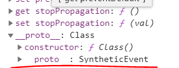
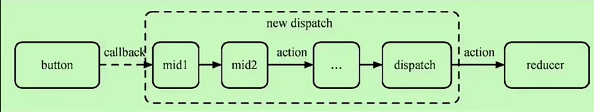

## 火速上手

### 变量与表达式

```js
import React, { PureComponent } from "react";

class BaseDemo extends React.Component {
  constructor(props) {
    super(props);
    this.state = {
      name: "Asher",
      flag: true,
      img: "https://seekinglight.cn/icon.png",
    };
  }
  render(h) {
    //一对大括号
    const elem = (
      <div>
        <h1>{this.state.name}</h1>
        </img>
        <h1>{this.state.flag === true ? "真" : "假"}</h1>
      </div>
    );
    return elem;
  }
}
export default BaseDemo;
```

### class 和 style

#### class

设置 class 的时候需要注意，要把 class 改为`className`,因为 class 在 js 中是保留字。

```js
import React, { PureComponent } from "react";
import "./style.css";

class BaseDemo extends React.Component {
  constructor(props) {
    super(props);
    this.state = {};
  }
  render(h) {
    const elem = (
      //class在js中是保留字
      <div>
        <h1 className="red">设置字体为红色</h1>
      </div>
    );
    return elem;
  }
}
export default BaseDemo;
```

如果想实现动态 class 也很简单，直接属性值套花括号。

#### style

```js
import React, { PureComponent } from "react";
import "./style.css";

class BaseDemo extends React.Component {
  constructor(props) {
    super(props);
    this.state = {};
  }
  render(h) {
    const styleData = {
      color: "blue",
    };
    const elem = (
      <div>
        <h1 style={styleData}>设置字体为蓝色</h1>
      </div>
    );
    return elem;
  }
}
export default BaseDemo;
```

### JSX 渲染 innerHTML

```js
import React, { PureComponent } from "react";
import "./style.css";

class BaseDemo extends React.Component {
  constructor(props) {
    super(props);
    this.state = {};
  }
  render(h) {
    const rawHtml = "<span>富文本内容<i>斜体</i><b>加粗</b></span>";
    const rawHtmlData = {
      __html: rawHtml,
    };
    const elem = (
      <div>
        <p dangerouslySetInnerHTML={rawHtmlData}></p>
      </div>
    );
    return elem;
  }
}
export default BaseDemo;
```

### 条件渲染

```js
import React, { PureComponent } from "react";
import "./style.css";

class BaseDemo extends React.Component {
  constructor(props) {
    super(props);
    this.state = {
      theme: "black",
    };
  }
  render(h) {
    const blackBtn = <button className="black">black</button>;
    const whiteBtn = <button className="white">white</button>;
    // if (this.state.theme === "black") {
    //   return blackBtn;
    // } else {
    //   return whiteBtn;
    // }
    return <div>{this.state.theme === "black" ? blackBtn : whiteBtn}</div>;
  }
}
export default BaseDemo;
```

### 循环渲染

```js
import React, { PureComponent } from "react";
import "./style.css";

class BaseDemo extends React.Component {
  constructor(props) {
    super(props);
    this.state = {
      theme: "black",
      list: [
        { id: "id-1", item: "item1" },
        { id: "id-2", item: "item2" },
        { id: "id-3", item: "item3" },
      ],
    };
  }
  render(h) {
    return (
      <div>
        {this.state.list.map((item, index) => {
          return (
            <div key={item.id}>
              index:{index};item:{item.item}
            </div>
          );
        })}
      </div>
    );
  }
}
export default BaseDemo;
```

### React 事件

在 react 的事件中，一定要在构造函数中将其绑定 this,因为默认事件中 this 的指向不是`组件实例`，而是`undefined`。

```js
import React, { PureComponent } from "react";
import "./style.css";

class BaseDemo extends React.Component {
  constructor(props) {
    super(props);
    this.state = {
      name: "张三",
    };
    //如果不绑定this那么方法中的this指向就会是undefined
    this.clickHandler1 = this.clickHandler1.bind(this);
  }
  render(h) {
    return <div onClick={this.clickHandler1}>{this.state.name}</div>;
  }
  clickHandler1() {
    this.setState({
      name: "法外狂徒",
    });
  }
}
export default BaseDemo;
```

如果觉得这样写看着不舒服的话也可以直接用静态方法，静态方法中的 this 永远指向组件实例。

```js
import React, { PureComponent } from "react";
import "./style.css";

class BaseDemo extends React.Component {
  //...
  clickHandler1 = () => {
    this.setState({
      name: "法外狂徒",
    });
  };
}
export default BaseDemo;
```

#### 传参

传参的时候 event 默认是追加在最后一个参数上

```js
import React, { PureComponent } from "react";
import "./style.css";

class BaseDemo extends React.Component {
  constructor(props) {
    super(props);
    this.state = {
      name: "张三",
    };
    //如果不绑定this那么方法中的this指向就会是undefined
  }
  render(h) {
    return (
      <div>
        <a
          href="https://www.baidu.com/"
          onClick={this.clickHandler1.bind(this, "jason", "18")}
        >
          {this.state.name}
        </a>
      </div>
    );
  }
  clickHandler1 = (name, age, event) => {
    event.preventDefault(); //阻止默认行为
    event.stopPropagation(); //阻止冒泡
    console.log(name); //jason
    console.log(age); //18
  };
}
export default BaseDemo;
```

#### React 事件与 Vue 中事件的区别

有一点需要注意，在 react 中的 event 并不和 vue 一样，是原生的 event，它是经过封装的。

我们可以打印 event 实例，能够看到它的原型是`SyntheticEvent`。


而其中的`nativeEvent`才是真正的原生事件对象。

```js
import React, { PureComponent } from "react";
import "./style.css";

class BaseDemo extends React.Component {
  //...
  clickHandler1 = (event) => {
    event.preventDefault(); //阻止默认行为
    event.stopPropagation(); //阻止冒泡
    console.log(event.nativeEvent); //MouseEvent{...}
    console.log(event.nativeEvent.target); //打印出了a标签
    console.log(event.nativeEvent.currentTarget); //document
  };
}
export default BaseDemo;
```

并且`Target`指向的是`reactDom.render`对应的 dom,这一点和 Vue 也不太一样。

也就是说，所有的事件，都在`document`上被触发.

::: tip

### 关于`target`与`currentTarget`

`currentTarget`指的是触发事件的 dom
`target`指的是生产事件的 dom
:::

经典的例子,ul 下面有一万个 li,使用事件委托.此时父元素上就要使用`e.target`来判断具体是那个 dom 生产了事件

### 表单

#### input

在 react 中没有类似`v-model`这样的双向数据绑定，要实现这种效果需要我们定义`onChange`事件来手动实现。

注意 label 标签中的`for`属性在 js 中是关键字，因此需要改个名。

`受控组件`:组件中的值受到`state`的控制的组件，常用于表单。

```js
import React from "react";

class FormDemo extends React.Component {
  constructor(props) {
    super(props);
    this.state = {
      name: "jason",
    };
  }
  render() {
    return (
      <div>
        <p>{this.state.name}</p>
        <label htmlFor="inputName">姓名：</label> {/* 用 htmlFor 代替 for */}
        <input
          id="inputName"
          value={this.state.name}
          onChange={this.onInputChange}
        />
      </div>
    );

  }
  onInputChange = (e) => {
    this.setState({
      name: e.target.value,
    });
  };

export default FormDemo;

```

#### textarea

```js
import React from "react";

class FormDemo extends React.Component {
  constructor(props) {
    super(props);
    this.state = {
      info: "information",
    };
  }
  render() {
    return (
      <div>
        <textarea value={this.state.info} onChange={this.onTextareaChange} />
        <p>{this.state.info}</p>
      </div>
    );
  }
  onInputChange = (e) => {
    this.setState({
      name: e.target.value,
    });
  };
  onTextareaChange = (e) => {
    this.setState({
      info: e.target.value,
    });
  };
}

export default FormDemo;
```

#### select

```js
import React from "react";

class FormDemo extends React.Component {
  constructor(props) {
    super(props);
    this.state = {
      city: "beijing",
    };
  }
  render() {
    return (
      <div>
        <select value={this.state.city} onChange={this.onSelectChange}>
          <option value="beijing">北京</option>
          <option value="shanghai">上海</option>
          <option value="shenzhen">深圳</option>
        </select>
        <p>{this.state.city}</p>
      </div>
    );
  }
  onSelectChange = (e) => {
    this.setState({
      city: e.target.value,
    });
  };
}

export default FormDemo;
```

#### checkBox

checkBox 中绑定的是`checked`属性。

```js
import React from "react";

class FormDemo extends React.Component {
  constructor(props) {
    super(props);
    this.state = {
      flag: true,
    };
  }
  render() {
    return (
      <div>
        <input
          type="checkbox"
          checked={this.state.flag}
          onChange={this.onCheckboxChange}
        />
        <p>{this.state.flag.toString()}</p>
      </div>
    );
  }
  onCheckboxChange = () => {
    this.setState({
      flag: !this.state.flag,
    });
  };
}

export default FormDemo;
```

#### radio

```js
import React from "react";

class FormDemo extends React.Component {
  constructor(props) {
    super(props);
    this.state = {
      gender: "male",
    };
  }
  render() {
    return (
      <div>
        male{" "}
        <input
          type="radio"
          name="gender"
          value="male"
          checked={this.state.gender === "male"}
          onChange={this.onRadioChange}
        />
        female <input
          type="radio"
          name="gender"
          value="female"
          checked={this.state.gender === "female"}
          onChange={this.onRadioChange}
        />
        <p>{this.state.gender}</p>
      </div>
    );
  }
  onRadioChange = (e) => {
    this.setState({
      gender: e.target.value,
    });
  };
}

export default FormDemo;
```

## 组件使用和生命周期

### 父组件向子组件通信

在使用的时候直接定义属性，然后在子组件内部通过`this.props.属性`来获取值。

> 父组件

```js
class TodoListDemo extends React.Component {
  constructor(props) {
    super(props);
    // 状态（数据）提升
    this.state = {
      list: [
        {
          id: "id-1",
          title: "标题1",
        },
        {
          id: "id-2",
          title: "标题2",
        },
        {
          id: "id-3",
          title: "标题3",
        },
      ],
      footerInfo: "底部文字",
    };
  }
  render() {
    return (
      <div>
        <List list={this.state.list} myprop="test" />
      </div>
    );
  }
}
```

> 子组件

```js
class List extends React.Component {
  constructor(props) {
    super(props);
  }
  render() {
    //通过解构赋值先将对象中的属性值取出来
    const { list } = this.props;
    return (
      <ul>
        {list.map((item, index) => {
          return (
            <li key={item.id}>
              <span>{item.title}</span>
            </li>
          );
        })}
      </ul>
    );
  }
}
```

### 子组件向父组件通信

在定义属性的时候，直接传一个函数过去，这样子组件在调用函数的时候，就可以顺便把参数给“带出来”。

> 父组件

```js
class TodoListDemo extends React.Component {
  constructor(props) {
    super(props);
    // 状态（数据）提升
    this.state = {
      list: [
        {
          id: "id-1",
          title: "标题1",
        },
        {
          id: "id-2",
          title: "标题2",
        },
        {
          id: "id-3",
          title: "标题3",
        },
      ],
      footerInfo: "底部文字",
    };
  }
  render() {
    return (
      <div>
        {/* 这里传一个函数过去 */}
        <Input submitTitle={this.onSubmitTitle} />
        <List list={this.state.list} />
      </div>
    );
  }
  onSubmitTitle = (title) => {
    this.setState({
      list: this.state.list.concat({
        id: `id-${Date.now()}`,
        title,
      }),
    });
  };
}
```

> 子组件

```js
class Input extends React.Component {
  constructor(props) {
    super(props);
    this.state = {
      title: "",
    };
  }
  render() {
    return (
      <div>
        <input value={this.state.title} onChange={this.onTitleChange} />
        <button onClick={this.onSubmit}>提交</button>
      </div>
    );
  }
  onTitleChange = (e) => {
    this.setState({
      title: e.target.value,
    });
  };
  onSubmit = () => {
    const { submitTitle } = this.props;
    //这样的话就能调用父组件的方法，参数也就能传出去了。
    submitTitle(this.state.title); // 'abc'

    this.setState({
      title: "",
    });
  };
}
```

### 兄弟间通信

利用父组件上的状态进行中转

### 组件生命周期(React15)

#### 挂载阶段

1. constructor()
2. componentWillMount()
3. render(): 执行 render 方法会将要渲染的内容返回出来，
4. componentDidMount()：此时真实的 dom 已经挂载到了页面上，这个阶段可以操作 dom。

#### 更新阶段

1. componentWillReceiveProps(): 父组件更新时，会调用这个方法。(即使 props 没有更改)
2. shouldComponentUpdate():组件更新前触发,可用来控制组件是否更新
3. componentWillUpdate()
4. render()
5. componentDidUpdate()

#### 卸载阶段

1. componentWillUnMount()

### React16 相较于 15 生命周期的变化

废弃掉了 render 阶段中三个带 will 的。

#### static getDerivedStateFromProps(props,state)

主要用来代替`componentWillReceiveProps`,可以将父组件上传来的属性映射到当前组件的`state`上。

那为什么要更改呢？

因为这个 api 更加语义化，它更专注于做着件事情。官方为了让它更加专注于这件事情，甚至将其更改为静态方法。原来的 api 也可以，但如果使用不当就会编写出副作用很强且不利于维护的代码。

#### getSnapshotBeforeUpdate(preProps,preState)

主要用来代替`componentWillUpdate`,顾名思义，获取更新前的快照。

它的返回值会作为第三个参数传递给`componentDidUpdate`。

### React 废弃原来生命周期的本质原因

这三个生命周期，对于 fiber 架构是一坨 shit，必须要干掉。

由于 fiber 架构要实现异步可中断，而中断恢复的操作只能在 commit 前进行(也就是 render 阶段)，如果不废掉，在 fiber 的场景下就会被重复执行。(如果是付款请求之类的，想想就要命)

## setState 使用注意点

### 不可变值

注意，如果要更改 state 中的值，**千万不能**直接对 state 中的值进行修改！至少要拷贝出一份然后更新上去。

这涉及到`shouldComponentUpdate`的一些原理，如果直接更改 state 中的值，那么`nextProps`或者`nextState`就也会发生变化，在视图层上也就不会更新成功。

#### 数组

如果 state 是数组，如果想偷懒的话可以用纯函数。

```js
// 不可变值（函数式编程，纯函数） - 数组
const list5Copy = this.state.list5.slice();
list5Copy.splice(2, 0, "a"); // 中间插入/删除
this.setState({
  list1: this.state.list1.concat(100), // 追加
  list2: [...this.state.list2, 100], // 追加
  list3: this.state.list3.slice(0, 3), // 截取
  list4: this.state.list4.filter((item) => item > 100), // 筛选
  list5: list5Copy, // 其他操作
});
// 注意，不能直接对 this.state.list 进行 push pop splice 等，这样违反不可变值
```

::: tip
结构运算符并不会影响原数组/对象。
:::

#### 对象

```js
// 不可变值 - 对象
this.setState({
  obj1: Object.assign({}, this.state.obj1, { a: 100 }),
  obj2: { ...this.state.obj2, a: 100 },
});
// 注意，不能直接对 this.state.obj 进行属性设置，这样违反不可变值
```

### 异步与同步

正常情况下是 setState 是异步的，只有在第二个参数的回调中才能拿到更新后的值。

```js
this.setState(
  {
    count: this.state.count + 1,
  },
  () => {
    // 联想 Vue $nextTick - DOM
    console.log("count by callback", this.state.count); // 回调函数中可以拿到最新的 state
  }
);
console.log("count", this.state.count); // 异步的，拿不到最新值
```

但是在**定时器**和**自定义事件**的回调中是同步的。

#### 定时器

```js
// setTimeout 中 setState 是同步的
setTimeout(() => {
  this.setState({
    count: this.state.count + 1,
  });
  console.log("count in setTimeout", this.state.count);
}, 0);
```

#### 自定义事件

```js
    bodyClickHandler = () => {
        this.setState({
            count: this.state.count + 1
        })
        console.log('count in body event', this.state.count)
    }
    componentDidMount() {
        // 自己定义的 DOM 事件，setState 是同步的
        document.body.addEventListener('click', this.bodyClickHandler)
    }
    componentWillUnmount() {
        // 及时销毁自定义 DOM 事件
        document.body.removeEventListener('click', this.bodyClickHandler)
        // clearTimeout
    }
```

::: warning
自定义事件与定时器要记得及时销毁。
:::

### setState 合并问题

#### setState 传入对象后面的会把前面的覆盖

```jsx
const fn1 = () => {
  this.setState({
    count: this.state.count + 1,
  });
  this.setState({
    count: this.state.count + 1,
  });
  this.setState({
    count: this.state.count + 3,
  });
};
```

执行时会发现每次都是+3

#### setState 传入 callback 不会被合并（解决异步问题）

所以最好传递函数，因为这样`react`就能够链式调用这些函数。

```jsx
const fn2 = () => {
  // 传入函数，不会被合并。执行结果是 +3
  this.setState((prevState, props) => {
    return {
      count: prevState.count + 1,
    };
  });
  this.setState((prevState, props) => {
    return {
      count: prevState.count + 1,
    };
  });
  this.setState((prevState, props) => {
    return {
      count: prevState.count + 1,
    };
  });
};
```

## 高级特性

### 异步组件

```js
import React from "react";

const ContextDemo = React.lazy(() => import("./ContextDemo"));

class App extends React.Component {
  constructor(props) {
    super(props);
  }
  render() {
    return (
      <div>
        <p>引入一个动态组件</p>
        <hr />
        <React.Suspense fallback={<div>Loading...</div>}>
          <ContextDemo />
        </React.Suspense>
      </div>
    );

    // 1. 强制刷新，可看到 loading （看不到就限制一下 chrome 网速）
    // 2. 看 network 的 js 加载
  }
}
export default App;
```

### 函数组件

其实就是“阉割版”的 class 组件，这种组件没有实例，没有生命周期，没有 state。

作用仅仅是把属性数据渲染上去,不过性能肯定比 class 组件要好。

```js
function Welcome(props) {
  return <h1>Hello, {props.name}</h1>;
}
```

### ref 与非受控组件

如果需要获取 dom 信息，可以在 jsx 上挂载 ref。
使用的时候需要在构造函数内部先创建一个 ref 引用,然后通过引用中 current 属性便可以获取到被挂载 dom 信息。

`非受控组件`:组件中的值不受到`state`的控制的组件，此时只能使用`ref`来获取表单中的数据。

使用场景：必须手动操作`dom`,setState 无法实现，比如文件上传，以及某些富文本编辑器，需要传入`dom`元素。

```js
class App extends React.Component {
  constructor(props) {
    super(props);
    this.state = {
      name: "jason",
      flag: true,
    };
    this.nameInputRef = React.createRef(); // 创建 ref
  }
  render() {
    // input defaultValue
    return (
      <div>
        {/* 使用 defaultValue 而不是 value ，使用 ref */}
        <input defaultValue={this.state.name} ref={this.nameInputRef} />
        {/* state 并不会随着改变 */}
        <span>state.name: {this.state.name}</span>
        <br />
        <button onClick={this.alertName}>alert name</button>
      </div>
    );
  }
  alertName = () => {
    const elem = this.nameInputRef.current; // 通过 ref 获取 DOM 节点
    alert(elem.value); // 不是 this.state.name
  };
}
```

#### 文件上传的例子

```js
import React from "react";

class App extends React.Component {
  constructor(props) {
    super(props);
    this.state = {
      name: "jason",
      flag: true,
    };
    this.fileInputRef = React.createRef();
  }
  render() {
    // file
    return (
      <div>
        <input type="file" ref={this.fileInputRef} />
        <button onClick={this.alertFile}>alert file</button>
      </div>
    );
  }
  alertFile = () => {
    //打印文件名
    const elem = this.fileInputRef.current;
    alert(elem.files[0].name);
  };
}

export default App;
```

### portals

类似于 Vue 中的插槽，可以指定渲染的位置。

```js
import React from "react";
import ReactDOM from "react-dom";
import "./style.css";

class App extends React.Component {
  constructor(props) {
    super(props);
    this.state = {};
  }
  render() {
    // 使用 Portals 渲染到 body 上。
    // fixed 元素要放在 body 上，有更好的浏览器兼容性。
    return ReactDOM.createPortal(
      <div className="modal">{this.props.children}</div>,
      document.body // DOM 节点
    );
  }
}
export default App;
```

### context

有的时候我们可能需要往层层嵌套的子组件中传递一些简单的数据(主题，语言)，这时候如果上一些状态管理的框架就有些小题大做了，React 为我们提供了 context 来解决这个纠结的问题。

首先要在外层定义 context。

```js
import React from "react";
// 创建 Context 填入默认值（任何一个 js 变量）
const ThemeContext = React.createContext("light");
```

父组件上要去生产数据。

```js
class App extends React.Component {
  constructor(props) {
    super(props);
    this.state = {
      theme: "light",
    };
  }
  render() {
    return (
      <ThemeContext.Provider value={this.state.theme}>
        <Toolbar />
        <hr />
        <button onClick={this.changeTheme}>change theme</button>
      </ThemeContext.Provider>
    );
  }
  changeTheme = () => {
    this.setState({
      theme: this.state.theme === "light" ? "dark" : "light",
    });
  };
}
```

此时，子组件中就可以来消费数据了。

子组件如果是函数组件的话需要返回一个`ThemeContext.Consumer`的 jsx，通过里面返回的函数参数便可以拿到外部的值。

```js
function ThemeLink(props) {
  // const theme = this.context // 会报错。函数式组件没有实例，即没有 this

  // 函数式组件可以使用 Consumer
  return (
    <ThemeContext.Consumer>
      {(value) => <p>link's theme is {value}</p>}
    </ThemeContext.Consumer>
  );
}
```

如果是 class 组件可以定义`contextType`静态属性。

```js
class ThemedButton extends React.Component {
  // 指定 contextType 读取当前的 theme context。
  static contextType = ThemeContext; // 也可以用 ThemedButton.contextType = ThemeContext
  render() {
    const theme = this.context; // React 会往上找到最近的 theme Provider，然后使用它的值。
    return (
      <div>
        <p>button's theme is {theme}</p>
      </div>
    );
  }
}
```

### shouldComponentUpdate 与性能优化

`shouldComponentUpdate`是 React 额外提供的一个生命周期，允许使用者手动控制组件是否渲染，默认返回 true。

也就是说，如果不定义 shouldComponentUpdate，即使内容不变，也会触发重新渲染。

```js
class Footer extends React.Component {
  constructor(props) {
    super(props);
  }
  render() {
    return <p>{this.props.text}</p>;
  }
  componentDidUpdate() {
    console.log("footer did update");
  }
  shouldComponentUpdate(nextProps, nextState) {
    if (nextProps.text !== this.props.text) {
      return true; // 可以渲染
    }
    return false; // 不重复渲染
  }
```

### 自带 shouldComponentUpdate 的组件

class 组件中可以继承`React.PureComponent`,这样的话如果 state 或者 props 中相同的部分就不会去触发渲染(当然是在数据结构扁平化的前提下)。

函数组件则是将整个组件作为参数传入到`React.memo()`中。

```js
const MyComponent = React.memo(function MyComponent(props) {
  /* 使用 props 渲染 */
});
```

### HOC 编写指南

HOC 即是“高阶组件”，这不是一个 API，它是一种类似于工厂模式的设计模式，只不过输入的“原材料”是组件，输出的“产品”也是组件。

组件的主要任务是把 props 或者 state 渲染成 UI，而高阶组件的主要任务是把一个组件加工成另一个组件。

高阶组件的主要作用就是复用组件间的公共逻辑，下面是一个 HOC 的基本框架。

```js
const HOCFactory = (Component) => {
  class Hoc extends React.Component {
    //在这里边可以把公共逻辑写进去
    render() {
      //这里需要将属性透传到组件内部
      return <Component {...this.props} />;
    }
  }
  return Hoc;
};
```

简单的例子:为一个组件添加显示鼠标位置的 HOC。

```js
import React from "react";

// 高阶组件
const withMouse = (Component) => {
  class withMouseComponent extends React.Component {
    constructor(props) {
      super(props);
      this.state = { x: 0, y: 0 };
    }

    handleMouseMove = (event) => {
      this.setState({
        x: event.clientX,
        y: event.clientY,
      });
    };

    render() {
      return (
        <div style={{ height: "500px" }} onMouseMove={this.handleMouseMove}>
          {/* 1. 透传所有 props 2. 增加 mouse 属性 */}
          <Component {...this.props} mouse={this.state} />
        </div>
      );
    }
  }
  return withMouseComponent;
};

const App = (props) => {
  const a = props.a;
  const { x, y } = props.mouse; // 接收 mouse 属性
  return (
    <div style={{ height: "500px" }}>
      <h1>
        The mouse position is ({x}, {y})
      </h1>
      <p>{a}</p>
    </div>
  );
};

export default withMouse(App); // 返回高阶函数
```

### HOC 缺点

组件层级嵌套,调试起来麻烦.而且容易忘了去透传 props

### Render props

Render Props 和 HOC 的目的一样，也是为了实现代码复用。

具有 render prop 的组件可以在自己 UI 的基础上再去自定义 UI，这样就能够实现组件逻辑复用。

```jsx
function App(props) {
  return (
    <div>
      <p>{props.a}</p>
      <Mouse
        render={
          /* render 是一个函数组件 */
          ({ x, y }) => (
            <h1>
              The mouse position is ({x}, {y})
            </h1>
          )
        }
      />
    </div>
  );
}

export default App;
```

在这个例子里，组件 App 的渲染函数中插入了带有渲染属性的 Mouse 组件
因此只要在 Mouse 组件中将显示鼠标位置的逻辑定义好，组件 App 就拥有了“实时显示鼠标位置”的能力。

具体怎么渲染上去，完全可以自己来进行定义。

> Mouse 组件的实现。

```js
class Mouse extends React.Component {
  constructor(props) {
    super(props);
    this.state = { x: 0, y: 0 };
  }

  handleMouseMove = (event) => {
    this.setState({
      x: event.clientX,
      y: event.clientY,
    });
  };

  render() {
    return (
      <div style={{ height: "500px" }} onMouseMove={this.handleMouseMove}>
        {/* 将当前 state 作为 props ，传递给 render （render 是一个函数组件） */}
        {this.props.render(this.state)}
      </div>
    );
  }
}
Mouse.propTypes = {
  render: PropTypes.func.isRequired, // 必须接收一个 render 属性，而且是函数
};
```

## Redux

### 单向数据流

1. dispatch(action)
2. reducer => newState
3. subscribe 触发通知

### Provider 和 connect

Provider 是`react-redux`中的一个组件，它可以给包裹的组件赋予 store 的能力。

connect 是一个 HOC,它可以将 state 和 dispatch 注入到每一个组建中，使其具有消费的能力。

### 异步 action

需要异步操作的话，可以引入一个 redux-thunk 中间件，dispatch 的 action 不是一个对象，而是一个函数，在这个函数的参数上可以获取 state 和 dispatch。

### 中间件原理

其实就是对 dispatch 进行了改造。

下面是一个 logger 中间件的大致原理。

```js
const originDispatch = store.dispatch;
store.dispatch = function(action) {
  console.log("action", action);
  originDispatch(action);
  console.log("next state", store.getState());
};
```



## react-router 配置懒加载

```jsx
import { BrowserRouter, Route, Switch } from "react-router-dom";
import React, { Suspense, lazy } from "react";

const Home = lazy(() => import("./routers/Home"));
const About = lazy(() => import("./routers/About"));

const App = () => {
  return (
    <Router>
      <Suspense fallback={<div>Loading...</div>}>
        <Switch>
          <BrowserRouter path="/" component={Home}></BrowserRouter>
          <BrowserRouter path="about" component={About}></BrowserRouter>
        </Switch>
      </Suspense>
    </Router>
  );
};

export default App;
```

## react 原理

### 函数式编程

函数式编程是一种“编程范式”，其在`react`中最大的体现就是“不可变值”和“函数是一等公民”。

> 不可变值在 redux 中的体现

```js
const todos = (state = [], action) => {
  switch (action.type) {
    // 创建一个 todo
    case "ADD_TODO":
      // 注意，返回不可变数据
      return [
        ...state,
        {
          id: action.id,
          text: action.text, // title
          completed: false,
        },
      ];

    // 切换一个 todo 的完成状态
    case "TOGGLE_TODO":
      // 注意，返回不可变数据
      return state.map((todo) =>
        todo.id === action.id
          ? { ...todo, completed: !todo.completed } // 切换完成状态
          : todo
      );
    default:
      return state;
  }
};

export default todos;
```

### vdom

在 react 中的 vdom 主要是利用`createElement()`来创建，其原理类似与`h函数`,需要接受`tagName`,`props`,`children`三个参数。

### 合成事件

React 为了磨平 IE 和Ｗ 3C 标准的兼容问题以及更好的跨平台，自己“包装”了一套合成事件的机制。


在 Dom 层的事件监听器上，react 将所有的事件都代理到了 document 上，当点击事件时，让事件会自己冒泡上去。

在合成事件层，会把这些所有的事件统一处理成合成事件，然后会根据`event.nativeEvent.target`来判断是谁触发了事件，最后进行派发处理事件。

好处：事件代理，性能优化，都挂到 document 上方便统一处理和销毁，同时方便事件的统一管理（事物机制）。

### setState 流程 和 batchUpdate


在 setState 时，会把新的状态存到 pending 队列中去，然后判断当前的组件*是否处于批量更新的状态*，是的话会将当前的组件放到`dirtyComponent`中，不是的话会遍历所有的`dirtyComponent`，然后去更新组件的`State`或`props`。

而判断是否处于批量更新的状态，主要是依靠一个`isBatchingUpdate`的`flag`。在调用事件函数之前，这个 flag 为`true`,调用 之后，flag 为`flase`。在结合一些“宏任务”的异步特性，就会使得宏任务中的`setState`之前的`flag`状态为`flase`（因为事件中的同步代码已经跑完了）。因此定时器里的内容不会被批量更新。

因此决定 setState 是异步还是同步，取决于是否能够命中“批量更新”的机制，所有的**宏任务**都没办法命中这个机制。

### 事务机制

> “事务”这个词最开始是在数据库中见到，意思是按照一定逻辑顺序执行的任务队列，具有不可分割性。一旦操作失败，就会回滚到操作前的状态。

```js
/**
 * <pre>
 *                    TRANSACTION_WRAPPERS (ExecutionEnvironment.canUseDOM 为 true 的情况)
 *                                       +                +     +
 *                                       |                |     |
 *                     +-----------------|----------------|-----|-------------------+
 *                     |                 v                |     |                   |
 *                     |      +-----------------------+   |     |                   |
 *                     |   +--| SELECTION_RESTORATION |---|-----|---+               |
 *                     |   |  +-----------------------+   v     |   |               |
 *                     |   |             +-------------------+  |   |               |
 *                     |   |     +-------| EVENT_SUPPRESSION |--|---|-----+         |
 *                     |   |     |       +-------------------+  v   |     |         |
 *                     |   |     |        +-----------------------+ |     |         |
 *                     |   |     |     +--| ON_DOM_READY_QUEUEING |-|-----|-----+   |
 *                     |   |     |     |  +-----------------------+ |     |     |   |
 *                     |   |     |     |                            |     |     |   |
 * perform(_mount      |   v     v     v                            v     v     v   | wrapper
 *         Component   | +---+ +---+ +---+   +----------------+   +---+ +---+ +---+ | invariants
 *         IntoNode)   | |   | |   | |   |   |                |   |   | |   | |   | | maintained
 * +------------------>|-|---|-|---|-|---|-->|     _mount     |---|---|-|---|-|---|-|-------->
 *                     | |   | |   | |   |   |    Component   |   |   | |   | |   | |
 *                     | |   | |   | |   |   |    IntoNode    |   |   | |   | |   | |
 *                     | |   | |   | |   |   |                |   |   | |   | |   | |
 *                     | +---+ +---+ +---+   +----------------+   +---+ +---+ +---+ |
 *                     |     initialize                                 close       |
 *                     +------------------------------------------------------------+
```

这段注释来源于源码，在执行任何方法之前，都会注入一个"wrapper",执行相应的逻辑。`isBatchingUpdate`这个 flag 也是在这个时候注入的。

### 组件渲染更新过程

当用户调用`render`方法后，此时就会进入`render`阶段。

在`render`的时候，会对所以的 fiber 进行 dfs，在递进去的时候会执行`beginWork(current,workInProcess)`,在归出来的时候执行`completeWork`。

在`beginWork`的时候，会根据参数`current`是否为空来判断是注册还是更新。

#### mount

注册阶段很简单，会根据`workInProcess`上的`tag`属性创建出对应的 fiber 节点。

#### update

1. 首先上来会根据前后的属性和 type 判断能否复用，如果不能复用会调用`reconcileChildFibers`进行**diff**，最终会返回带上`effectTag`的`Fiber`节点。
2. 如果能复用的话会根据优先级判断是否需要更新，如果更新的话就直接拷贝一份。

当`beginWork`执行完毕后，页面上就会存在许多打上“tag”的 fiber，在归出来的时候，并且执行`completeWork`的时候，会将所有存在`effectTag`的`fiber`存到`effectList`这个单向链表里，在`commit`阶段会遍历`effectList`并去执行所有的`effect`。

## 对 React 和 Vue 的理解

### 相同点

组件化、数据驱动视图、vdom

### 不同点

1. 函数式编程/声明式编程
2. 灵活/api 多

## diff 算法核心

### 根据 key 和 type 来判断是否是相同的 vnode。

::: tip
如果用 index 做 key 的话,假如要在头部插入一个 item,你会发现前面的数据根本没有发生变化,因为他们根据 index 复用了之前的 node,这肯定是不行的
:::

### 如果不同：则直接将 newVnode 删掉重建，不管底下有没有相同结点。

### 如果相同：则需要根据`dom`和`组件`来进行判断。

- dom: 直接更新差异属性
- 组件：继续递归比较子组件，递归到 dom 为止。

## Hooks

### 为什么不能在条件和循环中使用 hooks?

可以举一个具体的例子，比如`useState`的实现。

当一个组件中使用了多个 state，每次初始化时都会有一个索引记录当前 state 所对应的位置。

如果写在 if 条件中，那么在下一次渲染的时候可能不执行(假设为 false),那么索引对应的 state 就全乱了。

包括其他的 hook,全都按照一个严格的顺序的一一对应.

### 使用 useEffect 模拟生命周期

#### componentDidMount

使用`useEffect,依赖为空数组`.

#### componentDidUpdate

使用`useEffect,并添加依赖`

#### componentWillUnMount

使用 `useEffect,依赖为空数组,并return销毁逻辑`

::: warning
useEffect 中 return 的`fn`并不完全等于 `ComponentWillUnMount`,只有当依赖为空数组才是。

如果无依赖或依赖了变化的状态,那么在组件更新时仍然会执行 `fn`

换句话说,当依赖为空时,不会触发更新逻辑,也就无法恢复 state 中之前的状态!

在下面的例子中,你会发现控制台打印的永远都是 0,因为 useEffect 中触发的是注册时的逻辑

而首次更新时 count 的值由于受到初始值影响还是 0.
:::

```tsx
function App() {
  const [count, setCount] = useState(0);

  useEffect(() => {
    const timer = setInterval(() => {
      console.log("the count is:", count);
      setCount(count + 1);
    }, 1000);

    return () => {
      clearInterval(timer);
    };
  }, []);

  return <div>{count}</div>;
}
```

::: warning
当无依赖时，会同时命中`componentDidMount`和`componentDidUpdate`。
:::

### useReducer

用于管理单组件内的状态,要实现全局的状态管理还要靠 redux

```tsx
import React, { useEffect, useLayoutEffect, useReducer, useState } from "react";
import logo from "./logo.svg";
import "./App.css";

const initState = { count: 0 };

const reducer = (
  state: { count: number },
  action: { type: "increment" | "decrement" }
) => {
  switch (action.type) {
    case "increment":
      return { count: state.count + 1 };
    case "decrement":
      return { count: state.count - 1 };
    default:
      return state;
  }
};

function App() {
  const [state, dispatch] = useReducer(reducer, initState);

  return (
    <div>
      count:{state.count};
      <button
        onClick={() => {
          dispatch({ type: "increment" });
        }}
      >
        增加
      </button>
      <button
        onClick={() => {
          dispatch({ type: "decrement" });
        }}
      >
        减少
      </button>
    </div>
  );
}

export default App;
```

### hook 中的注意点

#### state 初始化传递问题

::: warning
子组件中的 state 在组件被更新时,并不会因为初始化值的变化而变化,这点一定要注意!
:::

```tsx
import React, { useEffect, useLayoutEffect, useReducer, useState } from "react";
import logo from "./logo.svg";
import "./App.css";

// @ts-ignore
const Child = ({ userInfo }) => {
  const [name, setName] = useState(userInfo.name);

  return (
    <div>
      <p>Child,props name:{userInfo.name}</p>
      <p>Child,state name:{name}</p>
    </div>
  );
};

function App() {
  const [name, setName] = useState("jason");

  const userInfo = { name };

  return (
    <div>
      Parent
      <button onClick={() => setName("SeekingLight")}>Change name</button>
      <Child userInfo={userInfo}></Child>
    </div>
  );
}

export default App;
```

#### 依赖比较的内部逻辑

useEffect 中的依赖比较的是"值"的变化.

这也就意味着尽量不要把引用作为依赖,否则很容易引起`useEffect`的死循环.

#### useRef 的更改是同步的

利用这个特性,我们可以同步化 setState 以及解决上面遇到的问题.

```tsx
function App() {
  const [count, setCount] = useState(0);
  const countRef = useRef(0);

  useEffect(() => {
    const timer = setInterval(() => {
      setCount(++countRef.current);
      console.log("the count is:", countRef.current);
    }, 1000);

    return () => {
      clearInterval(timer);
    };
  }, []);

  return <div>{count}</div>;
}
```

### 为什么要用 hooks?

1. 更方便进行组件逻辑复用
2. 函数更符合 React 的设计 View = f(props)
3. class 组件的一些弊端:逻辑复用要写 HOC,有的逻辑要写两边(ajax 请求等)

### 虚拟 dom 一定比直接操作慢吗?

分场景. 如果是首次渲染或者微量操作 dom,那肯定是比 vdom 快的

### 虚拟 dom 缺点

- 占内存
- 优化麻烦
