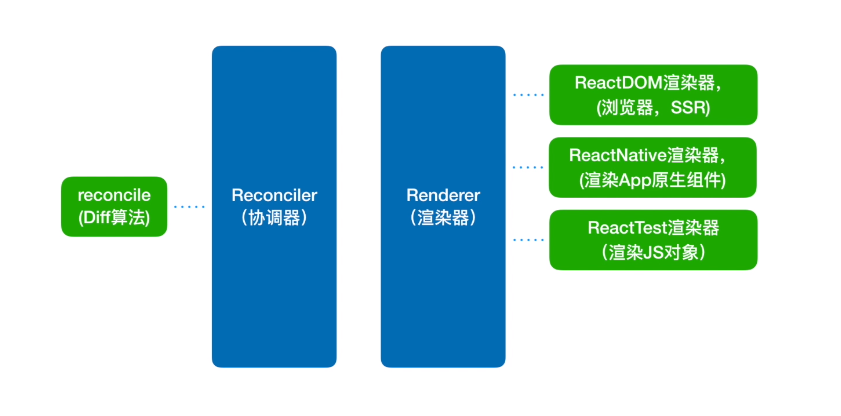

## 代数效应

代数效应是 FP 中的理念,算是一种处理 side effect 的一种机制吧.

假如有一种叫`try...handle`的语法,(可以理解为是一个不报错的`try...catch`),执行完 hanle 之后仍然会回到之前的状态,于是就能够实现`中断-恢复`这一重要机制.

假如说 es2025 能有个这语法,他们实现`异步可中断的更新`应该会容易许多.

## 为啥不用`generate`实现异步可中断?

优先级.因为 generate 只能实现中断,不能实现优先级.

## 老的 React 架构



只有协调器和渲染器

协调器管 diff,渲染器进行渲染,并且不支持**异步可中断的更新**.

以前的协调器也叫 stack reconciler
16 以后的协调器叫 fiber reconciler

## JSX

JSX 是 `React.createElement`的语法糖.

它接收三个参数,并且返回一个名为 ReactElement 的新函数作为返回值,该函数返回一个包含组件数据的对象

```ts
function createElement(type, config, children) {
  //...
  return ReactElement(
    type,
    key,
    ref,
    self,
    source,
    ReactCurrentOwner.current,
    props
  );
}
```

- 第一个参数为 type, type 为原生 html 节点字符串或者 Component (Component 有可能为 classComponent,也有可能为 functionComponent)

- 第二个参数为节点上的属性,第三个参数为 jsx 上的子元素

当调用完`React.createElement`之后,此次就有了组件的内容和结构,这为接下来创建 fiber 做了铺垫.

## render 阶段

### 挂载阶段

会对 上面的 jsx 对象 上的每一个节点进行 dfs,也就是说每一个节点都会执行 beiginWork 和 completeWork

在递进去的时候会执行 beginWork
在归出来的时候会执行 completeWork,最终会返回 一颗完整的 workInprogress fiber.

### 更新阶段

更新时 current 已经存在了,考虑到性能，如果我们要生成一颗新的 workInprogress fiber,最好的做法是**尽量复用**之前的 current fiber，而不是每次都去重新 dfs 我们要生成的 jsx。那怎么才能做到尽量复用呢？关键就是要看我们如何去找出**差异的地方**。

这里的“找差异”，就是所谓的 diff 算法，下文中会对 react 的 diff 算法做详细的介绍。

当 diff 走完以后，就会对要操作的 dom 打上 tag,这些 tag 会串成一根双向链表,然后放到 commit 阶段统一处理。

### 更新阶段中 diff 算法

在 render 阶段,会执行`reconcileChildFibers`,这个方法会把 jsx 对象和当前的 fiber(current fiber)进行比对,在内存中生成一个 vdom(React 中叫 workInProgress Fiber).

#### React 中 diff 算法的剪枝策略:

1. 只对同级元素进行 diff,如果一个 dom 在更新的过程中跨了层级,React 不会去尝试复用这个 dom.
2. tag 和 key 不同,则直接销毁.

### 单一节点的 diff

单节点的 diff 逻辑很简单,就是比较前后的 key 和 tagName,完全相同才复用.

### 多节点的 diff

多节点的要处理的情况有点多,总共需要遍历两轮,第一轮处理更新,第二轮处理增删和位置变化.

#### 第一轮遍历

遍历比较 jsx 里的`newChildren`和`oldFiber`.遍历会走接下来的逻辑

- 只要 key 不同,就会跳出当前遍历
- 如果 type 不同,会在这步先给 oldFiber 打上`DELETION`的标记,然后创建一个新的 fiber,并打上`Placement`

`oldFiber`和`newChildren`中只要有一个遍历完,就会跳出当前循环

#### 第二轮遍历

对于第一轮遍历,会产生四种结果.

第一轮遍历结束后,会会产生四种结果.

1. newChildren 和 oldFiber 都遍历完

说明他们一样长,此时不需要处理,第一轮就已经更新好了

2. 只有 newChildren 没跑完

此时说明有新节点,接下来只需要遍历新节点并给他们打上`Placement`标记

3. 只有 oldFiber 没跑完

此时说明删节点了,只需要遍历 oldFiber 并给他们打上`DELETION`标记

4. 这俩都没遍历完

想想什么情况下这俩都没遍历完呢?没错,就是上面由于 key 不同导致跳出的循环!
此时说明节点位置发生了变化.

那如何处理移动的节点呢?

首先,先将所有没处理的`oldFiber`存到一个 map 中,key 为`oldFiber`中的 key,value 为`oldFiber`自身

接下来**一边遍历 newChildren,一边往 oldFiber 上打 tag**,同时用一个变量来存储**上一次复用节点的位置**(lastPlacedIndex)

在接下来的过程中,如果 newChildren 中所对应的`oldIndex>=lastPlacedIndex`,就通过 map,给旧的 fiber 上打上"复用"的标记

否则就移动 oldFiber 中对应的节点.

(说人话就是我们需要看当前遍历对象已经存在的索引位置是不是比上次 fiber 中的索引位置小,如果小的话就往右边挪)

### 拓展: vue3 中的 diff 算法

vue3 中的 diff 算法和 react 在处理单节点 diff 的思路一模一样，都是根据 key 和 tagname 进行判断。

不同的是 vue 在处理多节点 diff 时用了一些很有趣的思路，这和 react 是完全不同的。

首先 vue 会先用"双端比较"，处理头尾的节点，vue2 也是用的该思路。

对于中间的部分，在 vue3 中用了一个非常聪明的小算法。

假设现在处理后的新旧节点如下所示。

```ts
// null 是经过双端比较已经处理过的元素
const oldChildren = [null,null,"c","d","e","f",null]
//                    0    1    2   3   4   5   6
const newChildren = [null,null,"f","c","d","e","h",null]


function getOriPosition(oldChildren,newChildren){
  // ...
  return [......]
}

```

首先获取 newChildren 中每一个元素**原来**的位置。

当我们调用完 `getOriPosition()`后，会得到 [5,2,3,4,-1] 这份原来的位置信息。

```ts
const oriPosition = getOriPosition(oldChildren, newChildren);

console.log(oriPosition);

// [5,2,3,4,-1]
// 由于h是新增的节点，所以我们找不到其原来的位置信息。
```

接下来，我们要找出`oriPosition`中的[最长递增子序列](https://leetcode-cn.com/problems/longest-increasing-subsequence/)。

得到 [2,3,4]。

至此，我们的任务就完成了，因为[2,3,4]所对应的[c,d,e]正是**能复用的最长部分**。接下来我们只需要把`f`挪到这部分的最前面，并且在这部分的最后新增一个`h`，diff 完成。

## commit 阶段

### before mutation

执行`commitBeforeMutationEffect`.
这个函数主要做了两件事.

1. 获取当前的 dom 快照
2. 根据优先级调度副作用

### mutation

遍历 effectlist,依次执行`commitMutationEffects`,在遍历的过程中会根据`EffectTag`的类型来调用不同的函数处理 fiber

::: tip
在这两个阶段之间,root.current 会暂时指向 finishedWork.
:::

### layout

会再次遍历 effectlist,并依次执行`commitMutationEffects`,该方法依然会根据`EffectTag`类型来处理 fiber,并最终更新 ref.
