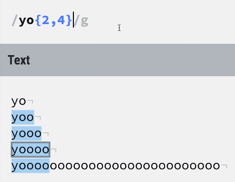

## 匹配任意字符

`/王../g`
会匹配出第一个字是王，并且是三个字的字符

> . 是一个占位符，意为匹配任意一个字符。

::: tip
如果要在字符串中匹配“真的.”可以在 "."的前面加上一个反斜杠
:::

## 匹配字母数字和下划线

`/\w2/g`
会匹配出`abcde12345__`中的`12`

> \w 是一个占位符，意为匹配任意的字符，数字，下划线
>
> ::: tip
> \W 意为匹配除了字符，数字，下划线之外的所有东西
> :::

## 匹配所有的数字

`/\d2\d4/g`
会匹配出`abcde12345__`的`1234`

> \d 意为匹配所有的数字

## 匹配所有的空格

`/s`

会匹配出字符串中的空格，断行和制表符

## 匹配字符集合

`/[ace2]/g`
会匹配出`abcde12345__aaccee`中所有的“a”，“c”，“e”，“2”。

> [] 会匹配括号内的任意一个字符

## +匹配重复一次或多次的字符

`/jasonle+/`
会匹配全部的`jasonleeeeeeeeeeeeee`。

## \*匹配重复零次或多次的字符

`/jason[led]*/g`
会匹配全部的`jasonllllllleeeeeeeeeeeeee`

## ?匹配出现 1 次或 0 次的字符

`/jasonf?[led]*/g`
会匹配全部的`jasonfllllllleeeeeeeeeeeeee`

## {}长度范围限定

<!--  -->


`/yo{2,4}/g`会匹配出字母 o 最后出现 2 次到 4 次的情况。

### 6 位邮政编码

```js
let reg = /^\d{6}$/;
let res = reg.test('13456');
console.log(res); //false
```

## 边界符

- `^`
  匹配以谁为开始。
  ::: warning
  如果这个符号写到了中括号里面代表的意思是范围取反。
  :::
- `&`
  匹配以谁为结束。
  ::: warning
  如果匹配规则是`/^abc$/`,那么只能匹配`abc`为`true`,其余的(`abcabc`)都为 false。
  <hide txt="实话实说，我也没想明白。。。"></hide>
  :::

---

## JS 中的正则表达式

### 创建一个正则对象

```js
let reg = new RegExp(/李../);
```

或者

```js
let reg = /李../;
```

- `test()`方法
  用来判断一个一个正则规则能否在指定字符串中匹配到字符

```js
//加上开头结尾意为必须全部满足规则
let reg = /李../;
let str = '李小明';
console.log(reg.test(str)); //true
str = '王小明';
console.log(reg.test(str)); //false
```

## 很常见的正则练习

> 建议先自己先写下试试哦

### 设定一个规则，以字母开头，后面数字字母下划线，长度 6-30

```js
let reg = /^[a-zA-Z]\w{5,29}$/;
let str = 'a690163223';
console.log(reg.test(str));
```

### 匹配日期

```js
let reg = /^\d{4}-\d{1,2}-\d{1,2}$/;
let res = reg.test('2020-1-1');
console.log(res); //true
```

### 简单 IP 地址匹配

```js
let reg = /\d+\.\d+\.\d+\.\d+/;
console.log(reg.test('192.168.0.1')); //true
```

### 将字符串中所有的小 b 换成大 B

```js
let str = 'aaaaaaaaaaaaabaaaaaaaaaab';
let res = str.replace(/b/g, 'B');
console.log(res);
//aaaaaaaaaaaaaBaaaaaaaaaaB
```

### 手写字符串`trim()`方法保证浏览器的兼容性

```js
//先去掉开头的空格，再去掉结尾的空格
String.prototype.trim = function() {
  return this.replace(/^\s+/, '').replace(/\s+$/, '');
};
let a = '  abc  ';
console.log(a.trim()); //abc
```

## 利用捕获分组和 replace 方法实现模板引擎

replace 方法中的第二个参数可以是一个 function
function 内的第一个参数可以取到每一次匹配到的原始内容
第二个参数可以匹配到分组中捕获到的内容

```js
const data = {
  name: 'jason',
  age: '18',
};

const tpl = 'my name is {{name}}, age is {{age}}';

// 要求最后输出
// "my name is jason, age is 18";

// 匹配两个大括号中间的东西

// 1.变量不能以数字开头
// 2.第二个变量可以是数字

const reg = /{{([a-zA-Z_$]\w*)}}/g;

const res = tpl.replace(reg, (row, key) => {
  return data[key];
});

console.log(res);
// my name is jason, age is 18
```

### 练习 II

```js
const obj = {
  num: 123,
  text: '456',
};
const str = `a{obj.num}aa{obj.text}`;

const reg = /\{([a-zA-Z\.0-9$_]*)\}/g;

const res = str.replace(reg, (row, group) => {
  const key = group.split('.')[1];
  return obj[key];
});

console.log(res);
```
