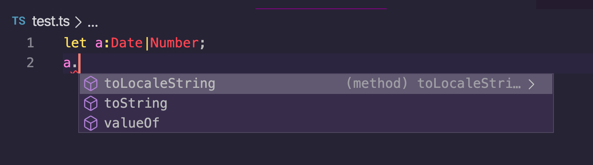
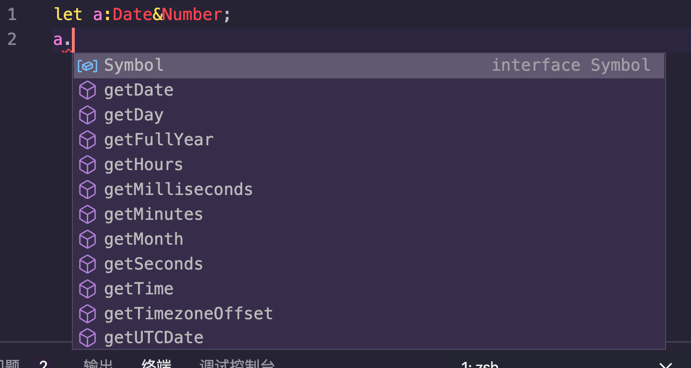

## 安装与编译

### 安装

```shell
npm i -g typescript
```

工具的话当然是巨硬家搭配的 VScode 啦~~

### 编译

> hello.ts

```ts
const hello = (name: string) => {
  return `hello ${name}`
}

const res = hello("SeekingLight")
```

此时在终端输入`tsc hello.ts`便可以将其编译成 js 文件。

如果想实现编译并且运行可以去 down 下`ts-node`这个 npm 包

## 类型系统

在声明变量时可以在后面用引号为其标注类型。

### 基础类型

```ts
//基本类型
let isDone: boolean = false

let age: number = 20
let binNum: number = 0b1011 //二进制字符串

let firstName: string = "Jason"
//es6中的模板字符串也是支持的
let message: string = `hello,${firstName},age is ${age}`

//undefined和null
let u: undefined = undefined
let n: null = null

//undefined和null是所有类型的子类型
let num: number = undefined
let num1: string = null
```

### 交叉类型

交叉类型可以使得一个类型变量同时拥有多个属性，逻辑上是并，不是交。

```ts
type NativeButtonProps = BaseButtonProps &
  React.ButtonHTMLAttributes<HTMLElement>
type AnchorButtonProps = BaseButtonProps &
  React.AnchorHTMLAttributes<HTMLElement>

export type ButtonProps = Partial<NativeButtonProps & AnchorButtonProps>
```

### 联合类型与 any 类型

联合类型与 any 类型可以允许我们为一个值变量赋不同类型的值。

```ts
//any类型允许你用任何类型的变量为其赋值
let notSure: any = 4
notSure = "4"
notSure = true
notSure.name = "jason"
//联合类型
let numberOrString: number | string = 234
numberOrString = "234"
```

::: warning
联合类型与交叉类型在取变量上的**属性**时非常容易搞混

如果是联合类型`|`那么在取属性时只能取到“相交的属性”。
如下图


反之如果是交叉类型`&`在取属性时取到的是“相并的属性”,个人感觉这点设计的非常奇怪。

:::

### Array 和 Tuple

ts 中的 Array 可以具体的为其制定元素类型。

```ts
//数组
let arr: Array<number>
let arr_num: number[] = [1, 2, 3, 4] //简写
arr_num.push(5)

let arr_num: Array<number> = [1, 2, 3, 4] //等同,后面会提及到泛型
```

元组可以理解为合并了不同类型的一种数组,可以具体到为每一个元素规定不同的类型。(定长数组)

```ts
//元组
let user: [string, number, string] = ["jason", 20, "你好"]
```

### Enum

Enum 类型可以允许用户去定义**一组**常量。

#### 数字枚举

```ts
enum Direction {
  Up = 10,
  Down,
  Left,
  Right,
}

console.log(Direction.Up) //10
console.log(Direction[11]) //反向映射

enum Gender {
  male,
  female,
  other,
}

//usage
let sex: Gender = Gender.male
```

#### 字符串枚举

```ts
enum Direction {
  Up = "go up!",
  Down = "go down!",
  Left = "go left",
  Right = "go right",
}

console.log(Direction.Up) //go up!
```

使用常量枚举可以提高性能。

```ts
const enum Direction {
  Up = "go up!",
  Down = "go down!",
  Left = "go left",
  Right = "go right",
}

console.log(Direction.Up) //10
```

### 字面类型

在 ts 中，字面量也可以作为类型来定义。

```ts
let Type: "video" | "audio"
let sex: "male" | "female" | true | 1

Type = "video"
sex = false //报错
```

### 类型别名

有时候一些类型在定义的时候写起来很麻烦(像函数类型)，这时候我们可以通过给这些类型起别名来简化代码量。

```ts
type PlusType = (x: number, y: number) => number
function sum(x: number, y: number) {
  return x + y
}
const sum2: PlusType = sum

type NameResolver = () => string
type NameOrResolver = string | NameResolver
function getName(n: NameOrResolver): string {
  if (typeof n === "string") {
    return n
  } else {
    //传入的参数为函数，直接执行
    return n()
  }
}
```

### 类型推断

当你声明变量后直接为变量赋值，便会自动触发 ts 的类型推断系统。

```ts
let str = "string"
str = 1 //报错
```

> 函数表达式也能进行推断

```ts
//函数表达式
const multiply = function(x: number, y: number, z?: number): number {
  if (typeof z === "number") {
    return x * y * z
  } else {
    return x * y
  }
}

const multi2: (x: number, y: number, z?: number) => number = multiply
```

::: warning
其实多些几行也没啥坏处，还是尽量不要用类型推测了。
:::

### 类型声明

使用 type 关键字可以手动定义类型

```ts
//定义User类型
type User = {
  name: String
  age?: number
}

let user: User
user = {
  name: "jason",
  age: 18,
}
//定义url类型
type url = {
  host: string
  port: number
  path: string
}

let a: url
a = "www.pronhub.com" //报错
```

### 类型断言

下面的代码为一个测试用例，我们可以使用`as`关键字手动为其设置类型断言。

```ts
it("应该渲染不可选按钮", () => {
  const wrapper = render(<Button {...disabledProps}>button</Button>)
  const element = wrapper.getByText("button") as HTMLButtonElement //手动设置断言
  expect(element).toBeInTheDocument()
  expect(element.disabled).toBeTruthy()
})
```

### 类型守卫函数

有时候函数的输入类型是不确定的，这时候直接传进去编译会报错，此时可以通过引入类型守卫函数进行判断

```ts
type User = {
  name: String
  age: number
}

function showUser(user: User) {
  alert(user.name)
  alert(user.age)
}

//类型守卫函数
function isUser(arg: any): arg is User {
  if (!arg) return false
  else {
    if (typeof arg.name === "string" && arg.name === "number") {
      return true
    } else {
      return false
    }
  }
}

let num = 123
//使用类型守卫函数进行断言
if (isUser(num)) {
  showUser(num) //不报错
}
```

## 接口与函数

### 对象中接口

ts 中的接口主要有两个作用。
一是对对象和函数的形状(shape)进行描述。
二是对类进行抽象(类似 java)。

```ts
interface Person {
  readonly id: number //只读属性
  name: string
  age: number
  height?: number //属性后面加？代表属性可有可无
}
let circel: Person = {
  id: 3,
  name: "circel",
  age: 20,
}

circel.id = 4 //报错

interface IPlus {
  (a: number, b: number): number
}
function plus(a: number, b: number) {
  return a + b
}
const a: IPlus = plus

//对象中定义多个键值对
interface Iobj {
  [name: string]: number
}

const obj: Iobj = {
  jason: 23,
  circle: 20,
  lee: 21,
}
```

### 函数

```ts
//函数声明的写法
function add(x: number, y: number, z?: number): number {
  if (typeof z === "number") {
    return x + y + z
  } else {
    return x + y
  }
}
let result = add(3, 4)
let result1 = add(7, 7, 7)
```

在 ts 中，不确定的函数参数也可以用？来进行标注。

### 用接口规定函数

```ts
//函数接口
interface SearchFunc {
  (keyword: string, page?: number): string[]
}
//1.返回值必须一样
//2.参数可以不写，但写的话要能对得上
interface SaveFunc {
  (data: string[]): void
}

function searchAndSave(search: SearchFunc, save: SaveFunc) {}
searchAndSave(
  () => {
    return ["a", "b"]
  },
  () => {}
)
```

### 接口的兼容性

在 ts 中，如果一个对象拥有另一个对象(“鸭子”)的所有属性(包括方法)，我们就可以把这个对象也叫做“鸭子”。

具体体现就是：**属性成员多的对象可以赋值给属性成员少的对象**
::: warning
函数参数的兼容性与上面的逻辑刚好相反。
:::

```ts
interface Ia {
  a: any
  b: any
}
interface Ib {
  a: any
  b: any
  c: any
}
let obja: Ia = {
  a: 123,
  b: 456,
}
let objb: Ib = {
  a: 789,
  b: 234,
  c: 777,
}
// obja = objb;//不报错
objb = obja //报错
```

## Class

### 基本使用

基本和 ES6 的写法差不多，只不过定义属性看起来比 ES6 要优雅一些

```ts
class Animal {
  name: string
  constructor(name: string) {
    this.name = name
  }
  run() {
    return `${this.name} is running`
  }
}

const snake = new Animal("sss")
console.log(snake.run()) //sss is running

//继承
class Dog extends Animal {
  bark() {
    return `${this.name} is wangwangwang`
  }
}
const erha = new Dog("erha")
console.log(erha.run()) //erha is running
console.log(erha.bark()) //erha is wangwangwang

class Cat extends Animal {
  //如果父类中有构造器，一定要调用super
  constructor(name) {
    super(name)
    console.log(this.name)
  }
  run() {
    return `Meow,` + super.run()
  }
}

const guoguo = new Cat("guoguo") //guoguo
//多态
console.log(guoguo.run()) //Meow,guoguo is running
```

#### 构造器赋值的简写形式

```ts
class Person {
  constructor(public name: string, public age: number) {}
}
let p = new Person("jason", 18)
console.log(p.name) //jason
```

### 静态属性和静态方法

静态属性和静态方法不用实例化便可以直接访问(调用)。

```ts
class Animal {
  readonly name: string
  static categoies: string[] = ["mammal", "bird"]
  static isAnimal(a) {
    {
      return a instanceof Animal
    }
  }
  constructor(name: string) {
    this.name = name
  }
  run() {
    return `${this.name} is running`
  }
}

const snake = new Animal("sss")
console.log(snake.name)
console.log(Animal.categoies[1]) //bird
console.log(Animal.isAnimal(snake)) //true
```

### 访问修饰符

和面向对象的语言一样，ts 也为我们提供了访问修饰符。

#### public

```ts
class Animal {
  public name: string
  constructor(name: string) {
    this.name = name
  }
  run() {
    return `${this.name} is running`
  }
}

const snake = new Animal("sss")
console.log(snake.name) //sss
snake.name = "lucy"
console.log(snake.name) //lucy
```

#### private

private 只允许类的内部访问方法，外部和子类无法访问

```ts
class Animal {
  private name: string
  constructor(name: string) {
    this.name = name
  }
  run() {
    return `${this.name} is running`
  }
}

const snake = new Animal("sss")
console.log(snake.name) //报错
snake.name = "lucy"
console.log(snake.name) //报错

//继承
class Dog extends Animal {
  bark() {
    return `${this.name} is wangwangwang` //报错
  }
}
```

#### protected

protected 允许类的内部和子类进行访问，但外部不允许访问

```ts
class Animal {
  protected name: string
  constructor(name: string) {
    this.name = name
  }
  run() {
    return `${this.name} is running`
  }
}

const snake = new Animal("sss")
console.log(snake.name) //报错
snake.name = "lucy"
console.log(snake.name) //报错

//继承
class Dog extends Animal {
  bark() {
    return `${this.name} is wangwangwang` //不报错
  }
}
```

### 修饰符顺序问题

允许的语法顺序是:`访问修饰符 static readonly`

### 访问器

如果想对私有属性进行访问控制，可以在类中设置访问器

```ts
class Person {
  private _age = 0

  public get age() {
    return this._age
  }

  public set age(val) {
    if (val < 18) {
      console.log("未成年人禁止访问！")
      return
    }
    this._age = val
  }
}

let p = new Person()
p.age = 17 //未成年人禁止访问！
```

### 类中的接口

在之前我们介绍了接口如何规定对象的“shape”，接下来接口的作用就和 java 中几乎一模一样了。

```ts
interface Radio {
  switchRadio(strigger?: boolean): void
}

interface Battery {
  checkBatteryStatus()
}
//接口继承
interface RadioWithBattery extends Radio {
  checkBatteryStatus()
}
class Car implements Radio {
  switchRadio(strigger?: boolean): void {}
}
//接口实现
class Cellphone implements Radio, Battery {
  checkBatteryStatus() {}
  switchRadio(strigger?: boolean): void {}
}

class Smartphone implements RadioWithBattery {
  checkBatteryStatus() {}
  switchRadio(strigger?: boolean): void {}
}
```

``

### 抽象类

```ts
abstract class Sharp {
  abstract area(): number
  abstract length()
  number
}
class Circle extends Sharp {
  r: number
  constructor(r: number) {
    super()
    this.r = r
  }
  area(): number {
    return Math.PI * this.r * this.r
  }
  length() {
    return 2 * this.r * Math.PI
  }
}

let circle = new Circle(50)
console.log(circle.area().toFixed(2)) //7853.98
console.log(circle.length().toFixed(2)) //314.16
```

## 泛型

泛型是指在定义函数，接口和类的时候，先不指定具体的类型（可以理解为一个占位符），而是在使用的时候才去指定类型。

### 函数中使用泛型

为函数中参数和返回值指定泛型。

```ts
function jionArray<T>(...args: T[][]): T[] {
  let res: T[] = []

  args.forEach((elem) => {
    res = res.concat(elem)
  })

  return res
}
//使用时显示指定泛型是个好习惯
let arr = jionArray<number | string>([1, 2, 3], [4, 5, 6])
console.log(arr)

//
function echo<T>(arg: T): T {
  return arg
}
const res = echo("str")
//参数是元组的情况
function swap<T, U>(tuple: [T, U]): [U, T] {
  return [tuple[1], tuple[0]]
}
const res1 = swap(["string", 1234])
console.log(res1) //[ 1234, 'string' ]

//参数为数组
function echoWithArr<T>(arg: T[]): T[] {
  console.log(arg.length)
  return arg
}
const arrs = echoWithArr([1, 2, 3])
//鼠标悬浮到arrs上   const arrs: number[]
```

### 泛型约束

ts 中的反应允许我们继承接口，从而实现对泛型的约束。

```ts
interface WithLength {
  length: number
}
function echoWithLength<T extends WithLength>(arg: T): T {
  console.log(arg.length)
  return arg
}
const str = echoWithLength("str")
const obj = echoWithLength({ length: 10, width: 10 })
const arr2 = echoWithLength([1, 2, 3])
const num = echoWithLength(333) //报错
```

### 在类中使用泛型

```ts
class Queue<T> {
  private data = []
  enQueue(item: T) {
    return this.data.push(item)
  }
  outQueue(): T {
    return this.data.shift()
  }
}

const queue = new Queue<number>()
queue.enQueue(1)
queue.enQueue("str") //报错

const queue2 = new Queue<string>()
queue2.enQueue("str")
queue2.enQueue(1) //报错
```

### 在接口中使用泛型

```ts
interface KeyPaie<T, U> {
  key: T
  value: U
}

let kp1: KeyPaie<number, string> = { key: 1, value: "value" }
let kp2: KeyPaie<number, string> = { key: 1, value: 2 } //报错

//函数表达式规定泛型接口
interface IPlus<T> {
  (a: T, b: T): T
}
function plus(a: number, b: number) {
  return a + b
}
function connect(a: string, b: string) {
  return a + b
}
const a: IPlus<number> = plus
const b: IPlus<string> = connect
```
