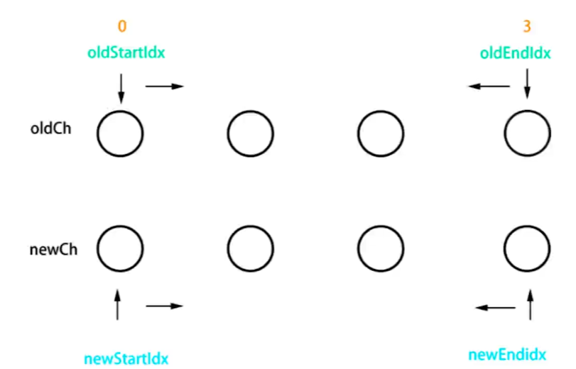
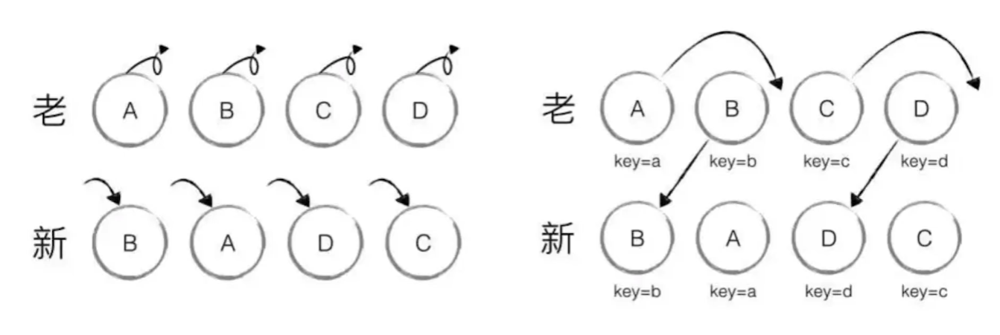

## new Vue 时发生了什么

当你 new 一个 Vue 实例的时候，Vue 会去执行一个叫`_init`的一个函数。

> src/core/instance/init.js

```js
Vue.prototype._init = function (options?: Object) {
  //...
  // expose real self
  vm._self = vm
  initLifecycle(vm)
  initEvents(vm)
  initRender(vm)
  callHook(vm, 'beforeCreate')
  initInjections(vm) // resolve injections before data/props
  initState(vm)
  initProvide(vm) // resolve provide after data/props
  callHook(vm, 'created')
  //...
```

别的暂且不管，这块还是能看懂的，Vue 会去初始化`生命周期`，`事件`，`渲染函数`，和`State`。

注意，这里面有一个`InitState()`方法，我们要好好看一下。

```js
export function initState(vm: Component) {
  vm._watchers = [];
  const opts = vm.$options;
  if (opts.props) initProps(vm, opts.props);
  if (opts.methods) initMethods(vm, opts.methods);
  if (opts.data) {
    initData(vm);
  } else {
    observe((vm._data = {}), true /* asRootData */);
  }
  if (opts.computed) initComputed(vm, opts.computed);
  if (opts.watch && opts.watch !== nativeWatch) {
    initWatch(vm, opts.watch);
  }
}
```

从代码里我们能够看到，在`initState()`中又将`props`,`data`,`methods`,`computed`,`watched`这些重要选项给初始化了。

## MVVM

- `M`:`Model`,指的是数据模型，包括操作数据的动作。
- `V`:`View`,视图。
- `VM`:`ViewModel`,一个**双向**连接层，用来连接`Model`和`View`。他会监听`Model`中的数据变化从而去控制视图层的渲染，也会由视图层的变化去改变`Model`中的数据，这个变化的过程是双向的，也是自动的。
  `MVVM`最大的一个好处就是能够让开发人员调出繁琐的操作 dom，将主要的精力放在数组模型(业务逻辑)上。

## 响应式原理

### 核心 api

`Object.defineProperty()`

首先要明白的一点，每当我们用“.”运算符去`get`和`set`对象中的数据时，都是**原子操作**。

这个 api 的作用就是你可以自定义在`get`和`set`时要进行的操作。

```js
let name = 'jason';
let obj = {};
Object.defineProperty(obj, 'name', {
  get() {
    return name;
  },
  set(val) {
    name = val;
    console.log('更新视图');
  },
});

obj.name = 'Katy';
```

响应式的核心原理就是这么简单。。

### 手写响应式

```js
//监听对象属性
function observe(target) {
  //如果是基本类型就不监听
  if (typeof target !== 'object' || target == null) {
    return target;
  }
  //对这个对象中的每一个属性都进行监听
  for (let key in target) {
    defineReactive(target, key, target[key]);
  }
}

function defineReactive(target, key, value) {
  //上来先对value进行一下递归监听，如果是基本类型就会被返回
  observe(value);

  Object.defineProperty(target, key, {
    get() {
      return value;
    },
    set(newVal) {
      if (newVal !== value) {
        value = newVal;
        updateView();
      }
    },
  });
}

function updateView() {
  console.log('视图更新');
}
//准备数据
const data = {
  name: 'jason',
  age: '20',
  obj: {
    city: 'beijing',
  },
};
//监听数据
observe(data);

data.name = 'asher';
//视图更新
data.obj.city = 'Shanghai';
//视图更新
data.num = '314';
//没有触发视图更新
delete data.name;
//没有触发视图更新
```

思路实现并不难，无非就是监听的对象键值对我们可能需要循环监听外加一些类型判断什么的。

但是注意一点，请看最后两行

```js
data.num = '314';
//没有触发视图更新
delete data.name;
//没有触发视图更新
```

我们发现最后的增加属性与删除属性并没有触发视图更新，这也是`Object.defineProperty()`无能为力的地方。

因此 Vue 为我们提供了[Vue.set()](https://cn.vuejs.org/v2/api/#Vue-set)和[Vue.delete()](https://cn.vuejs.org/v2/api/#Vue-delete)来完善这两种情况下的数据响应。

#### 响应数据是数组的情况

如果是数组的话我们就需要去重写下数组原型中的方法，为了防止污染数组原型，我们用`Object.create()`拷贝一份原型出来。

> 将数组的原型进行处理

```js
//先把数组的原型拿出来
const arrProperty = Array.prototype;
//把原型对象拷贝一份出来，防止污染
let resolveArr = Object.create(arrProperty);
//把一些常用的数组操作override了
['push', 'pop', 'shift', 'unshift'].forEach((name) => {
  resolveArr[name] = function() {
    arrProperty[name].call(this, ...arguments);
    updateView();
  };
});
```

> 在 observe()函数中对数组类型进行判断和处理

```js
//监听对象属性
function observe(target) {
    //...
    //如果响应式数据为数组，就需要自定义数组中的方法
    if (Array.isArray(target)) {
        target.__proto__ = resolveArr;
    }
    //...
}
    //test
const data = {
    arr: [1, 3, 4]
}

//监听数据
observe(data);
data.arr.push(5);
//conlose
//视图更新
}
```

## 虚拟 dom 与 diff 算法

其实虚拟 dom 的具体实现总的来说可以分成两步。

1. js 对象模拟 dom
2. 判断两个虚拟 dom 的差异，然后执行局部渲染。

这里面最核心最复杂的就是第二步。

### JS 对象模拟 dom

每一个 dom 元素其实都有三个核心特征：标签类别，属性以及子元素。

```html
<div id="div1" class="container">
  <p>vdom</p>
</div>
```

```js
let vdom = {
  tag: 'div',
  props: {
    id: 'div1',
    className: 'container',
  },
  children: [
    {
      tag: 'p',
      text: 'vdom',
    },
  ],
};
```

### diff 算法

vue 的 diff 算法借鉴的是`snabbdom`这个库，这个库中在进行虚拟 dom 比较时，会根据用户设置的`key`和`tagname`来比较同级的节点。

如果判断节点不同，那么会直接将新节点 replace 到旧节点上。

如果判断节点相同，则执行局部渲染(patch 函数。

局部渲染主要比较的是里面的内容，会根据两个 vnode 是否有子节点和文本是否相同进行进一步处理。

最最复杂的是两个 vnode 都有子节点的情况，此时会执行`updateChildren()`函数。



如图所示，会初始化四个指针，然后分别交叉比较，如果相同了则让指针往中间跑。

### 为什么在 v-for 中要使用 key

使用 key 可以提高渲染性能，在 diff 算法中通过 key 和 tag 来判断 sameNode，如果判断是 sameNode 直接移动就好了，而不需要全部销毁重建重新渲染。



## template 被编译成了什么

我们可以借助于`vue-template-compiler`来查看模板最终的编译结果。

先看一个非常简单的例子。

```js
const compiler = require('vue-template-compiler');

const template = `<p>div</p>`;

const res = compiler.compile(template);

console.log(res.render);
//with(this){return _c('p',[_v("div")])}
```

我们能够看到，这个 template 最终被编译成了 render 函数，render 函数则会根据`_c()`函数返回一个 vnode。

::: tip
`_c()`函数在 vue 源码里的意思是`createElement()`,也就是创建一个 vnode。
:::
\_v,\_s,\_l 在 vue 的模板编译中也很常用。

```js
target._v = createTextVNode;
target._s = toString;
target._l = renderList;
```

以下是常见的 vue 模板编译结果。

- 插值

```js
const template = `<p>{{message}}</p>`;
// with(this){return _c('p',[_v(_s(message))])}
```

可以看到{{message}}被编译成了`createTextVNode(toString(message))`。

- 表达式

```js
const template = `<p>{{flag ? message : 'no message found'}}</p>`;
//with(this){return _c('p',[_v(_s(flag ? message : 'no message found'))])}
```

- 属性和动态属性

```js
const template = `
    <div id="div1" class="container">
        
    </div>
     `;
//with(this){return _c('div',{staticClass:"container",attrs:{"id":"div1"}},[_c('img',{attrs:{"src":imgUrl}})])}
```

动态属性就是把属性值直接作为变量传过去了，很符合我们的猜测。

- 条件编译

```js
const template = `
    <div>
        <p v-if="flag === 'a'">A</p>
        <p v-if="flag === 'b'">A</p>
    </div>
`;
//with(this){return _c('div',[(flag === 'a')?_c('p',[_v("A")]):_e(),_v(" "),(flag === 'b')?_c('p',[_v("A")]):_e()])}
```

<hide txt="PS:大佬们写代码都喜欢用三元表达式嘛？？"/>

- 循环

```js
const template = `
    <ul>
        <li v-for="item in list" :key="item.id">{{item.title}}</li>
    </ul>
`;
//with(this){return _c('ul',_l((list),function(item){return _c('li',{key:item.id},[_v(_s(item.title))])}),0)}
```

主要就是调了一个`renderList()`这样一个函数。

- 事件

```js
const template = `
    <button @click="clickHandler">submit</button>
`;
//with(this){return _c('button',{on:{"click":clickHandler}},[_v("submit")])}
```

- v-model（v-model 的实现原理）

```js
const template = `<input type="text" v-model="name">`;
// with(this){return _c('input',{directives:[{name:"model",rawName:"v-model",value:(name),expression:"name"}],attrs:{"type":"text"},domProps:{"value":(name)},on:{"input":function($event){if($event.target.composing)return;name=$event.target.value}}})}
```

这个稍微有点长不过并不是很难理解。

> 这里有个面试题考点：v-model 的原理

首先 input 里的 value 会去等于 data.xxx。(单向绑定)
然后 data.xxx = \$event.target.value。（双向绑定）

## 组件渲染过程分析

### 初次渲染

1. 首先会将模板解析为 render 函数
2. 执行 render 函数()，通过 getter 拿到 data 生成虚拟 dom，并通过`patch(el,vnode)`函数将其更新到视图上。

### 更新渲染

当我们修改 data 的时候，就会触发 setter,从而触发视图更新。
此时会重新触发 render 函数，生成新的 vnode，然后通过 patch 函数更新上去。

::: tip
我们能够看到，不管是初次渲染还是更新渲染都是需要步骤和时间的，因此在 vue 中，渲染的过程是异步的！这点很重要
:::

## 前端路由

哈希模式下是通过`window.onhashchagne()`监听 url 中 hash 值变化，从而渲染页面。

history 模式主要利用`history.pushState()`在实现改变网址而不刷新界面，监听的话用的是`windows.onpopstate()`。
同时 history 需要后端进行相应的配置。

---

## 面试题补充

### Q：为什么 Vue 组件里的 data 必须是一个函数？

A：既然是组件嘛，肯定要保证复用性.

但数据不能复用啊，如果不是函数的话那么所有组件的 data 都会指向同一个静态对象，修改任何一个组件的 data 都会影响到其他组件的 data。

如果是函数的话每次实例化一个 Vue 组件都会调用 data()这个函数，然后返回一个新的对象。

### Q：ajax 请求应该放在哪个生命周期？

A: 都是异步的直接放`mounted`得了，放 created 里其实也快不了多少，还会让夜壶逻辑变得更加混乱。

### Q: 如何将组件上所有的属性传递给子组件？

A:可以通过`$props`打包传过去。

### Q: 何时可能会用到 beforeDestroy?

A:解除绑定自定义事件/清楚定时器

### Q：什么是作用域插槽

一种可以将子组件的数据带出来进行渲染的插槽，具体使用[请点击](./vue学习笔记.html/#插槽)

### Q：Vuex 中 action 和 mutation 有何区别

mutation 主要进行一系列原子操作。
action 可以整合多个 mutation 中的原子操作，同时也可以处理异步。

### 请描述响应式的原理

在前面响应式的基础上附加上组件渲染与更新的流程。

### Vue 中常见的性能优化点

- 合理使用 v-show 和 v-if
- v-for 时加 key，以及避免和 v-if 同时使用
- 自定义事件，dom 上的事件要及时销毁
- 合理使用异步组件和 keep-alive
- data 层级尽量扁平

#### 缓存层面
computed,keep-alive

#### 性能方面

data层级尽量扁平(vue2),加key

#### 习惯

定时器，自定义事件销毁