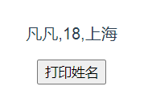

## 火速上手

### 插值表达式

```vue
<template>
  <div>
    <p>文本插值{{ message }}</p>
    <p>JS表达式{{ flag ? 'yes' : 'no' }}</p>
  </div>
</template>

<script>
export default {
  data() {
    return {
      message: 'hellovue',
      flag: true,
    };
  },
};
</script>
```


花括号里可以放一些简单的 js 表达式，但复杂的 js 语句是不支持的~~

### 动态属性值

```vue
<template>
  <div>
    <p :id="dynamicID">这个p标签的id属性值是动态的哦~~</p>
  </div>
</template>

<script>
export default {
  data() {
    return {
      dynamicID: `id-${Date.now()}`,
    };
  },
};
</script>
```

### 动态 class

vue 针对`class`属性和`style`属性做了专门的增强，不像以前那样只能往里面写纯字符串
你还可以往里面写“对象字符串”和“数组字符串”，vue 会对他们进行特殊的解析。

当然你也可以用 v-bind 指令来动态更新`class`和`style`的属性值，从而做出超级炫酷的效果(误

#### “对象字符串”

```vue
<template>
  <div>
    <p :class="{ red: isRed, bold: isBold }">使用class</p>
    <!-- red这个class效果是否存在要取决于isRed的真值,bold同理 -->
    <button @click="isRed = true">变红！</button>
    <button @click="isBold = true">加粗!</button>
  </div>
</template>

<script>
export default {
  data() {
    return {
      isRed: false,
      isBold: false,
    };
  },
};
</script>
<style>
.red {
  color: red;
}
.bold {
  font-weight: bold;
}
</style>
```

当点击按钮的时候，文字的 class 效果便会渲染上去。


#### “对象数组”

```vue
<template>
  <div>
    <p :class="[red, bold]">使用class</p>
  </div>
</template>

<script>
export default {
  data() {
    return {
      red: 'red',
      bold: 'bold',
    };
  },
};
</script>
<style>
.red {
  color: red;
}
.bold {
  font-weight: bold;
}
</style>
```

这样默认渲染的就是"红色加粗"的字体。
不过不要忘了在`data`中将 class 样式的字符串传过去。

### 动态 style

```vue
<template>
  <div>
    <p :style="red_bold">使用class</p>
  </div>
</template>

<script>
export default {
  data() {
    return {
      red_bold: {
        color: 'red',
        fontWeight: 'bold', //小短横在js中会报错，因此要转成驼峰式
      },
    };
  },
};
</script>
```

::: warning
使用动态 style 的时候需要注意,小短横在 js 中会报错，因此要转成驼峰式
:::

### v-html 指令

v-html 指令可以**覆盖更新**dom 元素的`innerHTML`。

```vue
<template>
  <div>
    <div v-html="myHtml">
      这里面的内容被覆盖掉了
    </div>
  </div>
</template>

<script>
export default {
  data() {
    return {
      myHtml: '<div>原始的html:<span>helloWorld</span></div>',
    };
  },
};
</script>
```

::: danger
千万不能再用户提交的页面上使用`v-html`,因为这样会导致 XSS 攻击。
:::

### 计算属性

对于一些稍微复杂一些的转换逻辑，我们可以考虑使用**计算属性**。

`computed`主要用来定义基于**数据之上的数据**.

```vue
<template>
  <div>
    <div>num:{{ num }}</div>
    <div>mult2:{{ handle }}</div>
  </div>
</template>

<script>
export default {
  data() {
    return {
      num: 20,
    };
  },
  computed: {
    handle() {
      return (this.num * 2 + 3) / 6;
    },
  },
};
</script>
```

::: tip
计算属性计算的结果会被缓存起来，方便下一次继续调用。
也就是说，只要**data**里的东西不变，则计算属性就不会重新计算。
:::

### 监听器属性

监听器可以对`data`里的数据进行监听，如果发生变化则触发。

`watch`是你想在**某个数据变化时去做一些事情**.这是和`computed`的主要区别.

```vue
<template>
  <div>
    <div>name:{{ name }}</div>
    <input v-model="name" />
    <div>{{ info.getOffer }}</div>
    <button @click="info.getOffer = true">when u get offer</button>
  </div>
</template>

<script>
export default {
  data() {
    return {
      name: '寻光',
      info: {
        age: '18',
        city: 'zhengZhou',
        getOffer: false,
      },
    };
  },
  watch: {
    //对name进行监听,当name发生变动时会触发
    name(newVal, oldVal) {
      console.log('name', newVal, oldVal);
    },
    //对info对象进行监听，需要将deep字段设置为true
    info: {
      handler(newVal, oldVal) {
        //newVal和oldVal指向的是同一个对象
        console.log('u do it!');
      },
      deep: true, //深度监听
    },
  },
};
</script>
```

::: warning
需要注意的是如果监听的是一个对象，则要在监听对象内部将`deep`字段设置为`true`。

并且`newVal`和`oldVal`指向的是同一个对象，真正变化的值是拿不到的。
:::

### v-if 与 v-show 的使用场景

`v-if`会对渲染条件进行判断，如果不满足则不渲染。

`v-show`也会对渲染条件进行判断，如果不满足**依然渲染，只是不显示出来**。


因此如果需要**频繁的切换是否显示**就用`v-show`,不需要频繁切换就用`v-if`。

### 循环渲染

`v-for`除了可以循环数组，也可以循环对象。

```vue
<template>
  <div>
    <h2>遍历数组</h2>
    <div v-for="(item, index) in listArr" :key="item.id">
      {{ index }} --- {{ item.id }} --- {{ item.title }}
    </div>
    <h2>遍历对象</h2>
    <div v-for="(val, key, index) in listObj" :key="key">
      {{ index }} --- {{ key }} --- {{ val.title }}
    </div>
  </div>
</template>

<script>
export default {
  data() {
    return {
      listArr: [
        //在数据中，最好设置一个id字段
        { id: 'a', title: '标题1' },
        { id: 'b', title: '标题2' },
        { id: 'c', title: '标题3' },
      ],
      listObj: {
        a: { title: '标题1' },
        b: { title: '标题2' },
        c: { title: '标题3' },
      },
    };
  },
};
</script>
```

- key 尽量设置成一个和业务相关的字段，最好不要是索引。
- 遍历对象的时候可以传进去三个参数，分别是`val`,`key`和`index`。

::: warning
尤大说了，v-if 和 v-for 最好不要一块用，因为这样会造成不必要的循环判断。
:::

### 事件

```vue
<template>
  <div>
    <div>天若有情天亦老</div>
    <div>我为长者续{{ num }}秒</div>
    <br />
    <button @click="increase1">+1s</button>
    <!-- 如果传参数的话可以用$event将event传过去 -->
    <button @click="increase2(2, $event)">+2s</button>
    <!-- <button @click=""></button> -->
  </div>
</template>

<script>
export default {
  data() {
    return {
      num: 0,
    };
  },
  methods: {
    //如果不传参数的话可以直接获取event对象
    increase1(event) {
      console.log(event);
      console.log(event.target);
      console.log(event.currentTarget);
      //事件真正在哪被监听触发
      this.num++;
    },
    increase2(val, event) {
      console.log(event);
      console.log(event.target);
      console.log(event.currentTarget);
      this.num += val;
    },
  },
};
</script>
```


从这个 demo 中我们可以看出来一下几点：

- 如果事件不传参数的话，我们可以直接在`method`属性中拿到`event`，否则我们要用`$event`将参数传递过去。
- 由上述 demo 我们能够发现`event`就是原生 js 中的`MouseEvent`! 没有任何装饰与加工。
- vue 中的`event`，挂载在当前元素，触发也是在当前元素。

### 事件修饰符

- 阻止向上冒泡传播

```html
<a @click.stop="doThis"></a>
```

- 提交事件不重载页面

```html
<form @submit.prevent="onSubmit"></form>
```

- 可以使用多个修饰符串联

```html
<a @click.stop.prevent="doThis"></a>
```

- 事件在捕获阶段就触发

```html
<div @click.capture="doThis">.....里面一堆子标签~~~</div>
```

::: warning
捕获阶段触发后事件在冒泡阶段不会被二次触发。
:::

- 从内部冒泡上来的事件不会被触发，也就是说只有点自己当前的元素才会触发

```html
<div @click.self="doThis">...里面一堆子标签</div>
```

### 表单

- v-model 的修饰符

```html
<!-- number修饰符可以将输入进来的字符串数字转化成纯number类型 -->
<input type="text" v-model.number="age" />
<!-- trim修饰符可以将输入进来的字符串中的留白删去 -->
<input type="text" v-model.trim="name" />
<!-- lazy修饰符可以让输入框实现防抖，失去焦点时才会更新数据 -->
<input type="text" v-model.lazy="name" />
```

- 多行文本
  在 vue 中，`textarea`也可以用来联通 v-model。

```html
<p>多行文本：{{desc}}</p>
<textarea v-model="desc"></textarea>
```

- 复选框
  当一个`input`被设置为复选框时，可以用 v-model 连通一个布尔值来控制。

```vue
<template>
  <div>
    <p>多行文本：{{ checked }}</p>
    <input type="checkbox" v-model="checked" />
  </div>
</template>

<script>
export default {
  data() {
    return {
      checked: true,
    };
  },
};
</script>
```


- 多选框
  多选框可以用 v-model 连通一个数组来实现~~

```vue
<template>
  <div>
    <p>多行文本：{{ checkedNames }}</p>
    <input type="checkbox" value="jason" v-model="checkedNames" />
    <input type="checkbox" value="asher" v-model="checkedNames" />
    <input type="checkbox" value="lee" v-model="checkedNames" />
  </div>
</template>

<script>
export default {
  data() {
    return {
      checkedNames: [],
    };
  },
};
</script>
```


- 单选
  用 v-model 连通一个值来实现

```vue
<template>
  <div>
    <p>单选：{{ gender }}</p>
    <input type="radio" value="男" v-model="gender" />
    <label for="male">男</label>
    <input type="radio" value="女" v-model="gender" />
    <label for="female">女</label>
  </div>
</template>

<script>
export default {
  data() {
    return {
      gender: 'male',
    };
  },
};
</script>
```


- 下拉列表
  可以用`select`配合 v-model 连通一个空值来实现，多选的话可以连通一个数组来实现。

```vue
<template>
  <div>
    <p>单选：{{ selected }}</p>
    <select v-model="selected">
      <option value="" disabled>请选择</option>
      <option value="A">A</option>
      <option value="B">B</option>
      <option value="C">C</option>
    </select>
    <h4>多选的时候要配合Ctrl键</h4>
    <p>多选：{{ selectedList }}</p>
    <select v-model="selectedList" multiple>
      <option value="" disabled>请选择</option>
      <option value="A">A</option>
      <option value="B">B</option>
      <option value="C">C</option>
    </select>
  </div>
</template>

<script>
export default {
  data() {
    return {
      selected: '',
      selectedList: [],
    };
  },
};
</script>
```


## 组件

### 父组件向子组件通讯

要实现父组件向子组件通信很简单，我们只需要自定义`prop`并向其中传递数据。

首先我们定义一个叫做`Alert`的子组件。

```vue
<template>
  <div>
    <button @click="onClick">弹弹弹</button>
  </div>
</template>

<script>
export default {
  //定义属性
  props: ['msg'],
  methods: {
    onClick() {
      alert(this.msg);
    },
  },
};
</script>
```

然后我们在父组件上来引用它。

```vue
<template>
  <div class="home">
    <Alert msg="从父组件传递过去的数据"></Alert>
  </div>
</template>

<script>
import Alert from '../components/BaseUse/Alert';
export default {
  name: 'Home',
  components: {
    Alert,
  },
};
</script>
```

此时当我们点击子组件(按钮)，父组件传过去的消息便能显示出来。

### 子组件向父组件通信

要想实现这种“从内到外”的消息传递，
我们需要在使用子组件的时候自定义一个`监听事件`，
然后在子组件内部通过`$emit()`方法来触发这个监听事件,顺带可以将数据传递过去。

这里是我们定义的`show.vue`子组件

```vue
<template>
  <div>
    <button @click="onClick">显示/关闭显示</button>
  </div>
</template>

<script>
export default {
  methods: {
    onClick() {
      //点击按钮的时候，监听使用时的方法，并传递数据过去
      this.$emit('show-balance', { a: 1, b: 2 });
    },
  },
};
</script>
```

在父组件上我们需要给子组件定义监听方法，并且我们可以在被调用的方法中拿到子组件传递过来的数据。

```vue
<template>
  <div class="home">
    <div>
      <!-- 在父组件上直接为子组件自定义了一个show-balance方法 -->
      <show @show-balance="showBalance"></show>
      <div v-if="show">您的余额</div>
    </div>
  </div>
</template>
<script>
import show from '../components/BaseUse/show';
export default {
  name: 'Home',
  data() {
    return {
      show: false,
    };
  },
  components: {
    show,
  },
  methods: {
    showBalance(data) {
      this.show = !this.show;
      console.log(data);
      //{a: 1, b: 2}
    },
  },
};
</script>
```

### 任意组件间的消息传递

要想实现任意组件间的消息传递，我们需要一个 Vue 实例来做消息传递的桥梁。

Vue 的实例中的`$emit()`方法可以用来发送数据，而`$on()`方法可以用来接收数据。

我们只需要在要发送的组件上定义`$emit()`方法，在接收的组件上定义`$on()`。

**发送消息的组件**

```vue
<template>
  <div>
    <p>baseUse1</p>
    <div>组件1说:<input @keyup="onChange" v-model="baseUse1_data" /></div>
  </div>
</template>

<script>
import vm from './vm';
export default {
  data() {
    return {
      baseUse1_data: '',
    };
  },
  methods: {
    onChange() {
      //通过emit方法发送消息
      vm.$emit('said', this.baseUse1_data);
    },
  },
};
</script>
```

**接收消息的组件**

```vue
<template>
  <div>
    <p>baseUse2</p>
    {{ baseUse2_data }}
  </div>
</template>

<script>
import vm from './vm';
export default {
  data() {
    return {
      baseUse2_data: '',
    };
  },
  mounted() {
    //通过$on方法来监听消息
    vm.$on('said', (data) => {
      this.baseUse2_data = data;
    });
  },
};
</script>
```

::: warning
这个例子仅仅是一个演示，在正常的生产环境中，尽量不要在`$on()`中定义“监听动作”，而是传一个函数引用进去。

这样在不用的时候可以调用`$off()`将“监听动作”传进去及时销毁。
:::

### 单组件生命周期

总的来说，vue 实例的生命周期要经历四个核心阶段。

**创建 => 挂载 => 更新 => 销毁**

在每一个核心阶段的前后，vue 都提供了相应的生命周期钩子以便我们进行操作。
<hide txt="请注意我在描述每个阶段时的时态。"></hide>

- **创建**

在**创建时**,vue 会去初始化`data`里的数据和`methods`里的方法。也就是说，在`beforeCreate`时，你是拿不到这些数据和方法的，只有到了`created`时，你才能拿到这些数据和方法。


在`created`之后，vue 就会根据组件内“是否有挂载目标 el”和“是否有 template”来将模板**渲染到内存中**，生成虚拟 dom。


> 画红框的地方为将模板渲染到内存中的阶段。

- **挂载**

在**挂载时**，vue 会将内存里的模板挂载到 el 上。也就是说，在`beforeMount`时，你是“看不到”渲染后的 vue 组件的(<hide txt="当然这个过程你用肉眼很难感知。"></hide>)，只有在`mounted`时，你才能通过`插值表达式`访问到 vue 组件内的数据。


当 vue 组件挂载完毕后，veu 组件就进入到了运行时。


- **更新**

在运行时，如果 data 发生了改变，就会触发更新事件。
在**更新时**，会在内存里重新渲染虚拟 dom 并将其同步到浏览器的视图上，也就是说，在`beforeUpdate`时，vue 里的 data 还并没有和视图上的 data 保持同步。

- **销毁**
  当调用实例上的`$destroy()`方法时，会销毁一个 vue 组件。
  但在销毁之前，vue 仍然给我们提供了`beforeDestory`钩子供我们进行相应的操作。

### 父子组件生命周期

下图是一段代码的输出结果，其中 index 是父组件，list 是子组件。
我们分别在父组件和子组件的生命周期钩子内打了几个 log。


由这几段 log 我们能得出一个结论：在 **创建 => 挂载**阶段，父子组件的运行顺序是一个“递归”的过程，就像函数一样。父组件必须等到子组件都渲染完了父组件才能说“自己渲染完了”。

接下来我们通过父组件来更新下子组件的 data。


是不是发现顺序有些像呢？没错，在 **更新前 => 更新后**，父子组件的运行顺序也是一个递归的过程。

同理，在 **销毁前 => 销毁后**，只有子组件销毁完了，父组件才能说“自己销毁完了”，毕竟**子组件是父组件的一部分**。

## 高级特性

### v-model 的自定义配置

有的时候我们可能需要在自定义的组件上使用 v-model,在 2.2 版本之后的 vue 给我们提供了`model`选项方便我们进行相关配置。

下面我们实现了一个自己的双向绑定的`input`。

```vue
<template>
  <div class="class1">
    <!-- 绑定text属性，并且将input元素上的值通过change事件发送出去 -->
    <input :value="text" @input="$emit('change', $event.target.value)" />
  </div>
</template>

<script>
export default {
  //让model去双向绑定text属性
  model: {
    prop: 'text',
    event: 'change',
  },
  props: ['text'],
};
</script>
<style scoped>
.class1 {
  border: 2px solid red;
}
</style>
```

在上面的代码中，我们监听了`input`标签中的**input**事件，并将当前元素上的值通过`$emit`方法发送出去。

然后我们就可以在父组件中像类似`input`标签那样用我们的自定义组件了。

```vue
<template>
  <div class="home">
    <p>{{ name }}</p>
    <myVmodel v-model="name"></myVmodel>
  </div>
</template>
<script>
import myVmodel from '../components/BaseUse/myVmodel';
export default {
  name: 'Home',
  components: {
    myVmodel,
  },
  data() {
    return {
      name: 'jason',
    };
  },
};
</script>
```

### refs

在 vue 中，如果我们想要获取到 dom 的信息我们可以为想要获取的 dom 注册`ref`属性

在组件内我们便可以用`vm.$refs.属性值`的方式来获取这个 dom 元素的信息。

```vue
<template>
  <div class="home">
    <div ref="mydiv">
      Goodnight World！
    </div>
  </div>
</template>
<script>
import myVmodel from '../components/BaseUse/myVmodel';
export default {
  name: 'Home',
  components: {
    myVmodel,
  },
  mounted() {
    let mydiv = this.$refs.mydiv;
    console.log(mydiv);
    //<div> Goodnight World！ </div>
  },
};
</script>
```

### \$nextTick

在讲这个实例方法前，首先要明确一个概念。

Vue 更新 dom 是一个异步的过程。

也就是说，当你把`data`里的内容改变后，你是不能同步的去立刻获取到更改后的 dom 信息的。

举个栗子

```vue
<template>
  <div class="home">
    <div ref="mydiv">
      <div v-for="item in lists" :key="item.id">
        {{ item }}
      </div>
    </div>
    <button @click="onclick">添加一项</button>
  </div>
</template>
<script>
import myVmodel from '../components/BaseUse/myVmodel';
export default {
  name: 'Home',
  components: {
    myVmodel,
  },
  data() {
    return {
      lists: [
        { name: 'jason', age: '18', id: 'a' },
        { name: 'ash', age: '18', id: 'b' },
        { name: 'john', age: '18', id: 'c' },
      ],
    };
  },
  methods: {
    onclick() {
      this.lists.push({ name: 'lee', age: '18', id: 'd' });
      let mydiv = this.$refs.mydiv;
      console.log(mydiv.childNodes.length); //3
    },
  },
};
</script>
```

在上述代码中，即使我们`push`进去了一项，最后发现元素长度仍然是 3。

解决这个问题我们可以使用`vm.nextTick()`方法，他可以指定**dom 更新后**执行什么操作。

```vue
<template>
  <div class="home">
    <div ref="mydiv">
      <div v-for="item in lists" :key="item.id">
        {{ item }}
      </div>
    </div>
    <button @click="onclick">添加一项</button>
  </div>
</template>
<script>
import myVmodel from '../components/BaseUse/myVmodel';
export default {
  name: 'Home',
  components: {
    myVmodel,
  },
  data() {
    return {
      lists: [
        { name: 'jason', age: '18', id: 'a' },
        { name: 'ash', age: '18', id: 'b' },
        { name: 'john', age: '18', id: 'c' },
      ],
    };
  },
  methods: {
    onclick() {
      this.lists.push({ name: 'lee', age: '18', id: 'd' });
      let mydiv = this.$refs.mydiv;
      this.$nextTick(() => {
        console.log(mydiv.childNodes.length); //4
      });
    },
  },
};
</script>
```

### 插槽

`slot`可以将外部的内容(可以是文本，也可以是组件)渲染到组件内指定的位置。

> 父组件

```vue
<template>
  <div class="home">
    <baseUse1>
      从插槽传进去的内容
    </baseUse1>
  </div>
</template>
<script>
import baseUse1 from '../components/BaseUse/baseUse1';
export default {
  name: 'Home',
  components: {
    baseUse1,
  },
};
</script>
```

> baseUse1.vue

```vue
<template>
  <div>
    <div>baseUse1中原先的内容</div>
    <div>baseUse1中原先的内容</div>
    <div>baseUse1中原先的内容</div>
    <slot></slot>
  </div>
</template>

<script>
export default {};
</script>
```


#### 作用域插槽

假如说我们上面的例子中，插槽内渲染的内容是子组件的数据，这时候怎么办呢？

当然你可以用`$emit`将数据带出来，但 vue 在插槽上给我们提供了更优雅的解决方案。

> 子组件

```vue
<template>
  <div>
    <div>baseUse1中原先的内容</div>
    <div>baseUse1中原先的内容</div>
    <div>baseUse1中原先的内容</div>
    <!-- 为了让name能够在父组件中可用 -->
    <slot :slotData="name"></slot>
  </div>
</template>

<script>
export default {
  data() {
    return {
      name: '子组件的数据',
    };
  },
};
</script>
```

> 父组件上要指定用 v-slot 指定一下 slotProps（当然这个名字你可以随便起）

```vue
<template>
  <div class="home">
    <baseUse1 v-slot="slotProps">
      {{ slotProps.slotData }}
    </baseUse1>
  </div>
</template>
<script>
import baseUse1 from '../components/BaseUse/baseUse1';
export default {
  name: 'Home',
  components: {
    baseUse1,
  },
};
</script>
```

#### 具名插槽

有的时候我们可能在子组件上“挖了不止一个槽”，这时候如果要将内容准确的填充到对应的位置，就需要我们给每一个插槽命一下名。

> 子组件

```vue
<template>
  <div>
    <slot name="header"></slot>
    <div>baseUse1中原先的内容</div>
    <div>baseUse1中原先的内容</div>
    <div>baseUse1中原先的内容</div>
    <div>baseUse1中原先的内容</div>
    <slot name="footer"></slot>
  </div>
</template>

<script>
export default {
  data() {
    return {
      name: '子组件的数据123',
    };
  },
};
</script>
```

> 父组件

```vue
<template>
  <div class="home">
    <baseUse1>
      <template v-slot:header>头部的数据</template>
      <template v-slot:footer>尾部的数据</template>
    </baseUse1>
  </div>
</template>
<script>
import baseUse1 from '../components/BaseUse/baseUse1';
export default {
  name: 'Home',
  components: {
    baseUse1,
  },
};
</script>
```

### 动态组件

有的时候我们在一个页面可能会根据后台的数据来动态的渲染不同的组件

这时候我们只需要通过`component`标签再加一个`is`属性就能够轻松实现。

```vue
<template>
  <div class="home">
    <component :is="componentName.com1" />
    <component :is="componentName.com2" />
  </div>
</template>
<script>
import baseUse1 from '../components/BaseUse/baseUse1';
import baseUse2 from '../components/BaseUse/baseUse2';
export default {
  name: 'Home',
  components: {
    baseUse1,
  },
  data() {
    return {
      componentName: {
        com1: baseUse1,
        com2: baseUse2,
      },
    };
  },
};
</script>
```


### 异步组件

有的时候一些组件的体积可能非常大（像百度的 Echarts），如果我们不确定是否展示的话可以将其异步的加载进来，如果使用的话在将其加载进来。

下面举一个简单的例子。

```vue
<template>
  <div class="home">
    <Bigcomp v-if="show"></Bigcomp>
    <button @click="show = true">显示这个超级大的组件</button>
  </div>
</template>
<script>
export default {
  name: 'Home',
  components: {
    Bigcomp: () => import('../components/BaseUse/Bigcomp'),
    //将其动态的加载进来
  },
  data() {
    return {
      show: false,
    };
  },
};
</script>
```

### keep-alive

在我们做开发的时候，组件的切换是一个非常常见的需求。

在切换的过程中，由于数据驱动，每一个组件会重新经历一个生命周期。

> 父组件

```vue
<template>
  <div class="home">
    <button @click="change('tab1')">tab1</button>
    <button @click="change('tab2')">tab2</button>
    <button @click="change('tab3')">tab3</button>
    <tab1 v-if="choose === 'tab1'"></tab1>
    <tab2 v-if="choose === 'tab2'"></tab2>
    <tab3 v-if="choose === 'tab3'"></tab3>
  </div>
</template>
<script>
import tab1 from './tab1';
import tab2 from './tab2';
import tab3 from './tab3';
export default {
  name: 'Home',
  components: {
    tab1,
    tab2,
    tab3,
  },
  data() {
    return {
      choose: 'tab1',
    };
  },
  methods: {
    change(tab) {
      this.choose = tab;
    },
  },
};
</script>
```

> 其中的一个 tab 组件，其他两个是一样的

```vue
<template>
  <div>
    <span>tab1</span>
  </div>
</template>

<script>
export default {
  mounted() {
    console.log('tab1挂载');
  },
  destroyed() {
    console.log('tab1销毁');
  },
};
</script>
```

当我们切换 tab 时，我们可以看到


毫无疑问，如果切换频繁的话，对性能的影响还是很大的。

还好 vue 给我们提供了`keep-alive`内置组件，包裹进去的组件在将要被 destroy 的时候会被缓存起来。

```vue
<template>
  <div class="home">
    <button @click="change('tab1')">tab1</button>
    <button @click="change('tab2')">tab2</button>
    <button @click="change('tab3')">tab3</button>
    <keep-alive>
      <tab1 v-if="choose === 'tab1'"></tab1>
      <tab2 v-if="choose === 'tab2'"></tab2>
      <tab3 v-if="choose === 'tab3'"></tab3>
    </keep-alive>
  </div>
</template>
<script>
import tab1 from './tab1';
import tab2 from './tab2';
import tab3 from './tab3';
export default {
  name: 'Home',
  components: {
    tab1,
    tab2,
    tab3,
  },
  data() {
    return {
      choose: 'tab1',
    };
  },
  methods: {
    change(tab) {
      this.choose = tab;
    },
  },
};
</script>
```


### mixin

有的时候我们可能会需要将公共的组件部分“剥离”出来，以便代码复用。

`mixin`给我们提供了剥离组件的方式。

> 抽离出来的组件部分 mixin.js

```js
export default {
  data() {
    return {
      city: '北京',
    };
  },
  methods: {
    showName() {
      console.log(this.name);
    },
  },
  mounted() {
    console.log('mixin mounted', this.name);
  },
};
```

> 父组件

```vue
<template>
  <div class="home">
    <p>{{ name }},{{ age }},{{ city }}</p>
    <button @click="showName">打印姓名</button>
  </div>
</template>
<script>
import mixin from '../components/BaseUse/mixin';
export default {
  //将组件逻辑混入进来
  mixins: [mixin],
  name: 'Home',
  components: {},
  data() {
    return {
      name: '凡凡',
      age: '18',
    };
  },
  methods: {},
  mounted() {
    console.log('componted mounted', this.name);
  },
};
</script>
```



你可能会很奇怪：在父组件的 data 上没有定义`city`呀，为什么还能渲染出来？

没错，渲染出来的是`mixin`里的 data！

::: tip
如果在混入的过程中发生了命名冲突，会以组件内的优先。
:::
::: warning
混入从一定程度上减少了代码的重复性，但这个特性尽量不要乱用。

如果引得混入过多会让逻辑变得非常混乱，更要命的是，你按 Ctrl 键去找变量都没法找。。
:::

## vuex

如果我们开发的应用组件非常多，这时候在各个组件之间难免要进行消息传递。

如果我们采用`$emit/$on`的方式来传递数据的话，就会非常的麻烦。

vuex 为我们提供了很好的策略：将要传递的数据放到一个“公共区域”，从而实现组件间消息的传递。

### state

`state`可以理解为“公共状态”。

假设你在做一个电商网站，你需要获取当前的库存

> store/index.js

```js
import Vue from 'vue';
import Vuex from 'vuex';

Vue.use(Vuex);

export default new Vuex.Store({
  state: {
    amount: 99,
  },
  mutations: {},
  actions: {},
  modules: {},
});
```

在任意组件内你就可以用`$store.state.amount`对其进行访问。

```vue
<template>
  <div class="home">
    {{ $store.state.amount }}
  </div>
</template>
```

### mutations

当然，对于每一个组件，都是可以直接操作`$store.state`的。

但是这不符合 vuex 的设计理念，最好的方法是调用`mutations`来间接操作。

> store/index.js

```js
import Vue from 'vue';
import Vuex from 'vuex';

Vue.use(Vuex);

export default new Vuex.Store({
  state: {
    amount: 99,
  },
  mutations: {
    add(state) {
      state.amount++;
    },
  },
  actions: {},
  modules: {},
});
```

组件内调用`$store.commit('方法名',参数)`来调用`mutation`。

```vue
<template>
  <div class="home">
    {{ $store.state.amount }}
    <button @click="$store.commit('add')">+1</button>
    <button @click="$store.commit('sub', 5)">减</button>
  </div>
</template>
```

::: warning
`$store.commit('sub',5)`中最多支持俩参数，如果参数多的话需要打包传过去。
:::

### actions

`actions`也和`mutations`一样，可以定义一些操作，不过在`actions`中定义的方法都是**异步**的。

> store/index.js

```js
import Vue from 'vue';
import Vuex from 'vuex';

Vue.use(Vuex);

export default new Vuex.Store({
  state: {
    amount: 99,
  },
  mutations: {
    sub(state, num) {
      state.amount -= num;
    },
  },
  getters: {},
  actions: {
    subasync(context, step) {
      setTimeout(() => {
        context.commit('sub', step);
      }, 1000);
    },
  },
  modules: {},
});
```

组件内用`$store.dispatch(action,参数)`来触发异步操作

```js
methods: {
    onClick(){
      //触发异步操作
      this.$store.dispatch('subasync',3);
    }
  },
```

### getter

这个官方文档也只说了，你可以直接把它理解为计算属性，可以对数据进行包装。

```js
getters: {
        showAmount(state) {
            return '当前的数量为' + state.amount;
        }
}
```

```vue
<template>
  <div class="home">
    {{ $store.getters.showAmount }}
    <button @click="$store.commit('add')">+1</button>
    <button @click="$store.commit('sub', 5)">减</button>
  </div>
</template>
```

## vue-router

### 快速上手

首先需要定义出两个 vue 页面组件。

> home.vue

```vue
<template>
  <div class="home">
    <h2>这是home页</h2>
  </div>
</template>
```

> about.vue

```vue
<template>
  <div class="about">
    <h1>This is an about page</h1>
  </div>
</template>
```

然后在父组件上设置路由导航位和路由填充位

```vue
<template>
  <div id="app">
    <!-- 路由导航位 -->
    <div id="nav">
      <router-link to="/">Home</router-link> |
      <router-link to="/about">About</router-link>
    </div>
    <!-- 路由填充位 -->
    <router-view />
  </div>
</template>
```

最后别忘了配置路由规则

> router/index.js

```js
import Vue from 'vue';
import VueRouter from 'vue-router';
import Home from '../views/Home.vue';

Vue.use(VueRouter);
//在routers中配置路由规则
const routes = [
  {
    path: '/',
    name: 'Home',
    //同步引入组件
    component: Home,
  },
  {
    path: '/about',
    name: 'About',
    //异步组件按需加载
    component: () =>
      import(/* webpackChunkName: "about" */ '../views/About.vue'),
  },
];

const router = new VueRouter({
  mode: 'hash',
  base: process.env.BASE_URL,
  routes,
});

export default router;
```

### 路由路径重定向

在路由配置数组中配置`redirect`字段。

```js
{
    path: '/a',
    //重定向路由路径
    redirect: '/'
}
```

### 嵌套路由

在需要配置子路由的配置项中，添加`children`字段。

`children`就类似于外层的 routes，value 部分也是一个路由配置数组。

```js
import Vue from 'vue'
import VueRouter from 'vue-router'
import Home from '../views/Home.vue'
import tab1 from '../views/tab1.vue'
import tab2 from '../views/tab2.vue'

Vue.use(VueRouter)
const routes = [{
        path: '/',
        component: Home,
        //为其配置子路由
        children: [{
                path: '/tab1',
                component: tab1
            },
            {
                path: '/tab2',
                component: tab2
            }
        ]
    },
    //其他路由页面的配置项
```

然后我们在 home 页为其子路由设置路由导航位和路由填充位。

```vue
<template>
  <div class="home">
    <h2>这是home页</h2>
    <!-- 路由导航位 -->
    <router-link to="/tab1">tab1</router-link>
    <router-link to="/tab2">tab2</router-link>
    <!-- 路由填充位 -->
    <router-view />
  </div>
</template>
```

::: warning
`router-link`中的`to`一定要和路由配置中的`path`对应好！
:::

### 动态路由

假如说有多个路由页面有相同的逻辑，这时候我们就可以把这多个路由页面合并成一个，然后在路由配置中动态的传递参数过去。

> 路由导航位肯定还是不变的

```vue
<template>
  <div id="app">
    <!-- 路由导航位 -->
    <div id="nav">
      <router-link to="/1">Home1</router-link> |
      <router-link to="/2">Home2</router-link> |
      <router-link to="/3">Home3</router-link> |
      <router-link to="/about">About</router-link>
    </div>
    <!-- 路由填充位 -->
    <router-view />
  </div>
</template>
```

在配置项中设置动态路由路径。

```js
import Vue from 'vue'
import VueRouter from 'vue-router'
import Home from '../views/Home.vue'

Vue.use(VueRouter)
    //在routers中配置路由规则
const routes = [{
        //动态路由路径
        path: '/:id',
        component: Home,
    },
    //...
```

在“被抽象”的路由组件中，我们可以用`$route.params`来访问路由参数。

```vue
<template>
  <div class="home">
    <h2>这是第{{ $route.params.id }}个home页</h2>
  </div>
</template>
```


#### 第二种访问路由参数的方法

直接在路由配置上设置`props`为`true`,这样参数就能作为组件的属性值被访问了。

```js
import Vue from 'vue'
import VueRouter from 'vue-router'
import Home from '../views/Home.vue'

Vue.use(VueRouter)
    //在routers中配置路由规则
const routes = [{
        //动态路由路径
        path: '/:id',
        component: Home,
        props: true
    },
    //...
```

组件中记得设置`props`接口

```vue
<template>
  <div class="home">
    <h2>这是第{{ $route.params.id }}个home页</h2>
    <button @click="show">打印</button>
  </div>
</template>
<script>
export default {
  props: ['id'],
  methods: {
    show() {
      console.log(this.id);
    },
  },
};
</script>
```

### script 中路由跳转

可以用`this.$router.push(路由路径)`

```vue
<template>
  <div class="home">
    <h2>这是第{{ $route.params.id }}个home页</h2>
    <button @click="jump">跳转到about</button>
  </div>
</template>
<script>
export default {
  methods: {
    jump() {
      this.$router.push('/about');
    },
  },
};
</script>
```

## Vue3

### ref 和 computed

```vue
<template>
  <button @click="increase">+1s</button>
  <div>{{ count }}</div>
  <h1>{{ double }}</h1>
</template>

<script lang="ts">
import { defineComponent } from 'vue';
import { ref, computed } from 'vue';

export default defineComponent({
  name: 'App',
  setup() {
    const count = ref(0);
    const double = computed(() => {
      return count.value * 2;
    });

    const increase = () => {
      count.value++;
    };
    return {
      count,
      increase,
      double,
    };
  },
});
</script>
```

### reactive

使用`reactive`改写上面的例子.

注意在模板中引用的变量类型必须是`Ref`类型

```vue
<template>
  <button @click="increase">+1s</button>
  <button @click="changeArr">改变数组第一项</button>
  <div>{{ count }}</div>
  <h1>{{ double }}</h1>
  <ul>
    <li v-for="num in numbers" :key="num">{{ num }}</li>
  </ul>
  <h1>{{ person.name }}</h1>
</template>

<script lang="ts">
import { defineComponent } from 'vue';
import { ref, computed, reactive, toRefs } from 'vue';
interface Data {
  count: number;
  double: number;
  increase: () => void;
  numbers: number[];
  person: {
    name?: string;
  };
}

export default defineComponent({
  name: 'App',
  setup() {
    const data: Data = reactive({
      count: 0,
      increase: () => data.count++,
      double: computed(() => data.count * 2),
      numbers: [1, 8, 6, 7, 55],
      person: {},

      changeArr: () => {
        data.numbers[0] = 111;
      },
    });

    const refsData = toRefs(data);

    return { ...refsData };
  },
});
</script>
```

可以看到,现在 vue3 已经可以实现对数组和对象的响应式实现了,相比较于 vue2 无疑更加方便

### vue3 中的生命周期


相比较与 vue2 几乎没啥变化,无非是把`Destroy`改成了`unmount`

```js
export default defineComponent({
  name: 'App',
  setup() {
    const data: Data = reactive({
      count: 0,
      increase: () => data.count++,
      double: computed(() => data.count * 2),
      numbers: [1, 8, 6, 7, 55],
      person: {},

      changeArr: () => {
        data.numbers[0] = 111;
      },
    });

    const refsData = toRefs(data);

    onMounted(() => {
      console.log('onMounted');
    });

    onUpdated(() => {
      console.log('onUpdated');
    });

    onRenderTriggered((event) => {
      console.log(event);
    });

    return { ...refsData };
  },
});
```

同时增加了一些用于调试的钩子,比如`onRenderTriggered`可以用来监听重渲染.

### watch

可以用来监听响应式数据的变化,并处理副作用.

PS:和 react 中的 useEffect 很类似,无非是写法有些变化

```js
<script lang="ts">
import { defineComponent, onRenderTriggered } from 'vue';
import {ref,computed,reactive,toRefs,onMounted,onUpdated,watch} from "vue"
interface Data{
  numbers: number[];
  greetings: string;
}

export default defineComponent({
  name: 'App',
  setup(){
    const data: Data= reactive({
      numbers:[1,8,6,7,55],
      greetings:"",
      changeArr:()=>{
        data.numbers[0] = 111;
        data.greetings = data.greetings+" hello"
      }
    })
    const refsData = toRefs(data)
    watch([()=>data.greetings],(newValue,oldValue)=>{
      document.title = "update"+refsData.greetings.value;
      console.log("newValue",newValue);
      console.log("oldValue",oldValue);
    })

    return {...refsData}
  }
});
</script>
```

### 组件逻辑复用

和`react`中的自定义 hook 同理.

> useMousePosition.ts

```ts
import { onMounted, onUnmounted, ref } from 'vue';

export function useMousePos() {
  const x = ref(0);
  const y = ref(0);

  const updateMouse = (e: MouseEvent) => {
    x.value = +e.pageX.toFixed(0);
    y.value = +e.pageY.toFixed(0);
  };

  onMounted(() => {
    document.addEventListener('click', updateMouse);
  });

  onUnmounted(() => {
    document.removeEventListener('click', updateMouse);
  });

  return { x, y };
}
```

```vue
<script lang="ts">
import { useMousePos } from './hooks/useMousePosition';

export default defineComponent({
  name: 'App',
  setup() {
    const { x, y } = useMousePos();
    // ...
    return { x, y };
  },
});
</script>
```

### props 和组件实例

在`setup`中,可以通过`props`和`context`来访问当前属性,`context`来访问当前的组件上下文

```vue
<script lang="ts">
import { defineComponent } from 'vue';

export default defineComponent({
  name: 'HelloWorld',
  props: {
    msg: {
      type: String,
      required: true,
    },
  },
  setup(props, context) {},
});
</script>
```
