主要参考文章[前端该如何准备数据结构和算法？](https://juejin.im/post/5d5b307b5188253da24d3cd1#heading-7)

## 排序算法

### 选择排序


> 思路
> 插入排序的思路很简单，就是每次一眼扫过去，把最小的“拎”出来插到头上，然后对剩余的元素重复刚才的动作。
> 但这一句话用代码实现却需要很多细节。

```js
function selectSort(arr) {
  for (let j = 0; j < arr.length; j++) {
    //先默认第一个位置是最小的
    let min_index = j;
    //然后向后进行比较，小的话更新minIndex
    for (let i = j + 1; i < arr.length; i++) {
      if (arr[i] < arr[min_index]) {
        min_index = i;
      }
    }
    //找出来以后，将最小元素与头部元素进行交换
    [arr[j], arr[min_index]] = [arr[min_index], arr[j]];
  }
  return arr;
}
let res = selectSort([5, 3, 6, 8, 1, 7, 9, 4, 2]);
console.log(res); //  [ 1, 2, 3, 4, 5, 6, 7, 8, 9 ]
```

::: tip
在写算法题一定要遵循**从具体到抽象**。
同时在**抽象化**过程中一定要重新读一遍之前写过的代码，千万不能“漏”。
:::
**时间复杂度: O(n2)
空间复杂度: O(1)**

### 冒泡排序

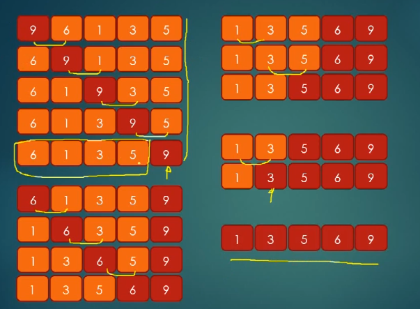

> 思路：从**头**扫一遍元素，在扫的过程中，如果发现**左边的比右边的大**，就让大的“沉到右边”。

```js
function bubbleSort(arr) {
  for (let finish = arr.length; finish > 0; finish--) {
    for (let i = 0; i < finish; i++) {
      if (arr[i - 1] > arr[i]) {
        [arr[i - 1], arr[i]] = [arr[i], arr[i - 1]];
      }
    }
  }
  return arr;
}
let res = bubbleSort([9, 3, 1, 4, 6, 8, 7, 2, 5]);
console.log(res); // [ 1, 2, 3, 4, 5, 6, 7, 8, 9 ]
```

::: tip
如果不知道怎么抽象化，可以多写几下具体的情况，但请注意在写**第二个**具体情况时一定要谨慎！一定要想好！就像这道题，先是“最右边的元素”落定之后再开始处理“从头到倒数第二个元素”。多去思考这个动态的过程。
:::

**时间复杂度: O(n2)
空间复杂度: O(1)**

### 插入排序

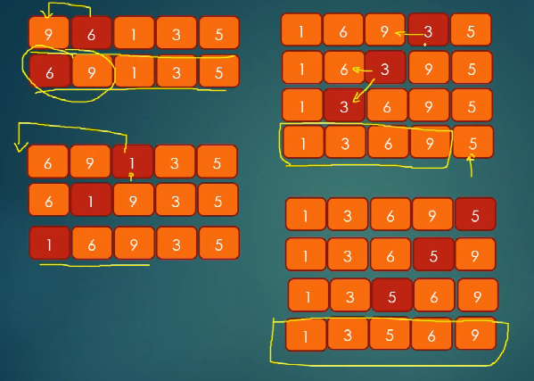

> 思路：就和平时打牌一样，每抓到一张牌，就将其插入到响应的位置。

```js
function insertSort(arr) {
  for (let start = 1; start < arr.length; start++) {
    //抽出第start张牌，然后将其与前面的数进行比较
    for (let i = start; i > 0; i--) {
      if (arr[i] < arr[i - 1]) {
        [arr[i - 1], arr[i]] = [arr[i], arr[i - 1]];
      }
    }
  }
  return arr;
}
let arr = insertSort([9, 3, 1, 4, 6, 8, 7, 2, 5]);
console.log(arr); //[ 1, 2, 3, 4, 5, 6, 7, 8, 9 ]
```

**时间复杂度：O(n2)
空间复杂度: O(1)**

### 归并排序

归并排序是分治法的典型应用。

所谓分治法，就是讲一个复杂的问题分解成小问题然后逐步求解，求完解之后再将答案**组织**到一起，其中求解并组织子问题的过程是最核心也是最复杂的。


```js
function mergeSort(arr) {
  //
  if (arr.length < 2) return arr;
  let mid = Math.floor(arr.length / 2);
  let left = arr.slice(0, mid);
  let right = arr.slice(mid);
  return merge(mergeSort(left), mergeSort(right));
}

function merge(left_arr, right_arr) {
  let tmp = [];
  let i = 0; //i指向前半数组的头
  let j = 0; //j指向后半数组的头
  let k = 0; //k指向缓存数组
  while (i < left_arr.length && j < right_arr.length) {
    if (left_arr[i] < right_arr[j]) {
      tmp[k++] = left_arr[i++];
    } else {
      tmp[k++] = right_arr[j++];
    }
  }
  //有可能上述操作完成之后left_arr或right_arr还没有跑完。
  while (i < left_arr.length) {
    tmp[k++] = left_arr[i++];
  }
  while (j < right_arr.length) {
    tmp[k++] = right_arr[j++];
  }
  return tmp;
}
let res = mergeSort([1, 5, 0, 9, 5, 4, 8, 15]);
console.log(res); //[ 0, 1, 4, 5, 5, 8, 9, 15 ]
```

**时间复杂度：O(nlogn)
空间复杂度:O(n)**

### 快速排序

在开始学习这个排序算法之前，建议先看下这个几分钟的小视频：[【TED-ed】快速排序是什么【6 小时字幕组】](https://www.bilibili.com/video/av10076626)

快速排序是我个人比较喜欢的一个算法，和归并相比，它的稳定性欠佳，但一般情况下都要比归并排序要快，空间复杂度也稍微有点大。但是它好写啊！逻辑清晰，转化成代码很容易。

> 思路:将数组的第一个数作为`compared_num`,然后遍历一遍数组，比这个数小的放左边，比这个数大的放右边，最后递归返回。

```js
function quickSort(arr) {
  //边界条件
  if (arr.length < 2) return arr;
  //把数组中的第一数选出来作为要比较的数
  let compared_num = arr[0];
  let letf_arr = [];
  let right_arr = [];
  //然后遍历一遍arr，讲比compared_num小的数放左边，比他大的放右边
  //注意是从第二个数开始
  for (let i = 1; i < arr.length; i++) {
    if (arr[i] < compared_num) {
      letf_arr.push(arr[i]);
    } else {
      right_arr.push(arr[i]);
    }
  }
  return quickSort(letf_arr).concat([compared_num], quickSort(right_arr));
}
let res = quickSort([3, 1, 2, 4, 5, 7, 7, 7]);
console.log(res); //[ 1, 2, 3, 4, 5, 7, 7, 7 ]
```

**时间复杂度：平均 O(nlogn)，最坏 O(n2)，实际上大多数情况下小于 O(nlogn)
空间复杂度: O(logn)**

### 堆与堆排序

优秀资源参考 [堆排序(heapSort)](https://www.bilibili.com/video/av47196993)

在讲解堆排序之前我们必须先弄明白`堆`是个啥。
<hide txt="PS:这里我们讨论的堆特指最大堆哦。"></hide>
堆是一种数据结构<hide txt="废话"></hide>,这种数据结构必须要满足下面两个条件。

1. 是一颗**完全二叉树**。
2. 这颗树上的每一个子节点都**不能大于**它的父节点。就像这样：
   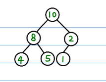

那**完全二叉树**又是个啥呢？

**完全二叉树**的定义取决于它生成节点的顺序，必须满足：

**从上到下，从左往右。**
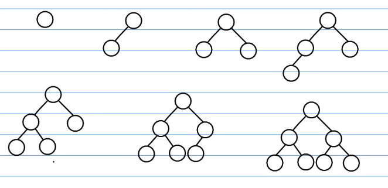

这里展示的便是一个符合定义的**堆**。
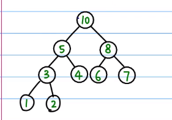

由于堆是一颗**从上往下，从左往右**生成的**二叉树**，因此我们可以很方便的用**一维数组**来表示一个堆。

如果我们将每一个节点都标上下标，

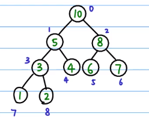
那么我们会发现堆中的每一个节点中的下标都会满足这样的关系：

```js
//假设当前节点的下标为 i
P_i = Math.floor((i - 1) / 2); //父节点下标
//左孩子和右孩子的下标
Ls_i = 2 * i + 1;
Rs_i = 2 * i + 2;
```

下面的代码演示了如何将一个用数组表示出来的二叉树变成一个堆。

```js
//对单个节点进行递归的heapify操作
function heapify(tree, i) {
  let end_node = Math.floor((tree.length - 1) / 2);
  if (i > end_node) return;
  //左右孩子的下标
  let ls_i = 2 * i + 1;
  let rs_i = 2 * i + 2;
  //假设第i个元素是最大的
  //如果它的两个儿子都比它大，那么久交换他们的位置
  if (ls_i < tree.length && tree[ls_i] > tree[i]) {
    [tree[i], tree[ls_i]] = [tree[ls_i], tree[i]];
  }
  if (rs_i < tree.length && tree[rs_i] > tree[i]) {
    [tree[i], tree[rs_i]] = [tree[rs_i], tree[i]];
  }
  heapify(tree, i + 1);
  return tree;
}
//如果要将一个完全混乱的二叉树变成一个堆，我们需要从最后一个节点开始“堆化”。
function full_heapify(tree) {
  let end_node = Math.floor((tree.length - 1) / 2);
  for (let i = end_node; i >= 0; i--) {
    heapify(tree, i);
  }
  return tree;
}

let res = full_heapify([1, 5, 7, 8, 9, 2]);
console.log(res); //[ 9, 8, 7, 1, 5, 2 ]
```

经过上面的操作，我们有一个堆了，那么我们如何将这个堆变成一个有序的数组呢？

很简单，对堆中的每一个元素，我们只需要这三步操作：

1. 先交换**堆顶**和**最后一个节点**
2. 砍断最后一个节点(此时的最后一个节点是最大值)，`push()`到一个容器中。
3. 上面的操作我们破坏了堆结构，因此需要重新进行“堆化”。(不用完全堆化，只针对根节点就可以)

代码如下

```js
function heapSort(arr) {
  let res = [];
  let tree = full_heapify(arr);
  //从树的最后一个元素开始
  for (let i = tree.length - 1; i >= 0; i--) {
    //先交换根节点和最后一个节点
    [tree[0], tree[tree.length - 1]] = [tree[tree.length - 1], tree[0]];
    //然后砍断最后一个节点
    res.push(tree.pop());
    //此时破坏了堆的解构，我们需要从根节点再次进行“堆化”
    heapify(tree, 0);
  }
  return res;
}

let res = heapSort([1, 2, 5, 8, 6, 4, 7, 8, 0.5, 6, 9, 100]);
console.log(res); //[ 100, 9, 8, 8, 7, 6, 6, 5, 4, 2, 1, 0.5 ]
```

## 二分搜索

二分搜索是一种在一个有序的容器中查找某一个元素的方法。

先来看一个最简单的例子
::: tip
假设给了一个有序数组和一个数，现在要判断这个数在这个数组中是否存在。
:::

```js
//判断一个元素是否在一个排好序的数组中存在

function binarySearch(arr, target) {
  if (arr.length < 1) return false;
  let mid = Math.floor(arr.length / 2);
  if (target == arr[mid]) return true;
  if (target < arr[mid]) {
    let left_arr = arr.slice(0, mid);
    return binarySearch(left_arr, target);
  }
  if (target > arr[mid]) {
    let right_arr = arr.slice(mid + 1, arr.length);
    return binarySearch(right_arr, target);
  }
}

let res = binarySearch([1, 2, 3, 4, 6, 7, 8, 9], 5);
console.log(res); //false

//非递归的写法
function binarySearch(arr, target) {
  let left = 0;
  let right = arr.length - 1;

  while (left <= right) {
    let mid = Math.floor((left + right) / 2);
    if (arr[mid] == target) return mid;
    if (arr[mid] > target) {
      right = mid - 1;
    }
    if (arr[mid] < target) {
      left = mid + 1;
    }
  }
  return -1;
}
let res = binarySearch([0, 2, 6, 7, 9, 11, 12, 45], 999);
console.log(res); //-1
```

### 可以返回索引值的二分查找

上面的二分查找只能返回 true 或者 false，返回索引值我们可以做更细节的处理

```js
function binsarySearch(arr, target, lp, rp) {
  if (lp > rp) {
    return -1;
  }

  let midIndex = Math.floor((lp + rp) / 2);
  let midVal = arr[midIndex];
  if (target === midVal) return midIndex;
  if (target < midVal) {
    //从左半旯开始找
    return binsarySearch(arr, target, lp, midIndex - 1);
  } else {
    return binsarySearch(arr, target, midIndex + 1, rp);
  }
}
```

- 二维数组中的查找
  ::: tip
  在一个二维数组中（每个一维数组的长度相同），每一行都按照从左到右递增的顺序排序，每一列都按照从上到下递增的顺序排序。请完成一个函数，输入这样的一个二维数组和一个整数，判断数组中是否含有该整数。
  :::
  > 思路：对每一行进行二分查找

```js
function Find(target, array) {
  for (let val of array) {
    let res = binarySearch(val, target);
    if (res == true) {
      return res;
    }
  }
  return false;
}

function binarySearch(arr, target) {
  if (arr.length < 1) return false;
  let mid = Math.floor(arr.length / 2);
  if (target == arr[mid]) return true;
  if (target < arr[mid]) {
    let left_arr = arr.slice(0, mid);
    return binarySearch(left_arr, target);
  }
  if (target > arr[mid]) {
    let right_arr = arr.slice(mid + 1, arr.length);
    return binarySearch(right_arr, target);
  }
}

let res = Find(10, [
  [1, 2, 3],
  [2, 4, 6],
  [7, 8, 9],
]);
console.log(res); //false
```

- 旋转数组中的最小数字
  ::: tip
  把一个数组最开始的若干个元素搬到数组的末尾，我们称之为数组的旋转。 输入一个非减排序的数组的一个旋转，输出旋转数组的最小元素。 例如数组{3,4,5,1,2}为{1,2,3,4,5}的一个旋转，该数组的最小值为 1。

注意：给出的所有元素都大于 0，若数组大小为 0，请返回 0。
:::

```js
/**
 * @param {number[]} numbers
 * @return {number}
 */
var minArray = function(numbers) {
  let left = 0,
    right = numbers.length;
  while (left < right) {
    if (numbers[left] > numbers[left + 1]) {
      return numbers[left + 1];
    }
    if (numbers[right] < numbers[right - 1]) {
      return numbers[right];
    }
    left++;
    right--;
  }
  return numbers[0];
};
```

- 统计一个数字在排序数组中出现的次数(知识迁移)
  ::: tip
  统计一个数字在排序数组中出现的次数。
  :::
  这题好写，套个二分，找下初始位置。

```js
var search = function(nums, target) {
  let left = binarySearch(nums, target);
  const value = nums[left];
  if (left == -1) {
    return 0;
  }
  let right = left;
  let res = 1;
  while (true) {
    left--;
    if (nums[left] != value) break;
    res++;
  }
  while (true) {
    right++;
    if (nums[right] != value) break;
    res++;
  }
  return res;
};

function binarySearch(arr, target) {
  let left = 0;
  let right = arr.length - 1;

  while (left <= right) {
    let mid = Math.floor((left + right) / 2);
    if (arr[mid] == target) return mid;
    if (arr[mid] > target) {
      right = mid - 1;
    }
    if (arr[mid] < target) {
      left = mid + 1;
    }
  }
  return -1;
}
```

## 链表

```js
class Node {
  constructor(data) {
    this.data = data;
    this.next = null;
  }
}

class LinkedList {
  constructor() {
    this.header = null;
    this.length = 0;
  }
  append(data) {
    let newNode = new Node(data);
    //判断是否添加的是第一个节点
    if (this.length == 0) {
      this.header = newNode;
    } else {
      let current = this.header;
      //current先保存第一个节点
      while (current.next) {
        current = current.next;
      }
      current.next = newNode;
    }
    this.length++;
  }
  print() {
    let res = [];
    let current = this.header;
    while (current) {
      res.push(current.data);
      current = current.next;
    }
    console.log(res);
  }
}
let ls = new LinkedList();
ls.append('第一个节点');
ls.append('第二个节点');
ls.append('第三个节点');

ls.print();
```

## 二叉树

### 遍历问题

在遍历树的过程中，我们可以采取两种策略，一种是**DFS**，一种是**BFS**。

其中**DFS**可以根据访问当前节点，访问左子树和访问右子树的顺序将其再次细分为**前序遍历**，**中序遍历**和**后序遍历**。

- [前序遍历](https://leetcode-cn.com/problems/binary-tree-preorder-traversal/)

**当前节点 => 左子树 => 右子树**

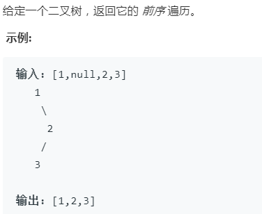

```js
/**
 * Definition for a binary tree node.
 * function TreeNode(val) {
 *     this.val = val;
 *     this.left = this.right = null;
 * }
 */
/**
 * @param {TreeNode} root
 * @return {number[]}
 */
var preorderTraversal = function(root, array = []) {
  //增加一个可选参数的入口，用于递归调用
  if (root) {
    array.push(root.val);
    //这个array要给它传到递归函数的内部，不然遍历过得遍历无法保存！
    preorderTraversal(root.left, array);
    preorderTraversal(root.right, array);
  }
  return array;
};
```

- 中序遍历

**左子树 => 当前节点 => 右子树**

```js
/**
 * Definition for a binary tree node.
 * function TreeNode(val) {
 *     this.val = val;
 *     this.left = this.right = null;
 * }
 */
/**
 * @param {TreeNode} root
 * @return {number[]}
 */
var inorderTraversal = function(root, array = []) {
  if (root) {
    inorderTraversal(root.left, array);
    array.push(root.val);
    inorderTraversal(root.right, array);
  }
  return array;
};
```

- 后序遍历

**左子树 => 右子树 => 当前节点**

```js
/**
 * Definition for a binary tree node.
 * function TreeNode(val) {
 *     this.val = val;
 *     this.left = this.right = null;
 * }
 */
/**
 * @param {TreeNode} root
 * @return {number[]}
 */
var postorderTraversal = function(root, array = []) {
  if (root) {
    postorderTraversal(root.left, array);
    postorderTraversal(root.right, array);
    array.push(root.val);
  }
  return array;
};
```

- [重建二叉树](https://leetcode-cn.com/problems/zhong-jian-er-cha-shu-lcof/)

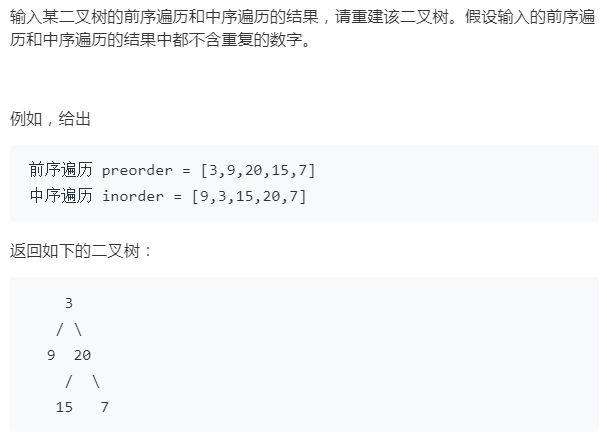

这道题的核心点很简单，前序遍历的第一个节点肯定是根节点，此时你去看一下这个根节点在中序遍历中的位置会发现：
左边那一坨是左子树的元素，右边那一坨是右子树的元素。

思考分治问题要遵循一个原则：**不要多想！**，只需要关注递归方法的返回值即可。

```js
/**
 * Definition for a binary tree node.
 * function TreeNode(val) {
 *     this.val = val;
 *     this.left = this.right = null;
 * }
 */
/**
 * @param {number[]} preorder
 * @param {number[]} inorder
 * @return {TreeNode}
 */
var buildTree = function(preorder, inorder) {
  if (preorder.length == 0) return null;
  if (inorder.length == 0) return null;
  let rootVal = preorder.shift();
  //用于记录根节点在inorder中的位置
  let root_indexINinorder = null;
  for (let i in inorder) {
    if (inorder[i] == rootVal) {
      root_indexINinorder = i;
    }
  }
  //写完发现傻逼了，忘了有个方法叫indexof

  //将这两个数组分别截成四个部分
  let left_inorder = inorder.slice(0, root_indexINinorder);
  let right_inorder = inorder.slice(++root_indexINinorder, inorder.length);
  let left_preorder = preorder.slice(0, left_inorder.length);
  let right_preorder = preorder.slice(left_inorder.length, preorder.length);

  let root = new TreeNode(rootVal);
  root.left = buildTree(left_preorder, left_inorder, root);
  root.right = buildTree(right_preorder, right_inorder, root);
  return root;
};
```

### 广度优先搜索

- 从上往下遍历二叉树

1. [不分行直接遍历](https://leetcode-cn.com/problems/cong-shang-dao-xia-da-yin-er-cha-shu-lcof/)

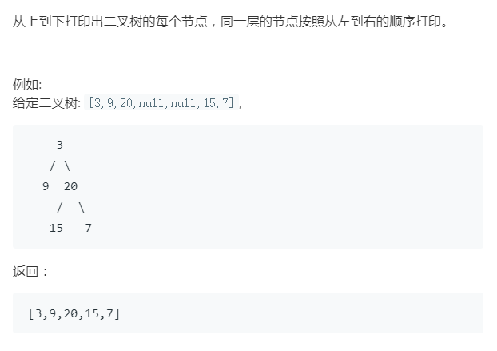

层序遍历的话肯定少不了用**队列**这种结构，先让父节点入队，当父节点出队的时候，再让自己的左右两个子节点依次入队。

而对于子节点依旧采取这样的操作，所以你会观察到:

**当第一层出队的时候，第二层已经完全入队；当第二层出队的时候，第三层已经完全入队。**

因此我们只需要在出队的时候对其进行访问便能够达到层次遍历的效果。

```js
/**
 * Definition for a binary tree node.
 * function TreeNode(val) {
 *     this.val = val;
 *     this.left = this.right = null;
 * }
 */
/**
 * @param {TreeNode} root
 * @return {number[]}
 */
var levelOrder = function(root) {
  let quque = [];
  let res = [];
  if (root) {
    quque.push(root);
  }
  while (quque.length > 0) {
    let node = quque.shift();
    res.push(node.val);
    //放完节点后判断下是否存在孩子，有的话放到队列中去
    if (node.left != null) {
      quque.push(node.left);
    }
    if (node.right != null) {
      quque.push(node.right);
    }
  }
  return res;
};
```

2. [分行遍历](https://leetcode-cn.com/problems/cong-shang-dao-xia-da-yin-er-cha-shu-ii-lcof/)

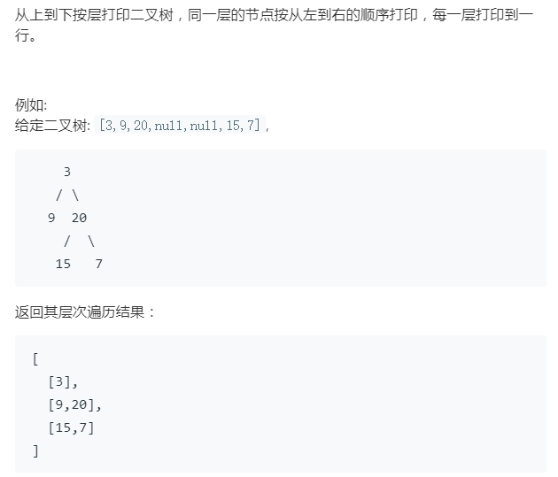

这道题唯一的麻烦点在于不清楚如何去获取每一层的长度，其实我们只需要在**元素第一次出队之前**记录一下就能获取每一层的长度了<hide txt="为什么我就想不到嘤嘤嘤"></hide>，知道长度后我们就明白接下来该进行几次操作。

```js
var levelOrder = function(root) {
  if (!root) return [];
  const res = [];
  const queue = [root];
  while (queue.length) {
    const preLength = queue.length;

    const layer = [];
    for (let i = 0; i < preLength; i++) {
      const curNode = queue.shift();
      curNode.left && queue.push(curNode.left);
      curNode.right && queue.push(curNode.right);
      layer.push(curNode.val);
    }
    res.push(layer);
  }
  return res;
};
```

::: warning
反思:这道题做的我很沮丧，这道题甚至让我怀疑自己最基本的编程功底，可能自己题量刷的还是不够吧。。
其实 while 循环就是一个循环版的 if 条件，自己平时写代码可能用的也比较少。
:::

3. [之字形遍历](https://leetcode-cn.com/problems/cong-shang-dao-xia-da-yin-er-cha-shu-iii-lcof/)

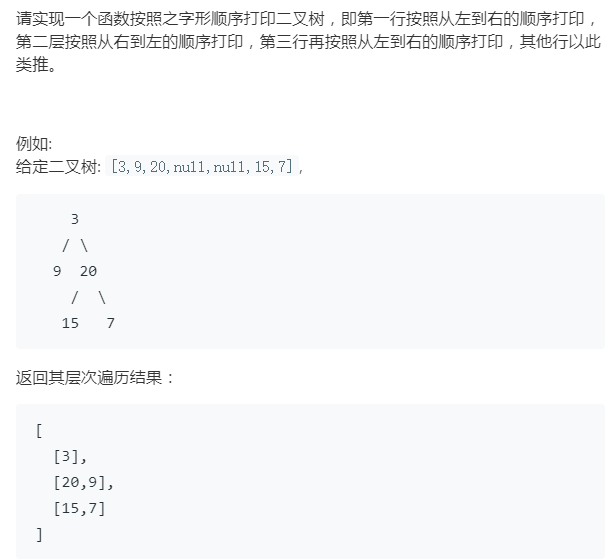

上道题如果弄明白这道题就很简单了，只需要记录一下层数，将偶数行`reverse()`一下就 OK。
```js
/**
 * Definition for a binary tree node.
 * function TreeNode(val) {
 *     this.val = val;
 *     this.left = this.right = null;
 * }
 */
/**
 * @param {TreeNode} root
 * @return {number[][]}
 */
var levelOrder = function(root) {
    if(!root) return [];
    const res = [];
    const queue = [root];
    let count = 1;
    while(queue.length){
        const preLength = queue.length;
        const layer = [];
        for(let i = 0;i<preLength;i++){        
            const curNode = queue.shift();
            curNode.left && queue.push(curNode.left);
            curNode.right && queue.push(curNode.right);
            layer.push(curNode.val);
        }
        (count % 2 === 0)&&layer.reverse();
        res.push(layer);
        count++;
    }
    return res
};
```

### 二叉树的深度

- 二叉树的深度

```js
/**
 * Definition for a binary tree node.
 * function TreeNode(val) {
 *     this.val = val;
 *     this.left = this.right = null;
 * }
 */
/**
 * @param {TreeNode} root
 * @return {number}
 */
var maxDepth = function(root) {
  if (!root) return 0;
  //二叉树的深度 = 左子树的深度与右子树深度的最大值+1
  let left = maxDepth(root.left);
  let right = maxDepth(root.right);
  return Math.max(left, right) + 1;
};
```

- [平衡二叉树](https://leetcode-cn.com/problems/ping-heng-er-cha-shu-lcof/)

输入一棵二叉树的根节点，判断该树是不是平衡二叉树。如果某二叉树中任意节点的左右子树的深度相差不超过 1，那么它就是一棵平衡二叉树。

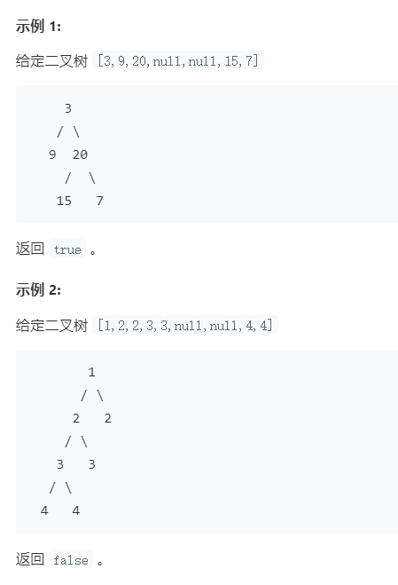

唉，对于我这样的笨孩子也只能这么做了呜呜呜~~

大概的思路就是对每一个节点进行一个左右深度的判断，如果都满足最后返回 true

```js
/**
 * Definition for a binary tree node.
 * function TreeNode(val) {
 *     this.val = val;
 *     this.left = this.right = null;
 * }
 */
/**
 * @param {TreeNode} root
 * @return {boolean}
 */
var isBalanced = function(root) {
  //既然提到了“任意”，那就说明必须先遍历一遍这个二叉树
  let res = dfs(root);
  for (let val of res) {
    if (val == false) return false;
  }
  return true;
};

function dfs(root, array = []) {
  if (root) {
    array.push(isBalanced_node(root));
    dfs(root.left, array);
    dfs(root.right, array);
  }
  return array;
}

function isBalanced_node(node) {
  if (node == null) return true;
  let left_depth = deep(node.left);
  let right_depth = deep(node.right);
  if (Math.abs(left_depth - right_depth) <= 1) {
    return true;
  } else return false;
}

function deep(root) {
  if (root == null) return 0;
  let left = deep(root.left);
  let right = deep(root.right);
  return Math.max(left, right) + 1;
}
```

### 二叉树的对称性

- [对称的二叉树](https://leetcode-cn.com/problems/dui-cheng-de-er-cha-shu-lcof/submissions/)

```js
/**
 * Definition for a binary tree node.
 * function TreeNode(val) {
 *     this.val = val;
 *     this.left = this.right = null;
 * }
 */
/**
 * @param {TreeNode} root
 * @return {boolean}
 */
var isSymmetric = function(root) {
  return isSymmetricTree(root, root);
};
function isSymmetricTree(node1, node2) {
  //先去考虑下这两个节点的存在情况
  if (!node1 || !node2) {
    //如果俩全都不存在的话就说明他们对称
    if (!node1 && !node2) {
      return true;
      //剩下的情况就是这俩只有一个存在
    } else return false;
  }
  //值不相等不对称
  if (node1.val != node2.val) {
    return false;
  }
  //注意镜像对称时满足的条件
  return (
    isSymmetricTree(node1.left, node2.right) &&
    isSymmetricTree(node1.right, node2.left)
  );
}
```

### 二叉搜索树

- [二叉搜索树的第 K 个节点](https://www.nowcoder.com/practice/ef068f602dde4d28aab2b210e859150a?tpId=13&tqId=11215&tPage=1&rp=1&ru=/ta/coding-interviews&qru=/ta/coding-interviews/question-ranking)
  思路一：暴力遍历一遍然后排个序。

```js
/* function TreeNode(x) {
    this.val = x;
    this.left = null;
    this.right = null;
} */
function KthNode(pRoot, k) {
  // write code here
  if (!pRoot) return undefined;
  let res = dfs(pRoot);
  res.sort((a, b) => {
    return a.val - b.val;
  });
  return res[k - 1];
}

function dfs(root, array = []) {
  if (root) {
    array.push(root);
    dfs(root.left, array);
    dfs(root.right, array);
  }
  return array;
}
```

当然这样做就没意思了，其实这道题如果知道一个结论会很简单。

**中序遍历一个二叉搜索树时本来就是排好序的！**<hide txt="哇！好神奇呢~~"></hide>

```js
/* function TreeNode(x) {
    this.val = x;
    this.left = null;
    this.right = null;
} */
function KthNode(pRoot, k) {
  // write code here
  if (!pRoot) return undefined;
  let res = dfs(pRoot);
  return res[k - 1];
}

function dfs(root, array = []) {
  if (root) {
    dfs(root.left, array);
    array.push(root);
    dfs(root.right, array);
  }
  return array;
}
```

## 递归

> 模板

```js
function recursive(level, ...args) {
  if (level >= max_level) {
    //记录结果
    return;
  }
  // 处理当前层逻辑
  // 递归到下一层
  recursive(level + 1, ...args);
  // 恢复到之前的状态
}
```

递归终结条件 => 处理当前层逻辑 => 递归到下一层 => 恢复当前层外部状态

- 斐波那契
  记忆化的题目可以利用一个 map 来缓存下中间计算的结果，如果 map 中有的话就不用重复计算

```js
/**
 * @param {number} n
 * @return {number}
 */
var fib = function(n) {
  //小于2的情况
  if (n < 2) {
    return n;
  }
  //如果大于2，就采用记忆化的方法
  //如果要记忆化，首先要有一个记忆化的容器
  let map = new Map();
  map.set(0, 0);
  map.set(1, 1);

  function memoize(number) {
    if (map.get(number) !== undefined) return map.get(number);

    let val = memoize(number - 1) + memoize(number - 2);
    //这一步是核心中的核心，将计算的结果缓存到map中
    map.set(number, val % 1000000007);
    return val % 1000000007;
  }
  return memoize(n);
};
```

- 跳台阶
  其实就是变形版的斐波那契

```js
/**
 * @param {number} n
 * @return {number}
 */
var numWays = function(n) {
  //小于2的情况
  if (n == 0) return 1;
  if (n == 1) return 1;
  //如果大于2，就采用记忆化的方法
  //如果要记忆化，首先要有一个记忆化的容器
  let map = new Map();
  map.set(0, 1);
  map.set(1, 1);

  function memoize(number) {
    if (map.get(number) !== undefined) return map.get(number);

    let val = memoize(number - 1) + memoize(number - 2);
    //这一步是核心中的核心，将计算的结果缓存到map中
    map.set(number, val % 1000000007);
    return val % 1000000007;
  }
  return memoize(n);
};
```

## 数组

- 反转数组
- 去掉数组中重复的元素

## 栈与队列

- 用两个栈实现队列

```js
var CQueue = function() {
  this.inStack = [];
  this.outStack = [];
};

/**
 * @param {number} value
 * @return {void}
 */
CQueue.prototype.appendTail = function(value) {
  this.inStack.push(value);
};

/**
 * @return {number}
 */
CQueue.prototype.deleteHead = function() {
  const { inStack, outStack } = this;
  if (outStack.length != 0) {
    return outStack.pop();
  } else {
    //如果out里没东西，就从in里面拿
    while (inStack.length != 0) {
      outStack.push(inStack.pop());
    }
    return outStack.pop() || -1;
  }
};

/**
 * Your CQueue object will be instantiated and called as such:
 * var obj = new CQueue()
 * obj.appendTail(value)
 * var param_2 = obj.deleteHead()
 */
```

- 包含 min 函数的栈
  PS:在 leetcode 上最后一个极端的样例一直过不了。。。

```js
/**
 * initialize your data structure here.
 */
var MinStack = function() {
  //整一个最小值队列
  this.min_num = [];
  this.arr = [];
};
MinStack.prototype = [];

/**
 * @param {number} x
 * @return {void}
 */
MinStack.prototype.push = function(x) {
  let mintmp = this.min_num[this.min_num.length - 1];
  if (x <= mintmp || mintmp == null) this.min_num.push(x);
  this.arr.push(x);
};

/**
 * @return {void}
 */
MinStack.prototype.pop = function() {
  let val = this.arr.pop();
  if (
    val === this.min_num[this.min_num.length - 1] &&
    this.min_num.length > 1
  ) {
    this.min_num.pop();
  }
};

/**
 * @return {number}
 */
MinStack.prototype.top = function() {
  return this.arr[this.arr.length - 1];
};

/**
 * @return {number}
 */
MinStack.prototype.min = function() {
  return this.min_num[this.min_num.length - 1];
};
```

- 滑动窗口的最大值

```js
/**
 * @param {number[]} nums
 * @param {number} k
 * @return {number[]}
 */
var maxSlidingWindow = function(nums, k) {
  if (nums.length == 0) return [];
  let res = [];
  //区间遍历
  for (let i = 0; i + k <= nums.length; i++) {
    let max = Math.max(...nums.slice(i, i + k));
    res.push(max);
  }
  return res;
};
```

## 哈希表

- 数组中重复的数字
  遍历每一个数组，并将其添加到对象中(添加的时候用键值对记录)

```js
/**
 * @param {number[]} nums
 * @return {number}
 */
var findRepeatNumber = function(nums) {
  const map = {};
  for (let num of nums) {
    if (!map[num]) {
      map[num] = true;
    } else {
      return num;
    }
  }
};
```

- 字符流中第一个不重复的字符

蛮简单的，主要就是用 hash 表跑一会记录一下，不过要先初始化

```js
/**
 * @param {string} s
 * @return {character}
 */
var firstUniqChar = function(s) {
  let res = ' ';

  let map = {};
  //初始化计数器
  for (let val of s) {
    map[val] = 0;
  }
  //访问到对应的key，就将其的val+1
  for (let val of s) {
    map[val]++;
  }

  for (let key in map) {
    if (map[key] === 1) {
      return key;
    }
  }
  return res;
};
```

## 链表

### 利用双向链表和 hashMap 实现一个 LRUCache

::: tip
这道体的关键点在于想清楚 map 里的 value 应该存的是双向链表的 node.
:::

```ts
class DoubleLinkedListNode {
  public key: number;
  public value: number;
  public pre: DoubleLinkedListNode | null = null;
  public next: DoubleLinkedListNode | null = null;
  constructor(key, value) {
    this.key = key;
    this.value = value;
  }
}

class LRUCache {
  private capacity: number;
  private hashmap = {};
  private dummyHead: DoubleLinkedListNode;
  private dummyTail: DoubleLinkedListNode;
  constructor(capacity: number) {
    this.capacity = capacity;
    this.dummyHead = new DoubleLinkedListNode(null, null);
    this.dummyTail = new DoubleLinkedListNode(null, null);
    this.dummyHead.next = this.dummyTail;
    this.dummyTail.pre = this.dummyHead;
  }

  private isFull() {
    return Object.keys(this.hashmap).length === this.capacity;
  }

  private removeNode(node: DoubleLinkedListNode) {
    // 移除双向链表中的节点
    node.pre.next = node.next;
    node.next.pre = node.pre;
    node.pre = null;
    node.next = null;
    return node;
  }

  private addToHead(node: DoubleLinkedListNode) {
    const head = this.dummyHead.next;
    node.next = head;
    head.pre = node;
    node.pre = this.dummyHead;
    this.dummyHead.next = node;
  }

  get(key: number): number {
    if (key in this.hashmap) {
      const node = this.hashmap[key];
      this.addToHead(this.removeNode(node));
      return node.value;
    } else {
      return -1;
    }
  }

  put(key: number, value: number): void {
    if (key in this.hashmap) {
      const node = this.hashmap[key];
      node.value = value;
      this.addToHead(this.removeNode(node));
    } else {
      if (this.isFull()) {
        const node = this.dummyTail.pre;
        // 删除对应的节点,同时要记得维护链表的结构
        delete this.hashmap[node.key];
        this.removeNode(node);
      }
      const node = new DoubleLinkedListNode(key, value);
      this.hashmap[key] = node;
      this.addToHead(node);
    }
  }
}
```

### 基本应用

- 合并两个有序链表

```ts
function mergeTwoLists(
  l1: ListNode | null,
  l2: ListNode | null
): ListNode | null {
  const dummy = new ListNode(null);
  let cur = dummy;

  while (l1 && l2) {
    if (l1.val < l2.val) {
      cur.next = l1;
      l1 = l1.next;
    } else {
      cur.next = l2;
      l2 = l2.next;
    }
    cur = cur.next;
  }

  if (l1) {
    cur.next = l1;
  }

  if (l2) {
    cur.next = l2;
  }

  return dummy.next;
}
```

- 删除链表中的节点

```js
/**
 * Definition for singly-linked list.
 * function ListNode(val) {
 *     this.val = val;
 *     this.next = null;
 * }
 */
/**
 * @param {ListNode} head
 * @param {number} val
 * @return {ListNode}
 */
var deleteNode = function(head, val) {
  let pre = new ListNode('虚拟头结点');
  //将pre节点与头结点相连
  pre.next = head;
  //从preNode开始遍历
  let preNode = pre;

  while (preNode.next) {
    //关键在这里，让它的下一个节点值去进行比较
    if (preNode.next.val != val) {
      preNode = preNode.next;
    } else {
      preNode.next = preNode.next.next;
      break;
    }
  }
  return pre.next;
};
```

- 反转链表

```js
/**
 * Definition for singly-linked list.
 * function ListNode(val) {
 *     this.val = val;
 *     this.next = null;
 * }
 */
/**
 * @param {ListNode} head
 * @return {ListNode}
 */
var reverseList = function(head) {
  let pre = null;
  let cur = head;
  while (cur) {
    //保存一份cur.next的拷贝
    let curNext = cur.next;
    if (pre === null) {
      cur.next = null;
    } else {
      cur.next = pre;
    }
    //步进两个指针
    pre = cur;
    cur = curNext;
  }
  return pre;
};
```

- 反转链表 2

```js
function reverseBetween(
  head: ListNode | null,
  m: number,
  n: number
): ListNode | null {
  if (head == null || m === n) return head;
  let pre = null;
  let cur = head;
  let next = head;

  for (let i = 1; i < m; i++) {
    pre = cur;
    cur = cur.next;
    next = cur;
  }

  // backup
  let originPre = pre;
  let originCur = cur;

  for (let i = m; i <= n; i++) {
    next = cur.next;
    cur.next = pre;
    pre = cur;
    cur = next;
  }
  // 这步也是个关键
  if (originPre !== null) {
    originPre.next = pre;
  } else {
    // 如果m的值是从最左边开始的,那么让head直接指向pre即可
    head = pre;
  }
  originCur.next = cur;

  return head;
}
```

### 双指针

- 求链表的下中点

```ts
function middleNode(head: ListNode | null): ListNode | null {
  let slow = head;
  let fast = head;
  while (fast && fast.next) {
    slow = slow.next;
    fast = fast.next.next;
  }
  return slow;
}
```

- 重排链表
  首提 AC
  利用栈把中点往后的链表给推进去,然后重新链接

```ts
function reorderList(head: ListNode | null): void {
  const midNode = getMidNode(head);
  let left = head;
  let stack: ListNode[] = [];
  let cur = midNode;
  while (cur) {
    stack.push(cur);
    cur = cur.next;
  }

  while (stack.length > 0) {
    const node = stack.pop();
    const left_next = left.next;
    left.next = node;
    if (stack.length === 0) {
      node.next = null;
    } else {
      node.next = left_next;
    }
    left = left_next;
  }
}

function getMidNode(head: ListNode) {
  let slow = head;
  let fast = head;

  while (fast && fast.next) {
    slow = slow.next;
    fast = fast.next.next;
  }
  return slow;
}
```

- 两个链表的第一个公共节点
  两个链表同时入栈，然后同时出栈，第一个相同的节点就是要求的结果

```js
/**
 * @param {ListNode} headA
 * @param {ListNode} headB
 * @return {ListNode}
 */
var getIntersectionNode = function(headA, headB) {
  let stackA = [];
  let stackB = [];
  let curA = headA;
  let curB = headB;
  if (curA == null || curB == null) return null;
  if (curA == curB) return curA;
  while (curA) {
    stackA.push(curA);
    curA = curA.next;
  }
  while (curB) {
    stackB.push(curB);
    curB = curB.next;
  }
  //同时出栈,定义一个变量保存最后结果
  let res = null;
  while (true) {
    let a = stackA.pop();
    let b = stackB.pop();
    if (a != b) {
      return res;
    } else res = a;
  }
};
```

- 链表中倒数第 K 个节点
  **故 计 重 施**

```js
/**
 * Definition for singly-linked list.
 * function ListNode(val) {
 *     this.val = val;
 *     this.next = null;
 * }
 */
/**
 * @param {ListNode} head
 * @param {number} k
 * @return {ListNode}
 */
var getKthFromEnd = function(head, k) {
  let stack = [];
  let cur = head;
  while (cur) {
    stack.push(cur);
    cur = cur.next;
  }
  let res = null;
  for (let i = 0; i < k; i++) {
    res = stack.pop();
  }
  return res;
};
```

- 环形链表
- 回文字符串

## 回溯

### 字符串的排列

```js
/**
 * @param {string} s
 * @return {string[]}
 */
var permutation = function(s) {
  let result = [];
  if (s) {
    //queue为未排序的字符
    let queue = s.split('');
    dfs(queue, result);
  }
  //?
  return [...new Set(result)];
};
//temp用于存储需要进入排列的那一个字符
//current用于记录已经排好序的字符
function dfs(queue = [], result, temp = '', current = '') {
  //先将需要排序的字符添加到current上面
  current += temp;

  if (queue.length == 0) {
    result.push(current);
    return;
  }
  for (let i = 0; i < queue.length; i++) {
    temp = queue.shift();
    dfs(queue, result, temp, current);
    queue.push(temp);
  }
}

let res = permutation('abc');
console.log(res);
```

### 回溯二叉树的所有路径

```ts
function hasPathSum(root: TreeNode | null, targetSum: number): boolean {
  if (!root) return false;
  const path = [];
  const res: number[][] = [];

  function dfs(node: TreeNode) {
    if (!node) return;
    path.push(node.val);

    if (!node.left && !node.right) {
      res.push([...path]);
    } else {
      node.left && dfs(node.left);
      node.right && dfs(node.right);
    }
    path.pop();
  }
  dfs(root);
  console.log(res);
  return false;
}
```
