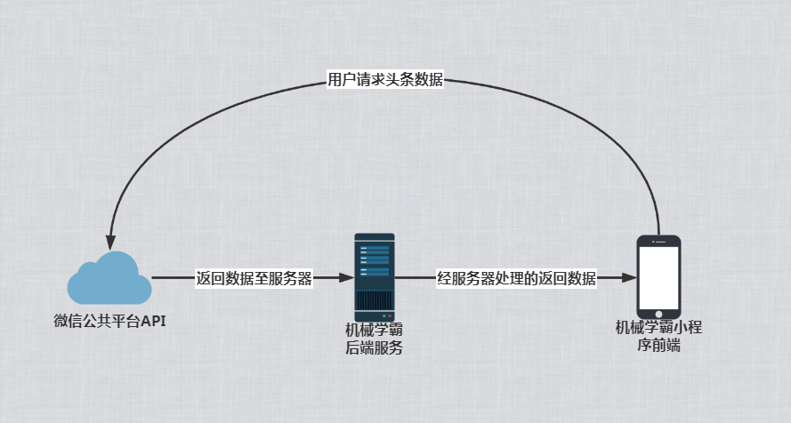
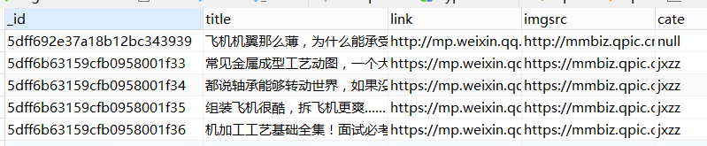
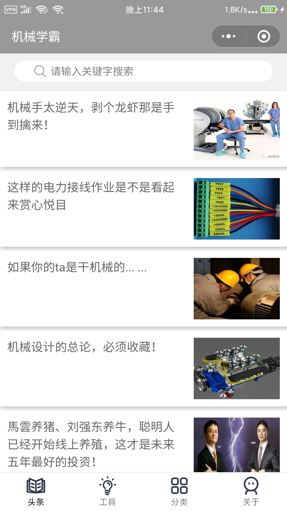
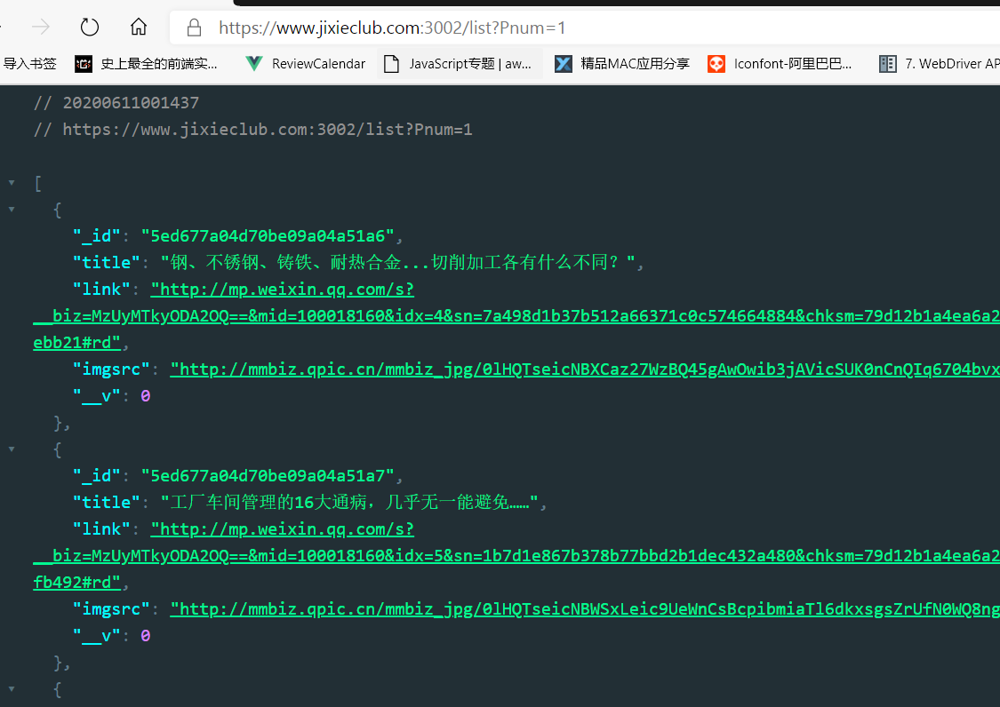
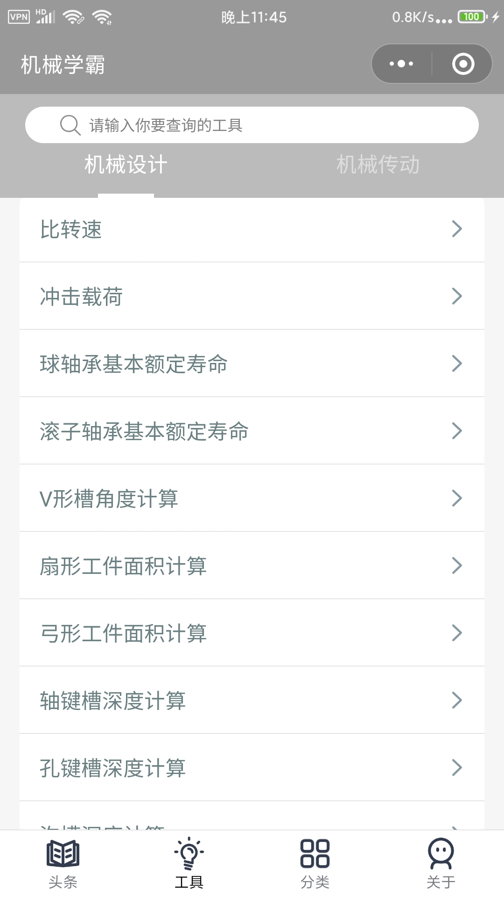
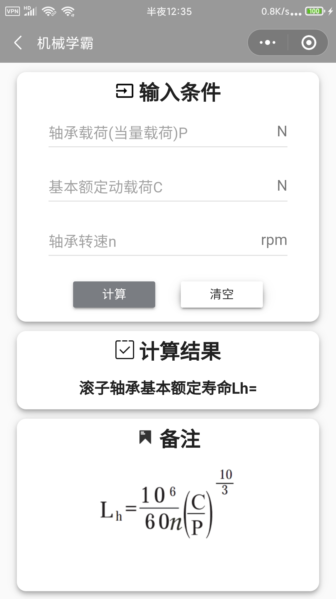
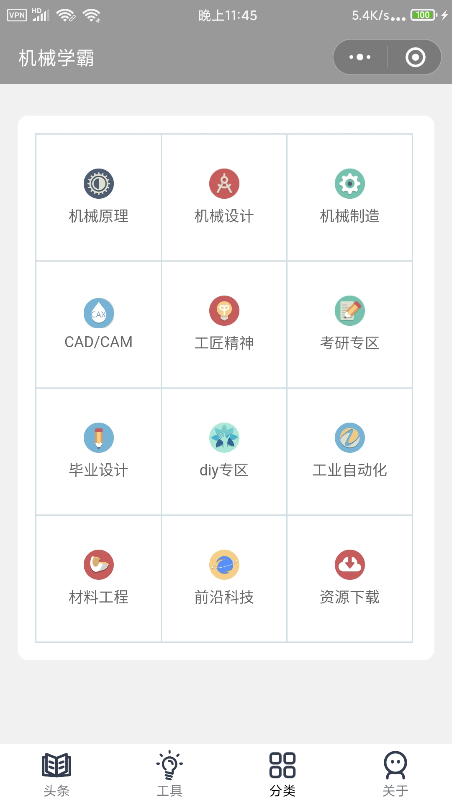
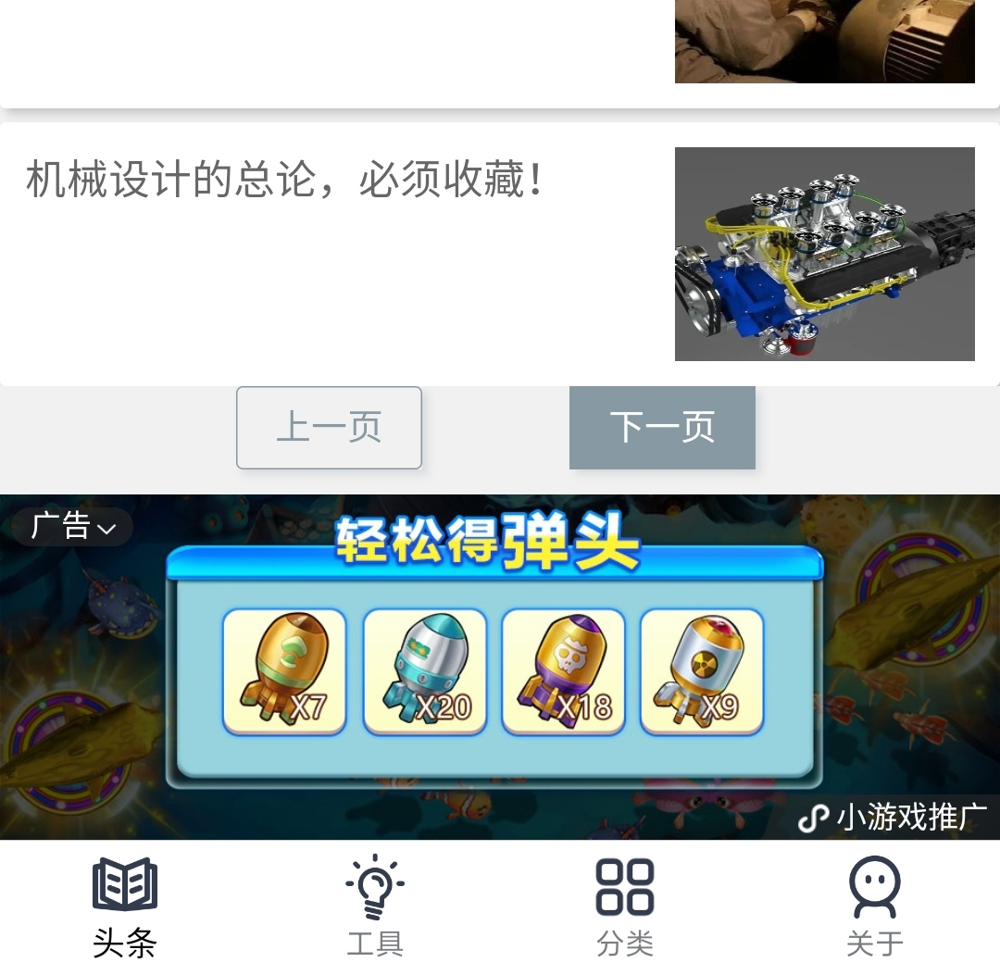
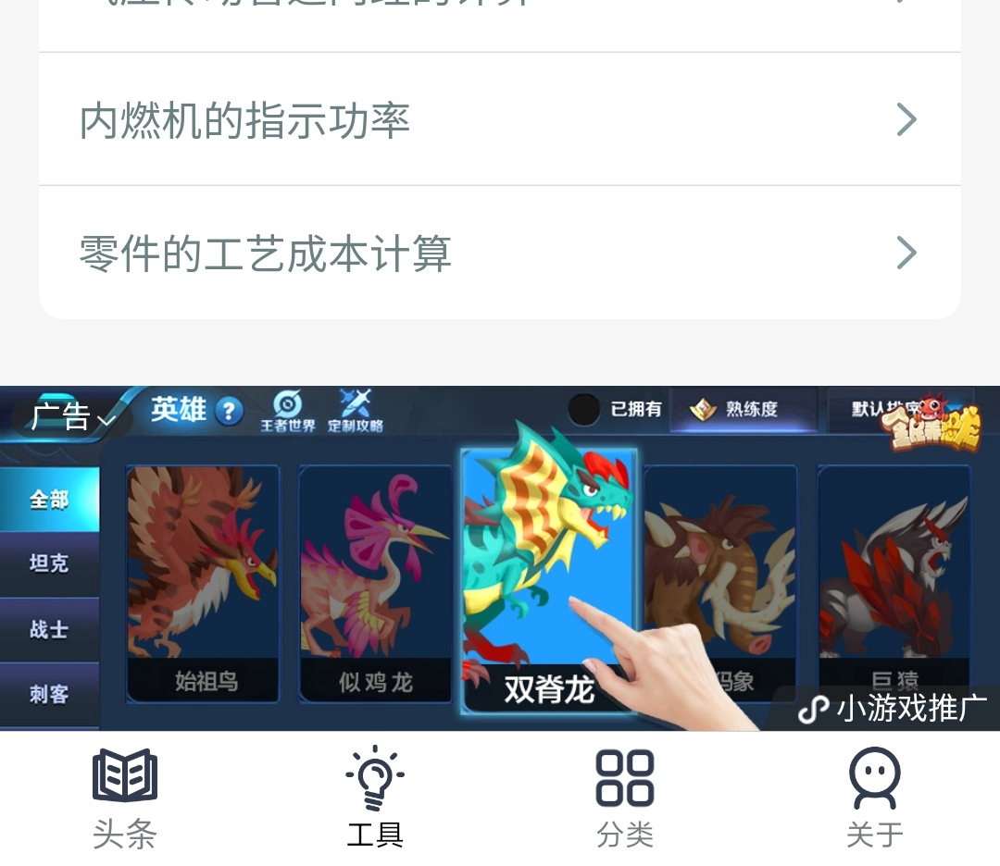

## 需求分析

在机械与自动化领域，对于从业人员存在着两个核心痛点。

一是无法及时获取到与之专业相匹配的信息流，二是在平时的生产活动中，大量工程计算的公式往往需要查阅专业手册，然后进行手动计算，相对耗时耗力。

对于前一个需求点，机械学霸公众号每周都会推送相应的专业文章，但由于其基于微信公众号平台，因此对于文章信息无法实现复杂的逻辑（如分类，查询等等）。而对于后一个需求点，目前市场上暂时还没有找到以小程序为载体的计算工具，而如果基于微信平台开发出一个针对机械领域工作的小程序，或多或少会对机械相关人员的工作和学习带来一定的帮助。

## 概要设计

而对于小程序而言，主要的需求点包括两大板块，一个是头条区，一个是工具区。这两大区块均支持搜索。其中头条区的文章允许管理员手动分类到分类板块。

网站的后端主要用 express(nodejs)+MongoDB 数据库实现。

在头条页面，当用户请求头条数据，在前端会直接调用微信公共平台的 api 来获取数据，但头条数据并不会直接返回给前端，而是经过后端服务器将数据格式化后再返回给前端，如图所示：

在服务器上每隔 24 个小时便会自动从微信公共平台拉取数据到 MongoDB 数据库中，管理员可以通过 Navicat 等第三方数据库客户端对相应的新闻进行手动分类，当用户打开某一个分类板块时，会向后端 api 发送携带分类字段的 get 请求，此时后端便可以根据对应的分类字段返回相应的头条数据，架构逻辑如图所示：

工具页面会涉及到大量的计算工具页面，如果将这些页面全部写到小程序中是行不通的，因为微信小程序有不允许超过 2M 的限制。此时我们可以采用将工具页面部署到自己的服务器，然后在小程序中通过 webview 组件将工具页面以第三方网站的形式加载进来，

## 详细设计

### 头条区和分类区的数据模型

新闻的数据模型如下所示：

其中`id`字段为默认生成，`title`字段为新闻标题，`link`字段为新闻链接，imgsrc 字段为新闻的预览图片，`cate`字段为文章所属的分类。

### 头条区

头条区块的 UI 页面如下图：

顶部是一个搜索框，当用户搜索时，搜索的关键字会由经后端的 api 检索数据库中的数据。

头条区的文章非常多，如果全部请求下来会造成页面卡顿，因此我们对头条区的文章进行了分页处理:每页最多渲染 15 条数据，当用户触底需点击下一页。

因此前端在请求数据的时候会将“页码”作为参数传递给后端，后端进行相应的逻辑处理后便可实现分页查询数据库，并将查询结果以 JSON 的形式返回给前端。

当用户查看了某篇新闻，可通过消息卡片的形式将其转发给其他微信用户，如下所示：

该功能的实现主要调用了微信提供的`onShareAppMessage`接口，只需要返回相应的数据即可实现。

### 工具区

工具区块的 UI 页码如下图：

主要的工具分类包括`机械设计`和`机械传动`。该页面在小程序上主要的作用是导航，每一个工具都会对应一个路由，当点击某一个工具时，会将路由地址处理为 url，然后跳转到指定的 webview，如下所示：

这些第三方的 webapp 使用 Vue 框架编写，计算逻辑放到了 web 前端层。

这些工具页多达 100 多个，而且是用 Vue 编写的单页应用，为了优化加载速度，我们引入了`vue-router`,并做了按需加载的处理，这样就可以让单页应用也能够像传统的 web 站点那样根据 url 加载，从而大大缩短加载时间。

### 分类区

分类区的逻辑和头条区的逻辑基本一致，只需要在请求的时候携带上分类的字段给后端，然后从数据库中进行检索。

分类区的 UI 如下所示：

## 测试报告

## 安装及使用

本项目为微信小程序，已经部署上线，无需安装。只需在微信端搜索“机械学霸”小程序，进入即可。

## 项目总结

在任务协调方面，团队成员苏星瑜负责需求分析以及素材获取，以及部分工具页面的编码工作，团队成员李非凡负责架构设计与具体实现。在管理代码的工具上，我们选择用 git 进行代码的版本管理和分工协作。

在商业推广方面在确保不会影响用户体验的情况下谨慎的添加了少量的广告 banner，具体表现在以下两个地方，一个是在头条区的最底部，一个是在工具区的最底部：

在开发期间遇到了非常多的困难，比如 github 服务器不稳定，无法正常推送代码到代码仓库，最终我们不得不讲代码转移到国内的 gitee 上；在开发时由于微信官方开发工具的 bug，导致我们无法准确的排查问题，最终我们只能找来多台设备进行真机调试。

但所幸的是我们最终都解决了所有遇到的大大小小的问题，并成功将项目部署上线。在这个过程中，我们真正的体会到了一个完整应用的开发流程，深刻理解了前后端分离的意义，总结了非常多的经验和教训。现在回过头来看自己的项目仍然发现在最初的代码设计方面仍有所欠缺，希望今后能够在写代码之前能够更完备的考虑各种边界情况，写出质量更高，更易维护的代码。
