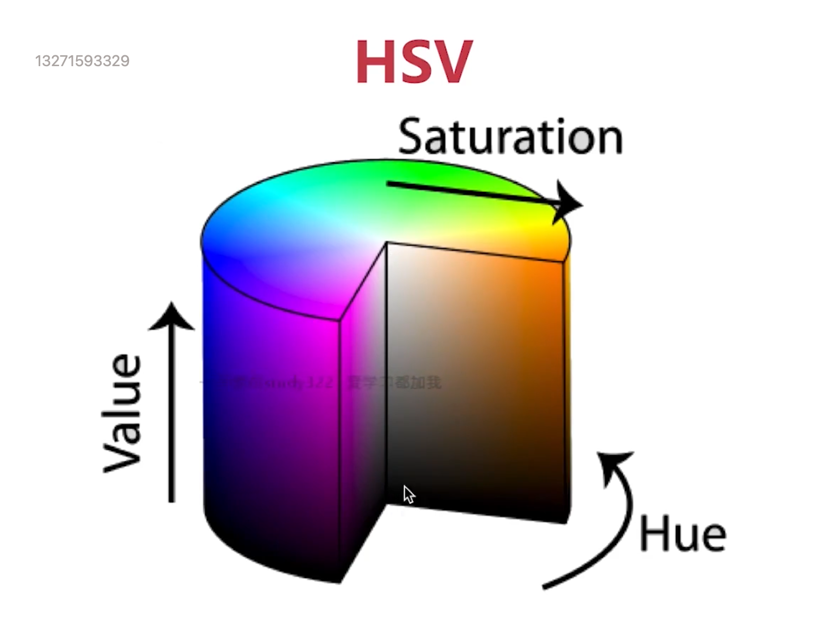
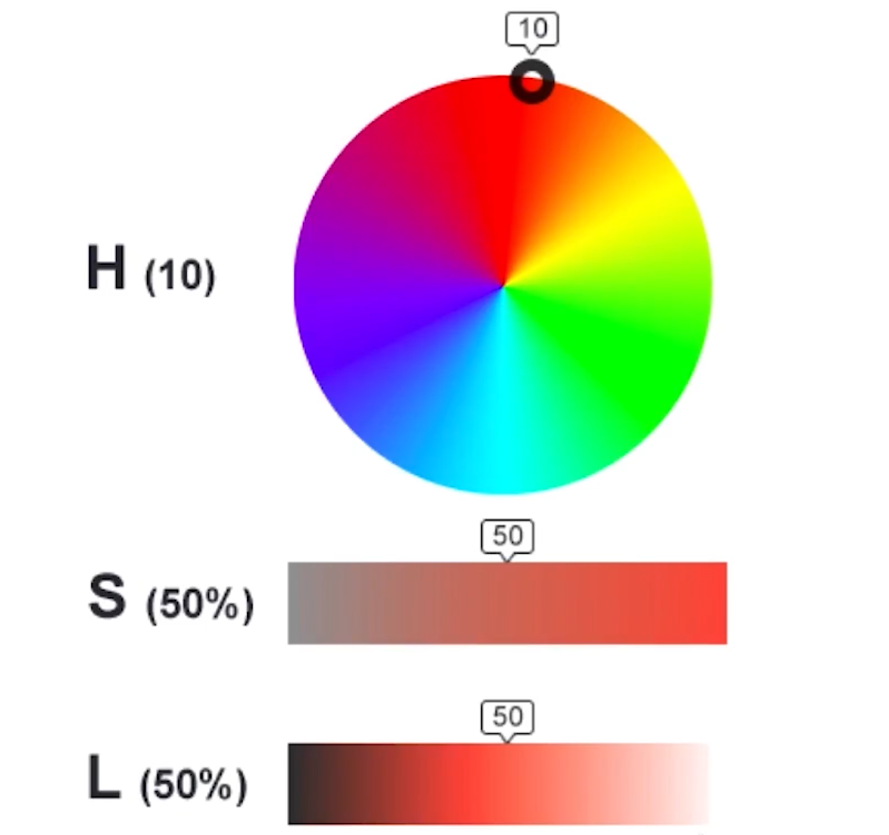

## 色彩空间
在opencv中的色彩空间为BGR。

### HSV



**Hue**: 色调。
**Saturation**: 饱和度。指的是在某个颜色上的纯度。
**Value**: 亮度。



### opencv 中的色彩空间转换

``` py
import cv2

def cb(x):
    pass

def main():
    cv2.namedWindow("color", cv2.WINDOW_NORMAL)
    img = cv2.imread("./test.jpeg")
    colorspaces = [cv2.COLOR_BGR2RGBA, cv2.COLOR_BGR2GRAY, cv2.COLOR_BGR2RGBA, cv2.COLOR_BGR2HSV_FULL,
                   cv2.COLOR_BGR2YUV]
    cv2.createTrackbar("curcolor", "color", 0, len(colorspaces)-1, cb)

    while True:
        idx = cv2.getTrackbarPos("curcolor", "color")
        print(idx)
        # 颜色空间转换
        cvt_img = cv2.cvtColor(img,colorspaces[idx])
        cv2.imshow("color", cvt_img)
        key = cv2.waitKey(10)
        if key & 0xFF == ord("q"):
            break

cv2.destroyWindow("color")

```

### 图像的基本操作
### 图像的属性  


