## 存储器的分类
### 按存储介质
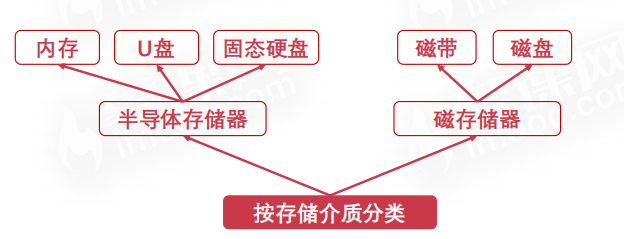
### 按存取方式
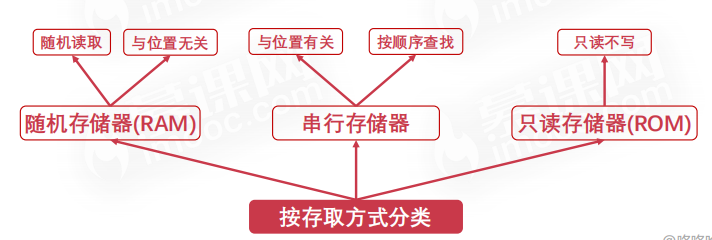
## 存储器的层次结构
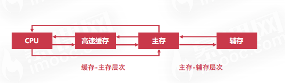
### 缓存-主存层次
利用了**局部性**的原理，实现核心是在CPU与主存之间加一块cache高速缓存(主要是由于CPU读写速度与内存读写速度差异巨大，方便信息缓冲)

> 局部性: 是指CPU访问存储器时，无论是读操作还是写操作，都倾向于访问存储器中较为靠近的值。

### 主存-辅存层次
也是基于**局部性**的原理，主要是通过添加外部磁盘来解决主存容量不足的问题。
## 主存(内存)
采用的是随机存取存储器，通过**电容**来存储数据，也就是说，一旦断电，数据也就会丢失。
### 内部结构
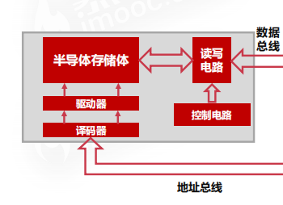
其中数据总线连接到CPU中的主存数据寄存器(MDR),地址总线链接到CPU中的主存地址寄存器(MAR)。
### 与操作系统位数的关系
32位系统最大只能支持到4GB的内存，而64位系统最大能支持到2的34次方GB

## 高速缓存的工作原理
由于cpu从寄存器中读数据太快，而从内存中读数据相对而言又太慢，此时就需要用高速缓存来解决二者之间速度不匹配的问题。
### 字与字块
**字**：是指存放在存储单元中最基本的二进制代码组合
**字块**：连续的一组字

假如说一个字有32位，一个字块内有B个字，内存里一共有M个字块，那么内存总容量就等于**B`*`M`*`32**,其中前面的B×M是内存的总字数。
### 字的地址结构

类似:*河南-郑州*这种表示方法
其中前面的m位表示的是**字所在的字块的地址**（大地址）。
后面的b位表示的是**当前字在字块中的具体位置**(小地址)。

同时存在
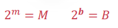

*eg1:*
首先算字块数：4G/4M = 1024
然后算得“大地址”(根据上面的取对数公式)，对1024个字块数取log2，算得10。

首先算块内的字数:4M/32bit = 1048576（这个数尽量记住）
然后同理算得“小地址”，对1048576个块内字数取log2，算得20。
### 高速缓存中的字的结构
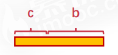
可以看到和内存中字的结构基本类似，也存在相同的逻辑关系
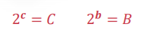
其中大C是缓存中有多少个字块。
### 命中率
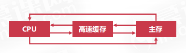
在上述结构中，可以看到cpu，缓存，以及主存之间是可以相互直接通信的。但cpu从缓存中取数据的速度要比从主存中取数据的速度快的多得多，cpu会优先访问缓存，如果缓存中没有数据就会到主存中去拿，在**缓存中拿到数据的概率**就可以称之为**命中率**。命中率可以作为衡量缓存的性能指标。

假设cpu访问主存的次数为Nm，访问缓存的次数为Nc，则命中率h为：
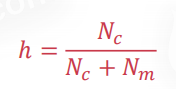
### 访问效率
访问效率是衡量缓存的另一个性能指标，不过这里是用时间来衡量的。
假设访问主存的时间为Tm，访问缓存的时间为Tc，则访问效率为：
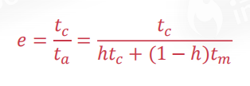
其中分母的ta是访问缓存与主存的平均时间。
*eg2*:
首先算下命中率: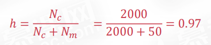
然后套公式。。。
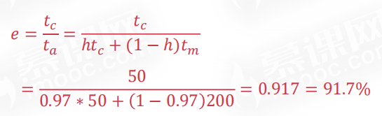
平均访问时间就是分母啦

## 高速缓存的替换策略
### 随机算法
就是随机抽一个缓存页淘汰掉。。。没啥说的
### 先进先出算法(FIFO)
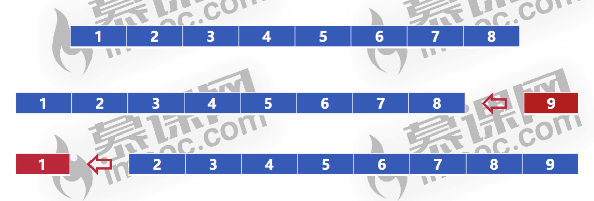

将整个高速缓存看做是一个队列，如果队列满了话就将队头的元素挤出队列。
### 最不经常使用算法(LFU)

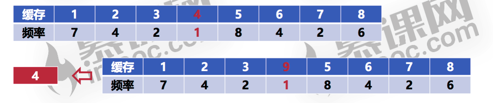
将每一个缓存字块增加一个频率字段，然后记录每一个缓存区被访问的频率，如果缓存区满了就将访问频率最低的那个缓存字块淘汰掉。
### 最近最少使用算法(LRU)

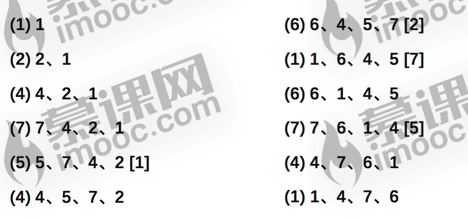
其实就是更加合理的FIFO算法。
当cpu访问一个值时，此时会出现两种情况：要么能访问到，要么访问不到。
如果能访问到，就将访问的元素从缓存区中间移到"缓存区队列"队头的位置。
如果访问不到，就将要访问的元素从主存调入到"缓存区队列"的队头。
然后正常淘汰队尾的元素。