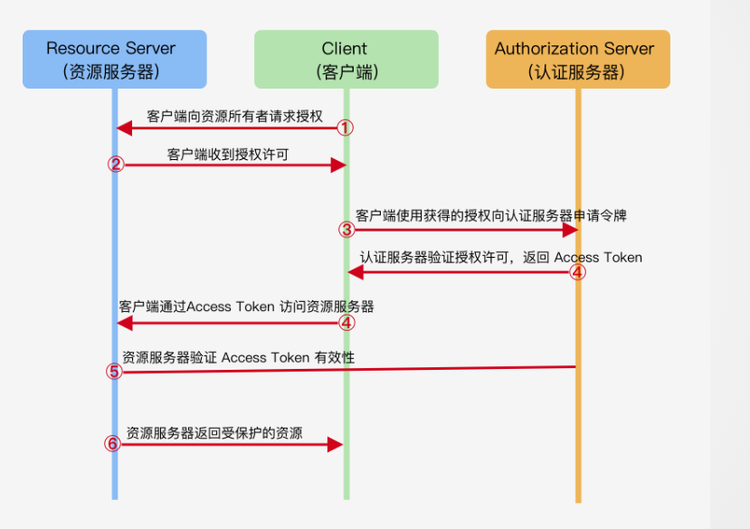

## 自定义组件

### 基本使用

小程序在自定义组件时需要有四个基本文件。

- 用于描述组件结构的 wxml 文件

- 用于描述组件样式的 wxss 文件

- 描述组件行为的 js 文件

- 声明组件配置的 json 文件

在 json 文件中需要配置为自定义组件。

```json
{
  "component": true
}
```

在 js 文件中需要初始化 Component 构造器。

```js
Component({
  behaviors: [],

  properties: {},

  data: {},

  lifetimes: {},

  pageLifetimes: {},

  methods: {},
});
```

**behaviors**: 共享逻辑，类似 vue 中的 mixins。可以包含一组对于`properties`,`data`,`lifetimes`和`methods`的定义。

**properties**: 属性，类似于 Vue 和 React 中的 props。

**data**: 类似于 Vue 中的 data 以及 React 中的 state。

**pageLifetimes**: 用于定义此组件在页面特定生命周期时的行为。目前只支持`show`,`hide`,`resize`。

**methods**: 与 Vue 的 methods 类似。

**lifetimes**: 自定义组件的生命周期。

### 生命周期

**created**: 组件实例刚刚创建完,注意这时候还不能调用 setData，只应该用于给组件 this 添加一些自定义属性字段。

**attached**: 组件完全初始化完毕，类似于 vue 中的 mounted。

**detached**: 组件被移除时触发，类似 react 中的 unmounted。

**ready**: 组件在视图层布局彻底完成。

**moved**: 组件实例被移动时。

**error**： 组件报错时执行。

### 消息通信


小程序上没有向 vuex 和 redux 这样的单项数据流，要实现通信的话只能在父组件上监听事件，然后子组件内部触发事件，然后把对应的信息带到上层。

或者可以在全局的 Page 上写一个 evnetbus，利用全局 App 做状态中转。

## 双线程模型


小程序整体采用的是双线程模型. 一个渲染层,一个逻辑层.这两者会通过一个 native 层进行桥接.

其中在不同平台上的 js 执行环境也是不一样的

在安卓上,**渲染层**用的是魔改后的移动端 chrome 内核,**逻辑层**理所当然用的 v8

IOS 上,**渲染层**用的 WKWebView(IOS 上的一个原声浏览器组件),**逻辑层**跑在 jscore 里。

### 为什么小程序采用双线程模型？

1. **为了安全**。小程序逻辑代码的运行环境本质上是一个沙箱。小程序和微信的关系就和 codePen 上的那些案例和 codePen 平台一样，案例是不能影响平台正常运行的，必须要有一个隔离的环境。

2. **为了性能**。有一种说法是，小程序中 js 逻辑线程是独立的，因此不会像`webworker`那样和主线程受到同一个 Page 的限制。

<hide txt="个人其实不是很同意这种说法，感觉利用native做消息中转性能也好不到哪去吧。。。"></hide>

## OAuth2 与小程序登录流程

### OAuth2 流程

[优秀视频：OAuth2 流程科普](https://www.bilibili.com/video/BV1zt41127hX?from=search&seid=2919103034218757307)



首先客户端要先取得用户的授权。

客户端拿到授权后，就带着授权去认证服务器换取 token。

换完 token 以后，就带着 token 去资源服务器，资源服务器会验证 token 是否有效，有效的话就返回给客户端相应的资源。

### 小程序登录流程


小程序登录流程本质上是 OAuth2.0 的具体实现。

1. 当用户授权登陆后，小程序会调用`wx.login()`获取 code，这个 code 有效期只要五分钟。

2. 小程序会调用`wx.request()`把这个 code 发给开发者服务器，开发者服务器会拿着 code，appid 和 appsecret 去换取 openid 和 session_key,session_key 是一个密钥，可以对用户的数据进行加密和解密，但是 openid 需要着重说一下。

::: tip

`openid`可以理解为`unionid`和`appid`加密后的结果。

其中 unionid 才是真正用来表示用户的唯一 id，微信平台的应用体系不仅仅包含小程序，也包括公众号和其他接入微信开放平台的应用。
:::

3. 当开发者服务器获取到 session_key 和 openid 后，便可以去创建 token 了，并且返回给小程序。此时小程序便拿到了 token。

## 小程序领域内性能优化

js 中的一些优化手段小程序这里肯定也是通用的。

### 首次加载

**分包加载**: 懒加载在小程序场景下的实现。我们把访问频率高的页面放到主包里，把访问率底的页面放到分包里，访问的时候异步加载，这样可以大大降低首次 loading 的时间。

**千万别用本地图片**: 图片这种东西对体积影响真的严重，放到云存储上最好。

**预加载**: 可以在后台配置，可以在小程序冷启动时便去加载要加载的首页数据，从而提高加载速度。

### 运行时(缓存)

**周期性更新**: 对于一些更新频率很低的数据(通常大于 12 小时)，可以利用周期性更新来做缓存，这样就不用在运行时再发送请求。

**setData**: 尽量在 setData 的调用频率和数据体量间找到一个“平衡”。
