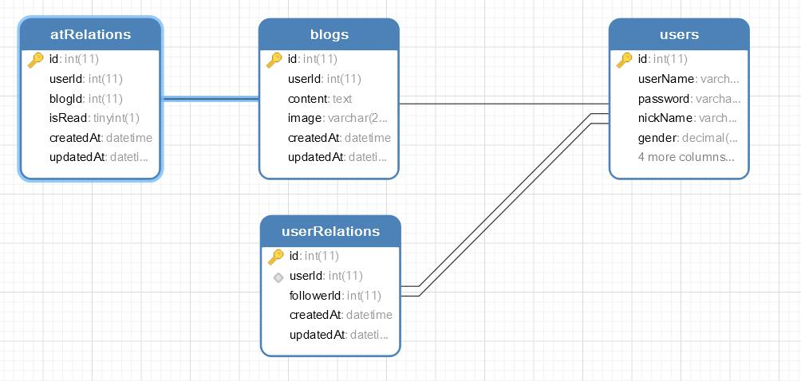
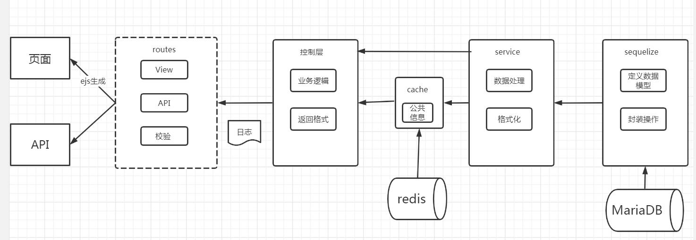
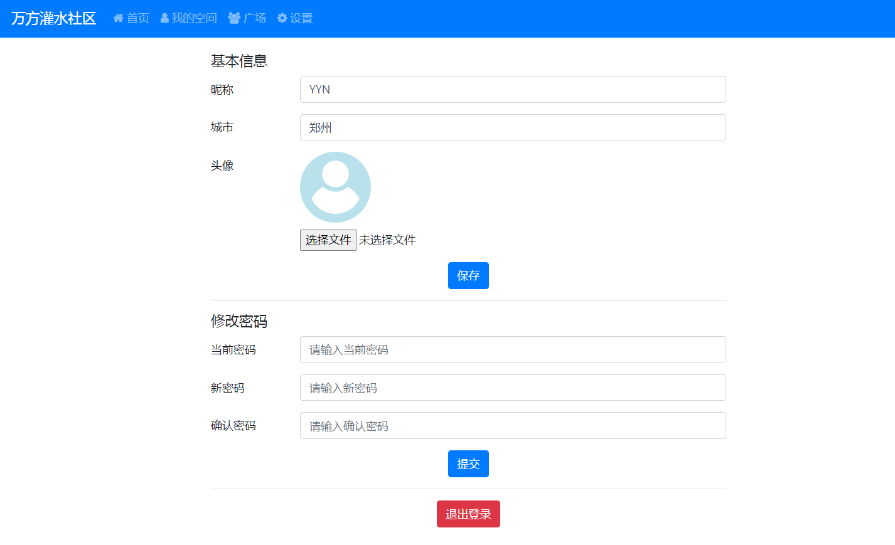

## 需求分析

## 核心概念与相关技术简介

### nodejs

nodejs 是一个开源且跨平台的 JavaScript 运行环境，它最显著的特点就是允许使用 JavaScript 来编写服务端的程序，从而使得前端开发者也能够开发出高性能的后端程序。

Node.js 由 Node.js Foundation（已与 JS Foundation 合并为 OpenJS Foundation）持有和维护，亦为 Linux 基金会的项目。Node.js 采用 Google 开发的 V8 运行代码，使用事件驱动、非阻塞和异步输入输出模型等技术来提高性能，可优化应用程序的传输量和规模。这些技术通常用于数据密集的即时应用程序。

### koa2

Koa2 是一个在 nodejs 平台的 web 框架，开发者为上一代 web 框架`express`的原班人马。 Koa2 中最显著的特点是使用了 ES7 中的`async/await`语法，从而使得开发者抛弃传统的回调式写法。

使用 Koa2 开发的应用会显得更加轻量且更具有可维护性。

### session

session 在计算机领域中，可以翻译为“会话控制”。而在 web 技术中，特指登录技术的具体实现。在该微博社区系统中，我们使用 seeion 技术来进行登录操作。

### MariaDB

MariaDB 是 MySQL 关系数据库管理系统的一个复刻，由社区开发，有商业支持，旨在继续保持在 GNU GPL 下开源。MariaDB 的开发是由 MySQL 的一些原始开发者领导的，他们担心甲骨文公司收购 MySQL 后会有一些隐患。

它的首席开发人员是米卡埃尔·维德纽斯，他是 MySQL 的创始人之一，也是 Monty Program AB 的创始人。2008 年 1 月 16 日，MySQL AB 宣布它已经同意被太阳微系统集团以大约 10 亿美元的价格收购。该项收购已于 2008 年 2 月 26 日完成。MariaDB 是以 Monty 的小女儿 Maria 命名的，就像 MySQL 是以他另一个女儿 My 命名的一样。

在该系统中，我们使用 MariaDB 来进行数据的存储。

### Redis

Redis 简单来说是一个“缓存数据库”。和传统的数据库不同的是，它的数据是存储在内存中而不是存储在磁盘上，这也就意味着，它相对于传统的数据库而言，拥有更快的读取速度。对于一些需要频繁读取的数据，我们可以将其存入到 Redis 中，来提高程序的性能。

### ejs

ejs 是一个前端的模板语言，性质有些类似于 php，语法简单。在该系统中由于项目时间原因没有采取复杂的前端框架(Vue,React)。

## 微博系统的设计

### 数据建模


上述的 ER 图为改系统的数据模型，从 ER 图中我们能够清晰的看到，我们创建了四个表，分别是"users"，"blogs","atRelations"以及"userRelations"。

其中 users 表中存储了用户的基本信息，包括：用户名、密码(md5 加密)、昵称、性别、城市等等。

blogs 表中则存储的是用户发表的微博(帖子)，里面包含有发表该微博的用户 id、内容、微博图片(url 地址)。

userRelations 表中存储的是用户间的关系，主要存储了当前用户的 id 以及关注人的 id。

atRelation 表中存储的是博客的 id 以及回复改博客的用户 id，主要是为了实现@功能。

### 架构设计



在架构方面组内的开发人员为了代码后期的可拓展性以及可维护性采取了多层的架构，虽然对于初期的业务需求来说，显得有些复杂，**但初期任何看似复杂的架构设计都是为了让后期的开发维护变得更简单**。

在数据层面，我们选择了 MariaDB 来进行数据的存储，为了方便 CRUD 操作，我们引入了 sequlize 来对常用的数据库操作进行封装。

在 service 中台层面，我们将数据在这里统一进行处理和格式化，比如当用户没有设置头像时我们会默认将 User 表中的用户头像链接设置为默认头像的链接。

在服务层和控制层之间，我们引用 Redis 用作缓存，来存储一些读写频繁的信息，如广场页中的数据。

在控制层，我们可以专注于业务逻辑，并将加工过的数据返回给后端路由。

在路由层中，我们将路由分为两大类，一类是 View，一类是 api。比如当用户访问`/square`时会跳转到广场页，此时的`/sequare`就是个 view 路由；当用户注册时会提交表单，此时的后端 api 接口就是`/api/register`。

最终返回的数据会通过服务端渲染一并返回到用户的浏览器上。

## 微博系统的实现

### 注册

对于微博这种系统，注册功能无疑是我们首先要实现的功能。首先我们在初始化模型时需要创建出 User 表，并为其初始化用户名、密码、昵称、性别、头像、城市字段。

核心代码如下：

```js
const User = seq.define("user", {
  userName: {
    type: STRING,
    allowNull: false,
    unique: true,
    comment: "用户名，唯一",
  },
  password: {
    type: STRING,
    allowNull: false,
    comment: "密码",
  },
  nickName: {
    type: STRING,
    allowNull: false,
    comment: "昵称",
  },
  gender: {
    type: DECIMAL,
    allowNull: false,
    defaultValue: 3,
    comment: "性别（1 男性，2 女性，3 保密）",
  },
  picture: {
    type: STRING,
    comment: "头像，图片地址",
  },
  city: {
    type: STRING,
    comment: "城市",
  },
})
```

然后便是创建用户的实现。用户的注册数据会从前端页面通过 post 请求传过来，一下为核心代码实现：

```js
/**
 * 创建用户
 * @param {string} userName 用户名
 * @param {string} password 密码
 * @param {number} gender 性别
 * @param {string} nickName 昵称
 */
async function createUser({ userName, password, gender = 3, nickName }) {
  const result = await User.create({
    userName,
    password,
    nickName: nickName ? nickName : userName,
    gender,
  })
  const data = result.dataValues
  return data
}
```

有一点需要注意，如果我们将用户的密码直接存入到数据库中，一旦数据库出现问题则会对用户的信息安全构成及其严重的威胁，

因此我们需要创建一个工具方法，来对密码进行 md5 加密。

以下为核心代码。

```js
const crypto = require("crypto")
const { CRYPTO_SECRET_KEY } = require("../conf/secretKeys")

/**
 * md5 加密
 * @param {string} content 明文
 */
function _md5(content) {
  const md5 = crypto.createHash("md5")
  return md5.update(content).digest("hex")
}

/**
 * 加密方法
 * @param {string} content 明文
 */
function doCrypto(content) {
  const str = `password=${content}&key=${CRYPTO_SECRET_KEY}`
  return _md5(str)
}

module.exports = doCrypto
```

### 登录

登录功能主要是利用 cookie+redis 做会话控制，用户在第一次登录成功时，会将用户的 cookie 存入 redis，并设置 cookie 有效期为一天。

登录成功后，会从数据库中拉取用户的信息，并返回给前端页面。

下叙代码为主要的业务逻辑。

```js
/**
 * 登录
 * @param {Object} ctx koa2 ctx
 * @param {string} userName 用户名
 * @param {string} password 密码
 */
async function login(ctx, userName, password) {
  // 获取用户信息
  const userInfo = await getUserInfo(userName, doCrypto(password))
  if (!userInfo) {
    // 登录失败
    return new ErrorModel(loginFailInfo)
  }

  // 登录成功
  if (ctx.session.userInfo == null) {
    ctx.session.userInfo = userInfo
  }
  return new SuccessModel()
}
```

### 发表微博

发表微博是该系统最核心的功能，考虑到业务场景，如果用户没有登录的话是不允许发表微博的。

因此我们需要写一个登录验证的中间件，来判断用户是否为登录状态，由于我们在登录时已经将用户的登录状态信息存储到了 Redis 中，因此这里的代码逻辑并不复杂。

以下为登录中间件的核心代码。

```js
/**
 * API 登录验证
 * @param {Object} ctx ctx
 * @param {function} next next
 */
async function loginCheck(ctx, next) {
  if (ctx.session && ctx.session.userInfo) {
    // 已登录
    await next()
    return
  }
  // 未登录
  ctx.body = new ErrorModel(loginCheckFailInfo)
}
```

当登录验证判断通过后，我们便可以实现发表微博的操作了。

首先我们需要定义微博的数据模型，核心字段包括发表该微博的用户 id，微博内容，微博插入的图片地址。

核心代码如下：

```js
const Blog = seq.define("blog", {
  userId: {
    type: INTEGER,
    allowNull: false,
    comment: "用户 ID",
  },
  content: {
    type: TEXT,
    allowNull: false,
    comment: "微博内容",
  },
  image: {
    type: STRING,
    comment: "图片地址",
  },
})
```

然后在业务层，我们就可以根据前台的数据，来创建微博了。

为了保证代码的鲁棒性，我们将创建微博的逻辑放入了`try...catch`中。

```js
try {
  // 创建微博
  const blog = await createBlog({
    userId,
    content: xss(content),
    image,
  })

  // 创建 @ 关系
  await Promise.all(
    atUserIdList.map((userId) => createAtRelation(blog.id, userId))
  )

  // 返回
  return new SuccessModel(blog)
} catch (ex) {
  console.error(ex.message, ex.stack)
  return new ErrorModel(createBlogFailInfo)
}
```

### 广场页

在广场业，我们能够看到所有人发的微博，因此我们需要从数据库中拉取微博信息。

由于微博的信息过多，因此我们要求前端给我们传过来一个"PageIndex"参数，从而确定拉取哪一页的数据。

由于数据是直接从数据库中查询得出，我们还需要给数据进行格式化操作，核心代码如下：

```js
async function getBlogListByUser({ userName, pageIndex = 0, pageSize = 10 }) {
  // 拼接查询条件
  const userWhereOpts = {}
  if (userName) {
    userWhereOpts.userName = userName
  }

  // 执行查询
  const result = await Blog.findAndCountAll({
    limit: pageSize, // 每页多少条
    offset: pageSize * pageIndex, // 跳过多少条
    order: [["id", "desc"]],
    include: [
      {
        model: User,
        attributes: ["userName", "nickName", "picture"],
        where: userWhereOpts,
      },
    ],
  })
  // result.count 总数，跟分页无关
  // result.rows 查询结果，数组

  // 获取 dataValues
  let blogList = result.rows.map((row) => row.dataValues)

  // 格式化
  blogList = formatBlog(blogList)
  blogList = blogList.map((blogItem) => {
    const user = blogItem.user.dataValues
    blogItem.user = formatUser(user)
    return blogItem
  })

  return {
    count: result.count,
    blogList,
  }
}
```

接下来的操作非常重要。由于广场页的微博数据用户会频繁的读取，因为广场页的微博数据是公开的，每个人都可以看到。如果每次都从 MariaDB 数据库中查询读取数据，一旦并发量变高，则单个用户获取微博数据的速度就会非常慢，非常的影响用户体验，因此我们需要在服务层与业务逻辑层之间加上一层缓存进行处理，核心代码如下：

```js
/**
 * 获取广场列表的缓存
 * @param {number} pageIndex pageIndex
 * @param {number} pageSize pageSize
 */
async function getSquareCacheList(pageIndex, pageSize) {
  const key = `${KEY_PREFIX}${pageIndex}_${pageSize}`

  // 尝试获取缓存
  const cacheResult = await get(key)
  if (cacheResult != null) {
    // 获取缓存成功
    return cacheResult
  }

  // 没有缓存，则读取数据库
  const result = await getBlogListByUser({ pageIndex, pageSize })

  // 设置缓存，过期时间 1min
  set(key, result, 60)

  return result
}
```

如果缓存能够命中，则从缓存中读取数据。如果缓存无法命中，则从数据库中先将数据设置到缓存中然后再读取，这样就能够大大提高程序的性能。

### 个人主页

在个人主页上，主要获取的是关注者与用户本身的微博列表。

个人主页的逻辑和广场页面基本一致，无非是个人主页我们需要给服务层中查询条件指定一个“关注者”的参数,核心代码如下:

```js
/**
 * 获取关注着的微博列表（首页）
 * @param {Object} param0 查询条件 { userId, pageIndex = 0, pageSize = 10 }
 */
async function getFollowersBlogList({ userId, pageIndex = 0, pageSize = 10 }) {
  const result = await Blog.findAndCountAll({
    limit: pageSize, // 每页多少条
    offset: pageSize * pageIndex, // 跳过多少条
    order: [["id", "desc"]],
    include: [
      {
        model: User,
        attributes: ["userName", "nickName", "picture"],
      },
      {
        model: UserRelation,
        attributes: ["userId", "followerId"],
        where: { userId },
      },
    ],
  })

  // 格式化数据
  let blogList = result.rows.map((row) => row.dataValues)
  blogList = formatBlog(blogList)
  blogList = blogList.map((blogItem) => {
    blogItem.user = formatUser(blogItem.user.dataValues)
    return blogItem
  })

  return {
    count: result.count,
    blogList,
  }
}
```

### 修改个人信息

对于一个完整的 web 应用来说，修改个人信息也是一个很重要的内容。


有了上面的基础，我们要想实现更新用户信息就非常容易了，在数据库层面我们只需要将用户提交上来的信息进行 update 即可。

但有一个细节需要注意，修改个人信息也需要对用户的登录状态进行检验。

以下为数据层上的核心代码：

```js
/**
 * 更新用户信息
 * @param {Object} param0 要修改的内容 { newPassword, newNickName, newPicture, newCity }
 * @param {Object} param1 查询条件 { userName, password }
 */
async function updateUser(
  { newPassword, newNickName, newPicture, newCity },
  { userName, password }
) {
  // 拼接修改内容
  const updateData = {}
  if (newPassword) {
    updateData.password = newPassword
  }
  if (newNickName) {
    updateData.nickName = newNickName
  }
  if (newPicture) {
    updateData.picture = newPicture
  }
  if (newCity) {
    updateData.city = newCity
  }

  // 拼接查询条件
  const whereData = {
    userName,
  }
  if (password) {
    whereData.password = password
  }

  // 执行修改
  const result = await User.update(updateData, {
    where: whereData,
  })
  return result[0] > 0 // 修改的行数
}
```

## 微博系统的测试
