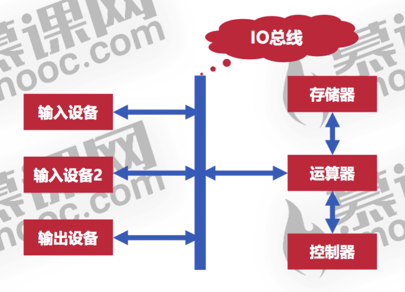
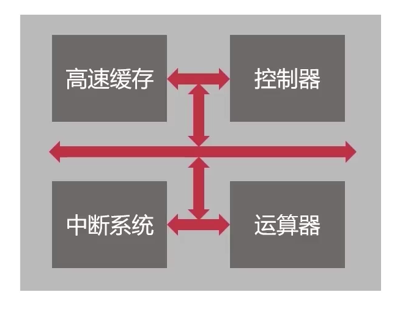
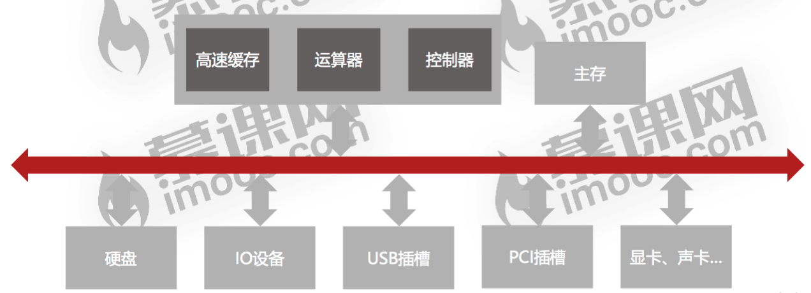
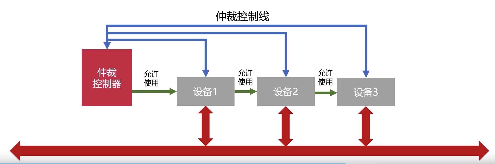
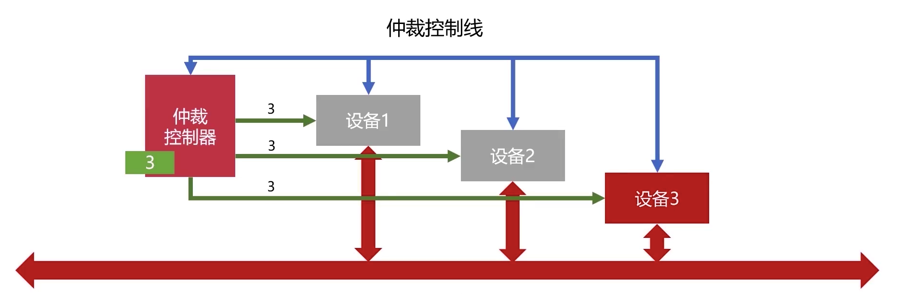
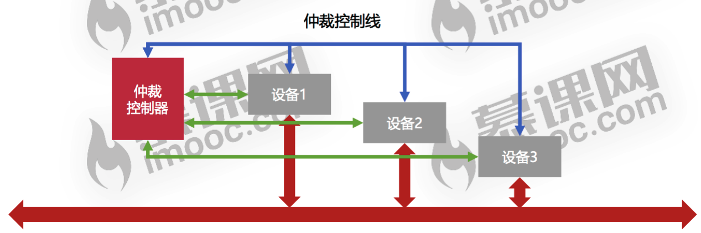

## 总线概述

用于解决不同设备间的通信问题。如果将信息比作血液，那么总线就类似血管。
## 总线分类
### 片内总线

CPU内部的信息传输线。
### 系统总线

连接计算机外围设备的信息传输线。可以分为以下**三类**：
#### 数据总线
用于各个部件间的数据(值)传输。其中总线位数（也就是总线宽度）一般与CPU的位数相同。
#### 地址总线
用来传输内存物理地址的总线。当CPU或DMA单元需要读或者写内存数据的时候，会先从地址总线中取或拿出内存地址，进行**寻址**操作。

如果地址总线的位数为n，那么寻址的最大范围可以到2的n次方。
#### 控制总线
用来发送控制信号，比如键盘鼠标操作等等。同时控制总线会监视各个设备的就绪状态。
## 总线的仲裁
总线发送信息具有互斥性，如果多个功能部件同时向总线发送信息，就会发生总线冲突。
因此需要有一个总线控制器按照某种策略对不同的信息发送方进行裁决，来决定具体的优先顺序。
## 总线仲裁的方法
### 链式查询

将所有的外围设备串联起来连接到仲裁控制器上。假如说设备2需要使用总线，那么它需要先想仲裁控制器发送一个请求，仲裁控制器会将允许使用的请求发给设备1，如果此时设备1不用总线，允许使用的命令才会到达设备2。

很明显这对于链尾的设备是不公平的，而且串联设备对电路故障非常敏感。
### 计时器定时查询

先假定总线处于闲的状态，那么仲裁控制器就会像定时器那样开始计时。（注意闲的时候定时器在跑)。假如说，设备3需要请求使用总线，那么总裁控制器中的定时器一旦转到了“3”（或者和设备3相关的值），就会把总线使用权给设备3，同时定时器也不跑了。当设备3用完后会告诉仲裁器自己不用了，此时定时器就会继续跑，仲裁器就好像是一个“巡游商人”一样，谁需要用总线就在谁那停下来。

可以看出这种方式比把三个设备串到一起要靠谱多了。
### 独立请求

每个设备均和仲裁控制器连接，每个设备都有权利直接向仲裁器发送使用总线的请求。

如果仲裁器同时收到了多个请求，会根据写在硬件上的某种算法来决定设备的优先级，总体来说还是很公平的。但是这种仲裁方法会让设备连线增多，总线控制变得更加复杂。