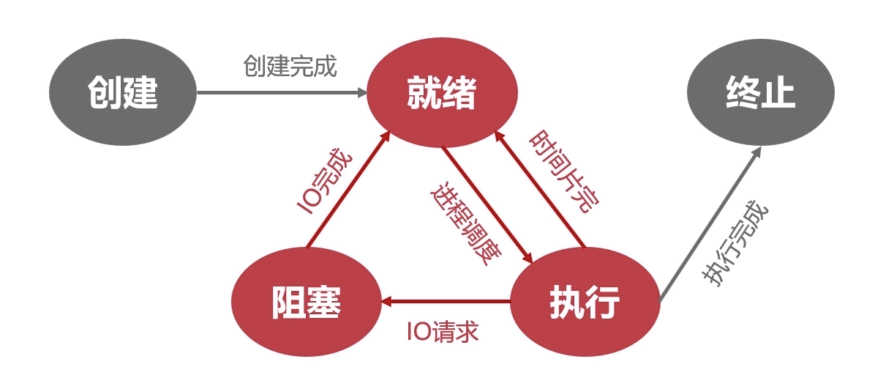
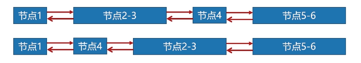

## 操作系统的目标
方便性，有效性，可扩充性，开放性。
## 操作系统的作用
- 用户与计算机硬件系统之间的接口
- 计算机系统资源的管理者
- 实现了对计算机资源的抽象
## 微机操作系统的发展阶段
- 单用户单任务操作系统
- 单用户多任务操作系统
- 多用户多任务操作系统
## 操作系统的基本特征？
并发、共享、虚拟、异步
## 操作系统的主要功能
- 处理机管理功能
- 存储器管理功能
- 设备管理功能
- 文件管理功能
- 操作系统与用户之间的接口

## 前趋图
判断前趋图的方法：有向无环。
## 顺序执行和并发执行的特征
顺序执行：顺序性、封闭性、可再现性
并发执行：间断性、失去封闭性、不可再现性
## 进程的定义和特征
定义：进程是程序的动态执行过程。
特征: 动态性、并发性、独立性、异步性
## 进程的基本状态及转换
- 创建状态
当进程**拥有PCB**但是其他所有资源还没就绪的状态。
- 就绪状态
当进程所需要的所有资源都准备好，但只差**CPU资源**的时候，我们就可以说进程进入了**就绪状态**。
- 执行状态
当进程获得全部资源（包括CPU资源），此时就会进入**执行状态**。
- 阻塞状态
当进程由于缺少IO资源而放弃CPU的时候，我们就可以说此时进程处于阻塞状态。
- 终止状态
当进程结束被**系统回收**(此时会归还PCB)的状态。
- 五状态之间的转换

当进程被创建后，并且获得了**除CPU资源的所有资源**，就会进入就绪状态(或进入就绪队列)。在就绪状态，一旦被**调度**（获得CPU资源），就会进入执行态。反之，如果不被调度（CPU资源用完），就会重新返回就绪态。当进程在执行态发起IO请求时，就会进入阻塞态。IO操作一旦完成，会回到就绪态，等待被调度。当进程在执行态运行完成后，会归还PCB，并进入终止态。
## 处理机调度的层次
- 高级调度：又称为作业调度，将外存的作业调入内存。
- 低级调度：又称为进程调度，决定哪个进程应该获得CPU资源。
- 中级调度：又称为内存调度，本质是存储器的页面对换功能。
## 动态分区分配算法
### 首次适应算法(FF)

会使用空闲链这种数据结构，每次分配内存时都会从开始的位置便利空闲链，当找到的空闲链的容量足够运行程序时，就会将这块空闲链分配出去。

但这种分配方式有个明显的缺点就是每次都是从内存头部地址开始，这使得内存头部的地址不断的被划分，而高地址位内存很难得到利用。为了改进这种情况，人们又发明了**循环首次适应算法**，每次划分内存不是从头开始划分，而是从上一次分配结束的位置开始。这样就能保证高地址位的内存也能得到充分利用。
### 最佳适应算法(BF)

这种算法会将空闲区链表按照容量**从小到大**排序，每次分配内存时都会从头遍历链表然后为其分配一个**最合适**的分区块，这样可以避免内存块出现“大材小用”的情况，同时也能减少内存碎片的产生。
### 快速适应算法(QF)

这种算法要求OS拥有多个空闲链表，每个链表都保存固定的存储容量（但每种链表的存储空间是不同的，如图）这样做的好处是在分配内存的时候可以**快速**找到适合分配内存的内存区域。
## 分段分页区别
- 页式信息的物理单位，而段式信息的逻辑单位。
- 页的大小是固定的，而段的大小是不固定的。
- 分页的用户程序地址结构是一维的，而分段的用户程序地址结构是二维的。
## 虚拟存储器的定义和特征
是指具有请求调入功能和置换功能，能从逻辑上对内存容量加以扩充的一种存储器系统。
多次性/对换性/虚拟性
## 虚拟存储器实现的方法
分页请求系统和分段请求系统
硬件支持：页/段表机制；缺页/段中断机构；地址变换机构
## 抖动产生的原因
运行的进程太多，但能分配给进程的物理块又太少，导致OS需要频繁的调入调出页面。
## 工作集的定义
是指在某段时间间隔中，进程所要访问页面的集合。
## IO系统的基本功能
1.隐藏物理设备的细节
2.与设备的无关性
3.提高处理机和IO设备的利用率
4.对IO设备进行控制
## IO通道的特征
IO通道是一种特殊的处理机，它的特点是：1.指令类型单一；2通道没有自己的内存
## 设备驱动程序的功能
1.接收从软件层发来的抽象信息，并将其转化为设备相关的低层次硬件操作。
2.检查用户IO请求的合法性，确定IO设备的工作状态。
3.发出IO命令，如果设备空闲，则启动设备；如果设备忙碌，则将设备请求插入设备请求队列中。
4.处理设备控制器中的发来的中断请求。
## SPOOLing(假脱机)系统的构成
1.输入井和输出井
2.输入缓冲区和输出缓冲区
3.输入进程和输出进程
4.井管理程序
## 文件的概念
文件是指由创建者所定义的，具有文件名的一组相关元素的集合
## 文件结构的类型
- 按照是否有结构：有结构文件，无结构文件
- 按照文件的组织方式：顺序文件，索引文件，索引顺序文件
## 外存的组织方式
- 连续组织方式
- 链接组织方式（隐式链接；显式链接）
## 系统调用的概念
是应用程序请求**OS的内核**完成某功能时的一种过程调用。
## 系统调用的类型
- 进程控制类系统调用
- 文件操纵类系统调用
- 进程通信类系统调用
## 大题部分(B站自行搜索“头秃程序员”)
## 银行家算法
NEED = 最大资源需求量 - 已分配资源(有的题目need字段是不给的)
1.首先先把表头背下来(work need allocation work+allocation finish),其中need，allocation都会给，work就是最右面那个available
2.找，看看哪个进程的need < available(work),填表
3.把work+allocation字段放入work中，重复之前的步骤
## 进程同步与死锁
## 信号量及生产者消费者
## 内存缺页置换
1.先把框图画出来
2.填框图，实施淘汰策略，淘汰替换后的页面还要占用原来的页框，注意：如果内存中有的话就把那一列空出来
> 如果是FIFO算法，就把内存中待得最久的给扔了
> 如果是LRU（最近最久未使用）算法，看上面，把靠前的给扔了
缺页 = 总的列数 - 空白列
## 磁盘调度策略
把要求的每一种寻道算法的要访问的下一个寻道地方以及要挪的距离列个表写出来，然后答一下就行，挺简单的。
## 内存地址变换
1.把要求的虚拟地址先转换成2进制
2.根据页面的大小和业内内存找出页号和业内内存对应的位数
3.根据题目中的信息，**页号变块号，业内地址不变**，最后根据内存位数补0
## 处理机选择调度
如果是用的先来先服务，那么调度顺序就是他们的提交顺序。
如果用的是短作业优先，那么调度顺序就是先装入提交最早的(不看执行时间长短)，然后再根据执行时间从小排到大
开始时间 = 上一行的开始时间+上一行的执行时间
完成时间 = 开始时间 + 执行时间
周转时间 = 完成时间 - 提交时间
平均带权周转时间 = 周转时间 / 执行时间
## 位示图
位示图需要的字 = 内存中拥有的物理块/字长
 i = (块号-1)div n + 1
 j = (块号-1)mod n + 1