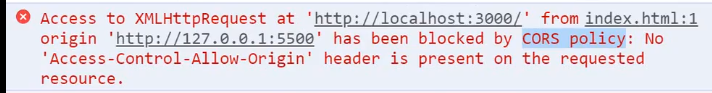
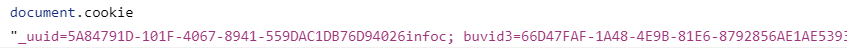

## 跨域

博文参考:[ajax 跨域，这应该是最全的解决方案了](https://segmentfault.com/a/1190000012469713#articleHeader9)

要理解**跨域**，首先我们需要理解**同源策略**。

**同源**是在 1995 年由网景公司提出来的一个策略，这个策略的最初的主要内容是：

> A 网页如果设置了 cookie，那么 B 网页不能打开。

我们很容易能够看出这个策略的主要目的是为了安全，现如今所有的浏览器都支持这个策略。

随着互联网的发展，同源策略也越来越严格，只要你的**协议**，**域名**和**端口**有一个不一样，浏览器都会将你的请求视为**跨域**访问,下面这三种行为都会受到限制：

1. 用户信息(`cookie`,`localStorage`,`indexedDB`)
2. `iframe`
3. 网络请求

当你发一个请求给一个非同源的服务器时，你会得到这条警告信息：

### CORS

**CORS**全称为`Cross-origin resource sharing`,这是一个 W3C 的标准，它允许浏览器向非同源服务器发送请求。

这个主要靠后端开启，但是存在兼容问题。

### JSONP

**JSONP**全称为`JSON with padding`

这种方式发起请求会从后端得到“被包裹的 JSON 数据”，大概像这样

```js
callback({ name: 'hax', gender: 'Male' });
```

其中`callback`是用户在发起请求时传过去的参数，我们实际要得到的数据会包裹在函数的参数中，我们可以在本地定义这个函数的具体操作，然后再通过`script`标签“云调用”一下这个函数，就可以完成我们的跨域请求啦~~

这种方式的主要原理还是利用了`script`标签没有跨域限制的漏洞，<hide txt="所以我个人不是很喜欢这种方式，感觉是在“卡bug”，给人一种将错就错的感觉。"></hide>来间接实现跨域访问。

这种方式相比较 CORS 来说兼容性会更好一些。

### 关于资源地址

当请求资源时(`css`,`js`,`img`)并不会触发同源限制，利用这个特性，我们可以：

1. 用来统计访问量(PV,UV)。
2. `link`和`script`标签可以使用 CDN

## 存储

### cookie

`cookie`是一种超小型的文本文件，由网景公司的某个员工发明，是网站为了辨别用户身份而存储在用户本地的非常小的数据(只有 4K)。

`cookie`会被设置在`HTTP`的`header`中，会对请求有性能影响。

`cookie`由服务器端生成，存储在客户端，可以设置过期时间。
;
::: warning
cookie 语法的键值对是用等于号隔开的，这点需要注意。
:::

### cookie 的结构

- name: cookie 的名字
- value: cookie 的值
- Expires/Max-Age: 超时时间
- HttpOnly: 只允许 http 使用,可以防止 XSS
- SameSite: 和防止 CSRF 有关

### localStorage

[localStorage 的简单使用](./js对象常用api整理.md#localstorage全局对象)

`localStorage`的生命周期为永久，除非用户手动清理。

`localStorage`的数据大小有 5M。

### sessionStorage

`sessionStorage`与`localStorage`的最大区别体现在生命周期上 ，一旦浏览器关闭则被清理。

### indexDB

如果`localStorage`存不下的话我们可以上浏览器中的这个数据库。

## 页面加载过程

这块的内容可以用来回答那个被问烂了的的问题<hide txt="Q:你梭梭当你输入url时发生了啥？A：不好意思面试官我先喝口水"></hide>,但全部展开这块内容能涉及到网络，计算机图形学，操作系统甚至是编译原理，<hide txt="我只是一个小蒟蒻鸭你总不能这样为难我"></hide>所以尽量站在前端的角度把这个问题回答好吧。

总的来说可以分为**资源加载阶段**和**资源渲染阶段**。

这里我们默认资源的类型是**HTML**。

### 资源加载阶段

1. 浏览器根据 DNS 服务器找到服务器的 ip 地址。
2. 浏览器向这个 ip 发请求 => 服务器处理并返回请求。

### 资源渲染阶段

这部分就是我们前端要详细回答的阶段了。

#### 一、dom 树生成

1. 首先浏览器在拿到`HTML`文件前要先在计算机中**开辟出内存**，同时为`HTML`**分配一个主线程**去一行行解析和执行代码。
2. 在主线程解析的过程中，如果遇到了外部静态资源(`link`,`script`,`img`),此时会开辟一个**新的任务队列和新的副线程**去加载这些资源文件，而主线程继续向下解析代码。
3. 当主线程从上往下执行完后，会生成**dom 树**。
   ::: warning
   假如说你现在打开一个网页，在加载的过程中你直接把网线给拔了，有很大几率你会碰到一个没有样式表的网页，因为此时 css 资源已经回不来了。。

因此建议将 css 放在 head 中，提前加载。
:::

#### 二、Event Loop 生成 CSSom

主线程解析完后，就会进入[Event Loop](./Javascript执行过程分析.md#event-loop)阶段，当任务队列里的 css 静态资源都加载完后，此时会生成**CSSom**。

#### 三、生成渲染树

当**dom 树**和**CSSom**都到齐了之后，此时他们俩会结合生成一颗**Render tree**。

#### 四、计算布局

根据生成的渲染树以及视窗(viewport)大小，计算每个 dom 节点的`layout`信息(位置，大小),最终生成分层树

如果由于渲染树中的某些属性的更改，而引发布局的更改，就会引发**回流**。

::: tip
影响回流的具体操作

1. 添加/删除 元素（display 也算）
2. 元素位置发生变化（可以使用`transform`，只会触发复合图层）
3. 更改 style
4. 修改浏览器大小，字体大小

最佳实践：**避免回流**/**读写分离**
:::

::: tip
在布局和绘制阶段，你可以使用`will-change`来创建新的图层。
有些浏览器为了进行渲染优化会默认将一些属性提取到新的图层，比如`transform，opacity，fixed,z-index等等`
:::

#### 五、绘制与合成

首先要为每个图层生成一个绘制列表(绘制指令),这些指令交给合成线程后,合成线程会将图层分成图块,并将图块进行光栅化成像素图.

最后合成线程会把绘制指令统一发送给浏览器的进程,浏览器通过调用内部的相关 api 最终会生成出页面.

## 安全

### XSS 跨站请求攻击

**XSS**全称为`Cross Site Scripting`<hide txt="如果缩写是CSS就和那个CSS混了"></hide>

攻击者会想尽一切办法将 script 代码注入到网页中，从而执行自己的攻击操作。

#### 存储性 XSS 攻击


案例:2015 喜马拉雅

当时喜马拉雅的技术没有对"专辑名称"这个输入框进行 XSS 过滤,黑客就可以通过这个输入框把恶意代码存储到服务器的数据库里

如果别的用户打开这个专辑,那么这段代码就被注进去了

#### 反射型 XSS 攻击

这种攻击的恶意代码写在 url 的参数上,黑客往往会诱导受害者去点击这些链接

#### 基于 Dom 的 XSS 攻击

这种攻击一般是由于 html 在传输的过程中就被人给改了,XSS 只是发起攻击的配合手段

#### 解决方法

1. 尖括号转码或 script 内容过滤
2. httpOnly 这样 document.cookie 无法读取
3. 开启 CSP 白名单,可以通过 meta 标签或在 http 头部设置`Content-Security-Policy`字段

### XSRF 跨站请求伪造

通过模拟登陆状态的用户,窃取受害人相关信息

案例:2007 Gmail

谷歌的某高官曾不小心点了一个恶意链接,点完这个链接后没几天自己的域名被盗了.

原因就是当他点完这个链接后,
其实从黑客的网站上带着他的 cookie 往 Gmail 上提交了一个恶意请求,这个恶意请求
会调用 Gmail 上的一些接口,然后偷偷设置了转发规则,于是邮件就被窃取了

#### 解决办法

1. cookie 上设置 SameSite 属性,最好设置为 lax,这样服务器默认就不会接受第三方的 Cookie 了(但导航到外链依旧可以)

2. 验证请求的来源地址(主要依靠请求头的 referer 和 origin 属性)

## 相关面试题

### script 中的 defer 和 async

defer 会推迟 script 脚本加载,效果和我们去把 script 放在 body 底下一样.
而 async 则会异步加载 script(类似又开了个进程去单独加载和执行),但具体的执行顺序就无法得到保证了
