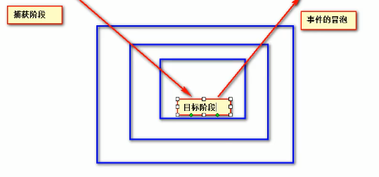

### dom dom1 dom2 dom3
**dom**全称为*Document Object Model*（文档对象模型）。
> The Document Object Model (DOM) is a programming interface for HTML and XML documents. ——MDN

MDN上说的很明白，dom是针对于HTML和XML文档的api，这些api可以使得开发人员对文档进行修改。

dom1级将HTML和XML文档看做是一个层次化的节点树，并且可以使用JS来对这个节点树进行操作。

dom2和dom3在dom1的基础上增加了更多的交互能力。

## js中常用的dom操作
### 创建
- **createElement创建元素**
``` js
var elem = document.createElement("div");  
elem.id = 'haorooms';  
elem.style = 'color: red';  
elem.innerHTML = '我是新创建的haorooms测试节点';
//创建完之后不要忘了给追加上去
document.body.appendChild(elem);
```
### 查找
- **document.getElementById**
根据ID查找元素，大小写敏感，如果有多个结果，只返回第一个。
- **document.getElementsByClassName**
根据类名查找，会返回一个集合。
- **document.getElementsByTagName**
根据标签名查找，会返回一个集合。
- **document.getElementsByName**
根据元素的name属性查找，返回一个 NodeList
- **document.querySelector**
通过制定选择器返回单个元素，挺灵活的一个方法。

### 修改
- **appendChild**
用于向节点的子节点列表追加新的子节点。
- **appendChild**
用于向节点的子节点列表前追加新的子节点。
- **insertAdjacentHTML**
也是一个用于追加的挺好用的api，具体使用参考[原生js操作dom方法之insertAdjacentHTML](https://www.jianshu.com/p/112bc211c39e)
### 删除
- **removeChild**
removeChild用于删除指定的子节点并返回子节点

## 事件传播模型
由于一些历史原因，W3C将事件的传播模型分成了下面三个阶段:


1.捕获阶段：在捕获阶段会从外层想内层进行事件元素捕获，但此时默认不会触发事件。
::: tip
如果想让事件在捕获阶段执行，可以将`addEventListener()`函数中的第三个参数设置为`true`。
:::

2.目标阶段: 当到达目标阶段，会触发目标元素事件，触发事件结束后，会进入冒泡阶段。

3.冒泡阶段: 在冒泡阶段事件会从目标元素开始依次向上进行传递，在传递的过程中默认会触发事件。
::: tip
如果不想让事件被冒泡触发，可以在事件函数中将`e.cancelBubble`设置为`true`。
:::
## 事件绑定
有两种方法。
### `dom对象.事件 = function(event){}`
> 这种事件也叫`dom0`事件。
``` js
let mydiv = document.getElementById("mydiv");
mydiv.onclick = function(e) {
    alert("mydiv")
}
```
此时就为`mydiv`这个元素绑定了一个`onclick`(点击)事件。
### `dom对象.addEventListener('事件名称',(e)=>{ },false)`
> 这种事件也叫`dom2`事件。

第一个参数是事件名称，注意没有**on**。
第二个参数是事件触发的函数。
第三个参数决定了是否在捕获阶段触发该事件。
``` js
let inner = document.getElementById("inner");
inner.addEventListener('click', (e) => {
    alert("inner")
}, false)

```
### 二者的区别
第一种方法有局限性，它只能为一个dom对象绑定一个响应事件，如果绑定多个事件，后面的会将前面的覆盖掉。
## 事件委托
一种优化dom事件响应的方式。
当子元素拥有大量且逻辑相同的监听函数时，最好讲监听函数直接设置到父元素上，通过事件冒泡的机制，父元素可以“委托”子元素来完成特定的事件。
这样做的好处一是优化性能，二是更加灵活————如果有新添加的子元素也会有监听函数。
可以通过事件触发函数中的`e.target`来判断是谁触发了事件。
## document实例
`document`其实是`HTMLDocument`的实例
`HTMLDocument`的原型对象是`Document`,换言之`HTMLDocument`继承了`Document`。