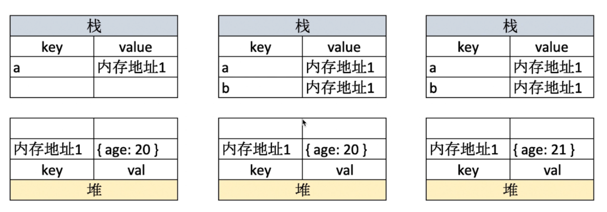

## Js中类型分类
### 原始类型
- 包括number/string/boolean/null/undefined/symbol;

- 原始类型中存的都是值，是不可能调出任何函数的。
但 `2333.3333.toFixed(2)` 之所以能调用是因为被js强制转型成了**Number对象**。

- null如果用typeof检查类型发现是Object，其实这是js的一个老bug。。。

- symbol是ES6中新增的原始类型，它可以用来生成唯一的标志来避免命名冲突。
``` js
  let obj = {
    [Symbol(01)]: "hello",
    [Symbol(01)]: "world",
};

console.log(Object.getOwnPropertySymbols(obj).map(sym => obj[sym]));
 // [ 'hello', 'world' ]
```
通过调用`Symbol()`方法来创建symbol实例，即便传入参数一样也不影响。

最终如果要拿对象中**symbol作为键的值**的话可以用`Object.getOwnPropertySymbols(obj).map(sym => obj[sym])`。
### 对象类型
- 对象类型里面存的是地址
- 如果函数参数是对象的话（假设传过来的这个对象叫p1），千万不要用`person = {...}`的形式修改传进来的对象(person是函数的形参)，你会发现根本修改不了。
``` js
function test(person) {
    person = {
        name: 'yyy',
        age: 30
    }
}
const p1 = {
    name: 'yck',
    age: 25
}
test(p1)
console.log(p1.age) // 25
```
> 最终可以发现，p1.age的值仍然是25。
> 
因为这等于是重新为person分配了一个新的对象，已经和p1没有关系了，请看下图

## typeof和instanceof
- typeof可以检查原始类型(除了null)，但是在检查对象类型的时候，除了函数能显示出一个function以外，其他的统统显示的是object
- 如果要判断对象到底是什么类型，可以用`instanceof `,但是需要提前知道对象的具体类型，因此也不是非常的灵活。
``` js
function Foo() {};
let foo = new Foo();
//foo是否是Foo的实例呢？
console.log(foo instanceof Foo); // true
```
## 类型转换
### 转boolean
通过`Boolean()`方法可以强制转换任意值为boolean类型，除了`undefined`,`null`,`-0`,`+0`,`NaN`,`""`以外，其余的值都是true。
### 转数字
通过`Number()`方法可以强制转换任意类型为number类型。
### 转字符串
通过`String()`方法可以强制转换任意类型为字符串，具体的转换效果可以参考下表


## `==`和`===`
==只会比较value，===更加严格，除了比较value还会检查类型。
## 原型
> 如何理解原型？如何理解原形链？
## instanceof 的原理
## js的作用域与作用域链
js中的每一个变量或者说函数都会有一个作用的范围，这个范围就叫作用域。
而作用域链指的是在js中查找一个变量的过程，会从最内层开始找，逐步找到最外层。
``` js
var a = 1;
function f1() {
    var b = 200;
    console.log(a);
    console.log(b);
}
f1();
//1
//200
```
## 闭包
*不得不承认闭包这个概念对于我这种“一句话描述党”真的是个灾难。*
简单理解为有权限访问另一个函数作用域的函数,通常表现为对另一个被返回函数的引用。
下面代码中的 ==closure()== 就是一个闭包。
```js
function makefunc() {
    var name = "jason2";

    function closure() {
        console.log(name);
    }
    return closure;
}
var clo = makefunc();
clo();//jason2
```
闭包有一个重要的特性。
- 创建了闭包之后，一旦调用，会延长作用域链，直到闭包不存在。
```js
function makeAdder(x) {
    return function(y) {
        return x + y;
    }
}
var add5 = makeAdder(5);
var add10 = makeAdder(10);
console.log(add5(2));
console.log(add10(2));
// 释放对闭包的引用
add5 = null;
add10 = null;
```
在上面这段代码中，add5和add10都是**对闭包的引用**，按理来说在别的语言中，==clo(),add5(),add10()== 都是不可能执行成功的——makeAdder()已经执行完了啊，内部的变量不应该已经被销毁了么？但最后“jason2”和下面的两个结果都打印出来了说明javascript中由于函数创建产生闭包的机制延长了函数的作用域链。

闭包最大的作用就是用来模拟一个类，从而间接实现面向对象编程。
``` js
// 实现一个模拟的name类，包含set和get方法
var Name = function() {
    var name = "未定义";
    return {
        getName() {
            return name;
        },
        setName(new_name) {
            name = new_name;
        }
    }
}(); //加小括号直接执行这个闭包引用
console.log(Name.name);
Name.setName("Jasonlee");
console.log(Name.getName());
```
## this的指向判断问题
一句话：this永远指向**最后调用this的函数所处的对象**
::: warning
这里的对象指的是"狭义"的对象，不包括函数对象(Function Object)。
:::
看下面几个demo，然后问自己两个问题。
最后调用this的函数是谁？它所处的**对象**在哪？
```js
var name = "windowsName";
    function a() {
        var name = "Cherry";
        console.log(this.name);          // windowsName
        console.log("inner:" + this);    // inner: Window
    }
a();
//调用this的函数是谁？是a()
//a()所处的对象在哪？在全局

var name = "windowsName";
    var a = {
        name: "Cherry",
        fn : function () {
            console.log(this.name);      // Cherry
        }
    }
a.fn();
//调用this的函数是谁？是fn()
//fn()所处的对象在哪？在对象a里面

var name = "windowsName";
    var a = {
        name: "Cherry",
        fn : function () {
            console.log(this.name);      // Cherry
        }
    }
window.a.fn();
//调用this的函数是谁？是fn()
//fn()所处的对象在哪？在对象a里面
```
## 执行上下文
> 解释下“全局执行上下文“和“函数执行上下文”。
### 全局执行上下文
当js引擎第一次遇到你的script时，会先创建一个全局执行的"小环境",这个全局执行的“小环境”就是所谓的Global Execution Context，此时这个执行的全局context会被压入执行栈。
### 函数执行上下文
当js引擎遇到函数调用时，会为该函数创建一个独立的context并压入执行栈中。
### 执行上下文具体创建的过程
会经历创建阶段和执行阶段，在创建阶段会去绑定this的指向，分配词法环境与变量环境；在执行阶段会先去完成对变量的分配，最后执行代码。
## 谈一谈js方法参数argument

## 深拷贝与浅拷贝
## new和object.creat的区别
## js的垃圾回收机制
---
*下面这块算es6的部分了*
## let、var和const
## 解构赋值
## 箭头函数
## promise
## Proxy
## set和map

## generator
## es6中的模块化
## es6中新增的正则符号

