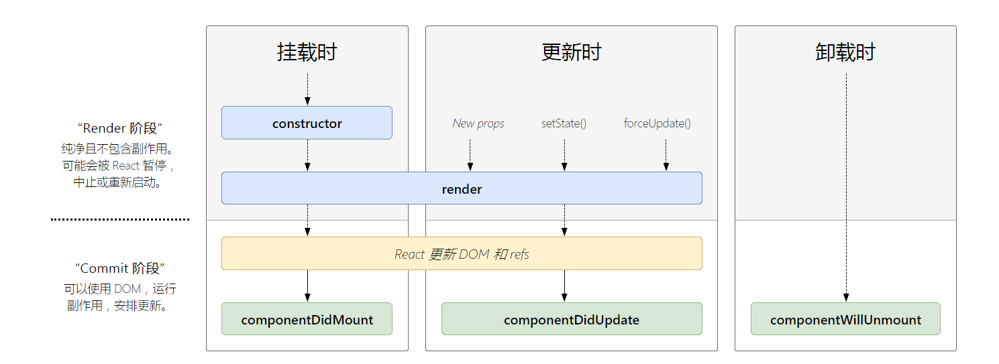

## 火速上手

### 变量与表达式

```js
import React, { PureComponent } from "react";

class BaseDemo extends React.Component {
  constructor(props) {
    super(props);
    this.state = {
      name: "Asher",
      flag: true,
      img: "https://seekinglight.cn/icon.png",
    };
  }
  render(h) {
    //一对大括号
    const elem = (
      <div>
        <h1>{this.state.name}</h1>
        </img>
        <h1>{this.state.flag === true ? "真" : "假"}</h1>
      </div>
    );
    return elem;
  }
}
export default BaseDemo;
```

### class 和 style

#### class

设置 class 的时候需要注意，要把 class 改为`className`,因为 class 在 js 中是保留字。

```js
import React, { PureComponent } from "react";
import "./style.css";

class BaseDemo extends React.Component {
  constructor(props) {
    super(props);
    this.state = {};
  }
  render(h) {
    const elem = (
      //class在js中是保留字
      <div>
        <h1 className="red">设置字体为红色</h1>
      </div>
    );
    return elem;
  }
}
export default BaseDemo;
```

如果想实现动态 class 也很简单，直接属性值套花括号。

#### style

```js
import React, { PureComponent } from "react";
import "./style.css";

class BaseDemo extends React.Component {
  constructor(props) {
    super(props);
    this.state = {};
  }
  render(h) {
    const styleData = {
      color: "blue",
    };
    const elem = (
      <div>
        <h1 style={styleData}>设置字体为蓝色</h1>
      </div>
    );
    return elem;
  }
}
export default BaseDemo;
```

### JSX 渲染 innerHTML

```js
import React, { PureComponent } from "react";
import "./style.css";

class BaseDemo extends React.Component {
  constructor(props) {
    super(props);
    this.state = {};
  }
  render(h) {
    const rawHtml = "<span>富文本内容<i>斜体</i><b>加粗</b></span>";
    const rawHtmlData = {
      __html: rawHtml,
    };
    const elem = (
      <div>
        <p dangerouslySetInnerHTML={rawHtmlData}></p>
      </div>
    );
    return elem;
  }
}
export default BaseDemo;
```

### 条件渲染

```js
import React, { PureComponent } from "react";
import "./style.css";

class BaseDemo extends React.Component {
  constructor(props) {
    super(props);
    this.state = {
      theme: "black",
    };
  }
  render(h) {
    const blackBtn = <button className="black">black</button>;
    const whiteBtn = <button className="white">white</button>;
    // if (this.state.theme === "black") {
    //   return blackBtn;
    // } else {
    //   return whiteBtn;
    // }
    return <div>{this.state.theme === "black" ? blackBtn : whiteBtn}</div>;
  }
}
export default BaseDemo;
```

### 循环渲染

```js
import React, { PureComponent } from "react";
import "./style.css";

class BaseDemo extends React.Component {
  constructor(props) {
    super(props);
    this.state = {
      theme: "black",
      list: [
        { id: "id-1", item: "item1" },
        { id: "id-2", item: "item2" },
        { id: "id-3", item: "item3" },
      ],
    };
  }
  render(h) {
    return (
      <div>
        {this.state.list.map((item, index) => {
          return (
            <div key={item.id}>
              index:{index};item:{item.item}
            </div>
          );
        })}
      </div>
    );
  }
}
export default BaseDemo;
```

### React 事件

在 react 的事件中，一定要在构造函数中将其绑定 this,因为默认事件中 this 的指向不是`组件实例`，而是`undefined`。

```js
import React, { PureComponent } from "react";
import "./style.css";

class BaseDemo extends React.Component {
  constructor(props) {
    super(props);
    this.state = {
      name: "张三",
    };
    //如果不绑定this那么方法中的this指向就会是undefined
    this.clickHandler1 = this.clickHandler1.bind(this);
  }
  render(h) {
    return <div onClick={this.clickHandler1}>{this.state.name}</div>;
  }
  clickHandler1() {
    this.setState({
      name: "法外狂徒",
    });
  }
}
export default BaseDemo;
```

如果觉得这样写看着不舒服的话也可以直接用静态方法，静态方法中的 this 永远指向组件实例。

```js
import React, { PureComponent } from "react";
import "./style.css";

class BaseDemo extends React.Component {
  //...
  clickHandler1 = () => {
    this.setState({
      name: "法外狂徒",
    });
  };
}
export default BaseDemo;
```

#### 传参

传参的时候 event 默认是追加在最后一个参数上

```js
import React, { PureComponent } from "react";
import "./style.css";

class BaseDemo extends React.Component {
  constructor(props) {
    super(props);
    this.state = {
      name: "张三",
    };
    //如果不绑定this那么方法中的this指向就会是undefined
  }
  render(h) {
    return (
      <div>
        <a
          href="https://www.baidu.com/"
          onClick={this.clickHandler1.bind(this, "jason", "18")}
        >
          {this.state.name}
        </a>
      </div>
    );
  }
  clickHandler1 = (name, age, event) => {
    event.preventDefault(); //阻止默认行为
    event.stopPropagation(); //阻止冒泡
    console.log(name); //jason
    console.log(age); //18
  };
}
export default BaseDemo;
```

#### React 事件与 Vue 中事件的区别

有一点需要注意，在 react 中的 event 并不和 vue 一样，是原生的 event，它是经过封装的。

我们可以打印 event 实例，能够看到它的原型是`SyntheticEvent`。


而其中的`nativeEvent`才是真正的原生事件对象。

```js
import React, { PureComponent } from "react";
import "./style.css";

class BaseDemo extends React.Component {
  //...
  clickHandler1 = (event) => {
    event.preventDefault(); //阻止默认行为
    event.stopPropagation(); //阻止冒泡
    console.log(event.nativeEvent); //MouseEvent{...}
    console.log(event.nativeEvent.target); //打印出了a标签
    console.log(event.nativeEvent.currentTarget); //document
  };
}
export default BaseDemo;
```

并且`currentTarget`指向的是`document`,这一点和 Vue 也不太一样。

### 表单

#### input

在 react 中没有类似`v-model`这样的双向数据绑定，要实现这种效果需要我们定义`onChange`事件来手动实现。

注意 label 标签中的`for`属性在 js 中是关键字，因此需要改个名。

```js
import React from "react";

class FormDemo extends React.Component {
  constructor(props) {
    super(props);
    this.state = {
      name: "jason",
    };
  }
  render() {
    return (
      <div>
        <p>{this.state.name}</p>
        <label htmlFor="inputName">姓名：</label> {/* 用 htmlFor 代替 for */}
        <input
          id="inputName"
          value={this.state.name}
          onChange={this.onInputChange}
        />
      </div>
    );

  }
  onInputChange = (e) => {
    this.setState({
      name: e.target.value,
    });
  };

export default FormDemo;

```

#### textarea

```js
import React from "react";

class FormDemo extends React.Component {
  constructor(props) {
    super(props);
    this.state = {
      info: "information",
    };
  }
  render() {
    return (
      <div>
        <textarea value={this.state.info} onChange={this.onTextareaChange} />
        <p>{this.state.info}</p>
      </div>
    );
  }
  onInputChange = (e) => {
    this.setState({
      name: e.target.value,
    });
  };
  onTextareaChange = (e) => {
    this.setState({
      info: e.target.value,
    });
  };
}

export default FormDemo;
```

#### select

```js
import React from "react";

class FormDemo extends React.Component {
  constructor(props) {
    super(props);
    this.state = {
      city: "beijing",
    };
  }
  render() {
    return (
      <div>
        <select value={this.state.city} onChange={this.onSelectChange}>
          <option value="beijing">北京</option>
          <option value="shanghai">上海</option>
          <option value="shenzhen">深圳</option>
        </select>
        <p>{this.state.city}</p>
      </div>
    );
  }
  onSelectChange = (e) => {
    this.setState({
      city: e.target.value,
    });
  };
}

export default FormDemo;
```

#### checkBox

checkBox 中绑定的是`checked`属性。

```js
import React from "react";

class FormDemo extends React.Component {
  constructor(props) {
    super(props);
    this.state = {
      flag: true,
    };
  }
  render() {
    return (
      <div>
        <input
          type="checkbox"
          checked={this.state.flag}
          onChange={this.onCheckboxChange}
        />
        <p>{this.state.flag.toString()}</p>
      </div>
    );
  }
  onCheckboxChange = () => {
    this.setState({
      flag: !this.state.flag,
    });
  };
}

export default FormDemo;
```

#### radio

```js
import React from "react";

class FormDemo extends React.Component {
  constructor(props) {
    super(props);
    this.state = {
      gender: "male",
    };
  }
  render() {
    return (
      <div>
        male{" "}
        <input
          type="radio"
          name="gender"
          value="male"
          checked={this.state.gender === "male"}
          onChange={this.onRadioChange}
        />
        female <input
          type="radio"
          name="gender"
          value="female"
          checked={this.state.gender === "female"}
          onChange={this.onRadioChange}
        />
        <p>{this.state.gender}</p>
      </div>
    );
  }
  onRadioChange = (e) => {
    this.setState({
      gender: e.target.value,
    });
  };
}

export default FormDemo;
```

## 组件使用和生命周期

### 父组件向子组件通信

在使用的时候直接定义属性，然后在子组件内部通过`this.props.属性`来获取值。

> 父组件

```js
class TodoListDemo extends React.Component {
  constructor(props) {
    super(props);
    // 状态（数据）提升
    this.state = {
      list: [
        {
          id: "id-1",
          title: "标题1",
        },
        {
          id: "id-2",
          title: "标题2",
        },
        {
          id: "id-3",
          title: "标题3",
        },
      ],
      footerInfo: "底部文字",
    };
  }
  render() {
    return (
      <div>
        <List list={this.state.list} myprop="test" />
      </div>
    );
  }
}
```

> 子组件

```js
class List extends React.Component {
  constructor(props) {
    super(props);
  }
  render() {
    //通过解构赋值先将对象中的属性值取出来
    const { list } = this.props;
    return (
      <ul>
        {list.map((item, index) => {
          return (
            <li key={item.id}>
              <span>{item.title}</span>
            </li>
          );
        })}
      </ul>
    );
  }
}
```

### 子组件向父组件通信

在定义属性的时候，直接传一个函数过去，这样子组件在调用函数的时候，就可以顺便把参数给“带出来”。

> 父组件

```js
class TodoListDemo extends React.Component {
  constructor(props) {
    super(props);
    // 状态（数据）提升
    this.state = {
      list: [
        {
          id: "id-1",
          title: "标题1",
        },
        {
          id: "id-2",
          title: "标题2",
        },
        {
          id: "id-3",
          title: "标题3",
        },
      ],
      footerInfo: "底部文字",
    };
  }
  render() {
    return (
      <div>
        {/* 这里传一个函数过去 */}
        <Input submitTitle={this.onSubmitTitle} />
        <List list={this.state.list} />
      </div>
    );
  }
  onSubmitTitle = (title) => {
    this.setState({
      list: this.state.list.concat({
        id: `id-${Date.now()}`,
        title,
      }),
    });
  };
}
```

> 子组件

```js
class Input extends React.Component {
  constructor(props) {
    super(props);
    this.state = {
      title: "",
    };
  }
  render() {
    return (
      <div>
        <input value={this.state.title} onChange={this.onTitleChange} />
        <button onClick={this.onSubmit}>提交</button>
      </div>
    );
  }
  onTitleChange = (e) => {
    this.setState({
      title: e.target.value,
    });
  };
  onSubmit = () => {
    const { submitTitle } = this.props;
    //这样的话就能调用父组件的方法，参数也就能传出去了。
    submitTitle(this.state.title); // 'abc'

    this.setState({
      title: "",
    });
  };
}
```

### 组件生命周期

和 Vue 组件生命周期类似，主要还是那几个过程。

在构造器初始化前就类似 Vue 中的`beforeCreate`。

`componentDidMount()`类似于`mounted`,这个阶段可以把网络请求放进去。

`setState()`就类似直接操作 Vue 组件中的`data`,会触发渲染函数。

`componentDidUpdate()`类似于`updated`。

还有一个 shouldComponentUpdate()生命周期在原理学习阶段可能要详细讨论。

## setState 使用注意点

### 不可变值

注意，如果要更改 state 中的值，**千万不能**直接对 state 中的值进行修改！至少要拷贝出一份然后更新上去。

这涉及到`shouldComponentUpdate`的一些原理，如果直接更改 state 中的值，那么`nextProps`或者`nextState`就也会发生变化，在视图层上也就不会更新成功。

#### 数组

如果 state 是数组，如果想偷懒的话可以用纯函数。

```js
// 不可变值（函数式编程，纯函数） - 数组
const list5Copy = this.state.list5.slice();
list5Copy.splice(2, 0, "a"); // 中间插入/删除
this.setState({
  list1: this.state.list1.concat(100), // 追加
  list2: [...this.state.list2, 100], // 追加
  list3: this.state.list3.slice(0, 3), // 截取
  list4: this.state.list4.filter((item) => item > 100), // 筛选
  list5: list5Copy, // 其他操作
});
// 注意，不能直接对 this.state.list 进行 push pop splice 等，这样违反不可变值
```

::: tip
结构运算符并不会影响原数组/对象。
:::

#### 对象

```js
// 不可变值 - 对象
this.setState({
  obj1: Object.assign({}, this.state.obj1, { a: 100 }),
  obj2: { ...this.state.obj2, a: 100 },
});
// 注意，不能直接对 this.state.obj 进行属性设置，这样违反不可变值
```

### 异步与同步

正常情况下是 setState 是异步的，只有在回调中才能拿到更新后的值。

```js
this.setState(
  {
    count: this.state.count + 1,
  },
  () => {
    // 联想 Vue $nextTick - DOM
    console.log("count by callback", this.state.count); // 回调函数中可以拿到最新的 state
  }
);
console.log("count", this.state.count); // 异步的，拿不到最新值
```

但是在**定时器**和**自定义事件**的回调中是同步的。

#### 定时器

```js
// setTimeout 中 setState 是同步的
setTimeout(() => {
  this.setState({
    count: this.state.count + 1,
  });
  console.log("count in setTimeout", this.state.count);
}, 0);
```

#### 自定义事件

```js
    bodyClickHandler = () => {
        this.setState({
            count: this.state.count + 1
        })
        console.log('count in body event', this.state.count)
    }
    componentDidMount() {
        // 自己定义的 DOM 事件，setState 是同步的
        document.body.addEventListener('click', this.bodyClickHandler)
    }
    componentWillUnmount() {
        // 及时销毁自定义 DOM 事件
        document.body.removeEventListener('click', this.bodyClickHandler)
        // clearTimeout
    }
```

::: warning
自定义事件与定时器要记得及时销毁。
:::

### 第一个参数 updater

第一个参数除了传对象以外也可以传一个函数进去。

```js
this.setState((state, props) => {
  return { counter: state.counter + props.step };
});
```

## 高级特性

### 异步组件

```js
import React from "react";

const ContextDemo = React.lazy(() => import("./ContextDemo"));

class App extends React.Component {
  constructor(props) {
    super(props);
  }
  render() {
    return (
      <div>
        <p>引入一个动态组件</p>
        <hr />
        <React.Suspense fallback={<div>Loading...</div>}>
          <ContextDemo />
        </React.Suspense>
      </div>
    );

    // 1. 强制刷新，可看到 loading （看不到就限制一下 chrome 网速）
    // 2. 看 network 的 js 加载
  }
}

export default App;
```

### 函数组件

其实就是“阉割版”的 class 组件，这种组件没有实例，没有生命周期，没有 state。

作用仅仅是把属性数据渲染上去,不过性能肯定比 class 组件要好。

```js
function Welcome(props) {
  return <h1>Hello, {props.name}</h1>;
}
```

### ref 与非受控组件

如果需要获取 dom 信息，可以在 jsx 上挂载 ref。
使用的时候需要在构造函数内部先创建一个 ref 引用,然后通过引用中 current 属性便可以获取到被挂载 dom 信息。

这种通过 dom 来获取节点信息的组件我们管它叫非受控组件。

```js
class App extends React.Component {
  constructor(props) {
    super(props);
    this.state = {
      name: "jason",
      flag: true,
    };
    this.nameInputRef = React.createRef(); // 创建 ref
  }
  render() {
    // input defaultValue
    return (
      <div>
        {/* 使用 defaultValue 而不是 value ，使用 ref */}
        <input defaultValue={this.state.name} ref={this.nameInputRef} />
        {/* state 并不会随着改变 */}
        <span>state.name: {this.state.name}</span>
        <br />
        <button onClick={this.alertName}>alert name</button>
      </div>
    );
  }
  alertName = () => {
    const elem = this.nameInputRef.current; // 通过 ref 获取 DOM 节点
    alert(elem.value); // 不是 this.state.name
  };
}
```

#### 文件上传的例子

```js
import React from "react";

class App extends React.Component {
  constructor(props) {
    super(props);
    this.state = {
      name: "jason",
      flag: true,
    };
    this.fileInputRef = React.createRef();
  }
  render() {
    // file
    return (
      <div>
        <input type="file" ref={this.fileInputRef} />
        <button onClick={this.alertFile}>alert file</button>
      </div>
    );
  }
  alertFile = () => {
    //打印文件名
    const elem = this.fileInputRef.current;
    alert(elem.files[0].name);
  };
}

export default App;
```

### portals

类似于 Vue 中的插槽，可以指定渲染的位置。

```js
import React from "react";
import ReactDOM from "react-dom";
import "./style.css";

class App extends React.Component {
  constructor(props) {
    super(props);
    this.state = {};
  }
  render() {
    // 使用 Portals 渲染到 body 上。
    // fixed 元素要放在 body 上，有更好的浏览器兼容性。
    return ReactDOM.createPortal(
      <div className="modal">{this.props.children}</div>,
      document.body // DOM 节点
    );
  }
}
export default App;
```

### context

有的时候我们可能需要往层层嵌套的子组件中传递一些简单的数据(主题，语言)，这时候如果上一些状态管理的框架就有些小题大做了，React 为我们提供了 context 来解决这个纠结的问题。

首先要在外层定义 context。

```js
import React from "react";
// 创建 Context 填入默认值（任何一个 js 变量）
const ThemeContext = React.createContext("light");
```

父组件上要去生产数据。

```js
class App extends React.Component {
  constructor(props) {
    super(props);
    this.state = {
      theme: "light",
    };
  }
  render() {
    return (
      <ThemeContext.Provider value={this.state.theme}>
        <Toolbar />
        <hr />
        <button onClick={this.changeTheme}>change theme</button>
      </ThemeContext.Provider>
    );
  }
  changeTheme = () => {
    this.setState({
      theme: this.state.theme === "light" ? "dark" : "light",
    });
  };
}
```

此时，子组件中就可以来消费数据了。

子组件如果是函数组件的话需要返回一个`ThemeContext.Consumer`的 jsx，通过里面返回的函数参数便可以拿到外部的值。

```js
function ThemeLink(props) {
  // const theme = this.context // 会报错。函数式组件没有实例，即没有 this

  // 函数式组件可以使用 Consumer
  return (
    <ThemeContext.Consumer>
      {(value) => <p>link's theme is {value}</p>}
    </ThemeContext.Consumer>
  );
}
```

如果是 class 组件可以定义`contextType`静态属性。

```js
class ThemedButton extends React.Component {
  // 指定 contextType 读取当前的 theme context。
  static contextType = ThemeContext; // 也可以用 ThemedButton.contextType = ThemeContext
  render() {
    const theme = this.context; // React 会往上找到最近的 theme Provider，然后使用它的值。
    return (
      <div>
        <p>button's theme is {theme}</p>
      </div>
    );
  }
}
```

### shouldComponentUpdate 与性能优化

`shouldComponentUpdate`是 React 额外提供的一个生命周期，允许使用者手动控制组件是否渲染，默认返回 true。

也就是说，如果不定义 shouldComponentUpdate，即使内容不变，也会触发重新渲染。

```js
class Footer extends React.Component {
  constructor(props) {
    super(props);
  }
  render() {
    return <p>{this.props.text}</p>;
  }
  componentDidUpdate() {
    console.log("footer did update");
  }
  shouldComponentUpdate(nextProps, nextState) {
    if (nextProps.text !== this.props.text) {
      return true; // 可以渲染
    }
    return false; // 不重复渲染
  }
```

### 自带 shouldComponentUpdate 的组件

class 组件中可以继承`React.PureComponent`,这样的话如果 state 或者 props 中相同的部分就不会去触发渲染(当然是在数据结构扁平化的前提下)。

函数组件则是将整个组件作为参数传入到`React.memo()`中。

```js
const MyComponent = React.memo(function MyComponent(props) {
  /* 使用 props 渲染 */
});
```
### HOC编写指南
HOC即是“高阶组件”，这不是一个API，它是一种类似于工厂模式的设计模式，只不过输入的“原材料”是组件，输出的“产品”也是组件。

组件的主要任务是把props或者state渲染成UI，而高阶组件的主要任务是把一个组件加工成另一个组件。

高阶组件的主要作用就是复用组件间的公共逻辑，下面是一个HOC的基本框架。

``` js
const HOCFactory = (Component)=>{
    class Hoc extends React.Component{
        //在这里边可以把公共逻辑写进去
        render() {
            //这里需要将属性透传到组件内部
            return <Component {...this.props}/>  
        }
    }
    return Hoc;
}
```
简单的例子:为一个组件添加显示鼠标位置的HOC。

``` js
import React from 'react'

// 高阶组件
const withMouse = (Component) => {
    class withMouseComponent extends React.Component {
        constructor(props) {
            super(props)
            this.state = { x: 0, y: 0 }
        }
  
        handleMouseMove = (event) => {
            this.setState({
                x: event.clientX,
                y: event.clientY
            })
        }
  
        render() {
            return (
                <div style={{ height: '500px' }} onMouseMove={this.handleMouseMove}>
                    {/* 1. 透传所有 props 2. 增加 mouse 属性 */}
                    <Component {...this.props} mouse={this.state}/>
                </div>
            )
        }
    }
    return withMouseComponent
}

const App = (props) => {
    const a = props.a
    const { x, y } = props.mouse // 接收 mouse 属性
    return (
        <div style={{ height: '500px' }}>
            <h1>The mouse position is ({x}, {y})</h1>
            <p>{a}</p>
        </div>
    )
}

export default withMouse(App) // 返回高阶函数
```
### Render props
Render Props和HOC的目的一样，也是为了实现代码复用。

具有render prop的组件可以在自己UI的基础上再去自定义UI，这样就能够实现组件逻辑复用。

``` js
function App(props) {
  return (
    <div>
      <p>{props.a}</p>
      <Mouse
        render={
          /* render 是一个函数组件 */
          ({ x, y }) => (
            <h1>
              The mouse position is ({x}, {y})
            </h1>
          )
        }
      />
    </div>
  );
}

export default App;
```
在这个例子里，组件App的渲染函数中插入了带有渲染属性的Mouse组件
因此只要在Mouse组件中将显示鼠标位置的逻辑定义好，组件App就拥有了“实时显示鼠标位置”的能力。

具体怎么渲染上去，完全可以自己来进行定义。
> Mouse组件的实现。
``` js
class Mouse extends React.Component {
  constructor(props) {
    super(props);
    this.state = { x: 0, y: 0 };
  }

  handleMouseMove = (event) => {
    this.setState({
      x: event.clientX,
      y: event.clientY,
    });
  };

  render() {
    return (
      <div style={{ height: "500px" }} onMouseMove={this.handleMouseMove}>
        {/* 将当前 state 作为 props ，传递给 render （render 是一个函数组件） */}
        {this.props.render(this.state)}
      </div>
    );
  }
}
Mouse.propTypes = {
  render: PropTypes.func.isRequired, // 必须接收一个 render 属性，而且是函数
};
```
## Redux
### 基本概念
### 单向数据流
### react-redux
### 异步action
### 中间件
## React-router
