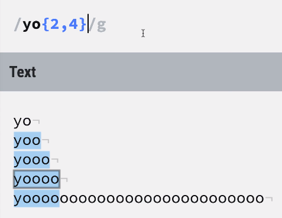

## 匹配任意字符

`/王../g`
会匹配出第一个字是王，并且是三个字的字符
> . 是一个占位符，意为匹配任意一个字符。
 
::: tip
如果要在字符串中匹配“真的.”可以在 "."的前面加上一个反斜杠
:::
## 匹配字母数字和下划线
`/\w2/g`
会匹配出`abcde12345__`中的`12`
> \w是一个占位符，意为匹配任意的字符，数字，下划线
> 
::: tip
\W意为匹配除了字符，数字，下划线之外的所有东西
:::

## 匹配所有的数字
`/\d2\d4/g`
会匹配出`abcde12345__`的`1234`
> \d意为匹配所有的数字

## 匹配所有的空格
`/s`

会匹配出字符串中的空格，断行和制表符
## 匹配字符集合
`/[ace2]/g`
会匹配出`abcde12345__aaccee`中所有的“a”，“c”，“e”，“2”。

> [] 会匹配括号内的任意一个字符
## +匹配重复一次或多次的字符
`/jasonle+/`
会匹配全部的`jasonleeeeeeeeeeeeee`。
## *匹配重复零次或多次的字符
`/jason[led]*/g`
会匹配全部的`jasonllllllleeeeeeeeeeeeee`
## ?匹配出现1次或0次的字符
`/jasonf?[led]*/g`
会匹配全部的`jasonfllllllleeeeeeeeeeeeee`
## {}长度范围限定
<!--  -->

`/yo{2,4}/g`会匹配出字母o最后出现2次到4次的情况。
### 6位邮政编码
``` js
let reg = /^\d{6}$/
let res = reg.test("13456");
console.log(res);//false
```
## 边界符
- `^`
匹配以谁为开始。
::: warning
如果这个符号写到了中括号里面代表的意思是范围取反。
:::
- `&`
匹配以谁为结束。
::: warning
如果匹配规则是`/^abc$/`,那么只能匹配`abc`为`true`,其余的(`abcabc`)都为false。
<hide txt="实话实说，我也没想明白。。。"></hide>
:::

---
## JS中的正则表达式
### 创建一个正则对象
``` js
let reg = new RegExp(/李../);
```
或者
``` js
let reg = /李../;
```
- `test()`方法
用来判断一个一个正则规则能否在指定字符串中匹配到字符
``` js
//加上开头结尾意为必须全部满足规则
let reg = /李../;
let str = "李小明";
console.log(reg.test(str));//true
str = "王小明";
console.log(reg.test(str));//false
```

## 很常见的正则练习
> 建议先自己先写下试试哦
### 设定一个规则，以字母开头，后面数字字母下划线，长度6-30
``` js
let reg = /^[a-zA-Z]\w{5,29}$/
let str = 'a690163223';
console.log(reg.test(str));
```
### 匹配日期
``` js
let reg = /^\d{4}-\d{1,2}-\d{1,2}$/
let res = reg.test("2020-1-1");
console.log(res); //true
```
### 简单IP地址匹配
``` js
let reg = /\d+\.\d+\.\d+\.\d+/;
console.log(reg.test("192.168.0.1")); //true
```
### 将字符串中所有的小b换成大B
``` js
let str = 'aaaaaaaaaaaaabaaaaaaaaaab';
let res = str.replace(/b/g, 'B');
console.log(res);
//aaaaaaaaaaaaaBaaaaaaaaaaB
```
### 手写字符串`trim()`方法保证浏览器的兼容性
``` js
//先去掉开头的空格，再去掉结尾的空格
String.prototype.trim = function() {
    return this.replace(/^\s+/, '').replace(/\s+$/, '');
}
let a = "  abc  ";
console.log(a.trim());//abc
```