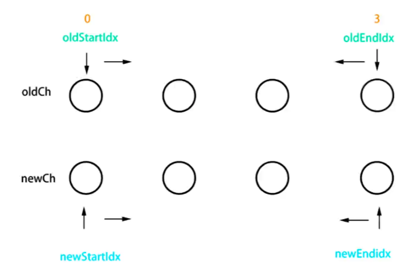
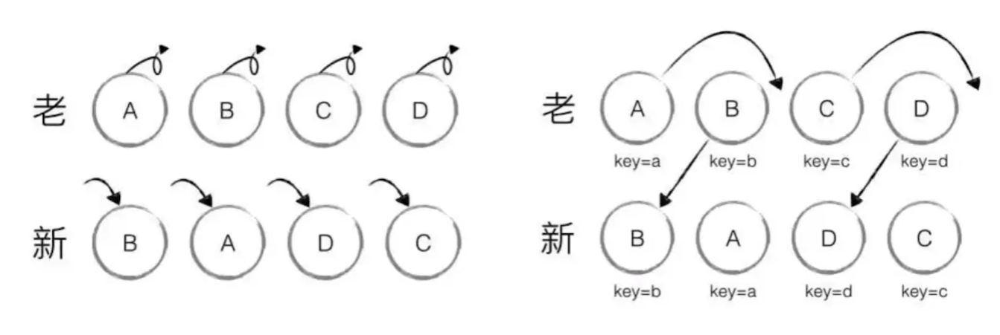

## new Vue时发生了什么
当你new一个Vue实例的时候，Vue会去执行一个叫`_init`的一个函数。
> src/core/instance/init.js
``` js
Vue.prototype._init = function (options?: Object) {
  //...
  // expose real self
  vm._self = vm
  initLifecycle(vm)
  initEvents(vm)
  initRender(vm)
  callHook(vm, 'beforeCreate')
  initInjections(vm) // resolve injections before data/props
  initState(vm)
  initProvide(vm) // resolve provide after data/props
  callHook(vm, 'created')
  //...
```
别的暂且不管，这块还是能看懂的，Vue会去初始化`生命周期`，`事件`，`渲染函数`，和`State`。

注意，这里面有一个`InitState()`方法，我们要好好看一下。

``` js
export function initState (vm: Component) {
  vm._watchers = []
  const opts = vm.$options
  if (opts.props) initProps(vm, opts.props)
  if (opts.methods) initMethods(vm, opts.methods)
  if (opts.data) {
    initData(vm)
  } else {
    observe(vm._data = {}, true /* asRootData */)
  }
  if (opts.computed) initComputed(vm, opts.computed)
  if (opts.watch && opts.watch !== nativeWatch) {
    initWatch(vm, opts.watch)
  }
}
```
从代码里我们能够看到，在`initState()`中又将`props`,`data`,`methods`,`computed`,`watched`这些重要选项给初始化了。

### MVVM
- `M`:`Model`,指的是数据模型，包括操作数据的动作。
- `V`:`View`,视图。
- `VM`:`ViewModel`,一个**双向**连接层，用来连接`Model`和`View`。他会监听`Model`中的数据变化从而去控制视图层的渲染，也会由视图层的变化去改变`Model`中的数据，这个变化的过程是双向的，也是自动  的。
`MVVM`最大的一个好处就是能够让开发人员调出繁琐的操作dom，将主要的精力放在数组模型(业务逻辑)上。
## 响应式原理
### 核心api
`Object.defineProperty()`

首先要明白的一点，每当我们用“.”运算符去`get`和`set`对象中的数据时，都是**原子操作**。

这个api的作用就是你可以自定义在`get`和`set`时要进行的操作。

``` js
let name = "jason";
let obj = {};
Object.defineProperty(obj, "name", {
    get() {
        return name;
    },
    set(val) {
        name = val;
        console.log("更新视图");
    }
})

obj.name = "Katy";
```
响应式的核心原理就是这么简单。。
### 手写响应式
``` js
    //监听对象属性
    function observe(target) {
        //如果是基本类型就不监听
        if (typeof(target) !== 'object' || target == null) {
            return target;
        }
        //对这个对象中的每一个属性都进行监听
        for (let key in target) {
            defineReactive(target, key, target[key]);
        }
    }

    function defineReactive(target, key, value) {
        //上来先对value进行一下递归监听，如果是基本类型就会被返回
        observe(value);

        Object.defineProperty(target, key, {
            get() {
                return value;
            },
            set(newVal) {
                if (newVal !== value) {
                    value = newVal;
                    updateView();
                }
            }
        })
    }

    function updateView() {
        console.log("视图更新");
    }
    //准备数据
    const data = {
            name: "jason",
            age: "20",
            obj: {
                city: "beijing"
            }
        }
        //监听数据
    observe(data);

    data.name = 'asher';
    //视图更新
    data.obj.city = "Shanghai";
    //视图更新
    data.num = '314';
    //没有触发视图更新
    delete data.name;
    //没有触发视图更新
```
思路实现并不难，无非就是监听的对象键值对我们可能需要循环监听外加一些类型判断什么的。

但是注意一点，请看最后两行
``` js
    data.num = '314';
    //没有触发视图更新
    delete data.name;
    //没有触发视图更新
```
我们发现最后的增加属性与删除属性并没有触发视图更新，这也是`Object.defineProperty()`无能为力的地方。

因此Vue为我们提供了[Vue.set()](https://cn.vuejs.org/v2/api/#Vue-set)和[Vue.delete()](https://cn.vuejs.org/v2/api/#Vue-delete)来完善这两种情况下的数据响应。

#### 响应数据是数组的情况
如果是数组的话我们就需要去重写下数组原型中的方法，为了防止污染数组原型，我们用`Object.create()`拷贝一份原型出来。
> 将数组的原型进行处理
``` js
//先把数组的原型拿出来
const arrProperty = Array.prototype;
//把原型对象拷贝一份出来，防止污染
let resolveArr = Object.create(arrProperty);
//把一些常用的数组操作override了
["push", "pop", "shift", "unshift"].forEach((name) => {
    resolveArr[name] = function() {
        arrProperty[name].call(this, ...arguments);
        updateView();
    }
})
```

> 在observe()函数中对数组类型进行判断和处理
``` js
//监听对象属性
function observe(target) {
    //...
    //如果响应式数据为数组，就需要自定义数组中的方法
    if (Array.isArray(target)) {
        target.__proto__ = resolveArr;
    }
    //...
}
    //test
const data = {
    arr: [1, 3, 4]
}

//监听数据
observe(data);
data.arr.push(5);
//conlose
//视图更新
}
```
## 虚拟dom与diff算法
其实虚拟dom的具体实现总的来说可以分成两步。

1. js对象模拟dom
2. 判断两个虚拟dom的差异，然后执行局部渲染。

这里面最核心最复杂的就是第二步。
### JS对象模拟dom
每一个dom元素其实都有三个核心特征：标签类别，属性以及子元素。
``` html
<div id="div1" class="container">
    <p>vdom</p>
</div>
```
``` js
let vdom = {
    tag:"div",
    props:{
        id:"div1",
        className:"container"
    },
    children:[
        {
            tag:"p",
            text:"vdom"
        },
    ]
}
```
### diff算法
vue的diff算法借鉴的是`snabbdom`这个库，这个库中在进行虚拟dom比较时，会根据用户设置的`key`和`tagname`来比较同级的节点。

如果判断节点不同，那么会直接将新节点replace到旧节点上。

如果判断节点相同，则执行局部渲染。

局部渲染主要比较的是里面的内容，会根据两个vnode是否有子节点和文本是否相同进行进一步处理。

最最复杂的是两个vnode都有子节点的情况，此时会执行`updateChildren()`函数。



如图所示，会初始化四个指针，然后分别交叉比较，如果相同了则让指针往中间跑。

### 为什么在v-for中要使用key

使用key可以提高渲染性能，因为使用key的话就能够判断虚拟dom是否相同，此时的虚拟dom在更新时只需要移动就可以了，而不需要全部销毁重建重新渲染。


## 模板编译
## 组件渲染过程分析
## 前端路由