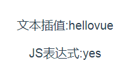
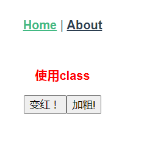
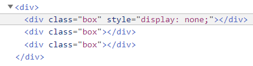
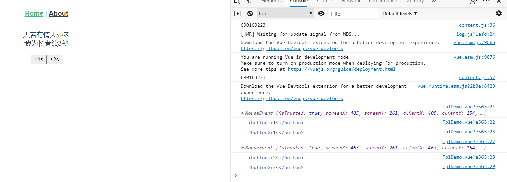
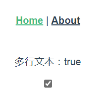
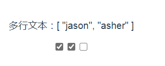
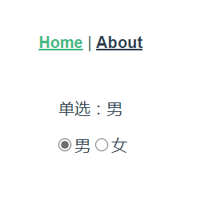
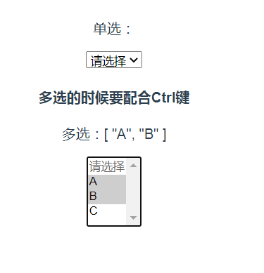

## 火速上手
### 插值表达式
``` vue
<template>
  <div>
      <p>文本插值{{message}}</p>
      <p>JS表达式{{flag?'yes':'no'}} </p>
  </div>
</template>

<script>
export default {
    data() {
        return {
            message:"hellovue",
            flag : true,
        }
    },
}
</script>
```

花括号里可以放一些简单的js表达式，但复杂的js语句是不支持的~~
### 动态属性值
``` vue
<template>
  <div>
      <p :id = "dynamicID">这个p标签的id属性值是动态的哦~~</p>
  </div>
</template>

<script>
export default {
    data() {
        return {
            dynamicID:`id-${Date.now()}`
        }
    },
}
</script>
```
### 动态class
vue针对`class`属性和`style`属性做了专门的增强，不像以前那样只能往里面写纯字符串
你还可以往里面写“对象字符串”和“数组字符串”，vue会对他们进行特殊的解析。

当然你也可以用v-bind指令来动态更新`class`和`style`的属性值，从而做出超级炫酷的效果(误
#### “对象字符串”
``` vue
<template>
  <div>
      <p :class="{red:isRed,bold:isBold}">使用class</p>
      <!-- red这个class效果是否存在要取决于isRed的真值,bold同理 -->
      <button @click="isRed = true">变红！</button>
      <button @click="isBold = true">加粗!</button>
  </div>
</template>

<script>
export default {
    data() {
        return {
            isRed:false,
            isBold:false
        }
    },
}
</script>
<style>
.red{
    color :red
}
.bold{
    font-weight: bold;
}
</style>
```
当点击按钮的时候，文字的class效果便会渲染上去。

#### “对象数组”
``` vue
<template>
  <div>
      <p :class="[red,bold]">使用class</p>
  </div>
</template>

<script>
export default {
    data() {
        return {
            red:'red',
            bold:'bold'
        }
    },
}
</script>
<style>
.red{
    color :red
}
.bold{
    font-weight: bold;
}
</style>
```
这样默认渲染的就是"红色加粗"的字体。
不过不要忘了在`data`中将class样式的字符串传过去。
### 动态style
``` vue
<template>
  <div>
      <p :style="red_bold">使用class</p>
  </div>
</template>

<script>
export default {
    data() {
        return {
            red_bold:{
                color:'red',
                fontWeight:'bold'//小短横在js中会报错，因此要转成驼峰式
            }
        }
    },
}
</script>
```
::: warning
使用动态style的时候需要注意,小短横在js中会报错，因此要转成驼峰式
:::
### v-html指令
v-html指令可以**覆盖更新**dom元素的`innerHTML`。
``` vue
<template>
  <div>
      <div v-html="myHtml">
          这里面的内容被覆盖掉了
      </div>
  </div>
</template>

<script>
export default {
    data() {
        return {
            myHtml:'<div>原始的html:<span>helloWorld</span></div>'
        }
    },
}
</script>
```
::: danger
千万不能再用户提交的页面上使用`v-html`,因为这样会导致XSS攻击。
:::
### 计算属性
对于一些稍微复杂一些的转换逻辑，我们可以考虑使用**计算属性**。
``` vue
<template>
  <div>
      <div> num:{{num}}</div>
      <div>mult2:{{handle}}</div>

  </div>
</template>

<script>
export default {
    data() {
        return {
            num:20
        }
    },
    computed:{
        handle(){
            return (this.num*2+3)/6;
        },
    },
}
</script>
```
::: tip
计算属性计算的结果会被缓存起来，方便下一次继续调用。
也就是说，只要**data**里的东西不变，则计算属性就不会重新计算。
:::
### 监听器属性
监听器可以对`data`里的数据进行监听，如果发生变化则触发。
``` vue
<template>
  <div>
      <div>name:{{name}}</div>
      <input v-model="name">
      <div>{{info.getOffer}}</div>
      <button @click="info.getOffer = true">when u get offer</button>
  </div>
</template>

<script>
export default {
    data() {
        return {
            name:"寻光",
            info:{
                age:"18",
                city:"zhengZhou",
                getOffer:false
            },
            
        }
    },
    watch: {
        //对name进行监听,当name发生变动时会触发
        name(newVal,oldVal){
            console.log('name',newVal,oldVal)
        },
        //对info对象进行监听，需要将deep字段设置为true
        info:{
            handler(newVal,oldVal){
                //newVal和oldVal指向的是同一个对象
                console.log("u do it!")
            },
            deep:true//深度监听
        }
    },
}
</script>
```
::: warning
需要注意的是如果监听的是一个对象，则要在监听对象内部将`deep`字段设置为`true`。

并且`newVal`和`oldVal`指向的是同一个对象，真正变化的值是拿不到的。
:::
### v-if与v-show的使用场景
`v-if`会对渲染条件进行判断，如果不满足则不渲染。

`v-show`也会对渲染条件进行判断，如果不满足**依然渲染，只是不显示出来**。



因此如果需要**频繁的切换是否显示**就用`v-show`,不需要频繁切换就用`v-if`。
### 循环渲染
`v-for`除了可以循环数组，也可以循环对象。
``` vue
<template>
  <div>
    <h2>遍历数组</h2>
    <div v-for="(item,index) in listArr" :key="item.id">
        {{ index }} --- {{item.id}} --- {{item.title}}
    </div>
    <h2>遍历对象</h2>
    <div v-for="(val,key,index) in listObj" :key="key">
        {{ index }} --- {{key}} --- {{val.title}}
    </div>
  </div>
</template>

<script>
export default {
  data() {
    return {
      listArr: [
        //在数据中，最好设置一个id字段
        { id: "a", title: "标题1" },
        { id: "b", title: "标题2" },
        { id: "c", title: "标题3" }
      ],
      listObj: {
        a: { title: "标题1" },
        b: { title: "标题2" },
        c: { title: "标题3" }
      }
    };
  }
};
</script>
```
- key尽量设置成一个和业务相关的字段，最好不要是索引。
- 遍历对象的时候可以传进去三个参数，分别是`val`,`key`和`index`。

::: warning
尤大说了，v-if和v-for最好不要一块用，因为这样会造成不必要的循环判断。
:::

### 事件
``` vue
<template>
  <div>
      <div>天若有情天亦老</div>
    <div>我为长者续{{num}}秒</div>
    <br>
    <button @click="increase1">+1s</button>
    <!-- 如果传参数的话可以用$event将event传过去 -->
    <button @click="increase2(2,$event)">+2s</button>
    <!-- <button @click=""></button> -->
  </div>
</template>

<script>
export default {
  data() {
    return {
      num:0
    };
  },
  methods: {
      //如果不传参数的话可以直接获取event对象
      increase1(event){
          console.log(event);
          console.log(event.target);
          //事件挂载在哪
          console.log(event.currentTarget);
          //事件在哪触发
          this.num++;
      },
      increase2(val,event){
          console.log(event);
          console.log(event.target);
          console.log(event.currentTarget);
          this.num+=val;
      }
  },
};
</script>
```

从这个demo中我们可以看出来一下几点：

- 如果事件不传参数的话，我们可以直接在`method`属性中拿到`event`，否则我们要用`$event`将参数传递过去。
- 由上述demo我们能够发现`event`就是原生js中的`MouseEvent`! 没有任何装饰与加工。
- vue中的`event`，挂载在当前元素，触发也是在当前元素。

### 事件修饰符
- 阻止向上冒泡传播
``` html
<a @click.stop="doThis"></a>
```
- 提交事件不重载页面
``` html
<form @submit.prevent="onSubmit"></form>
```
- 可以使用多个修饰符串联
``` html
<a @click.stop.prevent="doThis"></a>
```
- 事件在捕获阶段就触发
``` html
<div @click.capture="doThis">.....里面一堆子标签~~~</div>
```
::: warning
捕获阶段触发后事件在冒泡阶段不会被二次触发。
:::
- 从内部冒泡上来的事件不会被触发，也就是说只有点自己当前的元素才会触发
``` html
<div @click.self="doThis">...里面一堆子标签</div>
```
### 表单
- v-model的修饰符
``` html
<!-- number修饰符可以将输入进来的字符串数字转化成纯number类型 -->
<input type="text" v-model.number="age">
<!-- trim修饰符可以将输入进来的字符串中的留白删去 -->
<input type="text" v-model.trim="name">
<!-- lazy修饰符可以让输入框实现防抖，失去焦点时才会更新数据 -->
<input type="text" v-model.lazy="name">
```
- 多行文本
在vue中，`textarea`也可以用来联通v-model。
``` html
<p>多行文本：{{desc}}</p>
<textarea v-model="desc"></textarea>
```
- 复选框
当一个`input`被设置为复选框时，可以用v-model连通一个布尔值来控制。
``` vue
<template>
  <div>
      <p>多行文本：{{checked}}</p>
      <input type="checkbox" v-model="checked">
  </div>
</template>

<script>
export default {
  data() {
    return {
      checked:true
    };
  }
};
</script>
```

- 多选框
多选框可以用v-model连通一个数组来实现~~
``` vue
<template>
  <div>
      <p>多行文本：{{gender}}</p>
      <input type="checkbox" value="jason" v-model="checkedNames">
      <input type="checkbox" value="asher" v-model="checkedNames">
      <input type="checkbox" value="lee" v-model="checkedNames">
  </div>
</template>

<script>
export default {
  data() {
    return {
      checkedNames:[]
    };
  }
};
</script>
```

- 单选
用v-model连通一个值来实现
``` vue
<template>
  <div>
      <p>单选：{{gender}}</p>
      <input type="radio" value="男" v-model="gender">
      <label for="male">男</label>
      <input type="radio" value="女" v-model="gender">
      <label for="female">女</label>
  </div>
</template>

<script>
export default {
  data() {
    return {
      gender:'male'
    };
  }
};
</script>
```

- 下拉列表
可以用`select`配合v-model连通一个空值来实现，多选的话可以连通一个数组来实现。
``` vue
<template>
  <div>
      <p>单选：{{selected}}</p>
      <select v-model="selected">
        <option value="" disabled>请选择</option>
        <option value="A">A</option>
        <option value="B">B</option>
        <option value="C">C</option>
      </select>
      <h4>多选的时候要配合Ctrl键</h4>
      <p>多选：{{selectedList}}</p>
      <select v-model="selectedList" multiple>
        <option value="" disabled>请选择</option>
        <option value="A">A</option>
        <option value="B">B</option>
        <option value="C">C</option>
      </select>
  </div>
</template>

<script>
export default {
  data() {
    return {
      selected:'',
      selectedList:[]
    };
  }
};
</script>
```
