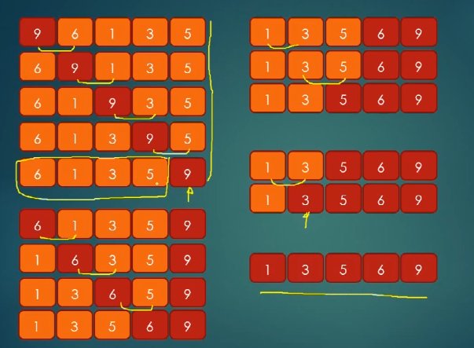
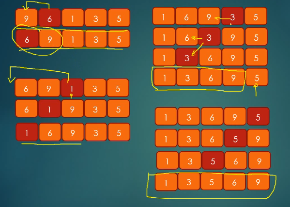
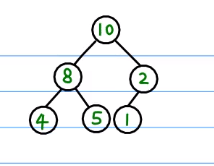
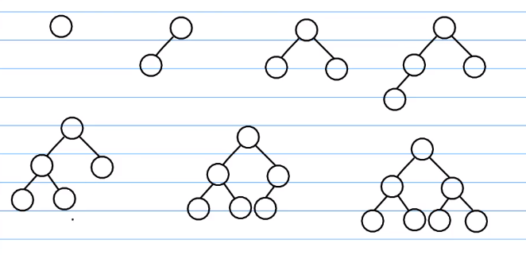
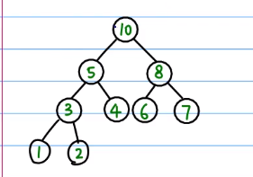
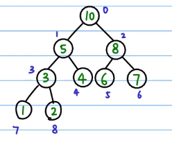

主要参考文章[前端该如何准备数据结构和算法？](https://juejin.im/post/5d5b307b5188253da24d3cd1#heading-7)
## 排序算法
### 选择排序

> 思路
> 插入排序的思路很简单，就是每次一眼扫过去，把最小的“拎”出来插到头上，然后对剩余的元素重复刚才的动作。
> 但这一句话用代码实现却需要很多细节。
``` js
function selectSort(arr) {
    for (let j = 0; j < arr.length; j++) {
        //先默认第一个位置是最小的
        let min_index = j;
        //然后向后进行比较，小的话更新minIndex
        for (let i = j + 1; i < arr.length; i++) {
            if (arr[i] < arr[min_index]) {
                min_index = i;
            }
        }
        //找出来以后，将最小元素与头部元素进行交换
        [arr[j], arr[min_index]] = [arr[min_index], arr[j]];
    }
    return arr;
}
let res = selectSort([5, 3, 6, 8, 1, 7, 9, 4, 2]);
console.log(res)//  [ 1, 2, 3, 4, 5, 6, 7, 8, 9 ]
```
::: tip
在写算法题一定要遵循**从具体到抽象**。
同时在**抽象化**过程中一定要重新读一遍之前写过的代码，千万不能“漏”。
:::
**时间复杂度: O(n2)
空间复杂度: O(1)**

### 冒泡排序

> 思路：从**头**扫一遍元素，在扫的过程中，如果发现**左边的比右边的大**，就让大的“沉到右边”。
``` js
function bubbleSort(arr) {
    for (let finish = arr.length; finish > 0; finish--) {
        for (let i = 0; i < finish; i++) {
            if (arr[i - 1] > arr[i]) {
                [arr[i - 1], arr[i]] = [arr[i], arr[i - 1]]
            }
        }
    }
    return arr;
}
let res = bubbleSort([9, 3, 1, 4, 6, 8, 7, 2, 5]);
console.log(res); // [ 1, 2, 3, 4, 5, 6, 7, 8, 9 ]
```
::: tip
如果不知道怎么抽象化，可以多写几下具体的情况，但请注意在写**第二个**具体情况时一定要谨慎！一定要想好！就像这道题，先是“最右边的元素”落定之后再开始处理“从头到倒数第二个元素”。多去思考这个动态的过程。
:::

**时间复杂度: O(n2)
空间复杂度: O(1)**

### 插入排序

> 思路：就和平时打牌一样，每抓到一张牌，就将其插入到响应的位置。
``` js
function insertSort(arr) {
    for (let start = 1; start < arr.length; start++) {
        //抽出第start张牌，然后将其与前面的数进行比较
        for (let i = start; i > 0; i--) {
            if (arr[i] < arr[i - 1]) {
                [arr[i - 1], arr[i]] = [arr[i], arr[i - 1]];
            }
        }
    }
    return arr;
}
let arr = insertSort([9, 3, 1, 4, 6, 8, 7, 2, 5]);
console.log(arr); //[ 1, 2, 3, 4, 5, 6, 7, 8, 9 ]
```
**时间复杂度：O(n2)
空间复杂度: O(1)**
### 归并排序
归并排序是分治法的典型应用。

所谓分治法，就是讲一个复杂的问题分解成小问题然后逐步求解，求完解之后再将答案**组织**到一起，其中求解并组织子问题的过程是最核心也是最复杂的。


``` js
function mergeSort(arr) {
    //
    if (arr.length < 2) return arr;
    let mid = Math.floor(arr.length / 2);
    let left = arr.slice(0, mid);
    let right = arr.slice(mid);
    return merge(mergeSort(left), mergeSort(right));
}

function merge(left_arr, right_arr) {
    let tmp = [];
    let i = 0; //i指向前半数组的头
    let j = 0; //j指向后半数组的头
    let k = 0; //k指向缓存数组
    while (i < left_arr.length && j < right_arr.length) {
        if (left_arr[i] < right_arr[j]) {
            tmp[k++] = left_arr[i++];
        } else {
            tmp[k++] = right_arr[j++];
        }
    }
    //有可能上述操作完成之后left_arr或right_arr还没有跑完。
    while (i < left_arr.length) {
        tmp[k++] = left_arr[i++];
    }
    while (j < right_arr.length) {
        tmp[k++] = right_arr[j++];
    }
    return tmp;
}
let res = mergeSort([1, 5, 0, 9, 5, 4, 8, 15]);
console.log(res); //[ 0, 1, 4, 5, 5, 8, 9, 15 ]
```
**时间复杂度：O(nlogn)
空间复杂度:O(n)**
### 快速排序
在开始学习这个排序算法之前，建议先看下这个几分钟的小视频：[【TED-ed】快速排序是什么【6小时字幕组】](https://www.bilibili.com/video/av10076626)

快速排序是我个人比较喜欢的一个算法，和归并相比，它的稳定性欠佳，但一般情况下都要比归并排序要快，空间复杂度也稍微有点大。但是它好写啊！逻辑清晰，转化成代码很容易。

> 思路:将数组的第一个数作为`compared_num`,然后遍历一遍数组，比这个数小的放左边，比这个数大的放右边，最后递归返回。
``` js
function quickSort(arr) {
    //边界条件
    if (arr.length < 2) return arr;
    //把数组中的第一数选出来作为要比较的数
    let compared_num = arr[0];
    let letf_arr = [];
    let right_arr = [];
    //然后遍历一遍arr，讲比compared_num小的数放左边，比他大的放右边
    //注意是从第二个数开始
    for (let i = 1; i < arr.length; i++) {
        if (arr[i] < compared_num) {
            letf_arr.push(arr[i])
        } else {
            right_arr.push(arr[i])
        }
    }
    return quickSort(letf_arr).concat([compared_num], quickSort(right_arr));
}
let res = quickSort([3, 1, 2, 4, 5, 7, 7, 7]);
console.log(res); //[ 1, 2, 3, 4, 5, 7, 7, 7 ]
```
**时间复杂度：平均O(nlogn)，最坏O(n2)，实际上大多数情况下小于O(nlogn)
空间复杂度: O(logn)**
### 堆与堆排序
优秀资源参考 [堆排序(heapSort)](https://www.bilibili.com/video/av47196993)

在讲解堆排序之前我们必须先弄明白`堆`是个啥。
<hide txt="PS:这里我们讨论的堆特指最大堆哦。"></hide>
堆是一种数据结构<hide txt="废话"></hide>,这种数据结构必须要满足下面两个条件。

1. 是一颗**完全二叉树**。
2. 这颗树上的每一个子节点都**不能大于**它的父节点。就像这样：


那**完全二叉树**又是个啥呢？

**完全二叉树**的定义取决于它生成节点的顺序，必须满足：

**从上到下，从左往右。**


这里展示的便是一个符合定义的**堆**。


由于堆是一颗**从上往下，从左往右**生成的**二叉树**，因此我们可以很方便的用**一维数组**来表示一个堆。

如果我们将每一个节点都标上下标，


那么我们会发现堆中的每一个节点中的下标都会满足这样的关系：
``` js
//假设当前节点的下标为 i
P_i = Math.floor((i-1)/2);//父节点下标
//左孩子和右孩子的下标
Ls_i = 2*i+1;
Rs_i = 2*i+2;
```
下面的代码演示了如何将一个用数组表示出来的二叉树变成一个堆。
``` js
//对单个节点进行递归的heapify操作
function heapify(tree, i) {
    let end_node = Math.floor((tree.length - 1) / 2);
    if (i > end_node) return;
    //左右孩子的下标
    let ls_i = 2 * i + 1;
    let rs_i = 2 * i + 2;
    //假设第i个元素是最大的
    //如果它的两个儿子都比它大，那么久交换他们的位置
    if (ls_i < tree.length && tree[ls_i] > tree[i]) {
        [tree[i], tree[ls_i]] = [tree[ls_i], tree[i]];
    }
    if (rs_i < tree.length && tree[rs_i] > tree[i]) {
        [tree[i], tree[rs_i]] = [tree[rs_i], tree[i]];
    }
    heapify(tree, i + 1);
    return tree;
}
//如果要将一个完全混乱的二叉树变成一个堆，我们需要从最后一个节点开始“堆化”。
function full_heapify(tree) {
    let end_node = Math.floor((tree.length - 1) / 2);
    for (let i = end_node; i >= 0; i--) {
        heapify(tree, i);
    }
    return tree;
}

let res = full_heapify([1, 5, 7, 8, 9, 2]);
console.log(res);//[ 9, 8, 7, 1, 5, 2 ]
```
经过上面的操作，我们有一个堆了，那么我们如何将这个堆变成一个有序的数组呢？

很简单，对堆中的每一个元素，我们只需要这三步操作：

1. 先交换**堆顶**和**最后一个节点**
2. 砍断最后一个节点(此时的最后一个节点是最大值)，`push()`到一个容器中。
3. 上面的操作我们破坏了堆结构，因此需要重新进行“堆化”。(不用完全堆化，只针对根节点就可以)

代码如下

``` js
function heapSort(arr) {
    let res = [];
    let tree = full_heapify(arr);
    //从树的最后一个元素开始
    for (let i = tree.length - 1; i >= 0; i--) {
        //先交换根节点和最后一个节点
        [tree[0], tree[tree.length - 1]] = [tree[tree.length - 1], tree[0]];
        //然后砍断最后一个节点
        res.push(tree.pop());
        //此时破坏了堆的解构，我们需要从根节点再次进行“堆化”
        heapify(tree, 0);
    }
    return res;
}

let res = heapSort([1, 2, 5, 8, 6, 4, 7, 8, 0.5, 6, 9, 100]);
console.log(res); //[ 100, 9, 8, 8, 7, 6, 6, 5, 4, 2, 1, 0.5 ]
```

## 二分搜索
二分搜索是一种在一个有序的容器中查找某一个元素的方法。

先来看一个最简单的例子
::: tip
假设给了一个有序数组和一个数，现在要判断这个数在这个数组中是否存在。
:::
``` js
//判断一个元素是否在一个排好序的数组中存在

function binarySearch(arr, target) {
    if (arr.length < 1) return false;
    let mid = Math.floor(arr.length / 2);
    if (target == arr[mid]) return true;
    if (target < arr[mid]) {
        let left_arr = arr.slice(0, mid);
        return binarySearch(left_arr, target);
    }
    if (target > arr[mid]) {
        let right_arr = arr.slice(mid + 1, arr.length);
        return binarySearch(right_arr, target);
    }
}

let res = binarySearch([1, 2, 3, 4, 6, 7, 8, 9], 5);
console.log(res); //false

//非递归的写法
function binarySearch(arr, target) {
    let left = 0;
    let right = arr.length - 1;

    while (left <= right) {
        let mid = Math.floor((left + right) / 2);
        if (arr[mid] == target) return mid;
        if (arr[mid] > target) {
            right = mid - 1;
        }
        if (arr[mid] < target) {
            left = mid + 1;
        }
    }
    return -1;
}
let res = binarySearch([0, 2, 6, 7, 9, 11, 12, 45], 999);
console.log(res); //-1
```
- 二维数组中的查找
::: tip
在一个二维数组中（每个一维数组的长度相同），每一行都按照从左到右递增的顺序排序，每一列都按照从上到下递增的顺序排序。请完成一个函数，输入这样的一个二维数组和一个整数，判断数组中是否含有该整数。
:::
> 思路：对每一行进行二分查找
``` js
function Find(target, array) {
    for (let val of array) {
        let res = binarySearch(val, target);
        if (res == true) {
            return res;
        }
    }
    return false;
}

function binarySearch(arr, target) {
    if (arr.length < 1) return false;
    let mid = Math.floor(arr.length / 2);
    if (target == arr[mid]) return true;
    if (target < arr[mid]) {
        let left_arr = arr.slice(0, mid);
        return binarySearch(left_arr, target);
    }
    if (target > arr[mid]) {
        let right_arr = arr.slice(mid + 1, arr.length);
        return binarySearch(right_arr, target);
    }
}

let res = Find(10, [
    [1, 2, 3],
    [2, 4, 6],
    [7, 8, 9]
])
console.log(res); //false
```
- 旋转数组中的最小数字
::: tip
把一个数组最开始的若干个元素搬到数组的末尾，我们称之为数组的旋转。 输入一个非减排序的数组的一个旋转，输出旋转数组的最小元素。 例如数组{3,4,5,1,2}为{1,2,3,4,5}的一个旋转，该数组的最小值为1。   

注意：给出的所有元素都大于0，若数组大小为0，请返回0。
:::
``` js
function minNumberInRotateArray(rotateArray) {
    if (rotateArray.length == 0) return 0;
    let left = 0;
    let right = rotateArray.length - 1;
    let mid = 0;
    while (left < right) {
        mid = left + Math.floor((right - left) / 2);
        //如果中间的值比左边的值小，那就说明“断崖”在左边，右边找无意思，将其缩短
        if (rotateArray[mid] < rotateArray[left]) {
            right = mid;
        } else if (rotateArray[mid] > rotateArray[left]) {
            left = mid;
        } else {
            left++;
        }
    }
    return rotateArray[left];
}
let res = minNumberInRotateArray([9, 10, 11, 12, 13, 14, 15, 16, 7, 8, 9]);
console.log(res); //7
```
- 统计一个数字在排序数组中出现的次数(知识迁移)
::: tip
统计一个数字在排序数组中出现的次数。
:::
这题好写，套个二分，找下初始位置。
``` js
var search = function(nums, target) {
    let left = binarySearch(nums, target);
    const value = nums[left];
    if (left == -1) {
        return 0;
    }
    let right = left;
    let res = 1;
    while (true) {
        left--;
        if (nums[left] != value) break;
        res++;
    }
    while (true) {
        right++;
        if (nums[right] != value) break;
        res++;
    }
    return res;
};


function binarySearch(arr, target) {
    let left = 0;
    let right = arr.length - 1;

    while (left <= right) {
        let mid = Math.floor((left + right) / 2);
        if (arr[mid] == target) return mid;
        if (arr[mid] > target) {
            right = mid - 1;
        }
        if (arr[mid] < target) {
            left = mid + 1;
        }
    }
    return -1;
}
```
## 二叉树
### 前后遍历
- 前序遍历
- 后序遍历
- 重建二叉树
### 二叉树的对称性
- 对称的二叉树
### 二叉搜索树
- 二叉搜索树的第K个节点
- 二叉搜索树的后序遍历
### 二叉树的深度
- 二叉树的最大深度
- 平衡二叉树(知识迁移)
### 广度优先搜索
- 从上往下打印二叉树
### 深度优先搜索
- 二叉树的深度
- 二叉树中序遍历
## 数组
- 反转数组
- 去掉数组中重复的元素
## 栈与队列
- 队列与栈的互相实现
- 包含min函数的栈
- 滑动窗口的最大值
## 哈希表
- 常数时间插入、删除和获取随机元素
- 字符流中第一个不重复的字符

## 递归
- 斐波那契
- 跳台阶
## 贪心、回溯、动态规划