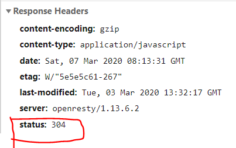
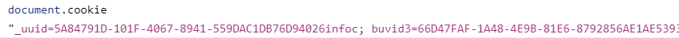

## 网络请求
### 手写ajax
``` js
//手写ajax
//请求地址 https://www.jixieclub.com:3002/list?Pnum=1
const xhr = new XMLHttpRequest();
//第三个参数为true说明是异步请求
xhr.open('GET', 'https://www.jixieclub.com:3002/list?Pnum=1', true);
//当readState变化时触发
xhr.onreadystatechange = function() {
        if (xhr.readyState === 4) {
            //readyState代表数据流的状态
            //4的意思是数据量全部下载完成
            if (xhr.status === 200) {
                console.log(xhr.responseText);
            } else {
                alert("其他情况");
            }
        }
    }
    //get请求发送null
xhr.send(null);
```
### HTTP状态码
- 2xx：表示成功处理请求
- 3xx: 表示需要重定向
这里需要强调下**304缓存**
如果客户端访问的服务器的资源文件未修改，则会请求就会重定向到浏览器的缓存中。

- 4xx: 客户端请求错误
- 5xx: 服务端内部错误
## 跨域
博文参考:[ajax跨域，这应该是最全的解决方案了](https://segmentfault.com/a/1190000012469713#articleHeader9)

要理解**跨域**，首先我们需要理解**同源策略**。

**同源**是在1995年由网景公司提出来的一个策略，这个策略的最初的主要内容是：

> A网页如果设置了cookie，那么B网页不能打开。

我们很容易能够看出这个策略的主要目的是为了安全，现如今所有的浏览器都支持这个策略。

随着互联网的发展，同源策略也越来越严格，只要你的**协议**，**域名**和**端口**有一个不一样，浏览器都会将你的请求视为**跨域**访问,下面这三种行为都会受到限制：
1. 用户信息(`cookie`,`localStorage`,`indexedDB`)
2. `iframe`
3. 网络请求

当你发一个请求给一个非同源的服务器时，你会得到这条警告信息：

其实请求发出去了，数据也回来了，只是浏览器说了句：“这不是给你的东西，你不许看~~”，然后“啪”的一下把你的眼睛给蒙上了。。。

如果你死皮赖脸非要看的话可以去控制台的`network`一栏里看到相应数据，当然了，你肯定没有办法把这个数据渲染到网页上。

那么我们应该怎么解决呢？

### CORS

**CORS**全称为`Cross-origin resource sharing`,这是一个W3C的标准，它允许浏览器向非同源服务器发送请求。

这个主要靠后端开启，但是存在兼容问题。
### JSONP
**JSONP**全称为`JSON with padding`

这种方式发起请求会从后端得到“被包裹的JSON数据”，大概像这样

``` js
callback({"name":"hax","gender":"Male"});
```
其中`callback`是用户在发起请求时传过去的参数，我们实际要得到的数据会包裹在函数的参数中，我们可以在本地定义这个函数的具体操作，然后再通过`script`标签“云调用”一下这个函数，就可以完成我们的跨域请求啦~~

这种方式的主要原理还是利用了`script`标签没有跨域限制的漏洞，<hide txt="所以我个人不是很喜欢这种方式，感觉是在“卡bug”，给人一种将错就错的感觉。"></hide>来间接实现跨域访问。

这种方式相比较CORS来说兼容性会更好一些。
## 存储
### cookie
`cookie`是一种超小型的文本文件，由网景公司的某个员工发明，是网站为了辨别用户身份而存储在用户本地的非常小的数据(只有4K)。

`cookie`会被设置在`HTTP`的`header`中，会对请求有性能影响。

`cookie`由服务器端生成，存储在客户端，可以设置过期时间。
;
::: warning
cookie语法的键值对是用等于号隔开的，这点需要注意。
:::
### localStorage
[localStorage的简单使用](./js对象常用api整理.md#localstorage全局对象)

`localStorage`的生命周期为永久，除非用户手动清理。

`localStorage`的数据大小有5M。
### sessionStorage
`sessionStorage`与`localStorage`的最大区别体现在生命周期上  ，一旦浏览器关闭则被清理。
### indexDB
如果`localStorage`存不下的话我们可以上浏览器中的这个数据库。
## 页面加载过程

这块的内容可以用来回答那个被问烂了的的问题<hide txt="Q:你梭梭当你输入url时发生了啥？A：不好意思面试官我先喝口水"></hide>,但全部展开这块内容能涉及到网络，计算机图形学，操作系统甚至是编译原理，<hide txt="我只是一个小蒟蒻鸭你总不能这样为难我"></hide>所以尽量站在前端的角度把这个问题回答好吧。

总的来说可以分为**资源加载阶段**和**资源渲染阶段**。

这里我们默认资源的类型是**HTML**。

### 资源加载阶段
1. 浏览器根据DNS服务器找到服务器的ip地址。
2. 浏览器向这个ip发请求 => 服务器处理并返回请求。
### 资源渲染阶段
这部分就是我们前端要详细回答的阶段了。
#### 一、dom树生成
1. 首先浏览器在拿到`HTML`文件前要先在计算机中**开辟出内存**，同时为`HTML`**分配一个主线程**去一行行解析和执行代码。
2. 在主线程解析的过程中，如果遇到了外部静态资源(`link`,`script`,`img`),此时会开辟一个**新的任务队列和新的副线程**去加载这些资源文件，而主线程继续向下解析代码。
3. 当主线程从上往下执行完后，会生成**dom树**。
::: warning
假如说你现在打开一个网页，在加载的过程中你直接把网线给拔了，有很大几率你会碰到一个没有样式表的网页，因为此时css资源已经回不来了。。

因此建议将css放在head中，提前加载。
:::
#### 二、Event Loop生成CSSom
主线程解析完后，就会进入[Event Loop](./Javascript执行过程分析.md#event-loop)阶段，当任务队列里的css静态资源都加载完后，此时会生成**CSSom**。
#### 三、生成渲染树
当**dom树**和**CSSom**都到齐了之后，此时他们俩会结合生成一颗**Render tree**。
#### 四、布局(layout)阶段 
根据生成的渲染树以及视窗(viewport)大小，计算每个dom节点的`layout`信息(位置，大小)。
如果由于渲染树中的某些属性的更改，而引发布局的更改，就会引发**回流**。

#### 五、绘制(painting)阶段
根据上一步的`layout`信息,得到每个节点在屏幕上的绝对像素，得到像素之后我们就能让GPU来显示图像信息了。

四阶段和五阶段统属于渲染阶段，在渲染阶段如果遇到`script`(此时假设script资源加载回来了)标签则会暂停渲染，优先执行js代码。
因此`script`标签一定要放到`body`的最后面。

这个阶段如果由于渲染树中的某些属性的更改，但没有引发局部更改，仍然会触发回流(repainting)
## 安全
> 简单了解一下，不是前端的重点
### XSS跨站请求攻击
**XSS**全称为`Cross Site Scripting`<hide txt="如果缩写是CSS就和那个CSS混了"></hide>

攻击者会想尽一切办法将`script`代码注入到网页中，从而执行自己的攻击操作。

解决方法通常是将尖括号啥的转义一下，但前端如果这样做的话会影响js的解析性能，通常还是由后端的同学来完成。
### XSRF跨站请求伪造

主要是针对登录态的用户进行的攻击。

攻击者会模拟出一个后端的请求操作，然后想办法让被害人去发起这个请求，经典手段是用一个图片的src来发起请求，然后利用你的登录信息为所欲为，而后端又以为这是用户在操作，后端便成了攻击者手中的“刀”。

而一些银行的钓鱼网站会诱导一些被害人去填一些表单，从而把你的钱全部搞走。

这种攻击最好的预防策略还是多几层验证，指纹人脸验证码啥的，所以说这种漏洞现在应该很少了。