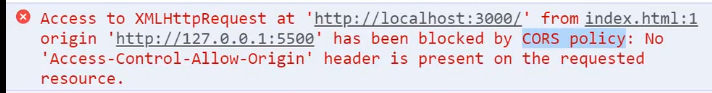

## 跨域

要理解**跨域**，首先我们需要理解**同源策略**。

**同源**是在1995年由网景公司提出来的一个策略，这个策略的最初的主要内容是：

> A网页如果设置了cookie，那么B网页不能打开。

我们很容易能够看出这个策略的主要目的是为了安全，现如今所有的浏览器都支持这个策略。

随着互联网的发展，同源策略也越来越严格，只要你的**协议**，**域名**和**端口**有一个不一样，浏览器都会将你的请求视为**跨域**访问。

当你发一个请求给一个非同源的服务器时，你会得到这条警告信息：

其实请求发出去了，数据也回来了，只是浏览器说了句：“这不是给你的东西，你不许看~~”
## 存储
## 缓存机制
## 渲染原理
### 页面生命周期
## 安全